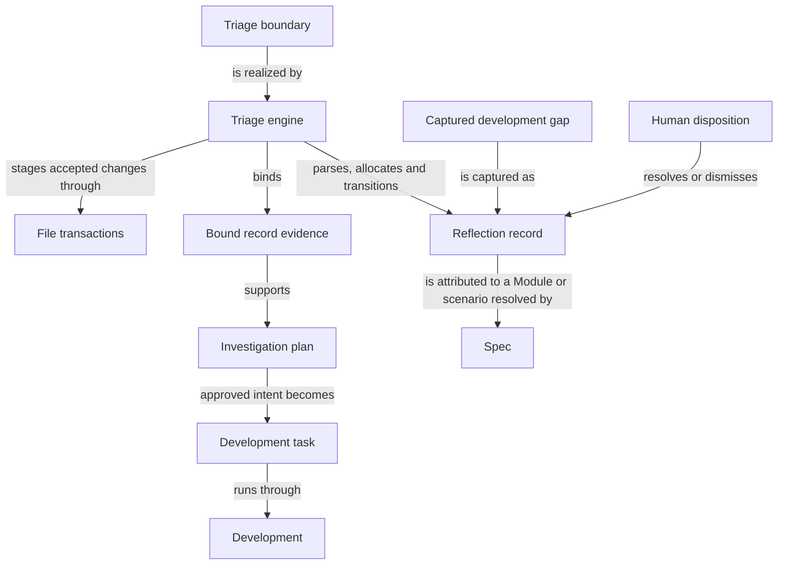

```concorde-document
{
  "id": "document.reflections.module",
  "targets": [
    "module.reflections"
  ],
  "main_visible": true
}
```

# Reflections

Retain, investigate and resolve explicitly attributed project feedback and persistent gaps.

## Purpose

Reflections retains, investigates and resolves project feedback and persistent development gaps
that are explicitly attributed to one Module or scenario. Developers triaging a problem and the
automated development loop that turns an approved finding into a fresh task are its users. Its
promises stop at attribution, evidence-bound investigation and human disposition: it never decides
product behavior on a target Module's behalf, and an approved resolution runs as ordinary work on
that target rather than granting Reflections access to the target's Spec. A record survives
independently of whether any repair is ever attempted, and closing it always remains an explicit
human decision rather than an automatic consequence of investigation.

## Requirements

### req.reflections.no-implicit-capture — No mutation from read-only requests

A status or other read-only assessment request SHALL NOT create or modify a Reflection record.

### req.reflections.mutation-attribution — Explicit id attribution required for mutations

A report or gap mutation request SHALL require an explicit nonempty `reflection_ids` or `gap_ids`
list, with every id attributed to the selected target or one of its local scenario ids.

### req.reflections.stable-gap-ids — Gap record ids stay stable across retries

A `gap_records` id SHALL remain stable across context-only retries.

### req.reflections.host-assigned-gap-ids — Gap ids are host-assigned, not caller-supplied

A `gap_records` id SHALL NOT be calculated by the caller.

The id is allocated and returned by the host; a caller that computes its own id and expects it to
match is relying on an implementation detail, not a promise.

### req.reflections.no-borrowed-access — Resolution routing grants no target Spec access

Routing an approved resolution to its named target SHALL NOT grant this Module access to that
target's Spec.

### req.reflections.explicit-gap-selection — Gap capture requires an explicit nonempty selection

record-gaps SHALL require a nonempty explicit `gap_ids` list and `reflection_ids=[]`.

See the [gap-capture scenario](interfaces.md#scenario.reflections.capture-gap).

### req.reflections.no-implicit-gap-selection — No implicit select-all for gap capture

record-gaps SHALL NOT treat an omitted or empty `gap_ids` list as selecting every gap.

See the [rejection scenario](interfaces.md#scenario.reflections.reject-invalid-gap-selection).

### req.reflections.bucket-triage-agreement — Bucket assignment must match triage state

A record whose triage sections contradict its bucket, or that lies outside every bucket, SHALL be
rejected.

### req.reflections.non-reproduced-disposition — Non-reproduction requires human intervention

A non-reproduced investigation outcome SHALL recommend dismissal and require human intervention.

### req.reflections.fast-loop-effort — Fast-loop route requires small effort

A fast-loop route SHALL only be recommended together with small effort.

### req.reflections.no-heading-injection — No document heading injection in section values

An investigation section value SHALL NOT inject a document-level Markdown heading.

### req.reflections.investigation-file-boundary — Investigation reads only the target Module's files

Investigation SHALL read only the files listed by the selected Module's own entities.

## Scenarios

Scenario definitions for the public triage boundary — status, gap capture and their rejection
paths — are registered in [interfaces](interfaces.md). Scenario definitions for investigation,
implementation and disposition are registered in [lifecycle](lifecycle.md).

## Ontology

The Ontology sets out the triage engine, the records and evidence it manages, and the collaborators
that turn a captured gap or report into an approved task or a human disposition.

### Entities

The triage engine and its collaborators below realize triage; the concept and record entities
describe the domain vocabulary the registered scenarios rely on. The triage engine lists the
`src/concorde/reflections/` and `tests/concorde/reflections/` package directories and its own
fixture directory; the shared file-transaction entry stays exact.

```concorde-entities
[
  {
    "id": "entity.reflections.triage-engine",
    "title": "Triage engine",
    "kind": "program",
    "responsibility": "Parses Reflection records, allocates and maintains stable R-NNN identities and bucket state, resolves current Module or scenario attribution, binds investigation to exact record bytes and HEAD, and turns an approved plan into a fresh development task while keeping evidence historical when attribution changes.",
    "files": [
      "capabilities/reflections_triage.py",
      "scripts/reflections_queue.py",
      "src/concorde/reflections/",
      "tests/concorde/fixtures/interfaces/reflections/",
      "tests/concorde/reflections/",
      "tests/concorde/support/reflection_triage.py"
    ]
  },
  {
    "id": "entity.reflections.file-transactions",
    "title": "File transactions",
    "kind": "shared program",
    "responsibility": "Realizes exact replacement proposals as staged filesystem operations with before-digest checks and original-byte recovery, for every Module that applies an accepted proposal.",
    "files": [
      "src/concorde/spec/changes.py"
    ]
  },
  {
    "id": "entity.reflections.development",
    "title": "Development",
    "kind": "used module",
    "target_id": "module.development",
    "responsibility": "Runs investigation and approved implementation as separately bound invocations and development loops, and reports their own completion, gaps and evidence without delivering."
  },
  {
    "id": "entity.reflections.spec",
    "title": "Spec",
    "kind": "used module",
    "target_id": "module.spec",
    "responsibility": "Owns the project Spec model: the pinned Protocol binding, the explicit registry, structural validation, stable-ID file-set queries and honest initialization, and resolves Module and scenario identities for attribution."
  },
  {
    "id": "entity.reflections.triage-boundary",
    "title": "Triage boundary",
    "kind": "interface",
    "responsibility": "The versioned concorde-reflections-triage request boundary that exposes read-only status and performs capture, investigation, approved implementation or human-disposition transitions for explicit Module- or scenario-owned records, exposing no record body, source code or log."
  },
  {
    "id": "entity.reflections.record",
    "title": "Reflection record",
    "kind": "record",
    "responsibility": "Retains one problem's report and original human comments independently of implementation, together with a stable monotonically allocated identity, its Module-or-scenario attribution, its status and the triage bucket that is the sole record of its triage progress."
  },
  {
    "id": "entity.reflections.gap",
    "title": "Captured development gap",
    "kind": "concept",
    "responsibility": "An explicitly selected blocked step from the current change's open gap history that record-gaps turns into a pending Reflection using the existing allocator, parser and buckets, without resolving the gap or starting work."
  },
  {
    "id": "entity.reflections.evidence",
    "title": "Bound record evidence",
    "kind": "concept",
    "responsibility": "The exact selected record bytes and HEAD commit that investigation binds before reading, so that changed bytes or a moved HEAD are rejected as stale rather than reinterpreted."
  },
  {
    "id": "entity.reflections.plan",
    "title": "Investigation plan",
    "kind": "record",
    "responsibility": "The findings, reproduction verdict, route, effort and evidence-bound resolution that investigation writes under the configured plans_dir, gated by the configured approval requirement."
  },
  {
    "id": "entity.reflections.task",
    "title": "Development task",
    "kind": "concept",
    "responsibility": "The fresh concorde-dev-loop invocation, composed with only the approved intended behavior, that turns a verified plan into a candidate change while excluding investigation text, code and logs from its Spec-stage inputs."
  },
  {
    "id": "entity.reflections.disposition",
    "title": "Human disposition",
    "kind": "concept",
    "responsibility": "The explicit developer decision that resolves or dismisses a record with a resolution_note; implementation completion or a non-reproduced finding alone never supplies it."
  }
]
```

### Relationships

The triage boundary is the only entry point; it is realized by the triage engine, which owns every
deterministic parsing, allocation and bucket transition. A captured development gap and an
investigation plan are the two ways a Reflection record gains new content, and a human disposition
is the only way its status changes to resolved or dismissed — observing that a problem stops
reproducing is not itself a disposition. Evidence binding happens once per investigation attempt;
stale bytes or a moved HEAD invalidate that attempt rather than being silently reused.



## Dependencies and composition

Development and this Module use each other: Development records gaps here, and approved work here
runs through Development.

```concorde-dependencies
[
  {
    "target_id": "module.development",
    "responsibility": "Run investigation and approved implementation as separately bound invocations and development loops.",
    "selection_condition": "When turning approved intended behavior into a development or investigation invocation.",
    "relied_upon_promises": [
      "An investigation or development invocation is fresh, bound to one Module and its recorded task, and reports its own completion, gaps and evidence without delivering."
    ]
  },
  {
    "target_id": "module.spec",
    "responsibility": "Resolve Module and scenario identities for attribution.",
    "selection_condition": "When admitting a record's owner or a selected local scenario identity.",
    "relied_upon_promises": [
      "A registered identity resolves to exactly one providing Module, and an unknown or foreign identity is rejected."
    ]
  }
]
```
