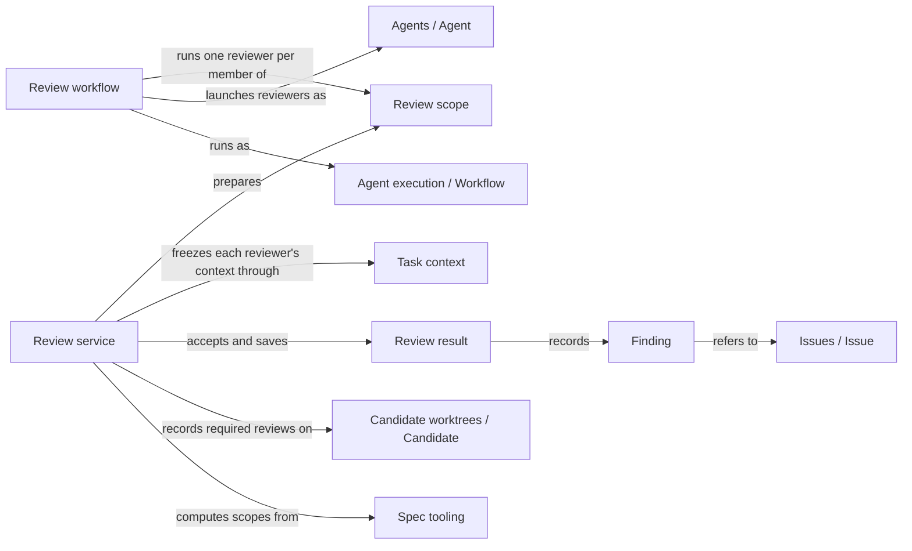

# Review

## Purpose

Review gives a Module an independent second opinion. It provides the Operations
`concorde-spec-review` and `concorde-code-review`: a fresh reviewer reads the Module's complete
Spec, and for code review also the files the Module binds, and reports the concrete problems it
finds for a stated task. Review never repairs anything: it returns findings, what it covered and
the exact inputs it examined. It also owns the rule that says when a change must have a current
review before its next stage. Planning, Implementation, Validation and Issue solving rely on these
results. A clean review is evidence about those inputs and that task only; it does not prove that
the Module has no other problems, and it gives nobody permission to change files.

## Terminology

| Term | Definition |
| --- | --- |
| Spec review | A review that checks whether a Module's complete Spec lets a reader carry out the stated task, without reading any implementation. |
| Code review | A review that checks a Module's bound implementation files against its complete Spec for the stated task. |
| Review scope | The set of Modules that one review request examines, each by its own fresh reviewer: the selected Module and the other Modules the change affects. |
| Review result | The typed record of one reviewer's conclusion for one Module and one review kind, bound to the exact inputs it examined. |
| Finding | One problem a reviewer reported as an Issue, judged either blocking or advisory for the reviewed task. |
| Required review | A review kind that a change has recorded as necessary for a Module, which only a current, complete and non-blocking result for the same task satisfies. |
| [Module](../vocabulary.md#concept.concorde.module) | |
| [Spec](../vocabulary.md#concept.concorde.spec) | |
| [Spec context](../vocabulary.md#concept.concorde.spec-context) | |
| [User session](../vocabulary.md#concept.concorde.user-session) | |
| [Host](../vocabulary.md#concept.concorde.host) | |
| [Evidence](../vocabulary.md#concept.concorde.evidence) | |
| [Operation](../operations/module.md#concept.operations.operation) | |
| [Agent](../agents/module.md#concept.agents.agent) | |
| [Workflow](../harness/execution/module.md#concept.execution.workflow) | |
| [Candidate](../harness/worktrees/module.md#concept.worktrees.candidate) | |
| [Issue](../issues/module.md#concept.issues.issue) | |
| [Blocker](../issues/module.md#concept.issues.blocker) | |
| [Change scope](../planning/module.md#concept.planning.change-scope) | |
| [Component work](../implementation/module.md#concept.implementation.component-work) | |

Learn the two review kinds first, then the result and its findings. Review scope and required
review matter once a review is part of a larger change.

## Usage

The user session calls one of two Operations. `concorde-spec-review` asks whether a Module's Spec is
good enough for a task: can a newcomer understand it, are the promises the task needs present and
consistent, and do the words it imports from other Modules keep their canonical meaning.
`concorde-code-review` asks whether the Module's bound files do what its Spec promises for the task.
They are two separate Operations with separate reviewer Agents, not two modes of one entry, and a
request cannot switch between them.

Both take the same request: `target_id` (the Module, always explicit), `task` (the question the
review serves), and optionally `focus_id` (a scenario of that Module to pay special attention to),
`constraints` and `change_id`. A focus never trims what the reviewer reads: it always receives the
Module's complete [Spec context](../vocabulary.md#concept.concorde.spec-context).

A typical call looks like this. The developer has changed the retry rules in Module
`module.transfer` and asks for a Spec review with the task "retries stop after three failures". The
user session calls `concorde-spec-review` through the Pi `concorde` tool. The Host checks the
request, works out the review scope, freezes a context for every member and returns a prepared
native workflow call. The user session invokes that call unchanged; the workflow runs one fresh
reviewer per member. The user session then polls with the action `result` and receives the accepted
outcome, the saved review reports and one review result per reviewed Module. Review runs in the
current worktree. It needs no managed change and creates none, and it needs no existing Issue:
every problem a reviewer finds is reported as a new [Issue](../issues/module.md#concept.issues.issue)
while it reviews.

A **review result** states a status and what the reviewer covered. `no_findings` means the reviewer
checked the representative tasks it lists and found nothing to report. `findings` means it reported
at least one problem. `incomplete` means it could not finish, for whatever reason. Each **finding**
refers to an Issue the reviewer reported while reviewing, so the problem, its evidence and its owner
live in one place. The reviewer also judges each finding for the task at hand: **blocking** when the
task cannot proceed without a fix, **advisory** when it is a real defect that this task does not
depend on. For example, a missing rule for what happens after the third failed retry blocks the
retry task, while an unrelated vague sentence about logging is advisory. Every result also states
that semantic completeness is not proven.

The Operation's `outcome` summarizes all results of the scope. `completed` means every reviewer
finished and nothing blocks. `conflicting` means a blocking finding in the implementation or a
contradiction the caller must decide how to repair. `spec_incomplete` means a blocking finding names
a missing or conflicting contract, so dependent work pauses until the Spec is repaired. `failed`
means at least one reviewer did not complete; its result is `incomplete`, never clean. A
`describe-policy` request previews the scope and returns `described` without running a reviewer.

One request often reviews more than one Module, because a change to one Module can break others.
For a Spec review inside a managed change, the scope follows **promise-level impact**: the Host
compares the changed documents between the change's starting commit and the candidate, definition
by definition, and the scope holds every Module that selects a changed document without narrowing,
and every Module whose declarations rely on, import, narrow, supersede, relate to or participate in
a changed definition. A Module that narrowed its `uses` to promises that did not change is left out,
even though it reads the changed document. Each member is asked whether it still works with the
changed Spec. Without a managed change or a starting commit, every Module whose Spec context selects
one of the selected Module's documents is a member.

For a code review, the scope holds every other Module that binds a file of the selected Module that
changed since the change started, and every component whose work the change recorded for this
Module. Each of them is reviewed against its own Spec. A Module with no bound files receives no
local code review; its code review consists of its components' reviews, and with no components it
is unsupported.

When the reviewed Module is the one the managed change is about, its scope looks at the whole
candidate rather than at its own files: the Spec review compares every changed document of the
candidate, and the code review includes every Module binding a file the candidate changed. A change
that edits several Modules together, as its [change scope](../planning/module.md#concept.planning.change-scope)
allows, therefore has every edited Module reviewed, and delivering the one candidate is the atomic
step.

Inside a managed change, a review can become a **required review**. When a public review's task,
focus and constraints match the change's accepted intent for that Module, the Host records that
review kind as required before it runs; Issue solving also records the reviews it needs. A
requirement is never removed during the change. Exactly two places check it:

- `concorde-plan`, `concorde-tasks` and `concorde-implement` refuse to start with `review_required`
  while the Module's required **Spec** review, including its consumers' reviews, is not current;
- `concorde-validate` refuses readiness while any required review of any Module in the change,
  **Spec or code**, is not current.

`concorde-context-solve`, the reviews themselves and Issue bookkeeping check no requirement. A
required code review is therefore first checked at validation: implementation may repeat freely
until then. A review that answers a different question is recorded as evidence but does not satisfy
a requirement. Task writing and implementation may also take the current blocking code review as
repair feedback; only the review the change recorded, with unchanged inputs and resolvable findings,
is accepted.

The Spec reviewer has only read tools. The code reviewer has read tools and a `run_checks` tool that
runs its Module's configured checks through the Host; it has no shell, write, edit or delegation
tool. Which files a reviewer opens is limited by its instructions and by the capsule or worktree it
starts in, not by the operating system: Concorde deliberately does not confine a reviewer's reads. A
review whose inputs changed later is no longer current, and an old result never satisfies a current
requirement. Nothing in Review applies a fix.

## Design

The **review service** is the Host side of Review. It implements the reviewer Agent hooks and the
review workflow hook: it computes each reviewer's input, decides the review scope, checks and saves
results, records required reviews and answers the currentness questions that other stages ask. The
key design choice is that a reviewer's answer is only a proposal. The service accepts it only after
checking that it belongs to the admitted reviewer, the frozen context and the exact input digest,
that its status agrees with its findings, and that a completed review names what it covered. This is
what keeps a model's claim from turning into evidence by itself.

Every result is bound to a digest of everything that could change the conclusion: the Module, task,
focus and constraints, the worktree and branch, the Spec revision, for code review the
implementation revision, the changes since the baseline, the reviewer's instructions and declared
effects, the Host's own review runtime files and the project configuration. Any change to one of
these makes the result stale. This is why a review of yesterday's code cannot pass today's gate, and
why a change to the reviewer's instructions calls for a fresh review.

The reviewer sees the complete current documents of its context plus the changes since a baseline:
the change's recorded starting commit, the current `HEAD` in an unmanaged Git checkout, or no
baseline at all in a directory without Git. A Spec reviewer's changes cover the documents of its
Spec context; a code reviewer's cover the files its Module binds. Full documents always accompany
the changes, because a problem often lies in text the change did not touch.

Promise-level impact decides Spec review scopes because document-level impact is too coarse: a
Module that relies on one concept of a large provider would otherwise be re-reviewed for every
unrelated sentence the provider changes. Comparing definitions keeps the scope exactly as wide as
the promises that changed, and a narrowed `uses` is the declaration that makes that possible.

The **review workflow** runs the reviewers. It is an authored pi workflow with exactly two Host
steps, whatever the scope size: a first step that checks every prepared member is still current,
and a final step that accepts the whole scope. Between them it runs one fresh reviewer per member,
one after another, and stops at the first reviewer that fails or loses its evidence. The final Host
step reads every reviewer's saved native records itself, admits each proposal, rechecks that the
scope, every member's context and every input are unchanged, and only then saves results. A reviewer
that exited successfully is not yet an accepted review, and a partially run scope is never accepted
as complete. Review has no cap of its own on scope size; the native runtime's budgets apply, and
exhausting them makes the review incomplete. The Host services behind the workflow's steps are
moving from the Harness package into Review's own package.

Each Module in a scope gets its own reviewer because each Module keeps its own promises. A shared
file changed for one Module is reviewed once per Module that binds it, each time against that
Module's own Spec, and a parent never receives its components' code. Fresh sessions keep the
assumptions of whoever wrote the change out of the review. The reviewer instructions, which Agents
owns, ask each reviewer to report every blocking finding it can establish in one pass, and to judge
only the scenarios and declarations of its own admitted context. The Host cannot verify either:
what it checks is the shape, identity and coverage of the result.

The **Review declarations** are the catalog entries of `concorde-spec-review` and
`concorde-code-review`, and the guidance the Pi session shows for each.

The **Review tests** exercise the service, the workflow and the promise-level impact computation,
with scripted reviewers and an opt-in test against real native Pi reviewers.

## Relationships

The picture shows the path of one review request. The other collaborations are explained below.

**Operations** catalogs both review [Operations](../operations/module.md#concept.operations.operation)
in the [Operation catalog](../operations/module.md#concept.operations.catalog) as pi workflows, each
naming its reviewer Agent and the `spec-review` or `code-review` phase. Review relies on that
declaration, not on a table of its own, to fix the review kind; a request cannot change it.

**Request admission** checks every [capability request](../harness/admission/module.md#concept.admission.capability-request),
binds it to the current worktree and wraps the answer in the
[result envelope](../harness/admission/module.md#concept.admission.result-envelope). When admission
refuses a request, no reviewer is prepared.

**Task context** freezes the complete [context snapshot](../harness/context/module.md#concept.context.snapshot)
of each reviewed Module in the review [phase](../harness/context/module.md#concept.context.phase) and
rechecks it later. Review adds the reviewer input as a [stage input](../harness/context/module.md#concept.context.stage-input),
freezes one context per member when it prepares the scope and rechecks every one of them before
accepting results. A changed context makes the whole scope stale; Review then refuses to accept
rather than saving results for inputs the reviewers did not see.

**Agent execution** runs native Pi Agents and [workflows](../harness/execution/module.md#concept.execution.workflow),
calls the reviewer [Agent hooks](../harness/execution/module.md#concept.execution.agent-hook) and
the review [workflow hook](../harness/execution/module.md#concept.execution.workflow-hook) that the
review service implements, runs the workflow's [Host steps](../harness/execution/module.md#concept.execution.host-step)
under the [Host-step protocol](../harness/execution/interfaces.md#contract.execution.host-step), and
passes each reviewer's [proposal](../harness/execution/module.md#concept.execution.proposal) through
the [result gate](../harness/execution/module.md#concept.execution.result-gate). A reviewer whose
native records are missing or inconsistent makes the review incomplete.

**Candidate worktrees** keeps the [change status](../harness/worktrees/module.md#concept.worktrees.change-status)
of each [candidate](../harness/worktrees/module.md#concept.worktrees.candidate) and the location of
[run records](../harness/worktrees/module.md#concept.worktrees.run-record). Review reads the change's
starting commit and accepted intent, writes the review requirements, the latest review record per
Module and kind, and the recorded consumer and component reviews, and saves its reports as run
records. When a result for a required review is recorded, Review clears the candidate's validated
tree, so a candidate that was ready must be validated again.

**Agents** defines the Spec reviewer and the code reviewer [Agents](../agents/module.md#concept.agents.agent)
in their [Agent definitions](../agents/module.md#concept.agents.definition): instructions, tools
and declared effects. Review binds the instructions and effects into each input digest and refuses a
reviewer definition without declared effects.

**Issues** stores every problem a reviewer reports as an [Issue](../issues/module.md#concept.issues.issue)
[report](../issues/module.md#concept.issues.report) with its evidence and owner. A finding refers to
that report by its receipt instead of copying it. Review turns blocking findings into
[blockers](../issues/module.md#concept.issues.blocker) of the affected task, asks Issues whether a
blocker needs a Spec repair, and resolves receipts when an older result is reused. A receipt that
does not resolve makes the older result unusable.

**Spec tooling** loads the [registry](../spec/module.md#concept.spec.registry) and the
[documents](../spec/module.md#concept.spec.document), and provides the
[boundary sets](../spec/module.md#concept.spec.boundary-set) of each Module and the
[impact indexes](../spec/module.md#concept.spec.impact-index): which Modules select a document, which
declarations reference a node, which Modules bind a file, and which documents changed between two
revisions. Review loads the Specs at the change's starting commit from Git objects through the same
loader, so the definitions of both revisions can be compared, and registers its result and input
shapes as [typed values](../spec/module.md#concept.spec.typed-value). Without a structurally valid
project, Review cannot compute a scope and refuses the request.

**Check execution** runs a Module's [configured checks](../harness/checks/module.md#concept.checks.configured-check)
inside the [read-only check boundary](../harness/checks/module.md#concept.checks.read-only-boundary)
when a code reviewer calls `run_checks`, and returns each [check result](../harness/checks/module.md#concept.checks.check-result)
with the tail of its log. Review treats those results as information for the reviewer, never as
validation evidence.

**Planning** defines the [change scope](../planning/module.md#concept.planning.change-scope) that
bounds which components a review may include, derives each component's task text by the
[implementation task contract](../planning/workflow.md#contract.planning.implementation-task), and
keeps the [pending gaps](../planning/module.md#concept.planning.pending-gap) in which Review records
the blockers of its findings. Review refuses a recorded component outside the change scope, and does
not reuse an earlier result while a pending gap recorded after it is still open.

**Implementation** records [component work](../implementation/module.md#concept.implementation.component-work)
and the [task completion](../implementation/module.md#concept.implementation.completion) of each
component. Review reads the recorded components of the selected Module and asks each one about its
component task. Review never starts or continues component work.

Review provides the [review result contract](contracts.md#contract.review.result) to Planning and
Implementation, which admit a code review as repair feedback, and to Issue solving, which reads the
results of the reviews it runs.
