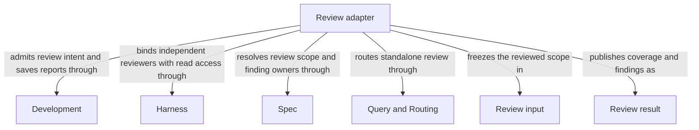

# Review

## Purpose

Review independently examines whether current specifications or code support the requested task. It returns findings and the scope actually examined, without repairing files. A successful review is evidence about those inputs and that question, not proof that every possible problem is absent.

## Terminology

| Term | Meaning / definition |
| --- | --- |
| Review coverage | The representative questions and cases actually examined by this review. |
| Advisory finding | A concrete problem recorded for consideration that does not block the admitted task. |
| [Spec](../module.md#terminology) | Defined in Concorde Framework. |
| [Evidence](../module.md#terminology) | Defined in Concorde Framework. |
| [Worker](../module.md#terminology) | Defined in Concorde Framework. |
| [Host](../module.md#terminology) | Defined in Concorde Framework. |
| [Grant](../module.md#terminology) | Defined in Concorde Framework. |
| [Worktree](../module.md#terminology) | Defined in Concorde Framework. |
| [Graph](../module.md#terminology) | Defined in Concorde Framework. |

## Usage

Request `concorde-review` with a task and `review_mode=spec|code`. Optional target/focus hints help
the router select one owner; an existing-change resumption supplies its bound target and change ID.
A standalone review runs in the current worktree without creating a development change. Spec mode
assesses the complete readable contract and design of the admitted contract; code mode additionally compares the
authorized implementation with that contract. Neither reviewer can repair files.

Read the typed [review result](review-result.md), including representative coverage, findings,
gaps and exact revision. No findings is a bounded conclusion, not universal proof; skipped,
not-run and incomplete are distinct from success. Missing necessary contracts pause dependent work,
while independent defects can remain advisory. Explicit standalone review is fresh; a composing
Graph can reuse only current evidence for the same intent. Failure, cancellation and invalid output
cannot masquerade as clean review. The caller decides whether an admitted repair is appropriate;
the reviewer itself does not execute it.

For example, reviewing a retry change includes its promised failure behavior and affected consumers.
An unrelated pre-existing limitation may be reported as advisory rather than automatically becoming
work required by this change. A missing contract necessary for the retry decision can block it.

## Design

The host constructs a digest-bound review input from current admitted sources and scoped changes,
then launches a fresh Spec or code reviewer under a read-only grant. Result admission checks
identity, coverage, locations and gap/finding consistency before retaining a typed report. Peer
reviews run separately and aggregate only results, not provider code or private conversation.

The two reviewers are separate model-backed Operations: `spec-reviewer` for Spec mode and
`code-reviewer` for code mode. Each runs as one
[Operation node](../harness/execution-reference.md#host-operation-node-operation-node) with its own
read-only grant. `concorde-review` has no Graph of its own. The common
[target admission Graph](../development/execution-reference.md#graphs-target-admission-graph-target-graph)
first binds the given owner or routes the task through the
[discovery Graph](../query-routing/execution-reference.md#query-and-routing-discovery-graph-discovery-graph),
and the router returns only the owner and focus, never a rewritten task. The
[dispatch Graph](../development/execution-reference.md#graphs-operation-dispatch-graph-dispatch-graph)'s
`review` leaf then reviews the owner, followed by each affected Module one at a time through the
[Sequential work items Graph](../harness/execution-reference.md#host-sequential-work-items-graph-batch-graph);
the first review that does not complete stops the rest. A code review skips an affected Module that
lists no implementation files.

A review of yesterday's code cannot establish today's changed revision. Binding results to current
inputs supports exact-intent reuse by composing graphs and fresh standalone review. Each reviewer
gets a fresh conversation so an author's assumptions cannot silently become review evidence. When a
changed file serves several Modules, each affected owner is reviewed against its own contract;
one reviewer does not acquire another Module's code. A report remains evidence about one task and revision;
its wire representation does not authorize a repair or override lifecycle gates.

## Relationships

This view covers selection, review admission and the resulting evidence, not a repair workflow.
[Query and Routing](../query-routing/module.md) selects the owner of an unbound standalone request; [Spec Module](../spec/module.md) supplies current scope
and finding ownership; [Harness Module](../harness/module.md) isolates the reviewer with read-only access. [Development Module](../development/module.md) accepts
and stores the Review result against the frozen Review input. None of these dependency edges gives
the reviewer write authority, and the result does not itself advance delivery or repair files.

### Development

Admit review intent and current revision, validate returned review identities and persist reports without changing reviewed project files.

This collaboration applies when standalone or composed review enters and when its report is accepted or refused.

- [Host admission](../development/interfaces.md#operation-execution-boundary); Recheck admitted intent and returned identities before accepting host state; a rejected result cannot advance the dependent step.

### Harness

Run independent fresh Spec or code reviewers with read-only grants and no author conversation, network or credentials.

This collaboration applies before each selected review mode and target is invoked, including recorded component reviews.

- [Complete context selection](../harness/contracts.md#contract.context.selection); Supply only mode-admitted inputs and require a matching completion; unavailable enforcement stops execution without a wider grant.

### Spec

Resolve complete review contracts, sole finding owners and the current implementation enumeration permitted in code mode.

This collaboration applies when freezing a review scope, attributing findings or rechecking its Spec and code revision.

- [Owner and context resolution](../spec/contracts.md#registry-stable-id-spec-context-queries); Reconstruct current resolutions after input changes; unresolved ownership, missing required definitions or stale revisions block dependent use.

### Query and Routing

Select one owning Module for a new standalone review while preserving its original task, focus and constraints.

This collaboration applies when a new standalone review has neither a trusted bound target nor a bound current-change resumption.

- [Explicit discovery and routing](../query-routing/module.md#usage); Preserve submitted task and constraints; accept only admitted selections and stop on gaps, ambiguity or discovery limits.

## Precise specifications

The Review Module owns the exact obligations and interface details in [requirements](requirements.md), [scenarios](scenarios.md) and the
[execution and record contracts](execution-reference.md#review-independent-review-operation).
These companions are part of the same complete Module specification, not separate topic owners.
