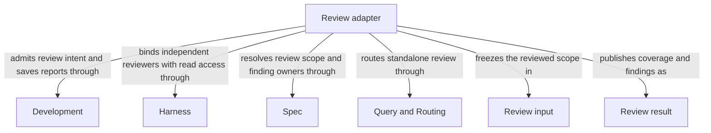

```concorde-document
{
  "id": "document.review.module",
  "owner": "module.review",
  "main_visible": true
}
```

# Review

## Purpose

Review independently evaluates an admitted task against current Module contracts and, in code mode, its separately granted implementation. It serves standalone callers and composing flows with revision-bound coverage, findings and gaps, without repairing or delivering the reviewed work.

## Requirements

### req.review.admitted-contract — Bind independent findings to current review inputs

Review SHALL return independent findings bound to its exact admitted task and current input revision.

## Scenarios

### scenario.development.standalone-review — Public review without a development change

- GIVEN an initialized project without a managed development change or selected Reflection record
- AND a task with review_mode spec or code and optional target/focus routing hints
- WHEN the user invokes the public `concorde-review` Skill or its Studio entry
- THEN a Spec-only coordinator selects one owning Module and a separate fresh reviewer receives its complete contract and, in code mode, only its admitted implementation files and scoped changes
- AND neither Agent receives write, network or credential authority
- AND the host returns typed review coverage, findings, gaps and completion status, persisting the review report without creating a development change or changing project Specs or implementation
- AND an unmanaged Git checkout uses HEAD as the scoped change baseline

The detailed contract is [Independent current review](review.md).

## Ontology

### Entities

```concorde-entities
[
  {
    "id": "entity.review.adapter",
    "title": "Review adapter",
    "kind": "shared program",
    "responsibility": "Review independently evaluates an admitted task against current Module contracts and, in code mode, its separately granted implementation. It serves standalone callers and composing flows with revision-bound coverage, findings and gaps, without repairing or delivering the reviewed work.",
    "files": [
      "capabilities/review.py",
      "tests/concorde/development/test_review.py",
      "tests/concorde/development/test_run_capability.py",
      "tests/concorde/development/test_standalone_review.py"
    ]
  },
  {
    "id": "entity.review.development",
    "title": "Development",
    "kind": "used module",
    "target_id": "module.development",
    "responsibility": "Admit review intent and current revision, validate returned review identities and persist reports without changing reviewed project files."
  },
  {
    "id": "entity.review.harness",
    "title": "Harness",
    "kind": "used module",
    "target_id": "module.harness",
    "responsibility": "Run independent fresh Spec or code reviewers with read-only grants and no author conversation, network or credentials."
  },
  {
    "id": "entity.review.spec",
    "title": "Spec",
    "kind": "used module",
    "target_id": "module.spec",
    "responsibility": "Resolve complete review contracts, sole finding owners and the current implementation enumeration permitted in code mode."
  },
  {
    "id": "entity.review.query-routing",
    "title": "Query and Routing",
    "kind": "used module",
    "target_id": "module.query-routing",
    "responsibility": "Select one owning Module for a new standalone review while preserving its original task, focus and constraints."
  },
  {
    "id": "entity.review.review-input",
    "title": "Review input",
    "kind": "record",
    "responsibility": "Current complete contract, exact task and separately granted scoped changes."
  },
  {
    "id": "entity.review.result",
    "title": "Review result",
    "kind": "record",
    "responsibility": "Canonical revision-bound coverage, findings and gaps without mutation authority."
  }
]
```

### Relationships



## Dependencies and composition

```concorde-dependencies
[
  {
    "target_id": "module.development",
    "responsibility": "Admit review intent and current revision, validate returned review identities and persist reports without changing reviewed project files.",
    "selection_condition": "When standalone or composed review enters and when its report is accepted or refused.",
    "relied_upon_promises": [
      "[Host admission](../development/interfaces.md#capability-execution-boundary); Recheck admitted intent and returned identities before accepting host state; a rejected result cannot advance the dependent step."
    ]
  },
  {
    "target_id": "module.harness",
    "responsibility": "Run independent fresh Spec or code reviewers with read-only grants and no author conversation, network or credentials.",
    "selection_condition": "Before each selected review mode and target is invoked, including recorded component reviews.",
    "relied_upon_promises": [
      "[Complete context selection](../harness/context.md#contract.context.selection); Supply only mode-admitted inputs and require a matching completion; unavailable enforcement stops execution without a wider grant."
    ]
  },
  {
    "target_id": "module.spec",
    "responsibility": "Resolve complete review contracts, sole finding owners and the current implementation enumeration permitted in code mode.",
    "selection_condition": "When freezing a review scope, attributing findings or rechecking its Spec and code revision.",
    "relied_upon_promises": [
      "[Owner and context resolution](../spec/registry.md#stable-id-spec-context-queries); Reconstruct current resolutions after input changes; unresolved ownership, missing required definitions or stale revisions block dependent use."
    ]
  },
  {
    "target_id": "module.query-routing",
    "responsibility": "Select one owning Module for a new standalone review while preserving its original task, focus and constraints.",
    "selection_condition": "When a new standalone review has neither a trusted bound target nor a bound current-change resumption.",
    "relied_upon_promises": [
      "[Explicit discovery and routing](../query-routing/query-and-routing.md); Preserve submitted task and constraints; accept only admitted selections and stop on gaps, ambiguity or discovery limits."
    ]
  }
]
```

## Realization and reuse limits

This Module and its consumers are siblings under Concorde Framework. Declared files explicitly
share the existing adapter realization with Development; no new runtime package, public Skill,
Agent grant or configurable arbitrary flow is created by this Spec boundary. Host admission,
phase artifacts and permissions remain mandatory. A new flow requires declared composition and
an implementation of its sequencing, artifact admission, recovery and completion policies before
it can execute. The existing host package still realizes common dispatch and provider internals.
