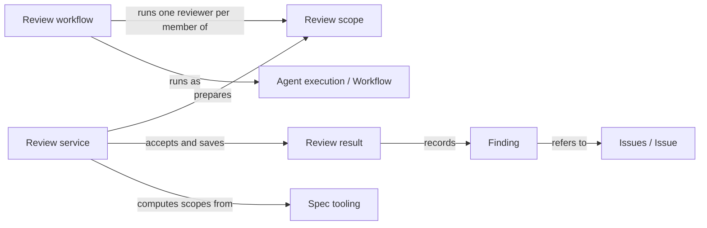

# Review

## Purpose

Review gives a Module an independent second opinion. It provides the Operations
`concorde-spec-review` and `concorde-code-review`: a fresh reviewer reads the Module's complete
Spec, and for code review also the files the Module binds, and reports the concrete problems it
finds for a stated task. Review never repairs anything: it returns findings, what it covered and
the exact inputs it examined. It also owns the rule that says when a change must have a current
review before its next stage. Planning, Implementation, Validation and Issue solving rely on these
results. A clean review is evidence about those inputs and that task only; it does not prove that
the Module has no other problems, and it gives nobody permission to change files.

## Terminology

| Term | Definition |
| --- | --- |
| Spec review | A review that checks whether a Module's complete Spec lets a reader carry out the stated task, without reading any implementation. |
| Code review | A review that checks a Module's bound implementation files against its complete Spec for the stated task. |
| Review scope | The set of Modules that one review request examines, each by its own fresh reviewer: the selected Module and the other Modules the change affects. |
| Review result | The typed record of one reviewer's conclusion for one Module and one review kind, bound to the exact inputs it examined. |
| Finding | One problem a reviewer reported as an Issue, judged either blocking or advisory for the reviewed task. |
| Required review | A review kind that a change has recorded as necessary for a Module, which only a current, complete and non-blocking result for the same task satisfies. |
| [Spec context](../vocabulary.md#concept.concorde.spec-context) | |
| [Operation](../operations/module.md#concept.operations.operation) | |
| [Issue](../issues/module.md#concept.issues.issue) | |
| [Change scope](../planning/module.md#concept.planning.change-scope) | |

## Usage

`concorde-spec-review` asks whether a Module's Spec is good enough for a task: understandable,
complete and consistent for it, with imported words keeping their canonical meaning.
`concorde-code-review` asks whether the Module's bound files do what its Spec promises for the task.
They are separate Operations with separate reviewer Agents. Both take `target_id`, `task`, and
optionally `focus_id`, `constraints` and `change_id`; a focus never trims the Module's complete
[Spec context](../vocabulary.md#concept.concorde.spec-context). The Host computes the scope, freezes
a context per member and returns a prepared workflow call; the user session invokes it unchanged,
the workflow runs one fresh reviewer per member, and polling returns the outcome, the saved reports
and one review result per Module. A review needs no managed change and creates none; every problem
found is reported as a new [Issue](../issues/module.md#concept.issues.issue). A worked example is in
the [design notes](design.md).

A **review result** has the status `no_findings` (the listed representative tasks were covered and
nothing was found), `findings`, or `incomplete` (the review did not finish; never clean). Each
**finding** refers to the Issue the reviewer reported and is judged **blocking** when the task cannot
proceed without a fix, or **advisory**. The Operation's outcome is `completed` when all finished and
nothing blocks, `conflicting` for a blocking implementation defect or contradiction,
`spec_incomplete` when a blocking finding needs a Spec repair, `failed` when a reviewer did not
complete, and `described` for a `describe-policy` preview that runs no reviewer.

Inside a managed change, a Spec review's scope follows **promise-level impact**: it holds every
Module that selects a changed document without narrowing, and every Module whose declarations rely
on, import, narrow, supersede, relate to or participate in a changed definition; without a change
or baseline, every Module selecting one of the target's documents. A code review's scope holds every
other Module binding a changed file of the target and every recorded component; a Module with no
bound files is reviewed only through its components. For the Module the change is about, both look
at the whole candidate, so every Module the change edits within its
[change scope](../planning/module.md#concept.planning.change-scope) is reviewed. The exact
computation is in [scope members](contracts.md#scope-members).

A review whose task, focus and constraints match the change's accepted intent for the Module is
recorded as a **required review** before it runs, and stays required for the whole change. Exactly
two places check it: `concorde-plan`, `concorde-tasks` and `concorde-implement` refuse with
`review_required` while the required **Spec** review is not current, and `concorde-validate` refuses
readiness while any required review, **Spec or code**, is not current. Nothing else checks it. Task
writing and implementation may also take the current blocking code review as repair feedback.

The Spec reviewer has only read tools; the code reviewer has read tools and `run_checks`, and no
shell, write, edit or delegation tool. Reviewers' reads are limited by instruction and by where they
start, not by the operating system. Nothing in Review applies a fix.

## Design

The **review service** implements the reviewer hooks and the review workflow hook: it computes each
reviewer's input and the scope, accepts and saves results, records required reviews and answers
currentness questions. A reviewer's answer is only a proposal; it becomes a result only when it
names the admitted context and input digest and its status agrees with its findings. Every result
is bound to a digest of everything that could change the conclusion, including the reviewer's
instructions and the Host's review code, so a change to any of them makes it stale.

The **review workflow** has exactly two Host steps whatever the scope size: one checks that every
prepared member is current, and one accepts the whole scope after rechecking every input; between
them one fresh reviewer per member runs in order, and the workflow stops at the first that fails. A
partially run scope is never accepted as complete. Its Host services are the review workflow hook.

The **Review declarations** are the catalog entries and guidance of the two review Operations.

The **Review tests** exercise the service, the workflow and the promise-level impact computation.

The reasons for promise-level scopes, one reviewer per Module and the reviewer instructions are in
the [design notes](design.md).

## Relationships

**Operations** catalogs both review [Operations](../operations/module.md#concept.operations.operation)
in the [Operation catalog](../operations/module.md#concept.operations.catalog) as pi workflows; the
declared phase, not the request, fixes the review kind.

**Request admission** checks each [capability request](../harness/admission/module.md#concept.admission.capability-request)
and wraps the answer in the [result envelope](../harness/admission/module.md#concept.admission.result-envelope);
a refused request prepares no reviewer.

**Task context** freezes each member's [context snapshot](../harness/context/module.md#concept.context.snapshot)
in its review [phase](../harness/context/module.md#concept.context.phase), with the reviewer input as
a [stage input](../harness/context/module.md#concept.context.stage-input). Review rechecks every
snapshot before accepting; a changed one makes the whole scope stale.

**Agent execution** runs the reviewers and the [workflow](../harness/execution/module.md#concept.execution.workflow)
through Review's [Agent hooks](../harness/execution/module.md#concept.execution.agent-hook) and
[workflow hook](../harness/execution/module.md#concept.execution.workflow-hook), with
[Host steps](../harness/execution/module.md#concept.execution.host-step) under the
[Host-step protocol](../harness/execution/interfaces.md#contract.execution.host-step). Each
[proposal](../harness/execution/module.md#concept.execution.proposal) must pass the
[result gate](../harness/execution/module.md#concept.execution.result-gate); missing native records
make the review incomplete.

**Candidate worktrees** keeps the [change status](../harness/worktrees/module.md#concept.worktrees.change-status)
of the [candidate](../harness/worktrees/module.md#concept.worktrees.candidate), where Review reads
the starting commit and intent and writes requirements and review records, and the
[run records](../harness/worktrees/module.md#concept.worktrees.run-record) holding its reports.
Recording a required review's result clears the candidate's validated tree.

**Agents** defines the two reviewer [Agents](../agents/module.md#concept.agents.agent) in their
[Agent definitions](../agents/module.md#concept.agents.definition); Review binds their instructions
and effects into each input digest and refuses a definition without declared effects.

**Issues** stores each problem as an [Issue](../issues/module.md#concept.issues.issue)
[report](../issues/module.md#concept.issues.report). A finding refers to it by receipt; blocking
findings become [blockers](../issues/module.md#concept.issues.blocker), and a receipt that no longer
resolves makes an older result unusable.

**Spec tooling** provides the [registry](../spec/module.md#concept.spec.registry),
[documents](../spec/module.md#concept.spec.document), [boundary sets](../spec/module.md#concept.spec.boundary-set)
and [impact indexes](../spec/module.md#concept.spec.impact-index) from which scopes are computed,
also for the baseline loaded from Git objects, and registers Review's shapes as
[typed values](../spec/module.md#concept.spec.typed-value). An invalid project cannot be scoped and is
refused.

**Check execution** runs the Module's [configured checks](../harness/checks/module.md#concept.checks.configured-check)
in the [read-only check boundary](../harness/checks/module.md#concept.checks.read-only-boundary) when a
code reviewer calls `run_checks`; each [check result](../harness/checks/module.md#concept.checks.check-result)
informs the reviewer and is never validation evidence.

**Planning** defines the [change scope](../planning/module.md#concept.planning.change-scope) that bounds
a review's components, the component task rule of the [implementation task contract](../planning/workflow.md#contract.planning.implementation-task),
and the [pending gaps](../planning/module.md#concept.planning.pending-gap) where Review records its
blockers. Review refuses a component outside the scope and reuses no result while a later gap is
open.

**Implementation** records [component work](../implementation/module.md#concept.implementation.component-work)
and its [task completion](../implementation/module.md#concept.implementation.completion); Review
asks each recorded component about its component task and never continues component work.

Review provides the [review result contract](contracts.md#contract.review.result) to Planning and
Implementation, which admit a code review as repair feedback, and to Issue solving, which reads the
results of the reviews it runs.
