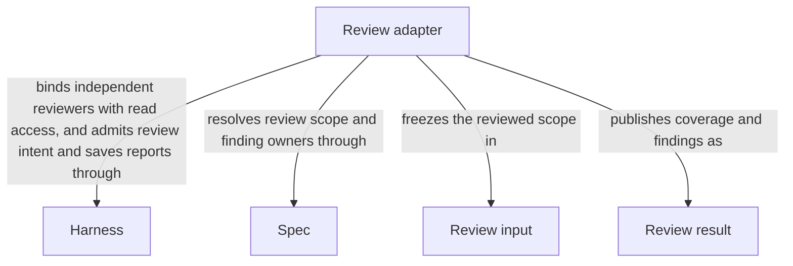

# Review

## Purpose

Review independently examines whether current specifications or code support the requested task. It returns findings and the scope actually examined, without repairing files. A successful review is evidence about those inputs and that question, not proof that every possible problem is absent.

## Terminology

| Term                                 | Meaning / definition                                                                 |
| ------------------------------------ | ------------------------------------------------------------------------------------ |
| Review coverage                      | The representative questions and cases actually examined by this review.             |
| Advisory finding                     | A concrete problem recorded for consideration that does not block the admitted task. |
| [Spec](../module.md#terminology)     | Defined in Concorde Framework.                                                       |
| [Evidence](../module.md#terminology) | Defined in Concorde Framework.                                                       |
| [Worker](../module.md#terminology)   | Defined in Concorde Framework.                                                       |
| [Host](../module.md#terminology)     | Defined in Concorde Framework.                                                       |
| [Grant](../module.md#terminology)    | Defined in Concorde Framework.                                                       |
| [Worktree](../module.md#terminology) | Defined in Concorde Framework.                                                       |
| [Graph](../module.md#terminology)    | Defined in Concorde Framework.                                                       |

## Usage

Use `concorde-spec-review` to assess a Module's complete specification and design, or
`concorde-code-review` to compare its authorized implementation with that contract. These are
separate native Workflow capabilities, not modes of one entry. Both require an explicit Module target and task;
optional focus selects a scenario owned by that Module without trimming its complete context.
An existing-change request supplies the current change ID. Neither accepts a review-mode selector. A standalone review runs in the current worktree without
creating a development change, and neither reviewer can repair files.

Spec review always checks terminology semantic consistency across its complete admitted reading
collection, including referenced documents. Each local restatement is compared with its direct
canonical definition for scope, conditions, constraints, exceptions and obligation strength. Different
wording is allowed; text equality is not required. Source-only rows still need an admitted canonical
source. A missing or ambiguous definition is a gap, not a reason to fetch outside the grant. The result
records coverage, semantic differences and unresolved comparisons; an unfinished comparison is not
silently counted as consistent.

Read the typed [review result](review-result.md), including representative coverage, findings,
gaps and exact revision. No findings is a bounded conclusion, not universal proof; skipped,
not-run and incomplete are distinct from success. Missing necessary contracts pause dependent work,
while independent defects can remain advisory. Explicit standalone review is fresh; a composing
caller can rely only on current evidence for the same intent. Failure, cancellation and invalid output
cannot masquerade as clean review. The caller decides whether an admitted repair is appropriate;
the reviewer itself does not execute it.

For example, reviewing a retry change includes its promised failure behavior and affected consumers.
An unrelated pre-existing limitation may be reported as advisory rather than automatically becoming
work required by this change. A missing contract necessary for the retry decision can block it.

## Design

The host constructs a digest-bound review input from current admitted sources and scoped changes,
then launches a fresh Spec or code reviewer under a read-only grant. Result admission checks
identity, coverage, locations and gap/finding consistency before retaining a typed report. Peer
reviews run separately and aggregate only results, not provider code or private conversation.

Public review prepares a named native workflow. The Host deterministically enumerates the owner,
explicit components and affected consumers, then projects a separate fresh reviewer for each admitted
Module. The authored workflow runs those reviewers sequentially; each sees only its own complete
context and scoped changes. A fixed Host preflight step and one aggregate finalization step avoid
per-item command grants and do not impose a new review-count cap. Native capacity/deadline limits
still apply and cannot turn partial coverage into success. Code-free parents aggregate applicable
components without inventing an owner code review.

The Host independently checks exact coverage, identities, immutable receipts and current inputs
before aggregating typed results. A native successful exit or staging gate is not accepted review.
Failed/missing reviewers leave incomplete evidence and never downgrade required review. The public
path does not use the former batch/Graph wrapper. Issue solving flattens fresh Issue-specific and ordinary native reviewer calls into its own bounded
workflow. No public or Issue-internal failure falls back to legacy review/worker/batch execution.

A review of yesterday's code cannot establish today's changed revision. Binding results to current
inputs supports exact-intent reuse by composing graphs and fresh standalone review. Each reviewer
gets a fresh conversation so an author's assumptions cannot silently become review evidence. When a
changed file serves several Modules, each affected owner is reviewed against its own contract;
one reviewer does not acquire another Module's code. A report remains evidence about one task and revision;
its wire representation does not authorize a repair or override lifecycle gates.

## Relationships

This view covers selection, review admission and the resulting evidence, not a repair workflow.
The calling agent selects the Module; [Spec Module](../spec/module.md) supplies current scope
and finding ownership; [Harness Module](../harness/module.md) delivers the reviewer's intended read-only context. [Harness admission](../harness/admission.md) accepts
and stores the Review result against the frozen Review input. None of these dependency edges gives
the reviewer write authority, and the result does not itself advance delivery or repair files.

### Harness

Run independent fresh native Spec or code reviewers without author conversation or shell/write/edit/delegation tools. Their file/network/credential exclusions are prompt-level policy; fixed Host checks retain their separate actual isolation.

This collaboration applies before each selected review mode and target is invoked, including recorded component reviews.

Admit review intent and current revision, validate returned review identities and persist reports without changing reviewed project files.

This collaboration applies when standalone or composed review enters and when its report is accepted or refused.

- [Complete context selection](../harness/contracts.md#contract.context.selection); Supply only mode-admitted inputs and require a matching completion; unavailable enforcement stops execution without a wider grant.
- [Host admission](../harness/admission.md#operation-execution-boundary); Recheck admitted intent and returned identities before accepting host state; a rejected result cannot advance the dependent step.

### Spec

Resolve complete review contracts, sole finding owners and the current implementation enumeration permitted in code mode.

This collaboration applies when freezing a review scope, attributing findings or rechecking its Spec and code revision.

- [Owner and context resolution](../spec/contracts.md#registry-stable-id-spec-context-queries); Reconstruct current resolutions after input changes; unresolved ownership, missing required definitions or stale revisions block dependent use.

## Precise specifications

The Review Module owns the exact obligations and interface details in [requirements](requirements.md), [scenarios](scenarios.md) and the
[execution and record contracts](execution-reference.md#review-independent-review-operation).
These companions are part of the same complete Module specification, not separate topic owners.

Native reviewer file scope is prompt-level policy, not OS confinement or proof of exclusive reads.
Reviewers have read tools and, for code review, the fixed Host check service; no native shell/write/
edit/delegation tools are supplied. Their conversation never inherits programmer reasoning.

### Agents

[Agents](../agents/module.md) owns callable role definitions and interaction. This Module consumes
those definitions rather than maintaining a role catalog or behavioral copy. It preserves the
role's family, scope and frozen grant and refuses missing or stale bindings; domain artifact
acceptance and execution mechanisms remain with their existing owners.
