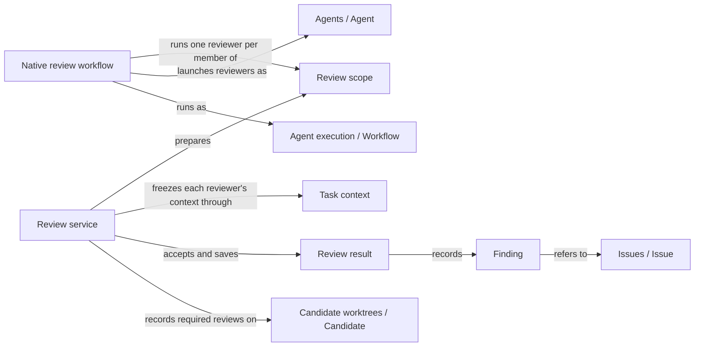

# Review

## Purpose

Review gives a Module an independent second opinion. A fresh reviewer reads the Module's complete
Spec, and for code review also the files the Module binds, and reports the concrete problems it
finds for a stated task. Review never repairs anything: it returns findings, what it covered and
the exact inputs it examined. The user session, planning, implementation, validation and Issue
solving rely on these results. A clean review is evidence about those inputs and that task only; it
does not prove that the Module has no other problems, and it gives nobody permission to change
files.

## Terminology

| Term | Definition |
| --- | --- |
| Spec review | A review that checks whether a Module's complete Spec lets a reader carry out the stated task, without reading any implementation. |
| Code review | A review that checks a Module's bound implementation files against its complete Spec for the stated task. |
| Review scope | The set of Modules that one review request examines, each by its own fresh reviewer: the selected Module and the other Modules the change affects. |
| Review result | The typed record of one reviewer's conclusion for one Module and one review kind, bound to the exact inputs it examined. |
| Finding | One problem a reviewer reported as an Issue, judged either blocking or advisory for the reviewed task. |
| Required review | A review kind that a change has recorded as necessary for a Module, which only a current, complete and non-blocking result for the same task satisfies. |
| [Module](../vocabulary.md#concept.concorde.module) | |
| [Spec](../vocabulary.md#concept.concorde.spec) | |
| [Context](../vocabulary.md#concept.concorde.context) | |
| [Capability](../vocabulary.md#concept.concorde.capability) | |
| [User session](../vocabulary.md#concept.concorde.user-session) | |
| [Host](../vocabulary.md#concept.concorde.host) | |
| [Worker](../vocabulary.md#concept.concorde.worker) | |
| [Evidence](../vocabulary.md#concept.concorde.evidence) | |
| [Agent](../agents/module.md#concept.agents.agent) | |
| [Workflow](../harness/execution/module.md#concept.execution.workflow) | |
| [Candidate](../harness/worktrees/module.md#concept.worktrees.candidate) | |
| [Issue](../issues/module.md#concept.issues.issue) | |
| [Blocker](../issues/module.md#concept.issues.blocker) | |

Learn the two review kinds first, then the result and its findings. Review scope and required
review matter once a review is part of a larger change.

## Usage

The user session calls one of two capabilities. `concorde-spec-review` asks whether a Module's
Spec is good enough for a task: can a newcomer understand it, are the promises the task needs
present and consistent, and do the words it imports from other Modules keep their canonical
meaning. `concorde-code-review` asks whether the Module's bound files do what its Spec promises for
the task. They are two separate capabilities with separate reviewer Agents, not two modes of one
entry, and a request cannot switch between them.

Both take the same request: `target_id` (the Module, always explicit), `task` (the question the
review serves), and optionally `focus_id` (a scenario of that Module to pay special attention to),
`constraints` and `change_id` (the change in the current worktree). A focus never trims what the
reviewer reads: it always receives the Module's complete context.

A typical call looks like this. The developer has changed the retry rules in Module `module.transfer`
and asks for a Spec review with the task "retries stop after three failures". The user session
calls `concorde-spec-review` through the Pi `concorde` tool. The Host checks the request, works
out the review scope, freezes a context for every member and returns a prepared native workflow
call. The user session invokes that call unchanged; the workflow runs one fresh reviewer per member.
The user session then calls the same capability again with the action `result` and receives the
accepted outcome, the saved review reports and one review result per reviewed Module. Review runs in
the current worktree. It needs no managed change and no existing Issue, and it creates neither.

A review result states a status and what the reviewer covered. `no_findings` means the reviewer
checked the representative tasks it lists and found nothing to report. `findings` means it reported
at least one problem. `incomplete` means it could not finish, for whatever reason. Each finding
refers to an Issue the reviewer reported while reviewing, so the problem, its evidence and its
owner live in one place. The reviewer also judges each finding for the task at hand: **blocking**
when the task cannot proceed without a fix, **advisory** when it is a real defect that this task
does not depend on. For example, a missing rule for what happens after the third failed retry blocks
the retry task, while an unrelated vague sentence about logging is advisory. Every result also
states that semantic completeness is not proven.

The capability's `outcome` summarizes all results of the scope. `completed` means every reviewer
finished and nothing blocks. `conflicting` means a blocking finding in the implementation or a
contradiction the caller must decide how to repair. `spec_incomplete` means a blocking finding
names a missing or conflicting contract, so dependent work pauses until the Spec is repaired.
`failed` means at least one reviewer did not complete; its result is `incomplete`, never clean.
A `describe-policy` request previews the scope and returns `described` without running a reviewer.

One request often reviews more than one Module, because a change to one Module can break others.
For a Spec review inside a managed change, the Host compares the changed documents between the
change's starting commit and the candidate, definition by definition: the section defining each
requirement, scenario and contract, each concept's definition row, record and explanation, and the
entry's `module` block. The scope then contains every Module that selects a changed document
whole, through ownership, a `contains` or `uses` without `relies_on`, or an `includes`, and every
Module whose declarations rely on, import, narrow, supersede, relate to or participate in a changed
definition. A Module that narrowed its `uses` to promises that did not change is left out, even
though it reads the changed document. Each member is asked whether it still works with the changed
Spec. Without a managed change or a starting commit, every Module whose Spec context selects one of
the selected Module's documents is a member.

For a code review, the scope contains every other Module that binds a file of the selected Module
that changed since the change started, and every component whose work the change recorded for this
Module. Each of them is reviewed against its own Spec. A Module with no bound files receives no
local code review; its code review consists of its components' reviews, and with no components it
is unsupported.

One change may have to edit several Modules together, for example a contract's provider and every
participant when the contract's version rises. When the reviewed Module is the one the managed
change is about, its scope therefore looks at the whole candidate rather than at its own files: the
Spec review compares every changed document of the candidate, so each Module whose Spec the change
edits is a member, and the code review includes every Module binding a file the candidate changed.
The change's required reviews then cover every Module it edits, and delivering the one candidate is
the atomic step.

Inside a managed change, a review can become a requirement. When a public review's task, focus and
constraints match the change's accepted intent for that Module, the Host records that review kind as
required before it runs; Issue solving also records the reviews it needs. A requirement is never
removed by a later request. Planning, task writing, implementation and validation then refuse to
proceed while a required review is missing, failed, incomplete, blocking or stale. A review that
answers a different question is recorded as evidence but does not replace a required one. Task
writing and implementation may also take the current blocking code review as repair feedback; only
the review the change recorded, with unchanged inputs and resolvable findings, is accepted.

Reviewers cannot write, edit, run shell commands or delegate. Which files they open is limited by
their instructions, not by the operating system; a code reviewer may ask the Host to run its
Module's configured checks. A review whose inputs changed later is no longer current, and an old
result never satisfies a current requirement. Nothing in Review applies a fix.

## Design

The review service is the Host side of Review. It computes each reviewer's input, decides the
review scope, checks and saves results, and answers the currentness questions that other Modules
ask. The key design choice is that a reviewer's answer is only a proposal. The service accepts it
only after checking that it belongs to the admitted reviewer, the frozen context and the exact
input digest, that its status agrees with its findings, and that a completed review names what it
covered. This is what keeps a model's claim from turning into evidence by itself.

Every result is bound to a digest of everything that could change the conclusion: the Module, task,
focus and constraints, the worktree and branch, the Spec revision, for code review the
implementation revision, the changes since the baseline, the reviewer's instructions and effects,
the Host's own review runtime files and the project configuration. Any change to one of these makes
the result stale. This is why a review of yesterday's code cannot pass today's gate, and why a
change to the reviewer's instructions triggers a fresh review.

The reviewer sees the complete current documents of its context plus the changes since a baseline:
the change's recorded starting commit, or the current `HEAD` in an unmanaged Git checkout, or no
baseline at all in a directory without Git. Changes are limited to the reviewed Module's own
documents or bound files, so no unrelated history enters. Full documents always accompany the
changes, because a problem often lies in text the change did not touch.

The native review workflow runs the reviewers. It is an authored Pi workflow with exactly two Host
steps, whatever the scope size: a first step that checks every prepared member is still current,
and a final step that accepts the whole scope. Between them it runs one fresh reviewer per member,
one after another, and stops at the first reviewer that fails or loses its evidence. The final Host
step reads every reviewer's saved native records itself, admits each proposal, rechecks that the
scope, every member's context and every input are unchanged, and only then saves results. A
reviewer that exited successfully is not yet an accepted review, and a partially run scope is never
accepted as complete. Review has no cap of its own on scope size; the native runtime's own budgets
apply, and exhausting them makes the review incomplete.

Each Module in a scope gets its own reviewer because each Module keeps its own promises. A shared
file changed for one Module is reviewed once per Module that binds it, each time against that
Module's own Spec, and a parent never receives its components' code. Fresh sessions keep the
assumptions of whoever wrote the change out of the review.

The review tests exercise the service and workflow with scripted reviewers, including an opt-in
test against real native Pi reviewers.

Open questions. The reviewer instructions owned by Agents still describe the previous Spec format;
this Spec describes the checks the Host performs, not the current wording of those instructions.
How the baseline registry is read for a Spec review's former consumers depends on the Spec
Module's loader, which is being rewritten.

## Relationships

The picture shows the path of one review request. Admission and the Spec tooling queries that
compute consumers are explained below.

**Request admission** receives every capability request, checks it, binds it to the current
worktree and wraps the answer in the common response envelope. Review relies on it for the
`concorde-spec-review` and `concorde-code-review` entries and for the classification of execution
failures. When admission refuses a request, no reviewer is prepared.

**Task context** freezes the complete context of each reviewed Module and rechecks it later. Review
freezes one context per member when it prepares the scope and rechecks every one of them before
accepting results. A changed context makes the whole scope stale; Review then refuses to accept
rather than saving results for inputs the reviewers did not see.

**Agent execution** runs native Pi Agents and [workflows](../harness/execution/module.md#concept.execution.workflow)
and verifies their native records. The review workflow is one such workflow; Review relies on
Agent execution to launch each reviewer with its admitted tools and to check each reviewer's
terminal records before the final Host step admits it. A reviewer whose records are missing or
inconsistent makes the review incomplete.

**Candidate worktrees** keeps the status record of each [candidate](../harness/worktrees/module.md#concept.worktrees.candidate)
change. Review reads the change's starting commit and accepted intent from it, and writes the
review requirements, the latest review record per Module and kind, and the recorded consumer and
component reviews. When a lifecycle-required review is recorded, Review clears the candidate's
validated tree, so a candidate that was ready must be validated again.

**Agents** defines the Spec reviewer and code reviewer [Agents](../agents/module.md#concept.agents.agent):
their instructions, tools and results. Review selects the reviewer that matches the capability and
binds its instructions and declared effects into each input digest. A reviewer definition without
explicit effects is refused.

**Issues** stores every problem a reviewer reports as an [Issue](../issues/module.md#concept.issues.issue)
observation with its evidence and owner. A finding refers to that observation by its receipt instead
of copying it. Review relies on Issues to turn blocking findings into
[blockers](../issues/module.md#concept.issues.blocker) of the affected task, to tell whether a
blocker needs a Spec repair, and to resolve receipts when an older result is reused. A receipt that
does not resolve makes the older result unusable.

**Spec tooling** loads the registry and the Module declarations. Review asks it which Modules select a
document, which declarations reference a node, which Modules bind a file, which files a Module binds,
what a Module's Spec context is, and which Modules a change of the selected Module may edit. It also
loads the Specs at the change's starting commit from Git objects, so the definitions of both
revisions can be compared. Without a structurally valid project, Review cannot compute a scope and
refuses the request.

**Implementation** records component work: tasks a Module handed to another Module that its change
must edit with it, such as a child, a provider or a contract participant.
Review reads the recorded components of the selected Module and asks each one about the task
Implementation derived for it. Review never starts or continues component work.

Review provides the [review result contract](contracts.md#contract.review.result) to every caller
of its capabilities.
