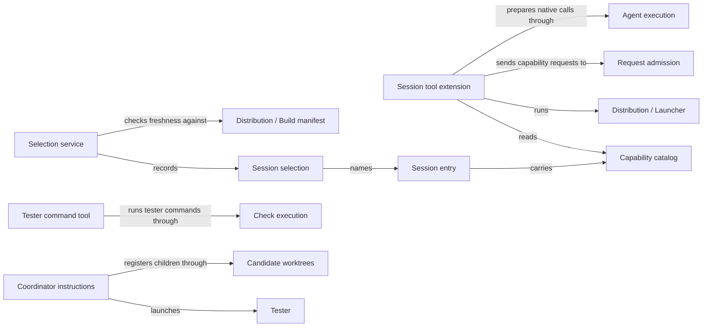

# Pi session

## Purpose

Pi session configures the developer's Pi session to use Concorde: one `concorde` tool that describes
and runs the public capabilities, the guidance for each, the exact selection of a candidate's build
for a fresh test session, the tester and (in Concorde's own checkout) maintenance worker Task
subagents, the source user session's coordinator instructions, the task brief kept across
compaction, and TODO notes. It decides nothing about a capability; the Host admits, prepares and
accepts. Distribution builds and installs these files, Agents defines the Agents inside
capabilities, and Check execution enforces the tester's command boundary.

## Terminology

| Term | Definition |
| --- | --- |
| Session entry | The file Pi loads to bind the Concorde session extension to one project, carrying that project's capability catalog. |
| Capability catalog | The list of public capabilities embedded in a session entry, each with its kind, description, guidance and request schema. |
| Capability guidance | The text that tells a user session when and how to call one public capability, embedded in the catalog and returned by `describe`. |
| Session selection | A verified record naming the exact candidate-built private session entry, its embedded catalog and the launcher that a fresh Pi test session may load. |
| Tester | The Task subagent that tests a stopped candidate independently, read-only, running commands only through its tester command tool. |
| Maintenance worker | The source-only Task subagent that changes Concorde's own sources in one candidate as its only writer until it stops. |
| Coordinator instructions | The instructions appended to the source user session's system prompt that govern how it registers candidates, hands them to Task subagents, chooses testing and records TODO notes. |
| Task brief | The short current record of a session's goal, grant, stage, decisions, checks and next step that is reinjected once after an actual compaction. |
| [Developer](../vocabulary.md#concept.concorde.developer) | |
| [User session](../vocabulary.md#concept.concorde.user-session) | |
| [Task subagent](../vocabulary.md#concept.concorde.task-subagent) | |
| [Capability](../vocabulary.md#concept.concorde.capability) | |
| [Host](../vocabulary.md#concept.concorde.host) | |
| [Capability request](../harness/admission/module.md#concept.admission.capability-request) | |
| [Result envelope](../harness/admission/module.md#concept.admission.result-envelope) | |
| [Agent call](../harness/execution/module.md#concept.execution.agent-call) | |
| [Workflow](../harness/execution/module.md#concept.execution.workflow) | |
| [Candidate](../harness/worktrees/module.md#concept.worktrees.candidate) | |
| [Tester command](../harness/checks/module.md#concept.checks.tester-command) | |
| [Launcher](../distribution/module.md#concept.distribution.launcher) | |
| [Build manifest](../distribution/module.md#concept.distribution.build-manifest) | |

The maintenance worker, the coordinator instructions and the task brief exist only in Concorde's
source checkout. TODO notes are defined in [Task subagents](task-subagents.md#terminology).

## Usage

In a consumer project Pi discovers the **session entry** `.pi/extensions/concorde-session.ts` by
itself. Before each turn it appends a short Concorde section to the system prompt naming the
`concorde` tool and every public capability. `describe` returns a capability's **capability
guidance** and request schema from the **capability catalog** embedded in the entry and starts
nothing. `run` wraps `input` in a
capability request, starts
the launcher with it and returns the
result envelope. For a
model-backed capability `run` instead returns an exact
Agent call, which the user session
passes unchanged to the pi-subagents `subagent` tool, or starts a named
workflow that `result` polls; the
catalog says which path each capability takes. What an Agent returns is a proposal; only the Host's
accepted result counts. In Concorde's own checkout the entry is private
(`generated/session/pi/concorde-session.ts`), loads only with a session selection, and tells the
model to run a capability only when the developer names it.

To test one candidate, the user session runs `select-session --mode test` in it, which records a
**session selection** of the candidate's exact private entry, catalog and launcher after checking
its build manifest, and launches a
fresh **tester** bound to that selection. The tester reads with `read`, `grep`, `find` and `ls` and
runs everything else as a tester command;
it reports failures instead of repairing them. Consumer projects receive the same generic tester.
The **maintenance worker** exists only in the source checkout, where it changes Concorde itself.

In the source checkout the user session also loads the **coordinator instructions**: it registers
a candidate before launching a maintenance worker there, binds and releases each child, hands a
stopped candidate to a fresh tester, records an authorized merge, and collects TODO notes without
starting maintenance. The user session and the maintenance worker each keep a **task brief** that a
lifecycle extension reinjects once after an actual compaction. [Task subagents and the source user
session](task-subagents.md) explains the flow; [Design notes](design.md) walks through a full
example.

Errors are tool errors carrying the envelope and a causal feedback record: a `blocked` or `failed`
envelope, a launcher that exits non-zero or prints no envelope, and a cancelled run. An unknown
capability or a missing `input` is refused before the launcher starts. The private entry refuses to
load without a valid selection or the candidate's interpreter, and a selection that changes
mid-session refuses later calls. Aborting a turn sends the launcher SIGTERM.

## Design

The **session tool extension** is deliberately thin: a model can call it with any arguments, so it
checks only that the capability is in its catalog and that `input` is present, wraps `input`
unchanged and leaves every admission, permission and acceptance decision to the Host. The catalog
is embedded, so a session never needs the sources and the tool holds no list of provider
capabilities.

Each provider owns its capability's guidance file; Pi session owns the guidance format and the
**session guidance fragments** that several guidance files include.

The **selection service** records exact bytes and refuses aliased, foreign or stale inputs, because
a tester that silently loaded another build would report the wrong code as the candidate's. The
selection is verified at load, before every tool call and by Distribution's launcher, which passes
the verified record to Request admission as session provenance. A selection is launch provenance,
never evidence that anything ran.

Task subagents are not Agents: they own a whole task, have no stage input, typed result or Host
acceptance, start fresh without inherited context or catalogs, and have no `subagent` tool. The
tester's tool guard and the maintenance guard are enforced; Check execution's boundary stops a tester
command from changing files but not from reading, using the network or seeing the environment.
**Not enforced:** where the maintenance worker writes, the coordinator's sequencing and TODO rules
(instructions only), and a worker with a shell starting the launcher directly. The full table, the
transitional code paths and open questions are in [Design notes](design.md).

## Relationships

Distribution renders the entry and catalog; Pi session defines their content and use.

**Request admission** is the boundary every `run` enters. The tool builds requests by the
[invocation contract](../harness/admission/contracts.md#contract.admission.invocation), reads
envelopes by the [result contract](../harness/admission/contracts.md#contract.admission.result) and
attaches records of the [feedback contract](../harness/admission/contracts.md#contract.admission.feedback),
relying on the meaning of a [capability request](../harness/admission/module.md#concept.admission.capability-request),
a [result envelope](../harness/admission/module.md#concept.admission.result-envelope) and
[causal feedback](../harness/admission/module.md#concept.admission.causal-feedback). Pi session adds no
check and reports every non-success envelope, or a missing one, as a tool error.

**Agent execution** prepares native work for model-backed capabilities. The tool returns its exact
[Agent call](../harness/execution/module.md#concept.execution.agent-call) or
[workflow](../harness/execution/module.md#concept.execution.workflow) unchanged, relying on it to treat
Agent output as a [proposal](../harness/execution/module.md#concept.execution.proposal) that only its
[result gate](../harness/execution/module.md#concept.execution.result-gate) accepts. A preparation
failure becomes a tool error.

**Check execution** runs each [tester command](../harness/checks/module.md#concept.checks.tester-command)
in its [read-only check boundary](../harness/checks/module.md#concept.checks.read-only-boundary) with
fresh [scratch](../harness/checks/module.md#concept.checks.scratch) and exports the
[tester evidence](../harness/checks/module.md#concept.checks.tester-evidence). The tester command tool
validates the request, reverifies the selection first and fails the call on a failed, cancelled or
incompletely exported command; an unavailable boundary is a blocker.

**Candidate worktrees** creates each [candidate](../harness/worktrees/module.md#concept.worktrees.candidate),
locates the [primary worktree](../harness/worktrees/module.md#concept.worktrees.primary-worktree) and
keeps [change status](../harness/worktrees/module.md#concept.worktrees.change-status). The coordinator
instructions use its `status` command to register, bind, release and record merges, and stop
dependent work when a reread record does not confirm a step.

**Observation** records passive [diagnostic spans](../harness/observation/module.md#concept.observation.diagnostic-span)
for selection checks, launcher runs and the Task subagent extensions. A span never changes a result.

**Distribution** builds and installs Concorde. The tool starts its
[launcher](../distribution/module.md#concept.distribution.launcher); selection judges freshness by the
[build manifest](../distribution/module.md#concept.distribution.build-manifest) and its
[contract](../distribution/interfaces.md#contract.distribution.build-manifest); consumer entries and
testers use the [managed runtime](../distribution/module.md#concept.distribution.managed-runtime)'s
interpreter; and the installed-output handoff verifies a [local installation](../distribution/module.md#concept.distribution.local-installation)
of a [consumer project](../distribution/module.md#concept.distribution.consumer-project). A stale
manifest fails selection, and a missing interpreter stops the private entry and the tester.

**Issues** keeps durable [Issue](../issues/module.md#concept.issues.issue) records. The coordinator
instructions read an Issue before moving it into a TODO note and delete it only after the note is
verified; any failure keeps the Issue.
