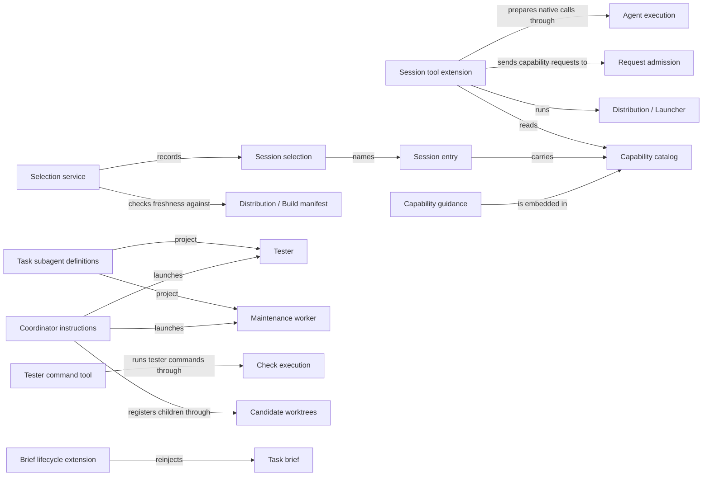

# Pi session

## Purpose

Pi session configures the developer's own Pi coding-agent session so that it can use Concorde. It
gives the session one `concorde` tool that describes and runs the public capabilities, the
guidance that tells the session when to call each one, the exact selection of a candidate's build
that a fresh test session may load, the two Task subagents a user session can hand a whole task to
(the tester and, in Concorde's own checkout, the maintenance worker), the coordinator instructions
of Concorde's source user session, the brief that keeps a session's current task across
compaction, and the collection of TODO notes. Pi session decides nothing about a capability: the
Host admits every request, prepares every Agent and accepts or rejects every result. It does not
build or install these files, which Distribution does, and it does not define the Agents that run
inside capabilities, which Agents does. A tester's command runs in Check execution's boundary, not
in anything Pi session enforces.

## Terminology

| Term | Definition |
| --- | --- |
| Session entry | A small TypeScript file that Pi loads to bind the Concorde session extension to one project and that carries the project's capability catalog. |
| Capability catalog | The list of public capabilities embedded in a session entry, each with its kind, description, guidance and request schema. |
| Capability guidance | The text that tells a user session when and how to call one public capability, embedded in the catalog and returned by `describe`. |
| Session selection | A verified record naming the exact candidate-built private session entry, its embedded catalog and the launcher that a fresh Pi test session may load. |
| Tester | The Task subagent that tests a stopped candidate independently, keeping every governing file read-only and running commands only through its tester command tool. |
| Maintenance worker | The source-only Task subagent that changes Concorde's own sources in one candidate as its only writer until it stops. |
| Coordinator instructions | The instructions appended to the source user session's system prompt that govern how it registers candidates, launches, binds and releases Task subagents, chooses testing and records TODO notes. |
| Task brief | The short current record of a session's goal, grant, stage, decisions, checks and next step that is reinjected once after an actual compaction. |
| [Developer](../vocabulary.md#concept.concorde.developer) | |
| [User session](../vocabulary.md#concept.concorde.user-session) | |
| [Task subagent](../vocabulary.md#concept.concorde.task-subagent) | |
| [Capability](../vocabulary.md#concept.concorde.capability) | |
| [Host](../vocabulary.md#concept.concorde.host) | |
| [Evidence](../vocabulary.md#concept.concorde.evidence) | |
| [Capability request](../harness/admission/module.md#concept.admission.capability-request) | |
| [Result envelope](../harness/admission/module.md#concept.admission.result-envelope) | |
| [Agent call](../harness/execution/module.md#concept.execution.agent-call) | |
| [Workflow](../harness/execution/module.md#concept.execution.workflow) | |
| [Candidate](../harness/worktrees/module.md#concept.worktrees.candidate) | |
| [Tester command](../harness/checks/module.md#concept.checks.tester-command) | |
| [Launcher](../distribution/module.md#concept.distribution.launcher) | |
| [Build manifest](../distribution/module.md#concept.distribution.build-manifest) | |

Learn the terms in three groups. The session entry, its catalog and the guidance inside it are what
every user session loads. The session selection is how a fresh test session is pinned to one
candidate's exact build. The tester and the maintenance worker are the two Task subagents; the
maintenance worker, the coordinator instructions and the task brief exist only in Concorde's own
source checkout. TODO notes are defined in
[Task subagents and the source user session](task-subagents.md#terminology).

## Usage

### Calling capabilities from Pi

<a id="concept.session.session-entry"></a><a id="concept.session.catalog"></a><a id="concept.session.guidance"></a>

A developer works in an ordinary Pi session. In a consumer project Pi discovers the **session
entry** `.pi/extensions/concorde-session.ts` by itself; Distribution's installer placed it there.
Before each turn the entry appends a short Concorde section to the system prompt that names the
`concorde` tool and lists every public capability with its one-line description. The tool has three
actions:

- `describe` returns a capability's **capability guidance** and the JSON Schema of its request,
  both read from the **capability catalog** embedded in the entry. It starts nothing.
- `run` sends the request data given as `input` to the capability.
- `result` polls a capability that runs as an asynchronous workflow.

For example, the user session first calls `concorde` with `{"operation": "concorde-validate",
"action": "describe"}`, reads the schema, and then calls `{"operation": "concorde-validate",
"action": "run", "input": {"change_id": "..."}}`. The tool wraps `input` in a
[capability request](../harness/admission/module.md#concept.admission.capability-request), starts
the [launcher](../distribution/module.md#concept.distribution.launcher) with that request on its
standard input, and returns the launcher's
[result envelope](../harness/admission/module.md#concept.admission.result-envelope). A `run` may
take long and blocks the turn; aborting the turn cancels it.

A model-backed capability is not run inside the tool. For `concorde-context-solve`,
`concorde-tasks` and `concorde-implement`, `run` returns one exact
[Agent call](../harness/execution/module.md#concept.execution.agent-call) prepared by the Host; the
user session passes it unchanged to the pi-subagents `subagent` tool. For `concorde-plan`, the two
review capabilities and the `solve` action of `concorde-issues`, `run` prepares a named
[workflow](../harness/execution/module.md#concept.execution.workflow) that runs asynchronously, and
`result` reports its state. Which path a capability takes is written in the catalog, not decided by
the tool. What an Agent returns is a proposal: the user session reads the Host's accepted result,
never the Agent's own output.

A `run` with `mode: "describe-policy"` asks the Host to describe the context and permissions an
execute run would use, without starting an Agent.

When something goes wrong the tool returns a tool error, never a success:

- a result envelope whose status is `blocked` or `failed`, a launcher that exits non-zero or prints
  output that is not an envelope, and a cancelled run all become tool errors that carry the
  envelope and a causal feedback record;
- an unknown capability, or `run` without `input`, is refused before the launcher starts.

A very large result is cut in the reply, and the whole text is saved to a private temporary file
whose path the reply names.

### The source checkout

In Concorde's own checkout the session entry is **private**: the build writes it to
`generated/session/pi/concorde-session.ts`, outside Pi's discovery, and a session loads it only when
it was started with it explicitly and with a session selection. Its catalog is marked
explicit-request-only, so the appended prompt tells the model to run a capability only when the
developer names it.

### Testing a candidate

<a id="concept.session.selection"></a>

A tester must test exactly what one candidate built. The user session creates a **session
selection** inside that candidate:

```sh
.venv/bin/python scripts/concorde.py select-session --mode test \
  --pi-entry "$PWD/generated/session/pi/concorde-session.ts" \
  --runtime "$PWD/scripts/run-operation.py" \
  --output "$PWD/.concorde/work/pi-selection.json"
```

Selection checks that the candidate's build is current against its
[build manifest](../distribution/module.md#concept.distribution.build-manifest) and records the exact
bytes of the private entry, its embedded catalog and the launcher, together with the Pi flags a
fresh session must use. `select-session --verify <path>` recomputes it and fails unless nothing
changed. The user session then launches the `tester` through pi-subagents with fresh context and the
extension binding `{"concorde/1": {"selection": "<absolute path>"}}`, or a standalone Pi process
with `CONCORDE_SESSION_SELECTION` set. The private entry refuses to load without a selection,
verifies it before it registers the tool and again before every call, and the launcher verifies it
before it runs anything. A missing or stale candidate artifact blocks the test; nothing falls back to
the primary checkout's build or an installed copy.

A selection names bytes a session was told to load. It is not evidence that Pi loaded them, that a
tool was called or that a model ran.

<a id="concept.session.tester"></a><a id="concept.session.maintenance-worker"></a>

The **tester** reads with `read`, `grep`, `find` and `ls` and runs everything else through its
`test_command` tool, which executes one
[tester command](../harness/checks/module.md#concept.checks.tester-command) in the host's read-only
check boundary with fresh scratch. It returns failures to the user session instead of repairing
them. In a consumer project the same generic tester is installed and tests the project's installed
Concorde. The **maintenance worker** exists only in the source checkout; it is how the source user
session changes Concorde itself. [Task subagents and the source user session](task-subagents.md)
explains both, the coordinator instructions, the task brief and TODO notes.

### Maintaining Concorde itself

<a id="concept.session.coordinator"></a><a id="concept.session.task-brief"></a>

In Concorde's source checkout the user session also loads the **coordinator instructions**. They
make it the coordinator of source work: it creates a candidate from a committed base, registers it
in the primary worktree's change status before launching a maintenance worker there, binds the
child's actual run, releases it once it stopped, and only then hands the candidate to a fresh tester
or back to the same maintenance worker. It chooses independent testing explicitly, and it alone
records an authorized merge. The same instructions let it collect TODO notes without starting any
maintenance. The source user session and the maintenance worker each keep a **task brief**, the
current goal, grant, stage, decisions, checks and next step, which a lifecycle extension reinjects
once after Pi has actually compacted the session. [Task subagents and the source user
session](task-subagents.md) explains the flow, its rules and what is only instructed.

### Errors, repeats and cancellation

- A session entry refuses to load inside a worker process, and the private entry refuses to load
  without a valid selection or without the candidate's own Python environment.
- A selection that changed during a session refuses every later tool call; start a fresh session.
- Aborting a turn sends the launcher SIGTERM. The launcher cancels its work and prints its result;
  a launcher that does not exit promptly is killed with its whole process group. Effects the Host
  already committed are not rolled back.
- Calling `describe` repeatedly is free. Repeating `run` is a new request; the Host decides whether
  it resumes or refuses.

## Design

### The tool grants nothing

<a id="realization.session.tool"></a>

The **session tool extension** is deliberately thin. A model can call it with any arguments, so the
extension must not be where anything is trusted: it checks only that the capability exists in its
catalog and that `input` is present, wraps `input` unchanged, and hands the request to the launcher
or to the native preparation step. Every check that matters, such as the typed request, the
configuration, the worktree, the permissions and the acceptance of a result, belongs to the Host.
The same reasoning makes the extension refuse to load in a worker process: a worker must not gain a
second way to call capabilities through Pi. That refusal keys on the worker marker in the process
environment; a worker that has a shell can still start the launcher directly, and this is **not
enforced** here.

The catalog is embedded in the entry rather than read from the source tree, so a session never
needs the sources, and the entry that Distribution installs is rendered by the same build that
renders the private entry this checkout tests. The catalog also carries each capability's path
(launcher, Agent call or workflow, and which actions of a mixed capability are workflows), so the
extension holds no list of provider capabilities of its own.

<a id="realization.session.guidance-fragments"></a>

**Guidance ownership.** Each provider owns the guidance file of its own capability, because only the
provider knows when its capability applies. Pi session owns the format of guidance and the
**session guidance fragments**, the few shared paragraphs that several guidance files include, such
as how a candidate worktree is used and which task request fields exist. The build resolves the
fragments into each capability's text before embedding it.

### Selection is exact launch provenance

<a id="realization.session.selection-service"></a>

A tester that silently loads the primary checkout's build, or an installed copy, would test the
wrong code and report it as the candidate's. The **selection service** therefore records the exact
bytes, accepts only absolute, unaliased paths inside the candidate and only the candidate's own
private entry and launcher, and refuses a stale build. Verification happens three times, at load, on
every tool call and in the launcher, because each could otherwise run with bytes that changed after
the previous check. The record carries no evidence field that could be filled in: what a session
actually did is observed elsewhere.

The launcher's verification is performed by Distribution's launcher calling the selection service
and passing the verified record to Request admission as the run's session provenance, so admission
never depends on Pi session.

### Task subagents are not Agents

A Task subagent owns a whole task in a candidate, so it has no single-Module stage input, no typed
result and no Host acceptance step. Its limits are its tool list, its explicit extension list and
the task the user session gives it. Both start with fresh context, replace Pi's default prompt, and
inherit no project context, global context, Skills or Concorde catalog, and neither has the
`subagent` tool. The source user session's coordinator instructions, its task brief and its TODO
notes are explained with them in [Task subagents and the source user session](task-subagents.md).

What is enforced and what is only instructed is stated plainly:

| Rule | How it holds |
| --- | --- |
| The tester runs commands only through `test_command` | Enforced by the tester's tool guard, which blocks every other tool |
| A tester command cannot change project files | Enforced by Check execution's read-only boundary; the command still reads anything the user can read, shares the network and receives the environment |
| The maintenance worker works only in a Concorde source checkout and never calls `subagent` or `concorde` | Enforced by the maintenance guard on every tool call |
| The maintenance worker writes only in its own candidate | Not enforced; it has `bash`, `edit` and `write`, and the rule is an instruction |
| One writer per candidate, register before launch, bind and release | The status commands refuse conflicting ownership; the sequence itself is an instruction to the source user session |
| A running child keeps its launch instructions | Holds because Pi loads a child's instructions and extensions once at launch |
| TODO notes change no implementation or Spec | Not enforced; an instruction to the source user session |

Several scenarios of this Module are instruction contracts: a check of the rendered instructions
shows what a session is told, not that a live model always complies.

### Incidental choices and transitional paths

The selection service, the Task subagent projector and the tester bridge currently live under
`src/concorde/distribution/`; they belong to Pi session and may move to `src/concorde/session/`.

The environment variable `CONCORDE_NATIVE_PROJECT_ROOT` is a test fixture override: when set, the
native preparation steps run against that directory as the project root. The private entry accepts
it only when it was loaded with a verified selection, so it cannot redirect an ordinary session;
consumer entries refuse it.

### Open questions

- The tester's definition lists the session entry of its layout among its extensions, so the
  selection is verified when it starts, but its tool guard blocks the `concorde` tool. Whether a
  tester should be able to call capabilities of the build it tests is undecided.

## Relationships



The session entry and its catalog are rendered by Distribution; Pi session defines what they
contain and how the extension uses them. The collaborations with other Modules follow.

<a id="uses-admission"></a>

**Request admission** is the boundary every capability request enters. Pi session relies on the
[invocation contract](../harness/admission/contracts.md#contract.admission.invocation) for the
request the tool builds, the [result contract](../harness/admission/contracts.md#contract.admission.result)
for what the launcher prints and the [feedback contract](../harness/admission/contracts.md#contract.admission.feedback)
for the causal record it attaches to a tool error. It relies on the meaning of a
[capability request](../harness/admission/module.md#concept.admission.capability-request), a
[result envelope](../harness/admission/module.md#concept.admission.result-envelope) and
[causal feedback](../harness/admission/module.md#concept.admission.causal-feedback). The collaboration
applies to every `run`. Pi session's duty is to wrap `input` without changing it and to report every
non-success envelope as a tool error; it adds no check of its own. When the launcher prints no
envelope, the tool reports a transport failure with the launcher's exit status.

<a id="uses-execution"></a>

**Agent execution** prepares and accepts native Agent work. For a model-backed capability the tool
asks the launcher's native preparation step for an exact
[Agent call](../harness/execution/module.md#concept.execution.agent-call) or
[workflow](../harness/execution/module.md#concept.execution.workflow), and relies on Agent execution
to treat what the Agent returns as a [proposal](../harness/execution/module.md#concept.execution.proposal)
that becomes a result only through its [result gate](../harness/execution/module.md#concept.execution.result-gate).
Pi session's duty is to return the prepared call unchanged and to show only the Host's accepted
state as acceptance. A preparation failure is returned as a tool error.

<a id="uses-checks"></a>

**Check execution** runs each [tester command](../harness/checks/module.md#concept.checks.tester-command)
inside its [read-only check boundary](../harness/checks/module.md#concept.checks.read-only-boundary)
with fresh [scratch](../harness/checks/module.md#concept.checks.scratch), and exports the
[tester evidence](../harness/checks/module.md#concept.checks.tester-evidence) before the scratch is
removed. The tester command tool relies on it for the only isolation a tester has. Pi session's duty
is to validate the request, reverify the selection first, and fail the tool call whenever the
command failed, was cancelled or its evidence export is incomplete. If the boundary is unavailable
the command does not run, and the tester reports that as a blocker.

<a id="uses-worktrees"></a>

**Candidate worktrees** creates each [candidate](../harness/worktrees/module.md#concept.worktrees.candidate),
locates the [primary worktree](../harness/worktrees/module.md#concept.worktrees.primary-worktree) and
keeps the [change status](../harness/worktrees/module.md#concept.worktrees.change-status) records.
The coordinator instructions rely on its `status` command, run in the primary worktree, to register a
candidate, bind the actual launched child, release it and record an authorized manual merge. When a
registration, bind or release cannot be verified by rereading the record, the instructions stop
dependent work.

<a id="uses-observation"></a>

**Observation** records passive [diagnostic spans](../harness/observation/module.md#concept.observation.diagnostic-span).
The session tool times selection verification and launcher runs with them, and the tester and
maintenance extensions register the passive observer. Recording a span never changes a tool result.

<a id="uses-distribution"></a>

**Distribution** builds and installs Concorde. Pi session relies on its
[launcher](../distribution/module.md#concept.distribution.launcher), which the tool starts for every
Host capability and native preparation; on the [build manifest](../distribution/module.md#concept.distribution.build-manifest)
and its [contract](../distribution/interfaces.md#contract.distribution.build-manifest), against which
selection checks that a candidate's build is current; on the
[managed runtime](../distribution/module.md#concept.distribution.managed-runtime), whose interpreter
a consumer entry and tester use; and on [local installations](../distribution/module.md#concept.distribution.local-installation)
of a [consumer project](../distribution/module.md#concept.distribution.consumer-project), which the
installed-output handoff verifies. A stale manifest makes selection fail; a missing interpreter makes
the private entry and the tester refuse to start.

<a id="uses-issues"></a>

**Issues** keeps durable [Issue](../issues/module.md#concept.issues.issue) records. The coordinator
instructions read an Issue before moving its settled content into a TODO note, and delete it only
after the note is verified. A failure keeps the Issue.
