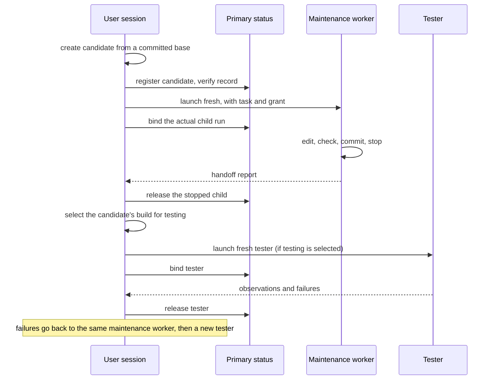

# Task subagents and the source user session

This topic explains how a user session hands whole tasks to the two Task subagents, how their
definitions reach Pi, and what the source user session's coordinator instructions, task brief and
TODO notes add in Concorde's own checkout. The exact files, fields and commands are in
[Pi session interfaces](interfaces.md#task-subagent-projection).

## Terminology

| Term | Definition |
| --- | --- |
| TODO note | One Markdown note under `.concorde/todos/` recording a settled, actionable change that the developer asked for or approved. |
| [User session](../vocabulary.md#concept.concorde.user-session) | |
| [Task subagent](../vocabulary.md#concept.concorde.task-subagent) | |
| [Evidence](../vocabulary.md#concept.concorde.evidence) | |
| [Candidate](../harness/worktrees/module.md#concept.worktrees.candidate) | |
| [Change status](../harness/worktrees/module.md#concept.worktrees.change-status) | |
| [Tester evidence](../harness/checks/module.md#concept.checks.tester-evidence) | |
| [Issue](../issues/module.md#concept.issues.issue) | |

The [tester](module.md#concept.session.tester), the
[maintenance worker](module.md#concept.session.maintenance-worker), the
[coordinator instructions](module.md#concept.session.coordinator) and the
[task brief](module.md#concept.session.task-brief) are defined in the entry. Everything in this
topic except the tester exists only in Concorde's source checkout.

## Two Task subagents

A Task subagent is a sibling of the user session, not a step inside a capability. It receives one
whole task in one candidate and works until it reports back.

- The **maintenance worker** changes Concorde's own sources. It reads the Protocol principles and
  the complete Specs it affects, edits sources, Specs and the registry directly, runs its own checks,
  commits verified work and stops writing before anyone tests it.
- The **tester** tests a stopped candidate. It keeps every governing file read-only, runs commands
  only through `test_command`, reports the tested revision, scope, commands, failures, skips and
  residual risks, and separates scripted fixtures from live model runs. It returns failures instead
  of fixing them. Consumer projects receive the same tester, without any source-only text.

Neither creates or moves worktrees, merges, pushes, cleans up, delegates or starts another agent.
A maintenance worker's self-checks are never independent [evidence](../vocabulary.md#concept.concorde.evidence);
a tester's observations are, but only for the revision and scope it tested, and only the
[tester evidence](../harness/checks/module.md#concept.checks.tester-evidence) the Host exported
survives the command's scratch.

### How the definitions reach Pi

The **Task subagent definitions** are one profile per Task subagent: its prompt, tool list,
explicit Pi extensions and whether it is source-only. The tester's profile ships with Concorde; the
maintenance worker's profile lives under `agents/source/`, which is never installed, so a consumer's
inventory simply has one Task subagent. Distribution's build calls the projector in the same
realization to render `.pi/agents/<name>.md`, the definition files Pi discovers, together with the
source user session's own extension entries. Every projected definition replaces Pi's default
prompt, inherits no project context, global context or Skills, starts with fresh context, excludes
the `subagent` tool and runs asynchronously. A definition's extension list is explicit, so a Task
subagent never picks up the coordinator extension or any other ambient extension.

These definitions are deliberately not Agent definitions. A Task subagent has no stage input, no
typed result and no single-Module grant; giving it one would pretend that the Host checks its work
the way it checks an Agent's proposal, and it does not.

The **tester command tool** is the tester's `test_command`. It starts the tester bridge with the
candidate's own interpreter (in a consumer project, the managed runtime's), sends one request with
the command, a time limit and the names of report files to export, and waits for the bridge's
answer. The bridge reverifies the tester's selection when there is one, runs the command in Check
execution's read-only boundary, and returns the exit status, the tail of each output stream and the
evidence export summary. The tool fails unless the command exited zero, was not cancelled and its
evidence export is complete, so a tester can never mistake a failed or unrecorded run for a pass.
The tester's tool guard blocks every tool that is not in its list.

The **maintenance guard** is the maintenance worker's extension. It blocks every tool call when the
working directory is not a Concorde source checkout, and always blocks the `subagent` and `concorde`
tools, so a maintenance worker can neither delegate nor let a public capability govern changes to
its own integration. It does not confine where the worker writes.

## The source maintenance flow

In Concorde's source checkout the user session loads the **coordinator instructions** from the
**coordinator prompt** through a generated extension that only that session loads. The instructions
make the user session the coordinator of source work. It owns a lightweight decomposition: work
packages, dependencies, which writer owns which files and contracts, and the gates between
components, integration and testing. This is not a Concorde plan and calls no planner. A normal
change runs like this:

Three rules hold the flow together:

1. **Register before launch.** Every candidate has a [change status](../harness/worktrees/module.md#concept.worktrees.change-status)
   record in the primary worktree before its maintenance worker starts. Right after launch the user
   session binds the child's actual run identity, not a workflow container, and rereads the record
   to verify it. Registering the same candidate again returns the existing record unchanged. Run
   evidence, notes and pi-subagents mission records never replace the status record.
2. **One writer at a time.** Before a tester or a resumed maintenance worker takes over, the user
   session verifies that the current child stopped, releases exactly that child and then binds the
   next. A failed release or bind blocks the handoff; ownership is never shared.
3. **Frozen launch grants.** A running child keeps the instructions and extensions it was launched
   with. The user session may change prompts, profiles or workflows in its own tree, but that never
   changes an active sibling; new instructions govern only sessions that load them.

The user session keeps the same maintenance worker through an unfinished stage and its feedback
cycle; a small milestone is no reason to restart. After a completed stage whose goals or context
changed, it may start a fresh maintenance worker after a durable handoff: the current brief,
accepted decisions, exact HEAD and dirty state, artifacts, checks, risks and next step. Independent
components may run in parallel in separate candidates; a shared file or contract needs one explicit
owner and an integration barrier, and component passes alone do not prove the combination works.

Independent testing is an explicit choice of none, targeted or full, with a stated scope and
reason. The tester receives the candidate's exact session selection; a missing or stale artifact
blocks testing. Integration into the primary branch and cleanup of candidates each need the
developer's explicit authorization, and only the user session records them.

Checks follow what changed: formatting, static and targeted checks for local edits; affected
integration for a coherent change; one full suite and the build gates at the final stable input. A
stage handoff alone needs no full suite, and a commit of an already checked tree needs only HEAD
checks. A check is repeated only after a relevant input changed or it failed, with the reason
recorded.

## Keeping the current task across compaction

A long session is compacted by Pi when its context fills. What must survive is not the launch text
or old instructions but the **task brief**: the current goal, grant, stage and objective, accepted
decisions, completed artifacts, checks, blocker, next action and where the evidence is. The source
user session keeps it with its `update_task_brief` tool; the maintenance worker includes it as a
fenced block in its progress messages to the user session. The **brief lifecycle extension**, loaded
by those two sessions only, records the latest valid brief and, after Pi reports that a compaction
actually completed, injects that brief once into the next model request. A checkpoint, a message
that says `/compact` or a failed compaction injects nothing, and an invalid brief clears the stored
one instead of blocking the progress message that carried it.

A brief is reported memory. It grants nothing, proves nothing about completion and never widens a
frozen launch grant. A request to replace a child for lack of room must report measured context use;
cumulative token counts or document sizes alone do not show that a session is exhausted.

## Collecting TODO notes

The source user session can simply talk with the developer: answer questions, read sources and
clarify a change without starting any maintenance. When a discussion reaches a conclusion whose
goal, scope and expected behaviour are settled, and the developer asks for or approves recording it,
the user session writes one **TODO note** under `.concorde/todos/` and rereads it before reporting
success. The directory is the list. An existing note for the same change is updated rather than
duplicated, and a note keeps the reasoning, decisions, alternatives, boundaries, examples and source
[Issue](../issues/module.md#concept.issues.issue) references, not just a title.

An unsettled request gets a question back: keep clarifying, or save it as an Issue? Nothing is
recorded until the developer chooses, and a conclusion that needs no action produces no note.
Moving a mature Issue into a note first reads the whole Issue, writes and verifies the note, and
only then deletes the Issue; any failure keeps the Issue, and a failed deletion keeps both and is
reported as a partial transfer that a retry completes by updating the same note. Recording a note
never changes implementation or Specs, creates no candidate and starts no child.

## Testing an installation from a selected source

A source selection pins a session to one candidate's private build; it cannot attest a copy of
Concorde installed somewhere else. When a tester must test installation itself, the
**installed-output handoff** is a source-only test recipe it runs inside a tester command. It checks
that the selection is still active and valid, admits the selected source as a package, installs it
into a fresh, empty directory inside the command's scratch, verifies that installation with the
installed copy's own interpreter, and checks that neither the selection nor the source changed
meanwhile. It then writes a small provenance record naming the source selection and build, the
installed entry, catalog, launcher, build, receipt and runtime, and returns an environment without
the source selection for starting installed processes. It is not a product feature, not a selection
mode and not an installer fallback: outside tester scratch, or against a non-empty target, it
refuses.

## In a consumer project

A consumer installation has no coordinator instructions, no maintenance worker, no brief lifecycle
extension and no TODO collection. Its user session can still launch the generic tester with the
same isolation; the tester's definition lists the project's installed session entry, and its
commands run with the managed runtime's interpreter.
