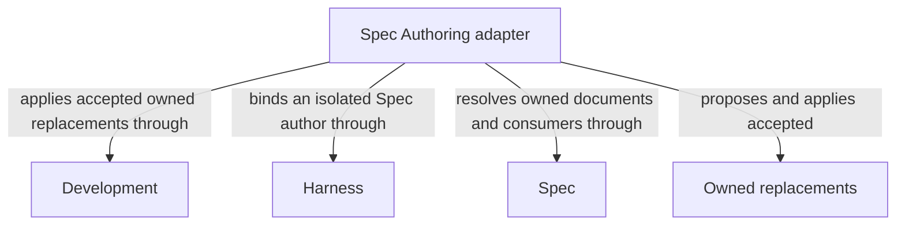

# Spec Authoring

## Purpose

Spec Authoring proposes complete replacements for the selected Module's owned Spec documents from its complete contract and an explicit task. It serves specification flows and other declared callers; independent review and flow completion belong to their consumers.

## Usage

Use `specify` from a declared composing capability to author or revise the selected Module's owned
Spec documents. Supply the task, constraints and current complete owned/direct-reference context;
this private bound provider has no direct Skill/CLI entry and does not select a different owner.
Its author returns full Markdown replacements for host acceptance, never direct project writes.
Write consumer usage and guarantees first, then the design and internal constraints that fulfill
them, keeping each definition canonical and preserving stable identities.

Unknown meaning returns attributed gaps without replacements. Foreign, malformed or stale output
is rejected with prior document bytes and blockers preserved. Referencing a provider permits
reading, not replacing its Spec. Ordinary authoring retains metadata and membership; ownership or
reference changes require topology reconciliation. Shared changes require separate affected-consumer
compatibility checks. Independent review, accepted-authoring reuse and completion belong to the
calling Flow, not to this author. See [authoring](authoring.md) for the precise input/output and
failure contract.

## Design

A fresh author sees the full contract and task but no implementation contents or write grant.
It returns complete owned Markdown replacements; the host checks metadata, current bytes and
allowed paths before applying them as one accepted change. Independent candidate reviews assess
affected consumers in their own contexts, preserving provider ownership and preventing copied
shared definitions from becoming competing authorities.

This proposal/acceptance split realizes the [authoring boundary](authoring.md) without trusting
model-authored paths as permission. Ordinary authoring preserves registered metadata; topology
reconciliation remains the separate mechanism for structural changes. Accepted-output reuse and
independent review ordering belong to the consuming Flow.

## Relationships

The diagram distinguishes proposing Owned replacements from applying them. Spec supplies document
ownership and affected-consumer scope; Harness gives the fresh author read-only contract access;
Development checks and applies accepted proposals. The author itself never gains a project write
grant. These are dependencies on sibling responsibilities, not structural ownership of providers,
and a provider reference does not permit a replacement of that provider's documents.

## Requirements

### req.spec-authoring.admitted-contract — Propose only owned Spec replacements

Spec Authoring SHALL propose replacements only for the selected Module's owned documents.

## Scenarios

### scenario.spec-authoring.admitted-work — Apply valid owner-bound replacements

- GIVEN a selected Module's complete current Spec and an explicit authoring task
- WHEN a fresh Spec author returns complete owned replacements whose identity, metadata and before-state remain valid
- THEN the host applies the accepted replacements after the required affected-consumer compatibility checks
- AND the author has no direct project write authority and the response retains artifact references to accepted output

The detailed contract is [Owner-only Spec replacements](authoring.md).

## Dependencies and composition

### Development

Admit the bound authoring request, check returned replacement identity and apply only accepted owned document replacements.

This collaboration applies when ordinary specify enters, accepts replacement output or preserves blockers after rejection.

- [Host admission](../development/interfaces.md#capability-execution-boundary); Recheck admitted intent and returned identities before accepting host state; a rejected result cannot advance the dependent step.

### Harness

Run a fresh isolated Spec author with complete Spec inputs, no inherited artifacts, no implementation contents and no project write grant.

This collaboration applies before launching spec-engineer specify mode and when validating its completion.

- [Complete context selection](../harness/context.md#contract.context.selection); Supply only mode-admitted inputs and require a matching completion; unavailable enforcement stops execution without a wider grant.

### Spec

Resolve sole document ownership, complete references and affected consumers, and validate replacement structure.

This collaboration applies when determining allowed replacement documents and checking their current contract and consumer set.

- [Owner and context resolution](../spec/registry.md#stable-id-spec-context-queries); Reconstruct current resolutions after input changes; unresolved ownership, missing required definitions or stale revisions block dependent use.

## Realization and reuse limits

This Module and its consumers are siblings under Concorde Framework. Declared files explicitly
share the existing adapter realization with Development; no new runtime package, public Skill,
Agent grant or configurable arbitrary flow is created by this Spec boundary. Host admission,
phase artifacts and permissions remain mandatory. A new flow requires declared composition and
an implementation of its sequencing, artifact admission, recovery and completion policies before
it can execute. The existing host package still realizes common dispatch and provider internals.
