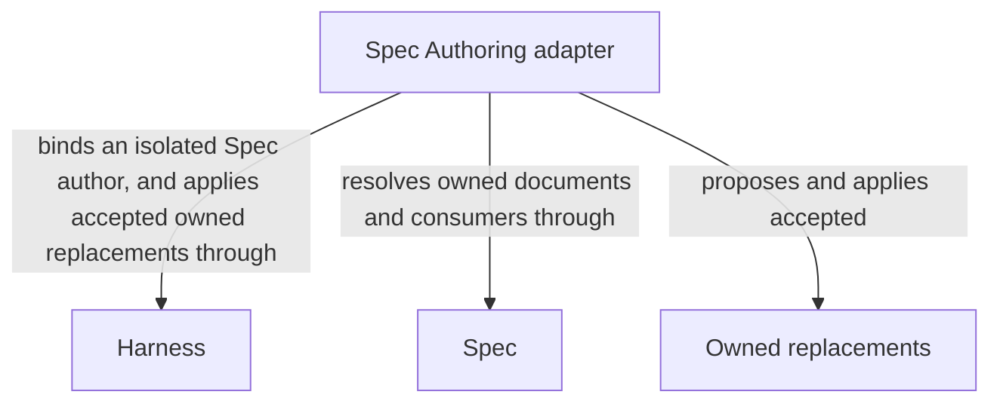

# Spec Authoring

## Purpose

Spec Authoring proposes changes to a Module’s intended behavior and design. It works from the allowed specifications and explicit intent, not from source code used to guess missing requirements. The host checks and applies owned proposals; independent review belongs to the calling workflow.

## Terminology

| Term | Meaning / definition |
| --- | --- |
| [Spec](../module.md#terminology) | Defined in Concorde Framework. |
| [Module Specs](../module.md#terminology) | Defined in Concorde Framework. |
| [Implementation Specs](../module.md#terminology) | Defined in Concorde Framework. |
| [Module](../module.md#terminology) | Defined in Concorde Framework. |
| [Worker](../module.md#terminology) | Defined in Concorde Framework. |
| [Host](../module.md#terminology) | Defined in Concorde Framework. |
| [Grant](../module.md#terminology) | Defined in Concorde Framework. |
| [Blocker](../module.md#terminology) | Defined in Concorde Framework. |
| [Reference](../spec/registry.md#terminology) | Defined in Registry. |
| [Ownership](../spec/registry.md#terminology) | Defined in Registry. |
| [Graph](../module.md#terminology) | Defined in Concorde Framework. |
| [Internal operation](../operations/module.md#terminology) | Defined in Operations. |
| [Skill](../module.md#terminology) | Defined in Concorde Framework. |

## Usage

Use `specify` from a declared composing operation to author or revise the selected Module's owned
Spec documents. Supply the task, constraints and current complete owned/direct-reference context;
this private bound provider has no direct Skill/CLI entry and does not select a different owner.
Its author returns full Markdown replacements for host acceptance, never direct project writes.
Explain consumer usage, important guarantees and design in Module Specs; define exact obligations
and internal constraints in Implementation Specs. Keep Terminology definitions canonical and
preserve stable identities.

Unknown meaning returns attributed gaps without replacements. Foreign, malformed or stale output
is rejected with prior document bytes and blockers preserved. Referencing a provider permits
reading, not replacing its Spec. Ordinary authoring retains metadata and membership; ownership or
reference changes require topology reconciliation. Shared changes require separate affected-consumer
compatibility checks. Independent review, accepted-authoring reuse and completion belong to the
calling Graph, not to this author.

For example, a consumer can rely on a provider's documented reservation result, but cannot replace
the provider's contract while editing its own Spec. A shared contract change is authored by its owner
and checked against affected consumers in their separate contexts.

## Design

A fresh author sees the full contract and task but no implementation contents or write grant.
It returns complete owned Markdown replacements; the host checks metadata, current bytes and
allowed paths before applying them as one accepted change. Independent candidate reviews assess
affected consumers in their own contexts, preserving provider ownership and preventing copied
shared definitions from becoming competing authorities.

This proposal/acceptance split protects ownership without trusting model-authored paths as
permission. Ordinary authoring preserves registered metadata; [Topology](../topology/module.md)
reconciles structural changes so registrations and references change together. Accepted-output reuse and
independent review ordering belong to the consuming Graph.

`specify` runs as a single node: one spec-author worker, run as an
[Operation node](../harness/execution-reference.md#host-operation-node-operation-node), after
which the owner's and each affected consumer's candidate compatibility reviews run one at a time
before the host applies the replacements. Composing Graphs use that node as one step: the
specification Graph's `specify` node, the Issue Graph's `repair_spec` node, and the
[component coordination Graph](../implementation/execution-reference.md#graphs-component-coordination-graph-coordination-graph)'s
`reconcile_specs` step, which runs it once per component.

## Relationships

The diagram distinguishes proposing Owned replacements from applying them. [Spec Module](../spec/module.md) supplies document
ownership and affected-consumer scope; the [Harness Module](../harness/module.md) gives the fresh author read-only contract access;
[Harness admission](../harness/admission.md) checks and applies accepted proposals. The author itself never gains a project write
grant. These are dependencies on sibling responsibilities, not structural ownership of providers,
and a provider reference does not permit a replacement of that provider's documents.

### Harness

The Harness Module runs a fresh isolated Spec author with complete Spec inputs, no inherited artifacts, no implementation contents and no project write grant.

This collaboration applies before invoking the spec-author Operation for the specify phase and when validating its completion.

Admit the bound authoring request, check returned replacement identity and apply only accepted owned document replacements.

This collaboration applies when ordinary specify enters, accepts replacement output or preserves blockers after rejection.

- [Complete context selection](../harness/contracts.md#contract.context.selection); Supply only mode-admitted inputs and require a matching completion; unavailable enforcement stops execution without a wider grant.
- [Host admission](../harness/admission.md#operation-execution-boundary); Recheck admitted intent and returned identities before accepting host state; a rejected result cannot advance the dependent step.

### Spec

Resolve sole document ownership, complete references and affected consumers, and validate replacement structure.

This collaboration applies when determining allowed replacement documents and checking their current contract and consumer set.

- [Owner and context resolution](../spec/contracts.md#registry-stable-id-spec-context-queries); Reconstruct current resolutions after input changes; unresolved ownership, missing required definitions or stale revisions block dependent use.

## Precise specifications

The Spec Authoring Module owns the exact obligations and interface details in [requirements](requirements.md), [scenarios](scenarios.md) and the
[execution and record contracts](execution-reference.md#authoring-spec-authoring-operation).
These companions are part of the same complete Module specification, not separate topic owners.
