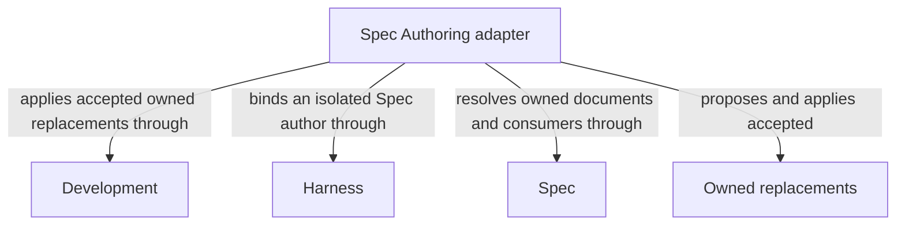

```concorde-document
{
  "id": "document.spec-authoring.module",
  "owner": "module.spec-authoring",
  "main_visible": true
}
```

# Spec Authoring

## Purpose

Spec Authoring proposes complete replacements for the selected Module's owned Spec documents from its complete contract and an explicit task. It serves specification flows and other declared callers; independent review and flow completion belong to their consumers.

## Requirements

### req.spec-authoring.admitted-contract — Propose only owned Spec replacements

Spec Authoring SHALL propose replacements only for the selected Module's owned documents.

## Scenarios

### scenario.spec-authoring.admitted-work — Apply valid owner-bound replacements

- GIVEN a selected Module's complete current Spec and an explicit authoring task
- WHEN a fresh Spec author returns complete owned replacements whose identity, metadata and before-state remain valid
- THEN the host applies the accepted replacements after the required affected-consumer compatibility checks
- AND the author has no direct project write authority and the response retains artifact references to accepted output


The detailed contract is [Owner-only Spec replacements](authoring.md).

## Ontology

### Entities

```concorde-entities
[
  {
    "id": "entity.spec-authoring.adapter",
    "title": "Spec Authoring adapter",
    "kind": "shared program",
    "responsibility": "Spec Authoring proposes complete replacements for the selected Module's owned Spec documents from its complete contract and an explicit task. It serves specification flows and other declared callers; independent review and flow completion belong to their consumers.",
    "files": [
      "capabilities/specify.py"
    ]
  },
  {
    "id": "entity.spec-authoring.development",
    "title": "Development",
    "kind": "used module",
    "target_id": "module.development",
    "responsibility": "Admit the bound authoring request, check returned replacement identity and apply only accepted owned document replacements."
  },
  {
    "id": "entity.spec-authoring.harness",
    "title": "Harness",
    "kind": "used module",
    "target_id": "module.harness",
    "responsibility": "Run a fresh isolated Spec author with complete Spec inputs, no inherited artifacts, no implementation contents and no project write grant."
  },
  {
    "id": "entity.spec-authoring.spec",
    "title": "Spec",
    "kind": "used module",
    "target_id": "module.spec",
    "responsibility": "Resolve sole document ownership, complete references and affected consumers, and validate replacement structure."
  },
  {
    "id": "entity.spec-authoring.replacements",
    "title": "Owned replacements",
    "kind": "record",
    "responsibility": "Complete owner-bound Spec replacement proposals accepted and applied only by the host."
  }
]
```

### Relationships



## Dependencies and composition

```concorde-dependencies
[
  {
    "target_id": "module.development",
    "responsibility": "Admit the bound authoring request, check returned replacement identity and apply only accepted owned document replacements.",
    "selection_condition": "When ordinary specify enters, accepts replacement output or preserves blockers after rejection.",
    "relied_upon_promises": [
      "[Host admission](../development/interfaces.md#capability-execution-boundary); Recheck admitted intent and returned identities before accepting host state; a rejected result cannot advance the dependent step."
    ]
  },
  {
    "target_id": "module.harness",
    "responsibility": "Run a fresh isolated Spec author with complete Spec inputs, no inherited artifacts, no implementation contents and no project write grant.",
    "selection_condition": "Before launching spec-engineer specify mode and when validating its completion.",
    "relied_upon_promises": [
      "[Complete context selection](../harness/context.md#contract.context.selection); Supply only mode-admitted inputs and require a matching completion; unavailable enforcement stops execution without a wider grant."
    ]
  },
  {
    "target_id": "module.spec",
    "responsibility": "Resolve sole document ownership, complete references and affected consumers, and validate replacement structure.",
    "selection_condition": "When determining allowed replacement documents and checking their current contract and consumer set.",
    "relied_upon_promises": [
      "[Owner and context resolution](../spec/registry.md#stable-id-spec-context-queries); Reconstruct current resolutions after input changes; unresolved ownership, missing required definitions or stale revisions block dependent use."
    ]
  }
]
```

## Realization and reuse limits

This Module and its consumers are siblings under Concorde Framework. Declared files explicitly
share the existing adapter realization with Development; no new runtime package, public Skill,
Agent grant or configurable arbitrary flow is created by this Spec boundary. Host admission,
phase artifacts and permissions remain mandatory. A new flow requires declared composition and
an implementation of its sequencing, artifact admission, recovery and completion policies before
it can execute. The existing host package still realizes common dispatch and provider internals.
