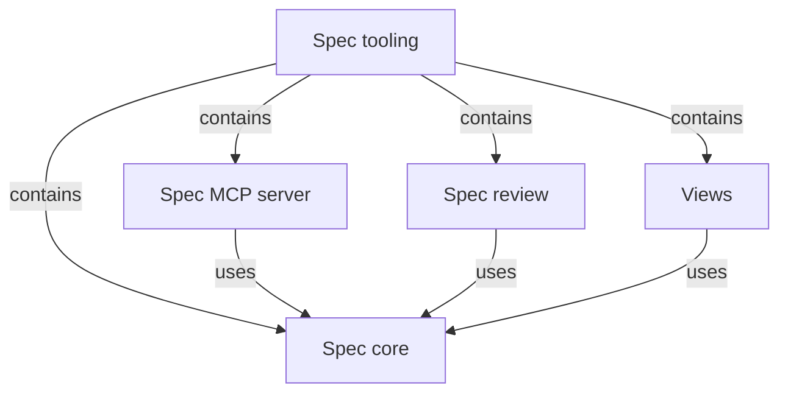

# Spec tooling

## Purpose

Spec tooling is the part of Concorde that works on Specs themselves, independently of the agents
that change a project. It has two sides. On the maintaining side it checks that a project's Specs
are structurally sound, deterministically and without a model, and has workers review whether
they are good enough for their reader. On the serving side it computes from the Specs what a task
may read and write, answers agents' questions about the Specs over a local MCP server, and
publishes the Specs as a documentation site for people. Every other part of Concorde relies on it
to refuse a structure that cannot support a trustworthy boundary, and projects that use Concorde
rely on it to understand their own Specs. Spec tooling never changes a Spec on its own, never
decides which task type a piece of work gets, and never enforces a boundary; enforcement belongs
to the Harness. It reports its failures with [its own error type](spec/errors.md), which says what
failed, where, why it is an error, how to fix it and what caused it, and it depends on no other
part of Concorde to do so; the rest of Concorde translates those errors into its own.

## Terminology

| Term | Definition |
| --- | --- |
| [Spec](../vocabulary.md#concept.concorde.spec) | |
| [Module](../vocabulary.md#concept.concorde.module) | |
| [Task type](../vocabulary.md#concept.concorde.task-type) | |
| [Boundary](../vocabulary.md#concept.concorde.boundary) | |
| [Main agent](../vocabulary.md#concept.concorde.main-agent) | |
| [Worker](../vocabulary.md#concept.concorde.worker) | |
| [Developer](../vocabulary.md#concept.concorde.developer) | |

Spec tooling defines no words of its own; each child defines the words of its interface, such as
the grant of Spec core or the review finding of Spec review.

## Usage

A developer or the main agent meets Spec tooling in four ways, one per child. Before trusting a
Spec change they run `concorde validate`, which Spec core answers with every structural finding
in one run. When a Spec's quality is in question, the main agent runs the `spec_review` Operation,
whose workers read the Specs of the named Modules and return findings and a verdict. While
planning, the main agent, or an agent in any project that uses Concorde, asks the Spec MCP server
which Modules exist, what one of them selects, whom a change concerns, or what grant a task type
would give some Modules. People read the published site that Views builds from the Specs.

The Operation host is the one consumer that does not go through these entry points: it calls Spec
core as a library, rooted at the task worktree, to compute and freeze a worker's grant. Everything
Spec tooling answers is computed from the Specs of one worktree, so two worktrees with different
Specs get different answers, and a Spec change on a task branch governs only that task.

## Design

The children are split by what they depend on. Spec core loads, checks and computes, and depends
on nothing, so every other Module, including the other three children, can rely on it without a
cycle. The Spec MCP server and Views only present what Spec core computes, one to agents and one to
people, and add no rule of their own about what a Spec means. Spec review is the only child that
calls a model: it runs workers through the Harness as an Operation, which is why it is kept apart
from the deterministic core that the Harness itself depends on.

Maintaining and serving share one model on purpose. The validator, the grant computation, the MCP
answers and the site all come from the same loader, so a grant cannot be computed from a project
the validator would refuse, and a page cannot show a provenance that disagrees with the context a
worker receives. Structural success is never presented as quality: validation proves structure,
review judges readability and form, and neither judges whether code keeps a promise.

## Relationships

Spec tooling binds no files of its own; its responsibility is fulfilled entirely by its children,
and it holds each of them to the split above.

**Spec core** implements the Spec Protocol: loading, structural validation, the registry mirror,
boundary sets, impact indexes, task-type grants with their context identities, initialization,
typed values, file transactions and the Protocol text. Spec tooling relies on it being the single
source of every structural answer and on its refusal to load a project whose structure could give
a wrong boundary. It must stay free of any other Module's code and of model calls.

The **Spec MCP server** serves Spec core's answers to agents over a local stdio MCP connection,
rooted at the worktree it runs in and read-only. Spec tooling relies on it adding no rule of its
own and refusing every path outside its root. Workers do not use it in this version; their grants
come from the Operation host.

**Spec review** is the `spec_review` Operation: workers of task type `review-spec` judge the
Specs of the named Modules against one checklist and return every blocking finding they can
establish, with a verdict. Spec tooling relies on it never editing a Spec and never presenting
structural validity as quality; the Operation catalog lists it like any other Operation.

**Views** publishes the registered Specs as a Docusaurus site and scaffolds that site into other
projects. Spec tooling relies on its pages being derived from the registry only, never written back
into a Spec and never offered to an agent as context.
