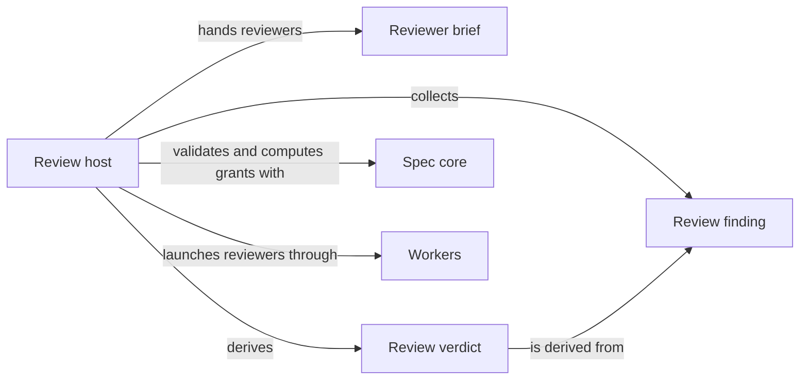

# Spec review

## Purpose

Spec review judges whether the Specs of one or more Modules are good enough for their reader, which
no deterministic check can establish. It is the `spec_review` Operation: the main agent runs it in a
task worktree, and for each named Module a headless worker of task type `review-spec` reads that
Module's Spec context and works through one checklist covering readability, the form of
requirements and scenarios, how well the design is explained, the honesty of diagrams and the
coherence of terminology. It returns every blocking finding it can establish in one pass, with a
verdict the host derives from them. Spec review never edits a Spec, never repairs what it finds and
never calls another Operation; the main agent decides what to change. It does not repeat structural
validation, which Spec core owns, and does not judge code, which Code review owns. The Operation,
its checklist and its tests are designed but not yet implemented.

## Terminology

| Term | Definition |
| --- | --- |
| Spec review | One run of the `spec_review` Operation, which judges the Specs of the named Modules of one task worktree and returns findings and a verdict. |
| Review finding | One problem a reviewer establishes in a reviewed Module's documents, with its location, dimension, severity, evidence and a suggested repair. |
| Review verdict | The outcome of a Spec review, derived by the host from the findings: `accepted`, `changes_required` or `incomplete`. |
| [Operation](../../operations/module.md#concept.operations.operation) | |
| [Operation host](../../operations/module.md#concept.operations.host) | |
| [Operation result](../../operations/module.md#concept.operations.result) | |
| [Brief](../../harness/workers/module.md#concept.workers.brief) | |
| [Worker result](../../harness/workers/module.md#concept.workers.worker-result) | |
| [Run record](../../harness/workers/module.md#concept.workers.run-record) | |
| [Grant](../spec/module.md#concept.spec.grant) | |
| [Context identity](../spec/module.md#concept.spec.context-identity) | |
| [Structural check](../spec/module.md#concept.spec.structural-check) | |
| [Main agent](../../vocabulary.md#concept.concorde.main-agent) | |
| [Worker](../../vocabulary.md#concept.concorde.worker) | |
| [Task type](../../vocabulary.md#concept.concorde.task-type) | |
| [Evidence](../../vocabulary.md#concept.concorde.evidence) | |
| [Escalation](../../vocabulary.md#concept.concorde.escalation) | |

A Spec review produces review findings and one review verdict inside an ordinary Operation result;
the verdict is evidence bound to the context identities the reviewers read.

## Usage

<a id="concept.spec-review.review"></a>

The main agent runs a **Spec review** when a Spec change is ready to be judged, typically after a
`specify` run and before implementation, or when it doubts that an existing Spec is clear enough to
hand to workers:

```text
concorde run spec_review --task <task-id> --modules module.checkout,module.inventory [--check-findings]
```

It runs in the background like any Operation and writes an Operation result when it ends. Each named
Module is reviewed on its own, from the Specs of the task worktree, so a Spec change made on the
task branch is what gets judged.

<a id="concept.spec-review.finding"></a>

Each **review finding** names the Module and document, the anchor or line it concerns, one checklist
dimension (`readability`, `obligations`, `design`, `views` or `terminology`), a severity, the
problem, the evidence in the Spec that shows it, and a suggested repair. A finding is `blocking`
when a reader or a worker bound to the Module could not rely on the Spec as written, for example a
requirement that states two obligations, a scenario whose outcome cannot be tested, or a Usage
section that never shows a normal path; everything else is `advisory`. A reviewer reports every
blocking finding it can establish in one pass instead of stopping at the first, so one round of
changes can address them all. With `--check-findings` a second worker checks each finding against
the same Specs and marks it `confirmed` or `disputed` with a reason.

<a id="concept.spec-review.verdict"></a>

The **review verdict** is `accepted` when no blocking finding stands, because there is none or
the checker disputed every one, `changes_required` when at least one blocking finding stands, and
`incomplete` when a Module could not be reviewed, because its Specs fail structural validation,
its worker was blocked or failed, or the host's audit found a change. The verdict comes with the context identity
of every reviewed Module; once any of those Specs changes, the verdict no longer applies to them.
The main agent reads the findings, decides which to act on, records that decision in the task's
decision log and, when it wants changes, runs `specify` again; Spec review itself changes nothing.

## Design

Spec review follows the ordinary host sequence of a worker-backed Operation, with the steps that
concern writing left out, because a `review-spec` grant makes nothing writable. The host validates
the named Modules first and stops a Module's review with `incomplete` when Spec core reports a
structural error, since a worker judging a Spec that does not load would report noise. It then
freezes one grant per Module, launches one reviewer per Module, audits that nothing changed,
optionally runs the checker, and derives the verdict itself. The exact steps are in the
[step table](operation.md#host-sequence).

<a id="realization.spec-review.operation"></a>

The **Review host** runs that sequence: it validates the Modules, asks Spec core for each grant,
launches the reviewers and the optional checker through the Harness, derives the verdict and
returns the Operation result. It and its tests are pending: they do not exist yet.

<a id="realization.spec-review.checklist"></a>

The **Reviewer brief** is the checklist every reviewer and checker receives: the dimensions, what
counts as blocking, the one-pass rule, and the shape of a finding. It is pending as well.

Deriving the verdict in the host rather than taking a worker's word keeps the outcome
deterministic: a worker contributes findings, which remain its claims, and the host counts them.
One reviewer per Module keeps each worker's context exactly one Module's Spec context, which is
also the scope of its judgment: a reviewer judges only the reviewed Module's own documents. A
problem it notices in a provider's selected document is reported as an advisory finding naming the
provider and never blocks this Module's verdict; reviewing the provider is a separate run.

A reviewer cannot widen its own view. When it cannot judge something without a document outside
its grant, it reports a `context` finding that names what it needed, and the main agent, which has
the project-wide view, decides whether the Spec lacks a relation or the review needs another
Module. In this version reviewers read the Specs directly under their grant and do not use the Spec
MCP server, and all dimensions are one checklist per reviewer; splitting dimensions into parallel
reviewers and letting reviewers query the server are future work.

## Relationships



The picture leaves out the Operation catalog, which lists Spec review, and the main agent, which
runs it and reads its result.

<a id="uses-spec"></a>

**Spec core** provides the structural answers the review builds on. The host relies on its
[structural checks](../spec/module.md#concept.spec.structural-check) to decide whether a Module can
be reviewed at all, and on its [grants](../spec/module.md#concept.spec.grant) with their
[context identities](../spec/module.md#concept.spec.context-identity) to fix, per Module, exactly
which Specs the reviewer may read and to bind the verdict to them. The host asks for each grant
with the task worktree as root and task type `review-spec`. When Spec core cannot load the task
worktree's Specs, the Operation fails with that error as host evidence; when it rejects one
Module's grant, that Module's review is `incomplete`.

<a id="uses-workers"></a>

**Workers**, in the Harness, turn a frozen grant into a running Claude Code worker and report what
happened. The host relies on them to launch each reviewer with the [brief](../../harness/workers/module.md#concept.workers.brief)
it prepared and no other instructions, to return the reviewer's
[worker result](../../harness/workers/module.md#concept.workers.worker-result), extended here by its
findings, to audit that the worker changed no file, and to keep a
[run record](../../harness/workers/module.md#concept.workers.run-record) per worker. A worker that
ends `blocked` or `failed`, or an audit that finds a change, makes that Module's review
`incomplete`, and the worker's own escalation travels in the result unchanged.

<a id="uses-operations"></a>

**Operations** defines what an [Operation](../../operations/module.md#concept.operations.operation)
is, runs its [host](../../operations/module.md#concept.operations.host) from `concorde run`, and
fixes the [Operation result](../../operations/module.md#concept.operations.result) envelope in which
Spec review returns its verdict and findings. Spec review relies on that contract to be launched
with a task and its arguments and to hand its payload back to the main agent; its duty is to fill
the envelope honestly, keeping worker claims apart from the evidence the host produced.
