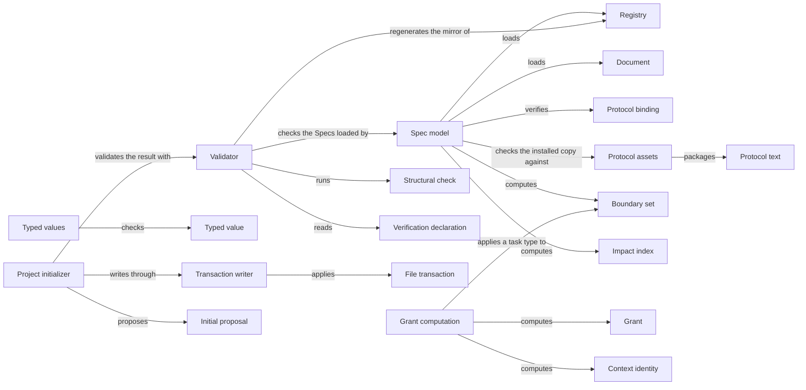

# Spec core

## Purpose

Spec core is Concorde's implementation of the Spec Protocol and the deterministic heart of Spec
tooling. It loads a project's Specs, checks them against the Protocol and Concorde's few added
conventions, and computes from the declarations alone what a task bound to some Modules may read
and write, whom a change concerns, and, for one task type and some Modules, the grant a worker
receives. The Spec MCP server, Spec review, Views, the Harness, the Operations and the developer's
`validate` command all rely on it. It also keeps the registry in step with the entries, creates a
new project's first Spec, provides typed JSON values and all-or-nothing file writes, and keeps the
Protocol text. It uses no other Module and never calls a model. It does not judge whether a Spec
explains enough or whether code keeps a promise, does not enforce a grant or decide which task type
a piece of work gets, holds no other Module's schemas or policies, and neither runs configured
checks nor reads Issue records.

## Terminology

| Term | Definition |
| --- | --- |
| Registry | The project-wide index of Modules, which mirrors every Module's `module` block and is never itself a place where relations are declared. |
| Document | One registered Markdown reading file together with its `.md.json` metadata file, which share one identity and one owning Module. |
| Protocol binding | The project configuration's explicit acceptance of one installed Spec Protocol copy, recorded as its version and the digest of its manifest. |
| Structural check | One decidable rule of the Spec Protocol or of Concorde's Spec conventions, named by a rule identity and carrying the severity error or warning. |
| Boundary set | One of the five sets the Protocol derives for a Module: its Spec context, external context, implementation context, Spec scope or implementation scope. |
| Grant | The per-path access list, each path at level `names`, `ro` or `rw`, that one task type assigns to the bound Modules, computed from one worktree's Specs and identified by its context identity. |
| Context identity | The digest of the selected Spec sources and pinned external material together with the declarations that selected them. |
| Impact index | A derived reverse lookup that tells which Modules a change to a document, node, contract or file concerns. |
| Verification declaration | A statement in a test's own source that names the scenario identities the test verifies. |
| Typed value | A versioned JSON record `{type_id, schema_version, data}` whose data is checked against the schema its owner registered for that type. |
| File transaction | A set of whole-file writes, each bound to the digest of the bytes it replaces, that is applied completely or not at all. |
| Initial proposal | The exact files that initialization offers for a new project before anything is written. |
| [Module](../../vocabulary.md#concept.concorde.module) | |
| [Spec](../../vocabulary.md#concept.concorde.spec) | |
| [Task type](../../vocabulary.md#concept.concorde.task-type) | |
| [Spec context](../../vocabulary.md#concept.concorde.spec-context) | |
| [Implementation context](../../vocabulary.md#concept.concorde.implementation-context) | |
| [Boundary](../../vocabulary.md#concept.concorde.boundary) | |
| [Worker](../../vocabulary.md#concept.concorde.worker) | |
| [Evidence](../../vocabulary.md#concept.concorde.evidence) | |
| [Developer](../../vocabulary.md#concept.concorde.developer) | |

Everything is computed from the registry and the documents. Boundary sets feed grants and impact
indexes; grants and context identities are what a worker's harness freezes; typed values and file
transactions are shared services.

## Usage

Every Concorde program that needs the Specs loads them: the configuration `.concorde/config.json`,
the Protocol binding, the **registry** `.concorde/specs.json`, and each Module's entry with the
documents it registers. The registry lists which Modules exist and mirrors each entry's `module`
block (title, owned documents, relations); the entry is where those are declared. A **document** is
always a Markdown file and its `.md.json` companion, owned, selected and digested together. Nothing
unregistered is read as a Spec, and a link never adds a document. A loaded repository is an
immutable snapshot that never writes.

The **Protocol binding** is the configuration's acceptance of the installed Protocol copy under
`.concorde/protocol/`, by version and manifest digest. Loading refuses a project whose binding,
copy or package Protocol disagree (`protocol_mismatch`), so a newer installation changes the rules
only when the developer explicitly rebinds the configuration to it.

`python3 scripts/concorde.py validate`, or the validator called from code, evaluates every
**structural check** of the Protocol plus Concorde's link, coverage and configured-check-input
checks, and reports every finding it can establish in one run, each with its rule, severity, file
and remediation. Errors make the result `invalid`; warnings do not. Success is evidence about
structure only, and the result says so. [What validation tells you](validation.md) explains the
families and what is left to configured checks.

Coverage comes from the tests: a test names the scenarios it verifies in its own source with a
**verification declaration**, which the validator reads by parsing, never running, the bound tests.
The Python and TypeScript syntax is in [the interface definitions](contracts.md#verification-declarations).
An unknown scenario is an error; an undeclared scenario of a Module that binds files is a warning.

A task may change its own Module's `module` block but never the registry, so the mirror can go
stale (`CHK.registry.mirror`); `concorde.py registry --write` regenerates every record's mirrored
fields, title included, and `--check` only reports. Adding or removing a Module is a deliberate
registry edit.

Callers ask for the **boundary sets** of the Modules a task is bound to: Spec context, external
context, implementation context (file names), Spec scope and implementation scope. Selection is one
level deep, `relies_on` narrows a `uses` to the provider's entry and the defining documents, and a
scenario query returns its owner's whole context. The **impact indexes** answer whom a change
concerns: `selected-by`, `referenced-by`, `implemented-by`, binding Modules and changed definitions
between two revisions. They never widen a boundary; sharing a file with another Module adds nothing
to a Spec context. Which Modules a task may edit and which need a fresh review are policies of the
Operations that ask these indexes.

A **grant** settles, before a worker starts, which paths it may change (`rw`), read (`ro`) or only
know by name (`names`). Spec core applies the Protocol's task-type table to the five boundary sets
of every bound Module, takes the union over the Modules, and gives each path the highest level any
set assigns; every other path is denied and simply absent. For a Module that binds `src/a/` and
uses a provider, an `implement` grant lists `src/a/` as `rw` and the Module's own and selected
provider documents as `ro`, while an `understand` grant lists the same documents as `ro` but the
files below `src/a/` only as `names`. A `specify` grant makes the Module's own documents `rw`, so it
can declare a pending file that a later `implement` grant then makes writable. Every grant carries
its **context identity**, one digest over the selected Spec sources, the declarations that selected
them and the pinned external material, so a caller can later tell whether anything the worker was
allowed to read has changed. A grant is computed from the Specs of the one worktree the caller
names and is a plain value: the Operation host computes it for the task worktree and freezes it
into the worker's configuration at launch, and the Spec MCP server returns the same computation to
agents that ask. Spec core neither stores nor enforces a grant. It refuses a grant that would make
writable a file another, unbound Module also binds, because the Protocol requires a task that
writes a shared file to be bound to every Module binding it.
`concorde grant --root <worktree> --modules <ids> --type <task type>` prints one.

Every structured request, response and record that Concorde's Modules exchange is a **typed value**
`{type_id, schema_version, data}`. Each owner registers its own types with a version and schema;
Spec core registers only its own and never imports an owner. A schema may name another registered
type, resolved when a value is checked. Checking is closed and offline, and registering a name twice
with a different schema is refused. See [typed values](contracts.md#typed-values).

A **file transaction** writes a set of files completely or not at all; each write names the digest
of the bytes it replaces, so a concurrent change stops it, and an optional final check can roll it
back. The same service confirms pending realization entries whose files now exist, which a caller
allowed to change the Specs calls before validating a worktree in which a task created them.

Initialization is a deterministic library call, `initialize(root, package, data)`, that runs no
model. With `action: "propose"` and a name it returns the **initial proposal**: the exact
configuration, registry and root entry, nothing written yet, and the proposal's digest. Called
again with `action: "apply"`, that exact proposal and its digest, it writes the files only if
every destination is still absent, the project's files are those the proposal was computed from,
and the project then validates. The root entry says the project is not yet specified, and one
realization, Existing project files, binds the files the project already has. Initialization
refuses a configured project (`already_initialized`) and one without the installer's Protocol copy
(`not_installed`). Which command exposes it to the developer is Distribution's decision.

## Design

One loader serves every query, grant and check, and it refuses, for consumers, any project whose
structure cannot support a trustworthy boundary, while the validator collects the same problems as
findings. Spec core uses nothing: other Modules' schemas arrive through registration, their file
locations as arguments, and their concerns (Issue records, package consistency) as their own
configured checks. Putting the grant computation here, next to the boundary sets, lets the Operation
host and the Spec MCP server give the same task the same boundary without either reimplementing
the Protocol. The reasons are in [How Spec core works](design.md).

The **Spec model** loads the registry and documents and computes every set and index from
declarations alone, never reading implementation contents.

The **Spec tooling errors** are Spec tooling's own error type, in `src/concorde/spec/errors.py`:
every error carries its code, a concrete message, its location, the reason it is an error, a
remediation and its causes, as the [error record](errors.md) defines, with its tests. It depends on
no other Module.

The **Grant computation** applies a task type to the boundary sets of the bound Modules, computes
the context identity and refuses unbound shared writes, in `src/concorde/spec/grants.py`, with its
tests.

The **Validator** evaluates every check over one loaded model, reads verification declarations and
configured-check inputs without running anything, and regenerates the registry mirror.

The **Typed values** hold the registration table, the closed offline checker, shared schema
building blocks, strict JSON, safe paths and the front-matter parser.

The **Transaction writer** applies digest-bound file transactions and confirms pending entries.

The **Project initializer** proposes and applies the first Spec of a project.

The **Protocol text** under `protocol/` is the standard itself; the **Protocol assets** are the
bundle sources and the tracked manifest from which Distribution renders the installed copy, which
carries only the Protocol.

The **Spec tests** exercise all of this on small fixture projects built with the shared test
support of the development environment.

## Relationships

Spec core has no children and uses no Module, so every collaboration in the picture is internal:
the Grant computation and the Validator work on what the Spec model loaded, and the initializer
writes through the Transaction writer and keeps its result only if the Validator passes it.

Most of Concorde depends on Spec core, and each consumer declares its own `uses` with the exact
promises it relies on. The Spec MCP server answers agents' questions with the model, grants and
validation; Spec review and Views read the model; the Harness freezes grants and context
identities into a worker's configuration and Check execution reads the configured checks; the
Operations ask the impact indexes and confirm pending entries; Issues registers its typed values;
Distribution renders and installs the Protocol copy and exposes the commands. None of these is a
dependency of Spec core, so their changes never change what it promises.
