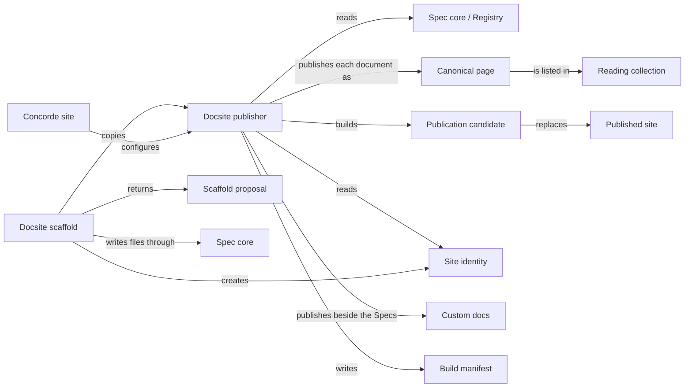

# Views

## Purpose

Views publishes a project's Specs as a documentation website, so that a developer can read the
Modules, follow how they fit together and look up their precise promises in a browser. It has two
parts. The publisher is a Docusaurus site under `docsite/` that turns the registered Spec documents
into pages, checks the result and only then replaces the previous site. The scaffold command copies
that same publisher into another Concorde project. Concorde publishes its own Specs with it. A
published page is only a view of the Specs: it grants no agent any context, never changes a Spec,
and proves nothing about whether the code keeps the promises it shows. Views does not define the
Spec format, which belongs to Spec core, does not install Node dependencies, and deploys
nothing unless a project opts into the GitHub Pages workflow the scaffold can add.

## Terminology

| Term | Definition |
| --- | --- |
| Published site | The last docsite build that passed every check, kept in `docsite/build/`. |
| Publication candidate | A complete new build, generated apart from the published site, that must pass every check before it may replace it. |
| Promotion | The directory swap that makes a checked publication candidate the new published site. |
| Canonical page | The single page at which one registered Spec document is published. |
| Reading collection | One of the two Spec tabs of the site, Module documents or Implementation documents, chosen for each document by its declared role. |
| Custom docs | Project-owned documentation that the site publishes in its own tab, beside the Specs and outside them. |
| Site identity | The project-owned file `docsite/site.json` that names the site and configures its optional homepage and custom docs. |
| Scaffold proposal | The exact list of files, with their digests, that the scaffold command would create in a project. |
| Build manifest | The record a build writes beside its pages, listing every published document with its route and source digests. |
| [Developer](../../vocabulary.md#concept.concorde.developer) | |
| [Module](../../vocabulary.md#concept.concorde.module) | |
| [Spec](../../vocabulary.md#concept.concorde.spec) | |
| [Context](../../vocabulary.md#concept.concorde.context) | |
| [Registry](../spec/module.md#concept.spec.registry) | |
| [Impact index](../spec/module.md#concept.spec.impact-index) | |
| [File transaction](../spec/module.md#concept.spec.file-transaction) | |

A reader of the site meets canonical pages and reading collections. Someone who builds the site
meets the candidate, promotion and the build manifest. Someone who adds a site to a project meets
the scaffold proposal and the site identity.

## Usage

The site has a **Module documents** tab and, when any document has the role `implementation`, an
**Implementation documents** tab: the Protocol's two document roles, chosen by each document's
declared role. Both show the Module tree built from `contains`. Every registered document has one
**canonical page** under its owner, at a route derived from its source path
(`specs/concorde/spec-tooling/views/scenarios.md` → `/specs/concorde/spec-tooling/views/scenarios`); a Module that reads it
through `uses` or `includes` links to that page instead of copying it. Each page shows its owner,
the Modules that select it and why, and its source digests. Every stable identity is an anchor,
import rows show the imported definition, and illustrative diagrams carry a non-normative label.

**Custom docs**, such as Concorde's Protocol chapters at `/protocol`, appear in their own tabs,
belong to no Module and are never agent context.

From `docsite/` after `npm ci`, `npm run start` previews, `npm run validate` checks without
building, and `npm run build` builds a **publication candidate**, checks it against the current
sources and only then performs the **promotion** that makes it the **published site** in
`docsite/build/`. A successful build writes a **build manifest** listing every page with its route,
owner and source digests; it says which sources were published, nothing about the code. Any failure,
such as a link to a moved anchor, deletes the candidate and keeps the published site.

In another initialized project, `concorde docsite --propose` returns a **scaffold proposal**, the
exact template files plus a new **site identity** `docsite/site.json`, and `docsite --apply
--proposal FILE` creates exactly those files. Applying never replaces or deletes: an existing
destination is a `conflict`, an already applied proposal is `unchanged`, and a proposal from other
package bytes is refused. [Design notes](design.md) walks through reading, building and
scaffolding in full.

## Design

The **Docsite publisher** reads only the configuration, the registry and the documents it lists, so
nothing is published that no Module owns. It publishes each document once, rewrites only a staged
copy under `docsite/.generated/`, and promotes a candidate only after its source digest, page
inventory and every internal link check out, restoring the old site if promotion fails. It refuses
inputs it cannot publish correctly, including a flowchart of executable topology on a `module`-role
page, but leaves full structural conformance to Spec core. Its TypeScript recomputation of which Modules
select a document must equal Spec core's `selected-by`
[impact index](../spec/module.md#concept.spec.impact-index).

The **Docsite scaffold** selects the template by the same inventory rule the installer uses and
applies a proposal through Spec core's
[file transactions](../spec/module.md#concept.spec.file-transaction), which it uses and does not own,
so accepting a proposal can never damage an existing site or Spec.

The **Concorde site** is Concorde's own publication configuration: its `site.json` homepage, the
Protocol collection, repository tests and the Pages workflow, all excluded from the template.

## Relationships

The publisher and the scaffold never edit each other's output: the scaffold creates files once,
and publication only reads Specs and writes derived output under `docsite/`. Neither changes a
registered Spec document.

**Spec core** defines the Protocol formats and owns the project
[registry](../spec/module.md#concept.spec.registry), the Python loading of Specs, the derived
[impact indexes](../spec/module.md#concept.spec.impact-index) and the
[file transactions](../spec/module.md#concept.spec.file-transaction). The publisher relies on the
registry records to know which Modules and documents exist and which Module contains which, and on
the meaning of the `selected-by` index for the provenance it shows. It parses the registry and
metadata itself in TypeScript and refuses any input it cannot publish, which fails the build and
keeps the published site; it leaves full structural conformance to the Spec validator. The scaffold
relies on Spec core to find the root Module's title for the default site title, to report
findings in the common result shape, and to apply its files through a file transaction that writes
everything or nothing and stops on stale input, a null digest meaning the file must still be
absent. When the project has no readable Spec configuration, the scaffold returns `invalid` and
asks for project initialization first.

Distribution calls the scaffold and packages it; Views declares no dependency on it.
Distribution's command-line interface dispatches `concorde docsite` to it, and the scaffold reads
the templates from the installed package, whose manifest `concorde.json` must list `docsite` as a
package root; when that package root is missing or unsafe, the scaffold returns `invalid` and asks
for a reinstall. In the other direction, Distribution's installer ships `docsite/` using the
inventory rule that Views defines, so the two cannot disagree about the template. Distribution's
own build manifest records Concorde's generated build outputs and is unrelated to the docsite's
build manifest.
