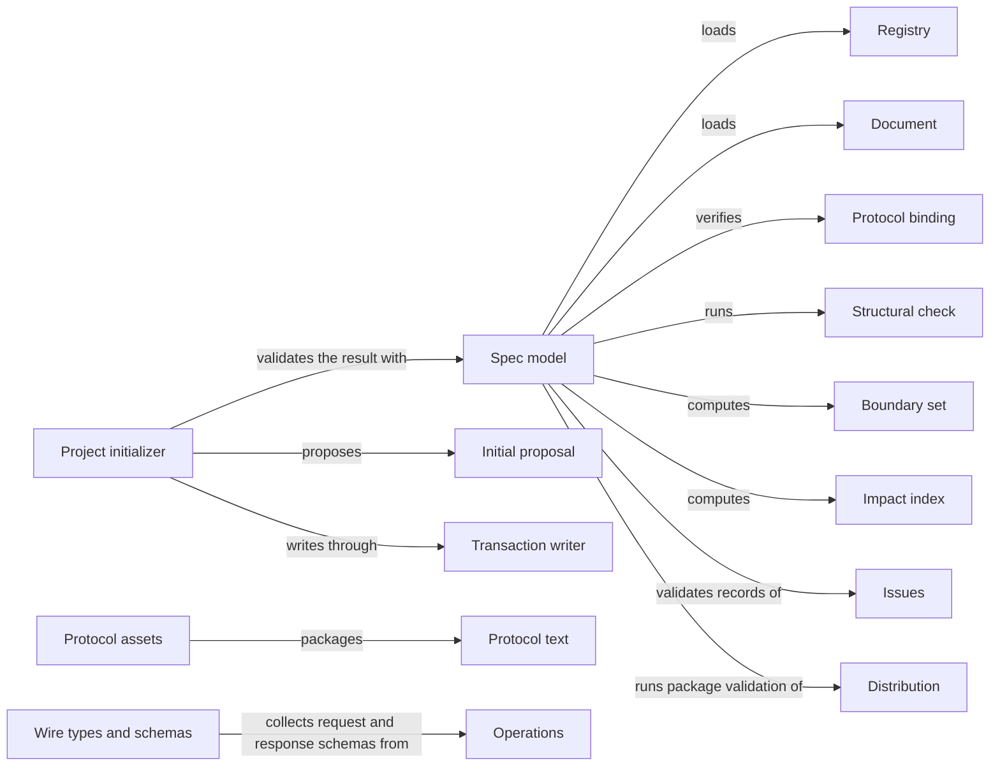

# Spec tooling

## Purpose

Spec tooling is Concorde's implementation of the Spec Protocol. It loads a project's Specs,
checks them against every rule of the Protocol, and computes from their declarations what a task
bound to a Module may read and what it may write. The Harness relies on those sets to bound every
worker, Views relies on the loaded model to publish the Specs, and the developer and the user
session rely on validation to learn whether the Specs are structurally sound. Spec tooling also keeps
the registry in step with the Module entries, creates the first Spec of a new project, provides the
typed JSON values and all-or-nothing file writes that the rest of Concorde uses, and keeps the
Protocol text together with the copy of it that is distributed to projects. It does not judge
whether a Spec explains enough or whether the code keeps the Spec's promises; those are questions
for review and tests. It does not decide which boundary a particular task receives, and it does not
enforce one.

## Terminology

| Term | Definition |
| --- | --- |
| Registry | The project-wide index of Modules, which mirrors every Module's `module` block and is never itself a place where relations are declared. |
| Document | One registered Markdown reading file together with its `.md.json` metadata file, which share one identity and one owning Module. |
| Protocol binding | The project configuration's explicit acceptance of one installed Spec Protocol copy, recorded as its version and the digest of its manifest. |
| Structural check | One decidable rule of the Spec Protocol, named by a `CHK` identity and carrying the severity error or warning. |
| Boundary set | One of the five sets the Protocol derives for a Module: its Spec context, external context, implementation context, Spec scope or implementation scope. |
| Impact index | A derived reverse lookup that tells which Modules a change to a document, node, contract or file concerns. |
| Verification declaration | A statement in a test's own source that names the scenario identities the test verifies. |
| Typed value | A versioned JSON record `{type_id, schema_version, data}` whose data is checked against the schema registered for its type. |
| File transaction | A set of whole-file writes, each bound to the digest of the bytes it replaces, that is applied completely or not at all. |
| Initial proposal | The exact files that `concorde-init` offers for a new project before anything is written. |
| [Module](../vocabulary.md#concept.concorde.module) | |
| [Spec](../vocabulary.md#concept.concorde.spec) | |
| [Context](../vocabulary.md#concept.concorde.context) | |
| [Boundary](../vocabulary.md#concept.concorde.boundary) | |
| [Evidence](../vocabulary.md#concept.concorde.evidence) | |
| [Developer](../vocabulary.md#concept.concorde.developer) | |
| [Host](../vocabulary.md#concept.concorde.host) | |
| [Capability](../vocabulary.md#concept.concorde.capability) | |
| [Operation](../operations/module.md#concept.operations.operation) | |
| [Agent](../agents/module.md#concept.agents.agent) | |
| [Issue](../issues/module.md#concept.issues.issue) | |
| [Worktree](../harness/worktrees/module.md#concept.worktrees.worktree) | |
| [Candidate](../harness/worktrees/module.md#concept.worktrees.candidate) | |

Start with Registry and Document: everything else is computed from them. Boundary sets and impact
indexes are the two answers the Harness asks for; structural checks and verification declarations
are what validation reports on.

## Usage

### Loading a project

Every Concorde program that needs the Specs starts by loading them. Loading reads
`.concorde/config.json`, confirms the Protocol binding, reads the registry, and then reads each
Module's entry and every document the entry registers. Nothing else is read as a Spec: a Markdown
file that no entry registers is not a document, and a link never adds one.

The **registry** (`.concorde/specs.json`) lists which Modules exist and, for each one, a copy of the
`module` block from its entry: the documents it owns and its `contains`, `uses`, `includes` and
`participates` relations. The entry is where those relations are declared; the registry only
mirrors them so that a coordinating session can see the whole project in one file. A **document**
is always a pair: `harness/module.md` and `harness/module.md.json` are one document, owned by one
Module, and they are read, selected and digested together. The exact formats are in
[the interface definitions](contracts.md#registry-file).

The **Protocol binding** records which Protocol the project has accepted. The installer places a
copy of the Protocol under `.concorde/protocol/`; the configuration names that copy's version and
the digest of its manifest. Loading refuses a project whose binding does not match the installed
copy, or whose copy differs from the Protocol shipped with the installed Concorde. A newer
installation therefore never changes the rules silently: the developer accepts it explicitly with
`concorde-configure`.

A loaded repository is a snapshot of the files as they were when it was built. It never writes, and
it answers the same query the same way every time. After any Spec file changes, build a new one.
A caller that wants to inspect a candidate state without writing it can hand the repository
replacement bytes for the registry or for individual documents.

### Checking the Specs

Run `python3 scripts/concorde.py validate` in a project, or call the validator from code. It
evaluates every structural check of the Protocol and reports one finding per violation. Each
finding names the check, for example `CHK.binds.unbound`, its severity, the file concerned and a
remediation. The result is `invalid` when at least one error was found; warnings are reported and
do not block.

For example, if a new script `scripts/export.py` is committed without any Module binding it,
validation reports `CHK.binds.unbound` as an error for that path. The fix is to add the path to a
realization of the Module responsible for it.

A **structural check** establishes only that the declarations are well formed and agree with each
other. A successful validation is evidence about structure alone: it says nothing about whether a
Spec explains enough or whether the code keeps its promises, and Concorde never reports it as if it
did. Validation also reads the
**verification declarations** in the tests that Modules bind, reports declarations that name
unknown scenarios, and warns about scenarios that no test declares. It also checks that a link
whose fragment names a node identity points at the document defining that node, and that every
configured check's declared inputs exist. [What validation tells you](validation.md) explains the
check families and the extra checks Concorde adds.

### Keeping the registry in step

A task bound to one Module may change that Module's own `module` block, for example to add a
`uses`. It may not write the registry, which lies outside every Module's write set. The registry is
then stale, and validation reports `CHK.registry.mirror`. A project-level step reconciles it:
`python3 scripts/concorde.py registry --write` rewrites every record's mirrored fields from the
entries, and `registry --check` only reports whether they differ. Neither adds nor removes a Module.
Creating or deleting a Module is a deliberate edit of the registry, together with the parent's
`contains`.

### Asking for boundary sets

The Harness asks the repository for the **boundary sets** of the Module a task is bound to, and
composes the task's boundary from them. For a Module M:

| Set | What it contains |
| --- | --- |
| Spec context | both members of every document M owns, and of every document selected by M's `contains`, `uses` and `includes` |
| External context | the readable files below M's external inclusions, with one digest per inclusion |
| Implementation context | the names of the files M's realizations bind |
| Spec scope | both members of every document M owns |
| Implementation scope | every file M's realizations cover, including pending entries not yet created |

Selection is one level deep. If Planning uses Spec and Spec uses Distribution, Planning's context
contains Spec's documents but not Distribution's. A `uses` with `relies_on` selects only the
provider's entry and the documents defining the listed promises. A query by scenario identity
returns the whole context of the scenario's owner, never a trimmed part of it.

The **impact indexes** answer the reverse question. Before a shared file changes, the Host asks
which Modules bind it; before a document changes, which Modules read it. The indexes never widen a
boundary; they tell a caller whom a change concerns.

### Starting a new project

After the installer has run, the developer calls the `concorde-init` capability with
`action: "propose"`, a project name and a worker configuration. It returns an **initial proposal**:
the configuration, the registry and a root Module entry with its metadata, as exact file contents.
Nothing is written yet. The developer reads the proposal and calls `concorde-init` again with
`action: "apply"` and the unchanged proposal. The Host applies it in a candidate worktree, and the
files are written only if every destination is still absent and the resulting project validates.
The root entry states plainly that the project's purpose and behaviour are not yet specified; it
invents no concepts, requirements, scenarios or relations. So that the new project validates at
once, the root Module binds every file the project already has, tracked or untracked but not
ignored by version control, in one realization called Existing project files. That binding says
only where the files are, nothing about what they do; later Modules take files over from it.

### Shared infrastructure

Two small services are used across Concorde. A **typed value** carries every request, response and
record that crosses a capability or worker boundary; checking it needs only the Python standard
library and never a network. A **file transaction** writes a set of files so that either all of
them change or none do; each write names the digest of the bytes it expects to replace, so a file
changed by someone else in the meantime stops the whole transaction.

## Design

The **Spec model** is one loader shared by queries and checks. Boundary sets, impact indexes and
validation all read the same parsed declarations, so a query and a check cannot disagree about who
owns a document or what a relation selects. The loader reads only registered documents and
computes every set from declarations alone. That is what lets two tools, or two runs of one tool,
get the same boundary from the same checkout.

The loader keeps two kinds of failure apart. Opened for use by the Harness and the other
consumers, it refuses a project whose structure cannot support a trustworthy boundary: an
unreadable configuration, registry or document, a mismatched Protocol binding, a broken entry, a
document owned twice or not at all, an unknown relation target or a composition cycle. A partial
model would give a harness a wrong boundary. Every other problem is only a finding. Opened by
validation, the loader collects even the refusing problems as findings and keeps going, so a
developer repairs a Spec in one pass instead of one error at a time.

Implementation files are never read to load the Specs or to compute a boundary set; only their
paths are listed. Validation reads test files for verification declarations, by parsing them and
never by running them, so coverage comes from the tests themselves and no Spec can claim its own
coverage.

**Wire types and schemas** hold every typed value's schema in one place: the shared building
blocks, the records that no single capability owns, and the request and response schemas each
Operation and Agent module declares. Checking is closed and offline: unknown fields fail, versions
must match exactly, and a schema can refer only to schemas registered here. The same files provide
the offline JSON Schema subset that checks the schema and example of every canonical contract in a
Spec, the safe project-path check, strict JSON decoding and the small front-matter parser used for prompt files.

The **Transaction writer** applies file transactions. It checks every expected digest before
writing, writes each file through a temporary file and an atomic rename, runs an optional check of
the result, and restores the original bytes if anything fails. Initialization, configuration,
the registry command, the confirmation of pending entries and several other Host steps use it, so
none of them can leave half an update behind. A pending entry records a file that a task may
create; once the file exists, the entry must leave `pending`. Validation of a candidate confirms
such entries before it checks the Specs, and delivery confirms any that remain.

The **Project initializer** separates describing a new project from writing it. The proposal is
the preview; application accepts only that exact proposal, and only while every destination is
absent. Initialization creates what the project itself owns: its configuration, its registry and
its first Spec. The Protocol copy and other defaults that exist only because Concorde is installed
are the installer's output. `concorde-configure` shares this code path: it rewrites the worker
configuration, or, when the developer accepts a newly installed Protocol, the binding, and keeps
the change only if the project still loads.

The **Protocol text** under `protocol/` is the standard itself: its chapters, templates and the
machine-readable vocabulary `model.yaml`. The **Protocol assets** are what projects receive: the
rule bundles assembled from the chapters and the Framework execution profile, and the manifest
that records their version and digests. The build renders the bundles; the installer copies them
into each project; the Protocol binding pins the manifest. Keeping the text and its distributed
copy apart lets a project keep working under the rules it accepted while a newer Protocol is being
written.

The **Spec tests** exercise the loader, every check family, the boundary sets, typed values,
transactions and initialization on small fixture projects, and hold the shared test-support
helpers other Modules' tests import.

### Known limits

The Framework execution profile distributed with the Protocol still describes the previous registry
and metadata shapes. Where it disagrees with the Protocol chapters or this Spec, they apply.

## Relationships

The diagram shows the principal relations. The Spec model also reads verification declarations
and checks the installed Protocol copy against the Protocol assets; the Wire types and schemas
also collect schemas from Agents; the Project initializer runs as a Host tool.

Most of Concorde depends on Spec tooling rather than the other way round. The Harness freezes each
task's context from the boundary sets and asks the impact indexes whom a change concerns. Views
loads the model to publish the Specs. Validation runs the validator, and Validation and delivery
confirm pending entries through the Spec model and the Transaction writer. Every capability passes typed values.
Those Modules declare their own `uses` of Spec.

**Distribution** builds, installs and runs Concorde. Spec tooling relies on it in four places. The
repository asks the build whether the installed Protocol assets are fresh before it trusts them,
and reads the installed copy from the location the installer uses. The typed values read the list
of capability adapters from the Operations package index that Distribution maintains. Validation
of Concorde's own source checkout also runs Distribution's package validation. Distribution's
command line exposes `validate`, `registry` and `build`. If the build reports stale assets, loading
fails with that error instead of admitting an unverified Protocol.

**Operations** lists the public [Operations](../operations/module.md#concept.operations.operation)
and routes each request to its provider. Each capability adapter declares its request and response
schemas; the Wire types and schemas collect them so that every typed value of every capability is
checked in one place, and so that they can be exported to the distributed JSON schemas.
`concorde-init` is one of those adapters, and Operations routes its requests to the Project
initializer. An adapter without schemas has no request or response type.

**Agents** defines every callable [Agent](../agents/module.md#concept.agents.agent). Agents that
take requests declare their request and response schemas in the same way as capability adapters,
and the Wire types and schemas collect them too. Capability and Agent names must not collide; the
collection stops with an error if they do.

**Issues** keeps durable [Issue](../issues/module.md#concept.issues.issue) records under
`.concorde/issues/`. Validation reads every record through the Issue store and reports a record the
store cannot read as an error finding, and the records' revisions become part of the digest of the
validated state. Spec tooling never writes Issue records.

**Candidate worktrees** manages each [candidate](../harness/worktrees/module.md#concept.worktrees.candidate)
and the primary [worktree](../harness/worktrees/module.md#concept.worktrees.worktree). A typed value
that references a run artifact under `.concorde/runs/` or `.concorde/status/` is resolved in the
primary worktree, because only the primary worktree keeps those records; the Wire types and schemas
ask the status store for that root. When `concorde-init` applies a proposal, the Host binds the
call to a candidate first, so the initial files are written there, not in the primary worktree.

**Agent execution** runs capabilities. The `concorde-init` adapter declares no model work: its entry
hands the admitted request to the Host's deterministic tool path, which calls the Project
initializer directly. A failure inside the initializer is returned as a failed result by that path;
the initializer itself never retries.
