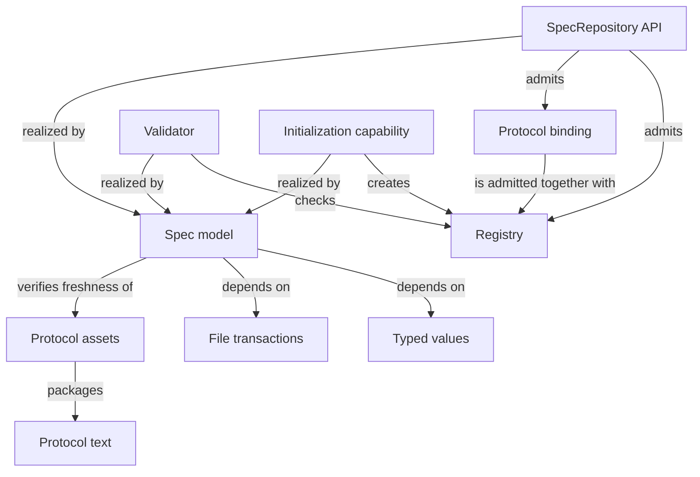

```concorde-document
{
  "id": "document.spec.module",
  "owner": "module.spec",
  "main_visible": true
}
```

# Spec

## Usage & Contract

### Purpose

Spec supplies explicit project identities, complete contract-context queries, structural
validation and honest initialization to developers and Framework tools. It admits and pins the
independent Spec Protocol rather than deciding the project's intended software behavior.

### Usage

Use this Module when a tool needs to identify a Module, resolve its complete Spec context,
validate authored documents or initialize a project. Construct a `SpecRepository` from an explicitly
configured project whose installed Protocol matches its accepted binding. Select a Module ID, or
query a scenario to select its sole owner's context. Use `spec_context` for sources and provenance;
implementation listing queries are separate and do not implicitly read source contents.

A registry records ownership, composition, dependencies and reading references as distinct facts.
A document has one owner; a file may realize several Modules. Usage & Contract explains correct
use, and Architecture & Realization explains design; both remain in every selected full document.
Reconstruct the repository after changes. Invalid identities, paths, references or bindings reject
admission rather than returning a partial result. `validate_repository` is read-only; its success
establishes structural checks only. For a new project, propose then apply `concorde-init`; existing
configuration is not overwritten. Read [queries](registry.md), [values](values.md),
[validation](structure.md) and [initialization](initialize.md) for exact inputs and outcomes.

### Requirements

#### req.spec.no-body-read — Metadata resolution does not read collaborator bodies

Resolving a Module's identity, ownership or file listing SHALL NOT read a collaborator Module's
Spec body or a listed file's contents.

#### req.spec.one-owner-per-module — One owning entity per bound file

Within one Module, a bound implementation file SHALL belong to exactly one entity, the owner of the
most specific entry that covers it.

#### req.spec.directory-entry — Directory prefix binds every file below it

A listing entry that ends with `/` SHALL bind every regular file below that directory.

#### req.spec.directory-no-spec-document — No Spec document inside a listed directory

A listed directory SHALL NOT contain a registered Spec document.

#### req.spec.sibling-sharing — Shared providers stay siblings of their consumers

A Module used by more than one consumer SHALL share the same structural parent as its consumers.

#### req.spec.no-structural-proof — Structural checks are not semantic proof

Structural validation SHALL NOT be represented as proof of semantic completeness.

### Scenarios

The registered companion documents [registry](registry.md), [values](values.md), [structure](structure.md) and [initialize](initialize.md) define most scenarios; this section introduces the Module's core admission behavior.

#### scenario.spec.admit-inventory — Admitting a consistent Module inventory

- GIVEN an explicit registry with Module identities, one structural parent per Module, directed uses, entity listing entries and document ownership and references
- AND a Protocol binding that matches the installed Protocol assets
- WHEN the repository is constructed
- THEN it admits immutable Module descriptors, file-ownership and reverse-user indexes
- AND it never reads a listed file's contents or a collaborator's Spec body to do so

#### scenario.spec.reject-inconsistent-inventory — Rejecting a structurally inconsistent inventory

- GIVEN a registry with an unresolved parent or use, a composition cycle, a duplicate entry owner within one Module, a non-sibling shared provider, or a listing entry that is a control or generated path, an existing path of the wrong kind, a registered Spec document or a directory containing one
- WHEN the repository is constructed
- THEN admission fails before any Agent runs
- AND no partial repository is returned

#### scenario.spec.shared-file — A file shared by several Modules

- GIVEN two Modules each declare an entity whose listing entry binds the same implementation file, as an exact file or as a directory prefix that covers it
- WHEN the repository is admitted
- THEN both Modules keep their own entry in their own entity listing
- AND the reverse index reports every Module whose entries cover the file, so a change to it can be assessed against each of their contracts
- BUT within one Module the file belongs to exactly one of its entities, the one whose most specific entry covers it

#### scenario.spec.external-reference — A Module references vendored material it does not own

- GIVEN a Module registration whose `references` include an entry of kind `external` naming the vendored documentation or source of a library, service or tool the Module uses
- WHEN the repository is admitted and the Module's external references are resolved
- THEN the entry enters no Spec context and no implementation file listing, its readable files are expanded with the ordinary exclusions plus media and archive suffixes, it is identified by one digest over those files, and validation reports an entry that does not exist as an error
- AND several Modules may reference the same material
- BUT an entry that is or contains a registered Spec document, that overlaps the Module's own file listing, or that is declared twice is rejected, and an external reference is never pending

#### scenario.spec.directory-entry — A directory prefix binds a whole directory

- GIVEN an entity whose listing entry ends with `/` and names a directory this Module alone owns
- WHEN the repository resolves that Module's implementation files
- THEN every existing regular file below the directory is bound, excluding the Framework's skipped directories, dot-prefixed names, symlinks and skipped suffixes
- AND a file created below that directory later needs no new declaration
- BUT a more specific entry of the same Module still owns the file it names

## Architecture & Realization

### Design

Registry admission first establishes explicit identities and relationship indexes. Document
parsing then resolves owned definitions, while a separate one-level union resolves context with
source digests and inclusion reasons. Keeping those operations distinct realizes the external
promise that reading a provider definition neither acquires ownership nor adds its implementation.
Entity bindings and the reverse file index independently identify affected implementation users.

The two reading parts are validated as document structure, not used as context filters. Definitions
are still parsed across the owner's whole collection, including internal constraints and scenarios.
Initialization uses a before-digest file transaction and validates its complete proposed overlay;
structural validation and test-declared coverage remain evidence rather than semantic proof.
Shared typed-value and transaction realizations have their own exact entity entries below.

### Entities

The entities below realize the Spec model. The Spec model entity lists the Python package and
test package directories it owns; the typed-values, file-transaction and Protocol-asset entities keep
the exact entries they realize, and the most specific entry decides which entity owns a file.

```concorde-entities
[
  {
    "id": "entity.spec.registry",
    "title": "Registry",
    "kind": "concept",
    "responsibility": "The explicit schema-4 JSON inventory of Module identities, document ownership and references, parent/uses relationships, entity listing entries (exact files and directory prefixes) and checks that the repository admits."
  },
  {
    "id": "entity.spec.protocol-binding",
    "title": "Protocol binding",
    "kind": "concept",
    "responsibility": "The pinned accepted Protocol version and exact manifest digest recorded in .concorde/config.json, matched against the Protocol copy the installer placed under .concorde/protocol/ and cross-checked against the installed package before any Spec is admitted."
  },
  {
    "id": "entity.spec.repository-api",
    "title": "SpecRepository API",
    "kind": "interface",
    "responsibility": "The Python query surface for ownership, owned definitions, one-level context resolution and affected-consumer provenance, separate from implementation listing queries."
  },
  {
    "id": "entity.spec.validator",
    "title": "Validator",
    "kind": "interface",
    "responsibility": "The validate_repository entry point that checks structure and references and reports findings and a source digest, without proving semantics."
  },
  {
    "id": "entity.spec.init-capability",
    "title": "Initialization capability",
    "kind": "interface",
    "responsibility": "The concorde-init capability that proposes, then applies, an uninitialized project's configuration, registry and honest Module stub; its public Skill is built and installed by Distribution."
  },
  {
    "id": "entity.spec.spec-model",
    "title": "Spec model",
    "kind": "program",
    "responsibility": "Realizes registry admission, selection and reverse indexes, deterministic structural validation, project initialization, the concorde-init capability and the package entry points.",
    "files": [
      "capabilities/init.py",
      "scripts/development/check-spec-v5.py",
      "src/concorde/__init__.py",
      "src/concorde/__main__.py",
      "src/concorde/spec/",
      "tests/__init__.py",
      "tests/concorde/__init__.py",
      "tests/concorde/spec/",
      "tests/concorde/support/__init__.py",
      "tests/concorde/support/paths.py"
    ]
  },
  {
    "id": "entity.spec.typed-values",
    "title": "Typed values",
    "kind": "shared program",
    "responsibility": "Realizes versioned value schemas, canonical encoding, safe project paths, the offline interface-schema evaluator and the constrained front-matter parser that every boundary of the Framework uses.",
    "files": [
      "src/concorde/spec/contract_shapes.py",
      "src/concorde/spec/contracts.py",
      "src/concorde/spec/frontmatter.py",
      "src/concorde/spec/schema.py",
      "src/concorde/spec/typed_data.py",
      "src/concorde/spec/wire_shapes.py",
      "tests/concorde/spec/test_typed_data.py"
    ]
  },
  {
    "id": "entity.spec.file-transactions",
    "title": "File transactions",
    "kind": "shared program",
    "responsibility": "Realizes exact replacement proposals as staged filesystem operations with before-digest checks and original-byte recovery, for every Module that applies an accepted proposal.",
    "files": [
      "src/concorde/spec/changes.py"
    ]
  },
  {
    "id": "entity.spec.protocol-text",
    "title": "Protocol text",
    "kind": "authored standard",
    "responsibility": "Authors the independent Spec Protocol 6.0.0 chapters and templates: principles, Module specifications, Spec management, Spec and Context, Required format, and the Module and Scenario templates.",
    "files": [
      "protocol/"
    ]
  },
  {
    "id": "entity.spec.protocol-assets",
    "title": "Protocol assets",
    "kind": "program",
    "responsibility": "Adapts the independent Protocol text and the Framework execution profile into packaged prompt assets, and pins the exported rule version and generated asset digests in the manifest.",
    "files": [
      "prompts/protocol/",
      "protocol/manifest.json"
    ]
  }
]
```

### Relationships

The registry separates semantic Module identities from implementation-file ownership: Modules register documents and entities, entities bind listing entries that are exact files or directory prefixes, and a file may be bound by several Modules while belonging to one entity within each, the owner of its most specific entry. Admission creates immutable selection records and reverse indexes from exact declarations; overlay bytes support candidate inspection without writes. Selection never walks a dependency to read another Module's body. The Spec model's own package entry points, the Validator and the Initialization capability are three ways of using the same admitted Registry and Protocol binding; the Protocol assets entity packages the authored Protocol text for runtime distribution without becoming a second authority over its meaning.




### Unresolved information

`spec_files` and `spec_context` now resolve Module and scenario queries through unique document
ownership and explicit one-level references. The retired `spec_pair` is not a Protocol 5 query.
Initialization emits the inline two-part Module stub, Profile 13/schema 4 and owner metadata.
`model.py` retains the compatibility `ProposalFile` record alongside `Finding` and `ToolResult`.

The runtime admits Profile 13/schema 4, validates canonical definitions and participant bindings,
and records exact source bytes, ownership, declarations and inclusion provenance. Structural
validation and passing tests do not establish semantic completeness.
