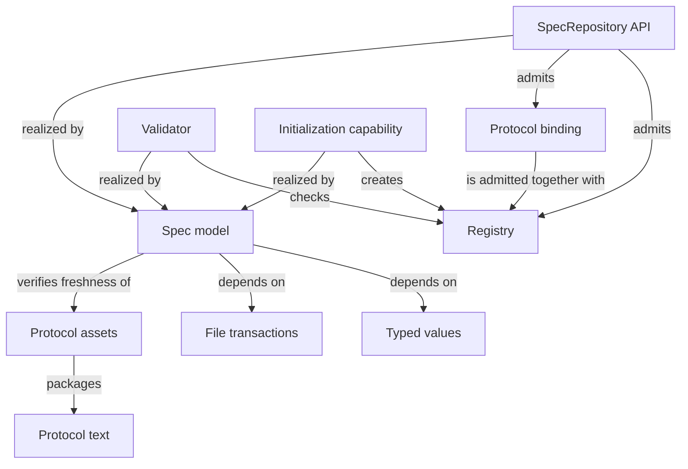

# Spec

## Purpose

The Spec Module records which documents belong to each Module, determines which specifications a task may read, and checks that their structure and references agree. It also creates an initial project specification without inventing business behavior. Developers and the Framework use it to establish the intended contract before work begins.

## Terminology

| Term | Meaning / definition |
| --- | --- |
| [Module](../concepts.md#terminology) | Defined in Concepts for reading Concorde. |
| [Spec](../concepts.md#terminology) | Defined in Concepts for reading Concorde. |
| [Registry](../concepts.md#terminology) | Defined in Concepts for reading Concorde. |
| [Context](../concepts.md#terminology) | Defined in Concepts for reading Concorde. |
| [Snapshot](../concepts.md#terminology) | Defined in Concepts for reading Concorde. |
| [Protocol binding](values.md#terminology) | Defined in Identities and versions. |
| [Document unit](values.md#terminology) | Defined in Identities and versions. |
| [Entity](../concepts.md#terminology) | Defined in Concepts for reading Concorde. |
| [Reference](registry.md#terminology) | Defined in Registry. |
| [Implementation binding](registry.md#terminology) | Defined in Registry. |
| [Structural validation](structure.md#terminology) | Defined in What structural validation tells you. |
| [Semantic completeness](structure.md#terminology) | Defined in What structural validation tells you. |

## Usage

Use the Spec Module when a task needs to find its owning Module, obtain the specifications it may rely on,
check document consistency or initialize a project. A Module selection includes its owned reading
and metadata plus explicitly referenced units. A scenario selects the same owner's complete context.

For example, Checkout may reference Inventory's reservation contract without owning Inventory or
receiving its implementation. Inventory's own references do not automatically join Checkout's context.
The [registry topic](registry.md) explains this one-level selection with a concrete example.

After relevant documents or declarations change, resolve a fresh context. Invalid identities,
missing sources or inconsistent references stop admission instead of returning a partial contract.
A successful structural check does not prove the software behaves correctly. Use
[initialization](initialize.md) for an honest starting draft and [validation](structure.md) to
understand what deterministic checks establish. Exact query interfaces are in Implementation Specs.

## Design

The Registry records ownership and relationships before document content is selected. The Protocol
binding identifies the rules the project has explicitly accepted. The SpecRepository API and Validator
use the same Spec model, so a query and a check do not invent different meanings of ownership.

The Initialization capability creates an honest starting draft. Typed values checks record shapes;
File transactions applies accepted changes together rather than leaving half an update visible.
Protocol text is the authored standard and Protocol assets are its distributed copy. Keeping these
roles separate prevents installation from silently deciding the project's business behavior.

Selection and implementation lookup are separate because permission to understand a provider is not
permission to modify its code. Exact source identities make changed inputs invalidate dependent
results, while explicit one-level references keep the boundary understandable and reproducible.

## Relationships

The registry separates semantic Module identities from implementation-file ownership: Modules register documents and entities, entities bind listing entries that are exact files or directory prefixes, and a file may be bound by several Modules while belonging to one entity within each, the owner of its most specific entry. Admission creates immutable selection records and reverse indexes from exact declarations; overlay bytes support candidate inspection without writes. Selection never walks a dependency to read another Module's body. The Spec model's own package entry points, the Validator and the Initialization capability are three ways of using the same admitted Registry and Protocol binding; the Protocol assets entity packages the authored Protocol text for runtime distribution without becoming a second authority over its meaning.

## Unresolved information

`spec_files` and `spec_context` now resolve Module and scenario queries through unique document
ownership and explicit one-level references. The retired `spec_pair` is not a Protocol 5 query.
Initialization emits the paired reading/metadata Module stub, Profile 14/schema 5 and owner metadata.
`model.py` retains the compatibility `ProposalFile` record alongside `Finding` and `ToolResult`.

The runtime admits Profile 14/schema 5, validates canonical definitions and participant bindings,
and records exact source bytes, ownership, declarations and inclusion provenance. Structural
validation and passing tests do not establish semantic completeness.

## Precise specifications

The Spec Module owns the exact obligations and interface details in [requirements](requirements.md), [scenarios](scenarios.md).
These companions are part of the same complete Module specification, not separate topic owners.
