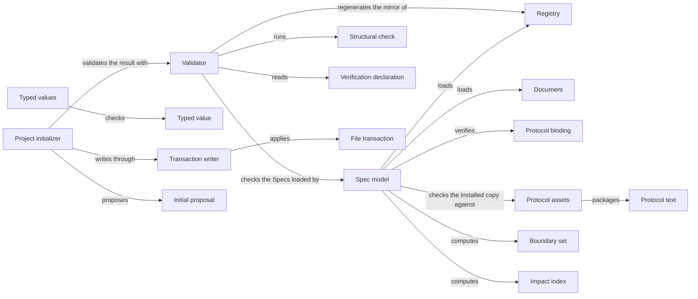

# Spec tooling

## Purpose

Spec tooling is Concorde's implementation of the Spec Protocol. It loads a project's Specs, checks
them against every rule of the Protocol and the few conventions Concorde adds, and computes from
their declarations what a task bound to a Module may read and write and whom a change concerns.
Every other part of Concorde relies on it: the Harness bounds each Agent call with its sets, the
providers ask it whom a change concerns, Views publishes the model it loads, and the developer runs
its validator to learn whether the Specs are structurally sound. It also keeps the registry in step
with the Module entries, creates the first Spec of a new project through `concorde-init`, provides
the typed JSON values and the all-or-nothing file writes the rest of Concorde uses, and keeps the
Protocol text from which the installed Protocol copy is built. It sits at the bottom of Concorde and
depends on no other Module. It does not judge whether a Spec explains enough or whether code keeps
a promise, it does not decide which boundary a task receives or enforce one, it holds no other
Module's record schemas or policies, and it neither runs configured checks nor reads Issue records.

## Terminology

| Term | Definition |
| --- | --- |
| Registry | The project-wide index of Modules, which mirrors every Module's `module` block and is never itself a place where relations are declared. |
| Document | One registered Markdown reading file together with its `.md.json` metadata file, which share one identity and one owning Module. |
| Protocol binding | The project configuration's explicit acceptance of one installed Spec Protocol copy, recorded as its version and the digest of its manifest. |
| Structural check | One decidable rule of the Spec Protocol or of Concorde's Spec conventions, named by a rule identity and carrying the severity error or warning. |
| Boundary set | One of the five sets the Protocol derives for a Module: its Spec context, external context, implementation context, Spec scope or implementation scope. |
| Impact index | A derived reverse lookup that tells which Modules a change to a document, node, contract or file concerns. |
| Verification declaration | A statement in a test's own source that names the scenario identities the test verifies. |
| Typed value | A versioned JSON record `{type_id, schema_version, data}` whose data is checked against the schema its owner registered for that type. |
| File transaction | A set of whole-file writes, each bound to the digest of the bytes it replaces, that is applied completely or not at all. |
| Initial proposal | The exact files that `concorde-init` offers for a new project before anything is written. |
| [Module](../vocabulary.md#concept.concorde.module) | |
| [Spec](../vocabulary.md#concept.concorde.spec) | |
| [Spec context](../vocabulary.md#concept.concorde.spec-context) | |
| [Implementation context](../vocabulary.md#concept.concorde.implementation-context) | |
| [Boundary](../vocabulary.md#concept.concorde.boundary) | |
| [Evidence](../vocabulary.md#concept.concorde.evidence) | |
| [Developer](../vocabulary.md#concept.concorde.developer) | |
| [Host](../vocabulary.md#concept.concorde.host) | |
| [Capability](../vocabulary.md#concept.concorde.capability) | |

Start with Registry and Document: everything else is computed from them. Boundary sets and impact
indexes are the two answers the Harness and the providers ask for; structural checks and
verification declarations are what validation reports on; typed values and file transactions are
the shared services other Modules build their records and writes on.

## Usage

### Loading a project

Every Concorde program that needs the Specs starts by loading them. Loading reads
`.concorde/config.json`, confirms the Protocol binding, reads the registry, and then reads each
Module's entry and every document the entry registers. Nothing else is read as a Spec: a Markdown
file that no entry registers is not a document, and a link never adds one.

<a id="concept.spec.registry"></a><a id="concept.spec.document"></a>

The **registry** (`.concorde/specs.json`) lists which Modules exist and, for each one, a copy of the
entry's `module` block: its title, the documents it owns and its `contains`, `uses`, `includes` and
`participates` relations. The entry is where those are declared; the registry only mirrors them so
that a coordinating session can see the whole project in one file. A **document** is always a pair:
`harness/module.md` and `harness/module.md.json` are one document, owned by one Module, and they
are read, selected and digested together. The exact formats are in
[the interface definitions](contracts.md#registry-file).

<a id="concept.spec.protocol-binding"></a>

The **Protocol binding** records which Protocol the project has accepted. The installer places a
copy of the Protocol under `.concorde/protocol/`; the configuration names that copy's version and
the digest of its manifest. Loading refuses a project whose binding does not match the copy, whose
copy has a changed asset, or whose copy differs from the Protocol this installation of Concorde
carries. A newer installation therefore never changes the rules silently: the developer accepts it
explicitly through `concorde-configure`, which rewrites the binding.

A loaded repository is a snapshot of the files as they were when it was built. It never writes, and
it answers the same query the same way every time. After any Spec file changes, build a new one. A
caller that wants to inspect a candidate state without writing it can hand the repository
replacement bytes for the registry or for individual documents.

### Checking the Specs

Run `python3 scripts/concorde.py validate` in a project, or call the validator from code. It
evaluates every structural check of the Protocol, plus Concorde's link, coverage and
configured-check-input checks, and reports one finding per violation. Each finding names its rule,
for example `CHK.binds.unbound`, its severity, the file concerned and a remediation. The result is
`invalid` when at least one error was found; warnings are reported and do not block. The validator
reports every finding it can establish in one run, so a developer repairs a Spec in one pass.

For example, if a new script `scripts/export.py` is committed without any Module binding it,
validation reports `CHK.binds.unbound` as an error for that path. The fix is to add the path to a
realization of the Module responsible for it.

<a id="concept.spec.structural-check"></a>

A **structural check** establishes only that the declarations are well formed and agree with each
other. A successful validation is evidence about structure alone: it says nothing about whether a
Spec explains enough or whether the code keeps its promises, and the result says so explicitly.
[What validation tells you](validation.md) explains the check families, the conventions Concorde
adds, and what validation deliberately leaves to configured checks.

### Declaring what a test verifies

<a id="concept.spec.verification-declaration"></a>

Coverage comes from the tests, never from the Specs. A test names the scenarios it verifies in its
own source with a **verification declaration**, and the validator reads those declarations by
parsing the test files that Modules bind, without importing, compiling or running them. This is the
convention every Concorde project uses, Concorde's own Specs included.

A Python test uses the `verifies` decorator from `concorde.spec.verification` on a test function or
method. A TypeScript test uses an own-line `verifies:` comment directly above its `it`, `test` or
`describe` call; several identities are separated by commas or spaces:

```python
from concorde.spec.verification import verifies

@verifies("scenario.checkout.submit", "scenario.checkout.retry")
def test_submit_once():
    ...
```

```typescript
// verifies: scenario.checkout.render
it("renders the page", () => {});
```

A declaration of an unknown scenario is an error. A scenario that no test declares is reported as a
warning, unless its Module binds no files at all and so has no tests of its own. A Spec document
never lists tests and never contains this syntax outside a fenced example.

### Keeping the registry in step

A task bound to one Module may change that Module's own `module` block, for example to add a
`uses`. It may not write the registry, which lies outside every Module's write set. The registry is
then stale, and validation reports `CHK.registry.mirror`. A project-level step reconciles it:
`python3 scripts/concorde.py registry --write` rewrites every record's mirrored fields, the title
included, from the entries, and `registry --check` only reports which records differ. Neither adds
nor removes a Module. Creating or deleting a Module is a deliberate edit of the registry, together
with the parent's `contains`.

### Asking for boundary sets and impact indexes

<a id="concept.spec.boundary-set"></a>

The Harness asks the repository for the **boundary sets** of the Modules a task is bound to, and
composes the task's boundary from them. For a Module M:

| Set | What it contains |
| --- | --- |
| Spec context | both members of every document M owns, and of every document selected by M's `contains`, `uses` and `includes` |
| External context | the readable files below M's external inclusions, with one digest per inclusion |
| Implementation context | the names of the files M's realizations bind |
| Spec scope | both members of every document M owns |
| Implementation scope | every file M's realizations cover, including pending entries not yet created |

Selection is one level deep. If Planning uses Review and Review uses Agents, Planning's context
contains the Review documents it selects but none of Agents'. A `uses` with `relies_on` selects only
the provider's entry and the documents defining the listed promises. A query by scenario identity
returns the whole context of the scenario's owner, never a trimmed part of it.

<a id="concept.spec.impact-index"></a>

The **impact indexes** answer the reverse question, whom a change concerns, and are all derived
from declarations: `selected-by` tells which Modules read a document, `referenced-by` which
declarations name a node, `implemented-by` which Modules bind a file, the binding Modules of a
Module which other Modules share its files, and the changed-definition index which documents and
which node definitions differ between two revisions of the Specs. The indexes never widen a
boundary. In particular, when several Modules bind one file, the Protocol requires a task that
writes that file to be bound to every binding Module; `implemented-by` names them, and deciding what
the task then receives is the caller's job. A Module's Spec context is never extended with a
sharing Module's documents.

What a change concerns is policy only as far as the Protocol defines it. Which Modules a change may
edit, which Modules need a fresh review and which Modules a candidate edited are rules of Planning,
Review and Validation, built on these indexes.

### Registering and checking typed values

<a id="concept.spec.typed-value"></a>

Every request, response and record that crosses a capability or Agent boundary is a **typed
value**. Spec tooling provides the machinery and no schemas of other Modules: each owner registers
its own types, with a name, a version and a schema, when its code is loaded, and anyone may then
build or check a value of a registered type. A schema may refer to another registered type by
name; the reference is resolved when a value is checked, so an owner never has to import the owner
of a type it embeds. Checking is closed and offline: unknown fields fail, versions must match
exactly, and no schema can load a remote resource. Registering a name twice with a different
version or schema is refused, so two owners cannot silently disagree about one type. The exact
calls are in [the interface definitions](contracts.md#typed-values).

### Writing files as one transaction

<a id="concept.spec.file-transaction"></a>

A **file transaction** writes a set of files so that either all of them change or none do. Each
write names the digest of the bytes it expects to replace, or states that the file must be absent,
so a file changed by someone else in the meantime stops the whole transaction. An optional final
check runs on the written result, and a failure restores every original byte. Initialization,
registry regeneration, pending-entry confirmation, configuration changes and several Host steps of
other Modules use it.

A pending realization entry records a file a task may create. Once the file exists, the entry must
leave `pending`; Spec tooling offers one call that confirms every such entry in one transaction,
changing only the affected metadata, and Validation and Delivery call it.

### Starting a new project

<a id="concept.spec.initial-proposal"></a>

After the installer has run, the user session calls `concorde-init` with `action: "propose"`, a
project name and a worker configuration. It returns an **initial proposal**: the configuration, the
registry and a root Module entry with its metadata, as exact file contents. Nothing is written yet.
The developer reads the proposal and the user session calls `concorde-init` again with
`action: "apply"` and the unchanged proposal. The files are written only if every destination is
still absent and the resulting project validates. The root entry states plainly that the project's
purpose and behaviour are not yet specified; it invents no concepts, requirements, scenarios or
relations. So that the new project validates at once, the root Module binds every file the project
already has, tracked or untracked but not ignored by version control, in one realization called
Existing project files. That binding says only where the files are, nothing about what they do;
later Modules take files over from it.

Initialization refuses a project that is already configured, and a project without the installer's
Protocol copy. It never creates files that exist only because Concorde is installed.

## Design

<a id="realization.spec.model"></a>

The **Spec model** is one loader shared by queries and checks. Boundary sets, impact indexes and
validation all read the same parsed declarations, so a query and a check cannot disagree about who
owns a document or what a relation selects. The loader reads only registered documents and
computes every set from declarations alone, which is what lets two tools, or two runs of one tool,
get the same boundary from the same checkout. Implementation files are never read to load the
Specs or to compute a set; only their paths are listed.

The loader keeps two kinds of failure apart. Opened for use by the Harness and the other
consumers, it refuses a project whose structure cannot support a trustworthy boundary: an
unreadable configuration, registry or document, a mismatched Protocol binding, a broken entry, a
document owned twice or not at all, an unknown relation target or a composition cycle. A partial
model would give a harness a wrong boundary. Every other problem is only a finding. Opened by the
validator, the loader collects even the refusing problems as findings and keeps going.

Loading checks the Protocol copy and nothing else about the installation. Whether the installed
package's built assets are fresh is Distribution's concern, checked by its own build and package
checks; Spec tooling never consults it, so it depends on nothing built above it.

<a id="realization.spec.validator"></a>

The **Validator** evaluates every Protocol check and Concorde's own conventions over one loaded
model and returns one result with a digest of every input it assessed. It reads the verification
declarations of bound tests by parsing them, and it reads configured checks only to confirm that
their declared inputs exist and are safe; it runs nothing. It also regenerates and compares the
registry mirror. Concerns that other Modules own, such as the validity of Issue records or of
Concorde's own package, are configured checks of those Modules and appear in a candidate's
evidence through Check execution, not in `validate`.

<a id="realization.spec.typed-values"></a>

The **Typed values** realization holds the registration table, the closed checker, the shared
schema building blocks (strings, paths, digests, closed objects and arrays), the offline JSON Schema
subset that also checks every canonical contract in a Spec, strict JSON decoding, the safe
project-path rules and the small front-matter parser used for instruction files. Registration
inverts the dependency: a record's owner decides its schema, and Spec tooling stays below every
owner. The catalog module and the capability-specific shapes that still live here today move to
their owners, which register them.

<a id="realization.spec.transactions"></a>

The **Transaction writer** applies file transactions. It checks every expected digest before
writing and again just before each write, writes each file through a temporary file and an atomic
rename, runs the optional final check, and restores the original bytes if anything fails. It also
confirms pending realization entries.

<a id="realization.spec.initializer"></a>

The **Project initializer** separates describing a new project from writing it. The proposal is
the preview; application accepts only that exact proposal, and only while every destination is
absent. Initialization creates what the project itself owns: its configuration, its registry and
its first Spec. The Protocol copy and every other file that exists only because Concorde is
installed are the installer's output. The `concorde-init` capability is declared in the Operation
catalog's format and routed by Operations to this deterministic service; it runs no model. The
configure service that still shares this code today moves to Request admission, which owns
`concorde-configure`.

<a id="realization.spec.protocol-text"></a><a id="realization.spec.protocol-assets"></a>

The **Protocol text** under `protocol/` is the standard itself: its chapters, templates and the
machine-readable vocabulary `model.yaml`. The **Protocol assets** are the bundle sources assembled
from those chapters and the tracked manifest that records the rendered bundle's version and
digests. Distribution's build renders the bundle and its installer copies it into each project;
the Protocol binding pins the manifest. The bundle carries only the Protocol: Concorde's own
conventions live in the Modules that own them, such as the verification declarations here and the
Graph Spec convention in Agent execution. Keeping the text and its distributed copy apart lets a
project keep working under the rules it accepted while a newer Protocol is being written.

<a id="realization.spec.tests"></a>

The **Spec tests** exercise the loader, every check family, the boundary sets and indexes, typed
values, transactions and initialization on small fixture projects, and provide the fixture builder
other Modules' tests use to create such projects.

### Open questions

The `concorde-init` declaration follows the Operation catalog's format, which Operations defines,
although Spec tooling uses no other Module; how an infrastructure Module declares a capability
without depending on the catalog is not settled. The worker configuration carried by an initial
proposal is a typed value whose type Request admission registers; Spec tooling stores it unchanged
without checking its schema itself.

## Relationships



Spec tooling has no children and uses no Module, so every collaboration in the picture is internal.
The Spec model is the base: the Validator never parses a document itself, and the initializer
proves its result by running the Validator on the written files inside the transaction, so a first
Spec that does not validate is rolled back. The Typed values and the Transaction writer depend on
nothing else here and are the pieces other Modules call most.

Most of Concorde depends on Spec tooling, and each consumer declares its own `uses` with the exact
promises it relies on. The Harness children compose contexts from the boundary sets, check typed
values and write through transactions. The providers under Operations ask the impact indexes whom a
change concerns and register their record types. Validation runs the validator and, with Delivery,
confirms pending entries. Issues registers its record types. The Pi session, Distribution and Views
load the model to select, package and publish Specs; Distribution also renders the Protocol assets
and installs the copy the Protocol binding names. Because none of these is a dependency of Spec
tooling, a change to any of them never changes what Spec tooling promises.
