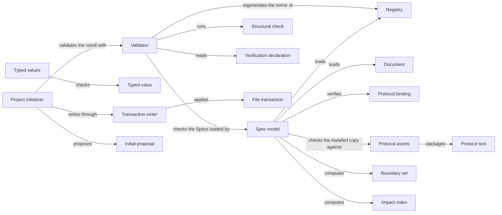

# Spec tooling

## Purpose

Spec tooling is Concorde's implementation of the Spec Protocol. It loads a project's Specs, checks
them against the Protocol and Concorde's few added conventions, and computes from the declarations
what a task bound to a Module may read and write and whom a change concerns. The Harness bounds
Agent calls with its sets, the providers ask it whom a change concerns, Views publishes its model,
and the developer runs its validator. It also keeps the registry in step with the entries, creates
a new project's first Spec through `concorde-init`, provides typed JSON values and all-or-nothing
file writes, and keeps the Protocol text. It depends on no other Module. It does not judge whether
a Spec explains enough or code keeps a promise, does not decide or enforce a task's boundary, holds
no other Module's schemas or policies, and neither runs configured checks nor reads Issue records.

## Terminology

| Term | Definition |
| --- | --- |
| Registry | The project-wide index of Modules, which mirrors every Module's `module` block and is never itself a place where relations are declared. |
| Document | One registered Markdown reading file together with its `.md.json` metadata file, which share one identity and one owning Module. |
| Protocol binding | The project configuration's explicit acceptance of one installed Spec Protocol copy, recorded as its version and the digest of its manifest. |
| Structural check | One decidable rule of the Spec Protocol or of Concorde's Spec conventions, named by a rule identity and carrying the severity error or warning. |
| Boundary set | One of the five sets the Protocol derives for a Module: its Spec context, external context, implementation context, Spec scope or implementation scope. |
| Impact index | A derived reverse lookup that tells which Modules a change to a document, node, contract or file concerns. |
| Verification declaration | A statement in a test's own source that names the scenario identities the test verifies. |
| Typed value | A versioned JSON record `{type_id, schema_version, data}` whose data is checked against the schema its owner registered for that type. |
| File transaction | A set of whole-file writes, each bound to the digest of the bytes it replaces, that is applied completely or not at all. |
| Initial proposal | The exact files that `concorde-init` offers for a new project before anything is written. |
| [Module](../vocabulary.md#concept.concorde.module) | |
| [Spec](../vocabulary.md#concept.concorde.spec) | |
| [Spec context](../vocabulary.md#concept.concorde.spec-context) | |
| [Implementation context](../vocabulary.md#concept.concorde.implementation-context) | |
| [Boundary](../vocabulary.md#concept.concorde.boundary) | |
| [Evidence](../vocabulary.md#concept.concorde.evidence) | |
| [Developer](../vocabulary.md#concept.concorde.developer) | |
| [Host](../vocabulary.md#concept.concorde.host) | |
| [Capability](../vocabulary.md#concept.concorde.capability) | |

Everything is computed from the registry and the documents. Boundary sets and impact indexes are
what the Harness and the providers ask for; typed values and file transactions are shared services.

## Usage

Every Concorde program that needs the Specs loads them: the configuration `.concorde/config.json`,
the Protocol binding, the **registry** `.concorde/specs.json`, and each Module's entry with the
documents it registers. The registry lists which Modules exist and mirrors each entry's `module`
block (title, owned documents, relations); the entry is where those are declared. A **document** is
always a Markdown file and its `.md.json` companion, owned, selected and digested together. Nothing
unregistered is read as a Spec, and a link never adds a document. A loaded repository is an
immutable snapshot that never writes.

The **Protocol binding** is the configuration's acceptance of the installed Protocol copy under
`.concorde/protocol/`, by version and manifest digest. Loading refuses a project whose binding,
copy or package Protocol disagree (`protocol_mismatch`), so a newer installation changes the rules
only when the developer accepts it through `concorde-configure`.

`python3 scripts/concorde.py validate`, or the validator called from code, evaluates every
**structural check** of the Protocol plus Concorde's link, coverage and configured-check-input
checks, and reports every finding it can establish in one run, each with its rule, severity, file
and remediation. Errors make the result `invalid`; warnings do not. Success is evidence about
structure only, and the result says so. [What validation tells you](validation.md) explains the
families and what is left to configured checks.

Coverage comes from the tests: a test names the scenarios it verifies in its own source with a
**verification declaration**, which the validator reads by parsing, never running, the bound tests.
The Python and TypeScript syntax is in [the interface definitions](contracts.md#verification-declarations).
An unknown scenario is an error; an undeclared scenario of a Module that binds files is a warning.

A task may change its own Module's `module` block but never the registry, so the mirror can go
stale (`CHK.registry.mirror`); `concorde.py registry --write` regenerates every record's mirrored
fields, title included, and `--check` only reports. Adding or removing a Module is a deliberate
registry edit.

The Harness asks for the **boundary sets** of the Modules a task is bound to: Spec context, external
context, implementation context (file names), Spec scope and implementation scope. Selection is one
level deep, `relies_on` narrows a `uses` to the provider's entry and the defining documents, and a
scenario query returns its owner's whole context. The **impact indexes** answer whom a change
concerns: `selected-by`, `referenced-by`, `implemented-by`, binding Modules and changed definitions
between two revisions. They never widen a boundary; sharing a file with another Module adds nothing
to a Spec context, and binding a writing task to every binding Module is the caller's job. Change
scope, review impact and edited Modules are policies of Planning, Review and Validation.

Every request, response and record crossing a capability or Agent boundary is a **typed value**
`{type_id, schema_version, data}`. Each owner registers its own types with a version and schema;
Spec tooling registers only its own and never imports an owner. A schema may name another
registered type, resolved when a value is checked. Checking is closed and offline, and registering
a name twice with a different schema is refused. See [typed values](contracts.md#typed-values).

A **file transaction** writes a set of files completely or not at all; each write names the digest
of the bytes it replaces, so a concurrent change stops it, and an optional final check can roll it
back. The same service confirms pending realization entries whose files now exist, which
Validation and Delivery call.

After installation the user session calls `concorde-init` with `action: "propose"`, a name and a
worker configuration, and receives the **initial proposal**: the exact configuration, registry and
root entry, nothing written yet. Calling it again with `action: "apply"` and that exact proposal
writes the files only if every destination is still absent and the project then validates. The
root entry says the project is not yet specified, and one realization, Existing project files,
binds the files the project already has. Initialization refuses a configured project
(`already_initialized`) and one without the installer's Protocol copy (`not_installed`).

## Design

One loader serves every query and check, and it refuses, for consumers, any project whose
structure cannot support a trustworthy boundary, while the validator collects the same problems as
findings. Spec tooling uses nothing: other Modules' schemas arrive through registration, their
file locations as arguments, and their concerns (Issue records, package consistency) as their own
configured checks. The reasons and the transitional files are in [How Spec tooling works](design.md).

The **Spec model** loads the registry and documents and computes every set and index from
declarations alone, never reading implementation contents.

The **Validator** evaluates every check over one loaded model, reads verification declarations and
configured-check inputs without running anything, and regenerates the registry mirror.

The **Typed values** hold the registration table, the closed offline checker, shared schema
building blocks, strict JSON, safe paths and the front-matter parser.

The **Transaction writer** applies digest-bound file transactions and confirms pending entries.

The **Project initializer** proposes and applies the first Spec behind `concorde-init`, a
deterministic capability that runs no model.

The **Protocol text** under `protocol/` is the standard itself; the **Protocol assets** are the
bundle sources and the tracked manifest from which Distribution renders the installed copy, which
carries only the Protocol.

The **Spec tests** exercise all of this on small fixture projects and provide the fixture builder
other Modules' tests use.

## Relationships

Spec tooling has no children and uses no Module, so every collaboration in the picture is internal:
the Validator checks what the Spec model loaded, and the initializer writes through the
Transaction writer and keeps its result only if the Validator passes it.

Most of Concorde depends on Spec tooling, and each consumer declares its own `uses` with the exact
promises it relies on: the Harness children compose contexts from boundary sets, check typed values
and write through transactions; providers ask the impact indexes and register their record types;
Validation and Delivery confirm pending entries; Issues registers its types; the Pi session,
Distribution and Views load the model, and Distribution renders and installs the Protocol copy.
None of these is a dependency of Spec tooling, so their changes never change what it promises.
