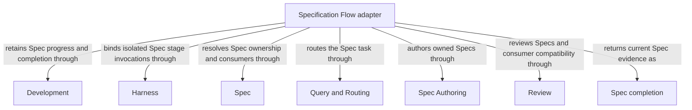

```concorde-document
{
  "id": "document.specify-loop.module",
  "owner": "module.specify-loop",
  "main_visible": true
}
```

# Specification Flow

## Usage & Contract

### Purpose

Specification Flow composes routing, Spec Authoring and Review to prepare or review one Module contract independently of implementation. It owns Spec-stage ordering, accepted-authoring reuse and Spec-review completion, and returns before planning or readiness.

### Usage

Choose `concorde-specify-loop` when you want to prepare or review a Module contract without yet
planning or implementing code. Supply a task, optional target/focus hints and constraints; the
Flow selects one owner, authors its documents and independently reviews the resulting contract
and affected consumers. A primary mutation requires the common committed-base session handoff.
Resume with the recorded change and compatible intent.

`specify=false` reviews the existing contract. `run_reviews=false` records a Spec review skip only
where no requirement already exists. Accepted authoring for the same intent and current review
evidence can be reused; an unrelated review cannot stand in for authoring. Missing meaning or a
blocking review stops for an explicit decision, without an automatic Spec-repair loop. Completion
returns Spec-stage artifacts and blockers, not tasks, code-check evidence, readiness or delivery.
Dev-loop can continue the same task/change afterward. See [specification flow](specify-loop.md)
for request fields, reuse and failure behavior.

### Requirements

#### req.development.specify-loop-boundary — Spec completion is independently available

Concorde-specify-loop SHALL complete Spec preparation independently of implementation readiness.

### Scenarios

#### scenario.development.specify-loop — Author and review a Spec independently

- GIVEN a developer supplies a Spec-writing or Spec-revision task and constraints
- WHEN concorde-specify-loop routes the owning Module and runs the selected Spec stages
- THEN only owned Spec replacements are accepted and independent reviews cover the complete contract and affected consumers
- AND successful stages return completed with artifact references, without planning, implementation, code checks, code review requirements or readiness
- AND specify=false skips authoring while run_reviews=false records a Spec review skip only where no requirement already exists
- AND a required review with blocking findings, gaps, incomplete coverage or failed execution stops with inspectable progress
- AND repeating the same intent resumes accepted authoring and current reviews, including when concorde-dev-loop calls specify-loop before continuing development

The detailed contract is [Independent Spec completion](specify-loop.md).

## Architecture & Realization

### Design

The [specification Flow](specify-loop.md#specification-flow-specify_flow) decides whether accepted
authoring can be reused, invokes Spec Authoring when needed, independently reviews missing/stale
owner or consumer evidence, and summarizes typed artifacts. Accepted candidate compatibility
reviews are rechecked against applied bytes rather than repeated blindly.

The candidate records authoring intent separately from review requirements. This prevents a
standalone review from substituting for authoring and makes prior required reviews sticky across
skips. There is no automatic Spec-repair edge and no implementation/readiness node; consumers decide
whether to continue into development.

### Entities

```concorde-entities
[
  {
    "id": "entity.specify-loop.adapter",
    "title": "Specification Flow adapter",
    "kind": "shared program",
    "responsibility": "Specification Flow composes routing, Spec Authoring and Review to prepare or review one Module contract independently of implementation. It owns Spec-stage ordering, accepted-authoring reuse and Spec-review completion, and returns before planning or readiness.",
    "files": [
      "capabilities/specify_loop.py",
      "tests/concorde/development/test_specify_loop.py",
      "tests/concorde/harness/test_worktree_lifecycle.py"
    ]
  },
  {
    "id": "entity.specify-loop.development",
    "title": "Development",
    "kind": "used module",
    "target_id": "module.development",
    "responsibility": "Admit or resume the Spec task, persist accepted authoring and Spec-review requirements and return completed or preserved blockers."
  },
  {
    "id": "entity.specify-loop.harness",
    "title": "Harness",
    "kind": "used module",
    "target_id": "module.harness",
    "responsibility": "Bind the router, author and each independent Spec reviewer to separate fresh Spec-only invocations."
  },
  {
    "id": "entity.specify-loop.spec",
    "title": "Spec",
    "kind": "used module",
    "target_id": "module.spec",
    "responsibility": "Resolve the owner's complete contract and old/candidate direct consumers affected by accepted Spec changes."
  },
  {
    "id": "entity.specify-loop.query-routing",
    "title": "Query and Routing",
    "kind": "used module",
    "target_id": "module.query-routing",
    "responsibility": "Select the owning Module for a new unbound Spec task while preserving the submitted intent and constraints."
  },
  {
    "id": "entity.specify-loop.spec-authoring",
    "title": "Spec Authoring",
    "kind": "used module",
    "target_id": "module.spec-authoring",
    "responsibility": "Produce complete replacements for owned Spec documents and return attributed gaps when necessary meaning is absent."
  },
  {
    "id": "entity.specify-loop.review",
    "title": "Review",
    "kind": "used module",
    "target_id": "module.review",
    "responsibility": "Independently review the complete current Spec and affected consumers with revision-bound coverage and findings."
  },
  {
    "id": "entity.specify-loop.completion",
    "title": "Spec completion",
    "kind": "record",
    "responsibility": "Current accepted authoring or explicit skip and current Spec review or admissible skip; no implementation readiness."
  }
]
```

### Relationships




### Dependencies and composition

```concorde-dependencies
[
  {
    "target_id": "module.development",
    "responsibility": "Admit or resume the Spec task, persist accepted authoring and Spec-review requirements and return completed or preserved blockers.",
    "selection_condition": "At Spec-flow entry, accepted authoring or review completion, skip recording and current-intent resume.",
    "relied_upon_promises": [
      "[Host admission](../development/interfaces.md#capability-execution-boundary); Recheck admitted intent and returned identities before accepting host state; a rejected result cannot advance the dependent step."
    ]
  },
  {
    "target_id": "module.harness",
    "responsibility": "Bind the router, author and each independent Spec reviewer to separate fresh Spec-only invocations.",
    "selection_condition": "When routing or a composed authoring/review stage requires an Agent; reviewers inherit no author artifacts.",
    "relied_upon_promises": [
      "[Complete context selection](../harness/context.md#contract.context.selection); Supply only mode-admitted inputs and require a matching completion; unavailable enforcement stops execution without a wider grant."
    ]
  },
  {
    "target_id": "module.spec",
    "responsibility": "Resolve the owner's complete contract and old/candidate direct consumers affected by accepted Spec changes.",
    "selection_condition": "When binding the Spec task, determining compatibility-review scope or rejecting stale saved evidence.",
    "relied_upon_promises": [
      "[Owner and context resolution](../spec/registry.md#stable-id-spec-context-queries); Reconstruct current resolutions after input changes; unresolved ownership, missing required definitions or stale revisions block dependent use."
    ]
  },
  {
    "target_id": "module.query-routing",
    "responsibility": "Select the owning Module for a new unbound Spec task while preserving the submitted intent and constraints.",
    "selection_condition": "When no trusted bound owner or compatible persisted owner is available.",
    "relied_upon_promises": [
      "[Explicit discovery and routing](../query-routing/query-and-routing.md); Preserve submitted task and constraints; accept only admitted selections and stop on gaps, ambiguity or discovery limits."
    ]
  },
  {
    "target_id": "module.spec-authoring",
    "responsibility": "Produce complete replacements for owned Spec documents and return attributed gaps when necessary meaning is absent.",
    "selection_condition": "When specify is enabled and accepted authoring for the same current intent is not already available.",
    "relied_upon_promises": [
      "[Owned replacement admission](../spec-authoring/authoring.md); Admit only owned current replacements; rejected output or necessary gaps stop dependent Spec completion."
    ]
  },
  {
    "target_id": "module.review",
    "responsibility": "Independently review the complete current Spec and affected consumers with revision-bound coverage and findings.",
    "selection_condition": "After accepted or explicitly skipped authoring when Spec review is enabled or already required.",
    "relied_upon_promises": [
      "[Independent review](../review/review.md); Supply the exact review intent and current scope; incomplete coverage, gaps or blocking findings cannot satisfy the required gate."
    ]
  }
]
```


### Realization and reuse limits

This Module and its consumers are siblings under Concorde Framework. Declared files explicitly
share the existing adapter realization with Development; no new runtime package, public Skill,
Agent grant or configurable arbitrary flow is created by this Spec boundary. Host admission,
phase artifacts and permissions remain mandatory. A new flow requires declared composition and
an implementation of its sequencing, artifact admission, recovery and completion policies before
it can execute. The existing host package still realizes common dispatch and provider internals.
