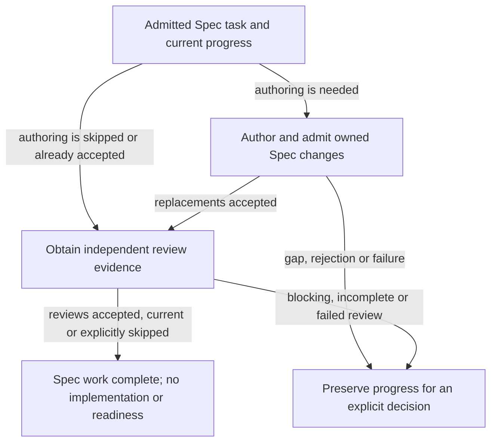
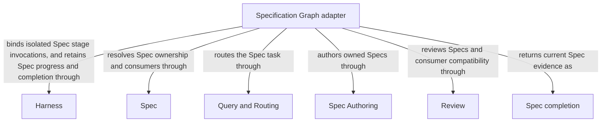

# Specification Graph

## Purpose

Specification Graph prepares or revises a Module’s specification and obtains independent review before any coding is required. It lets developers settle intended behavior first. Successful completion produces accepted Spec-stage work, not an implementation or a ready development candidate.

## Terminology

| Term | Meaning / definition |
| --- | --- |
| [Graph](../module.md#terminology) | Defined in Concorde Framework. |
| [Spec](../module.md#terminology) | Defined in Concorde Framework. |
| [Evidence](../module.md#terminology) | Defined in Concorde Framework. |
| [Candidate](../module.md#terminology) | Defined in Concorde Framework. |
| [Ready](../module.md#terminology) | Defined in Concorde Framework. |
| [Blocker](../module.md#terminology) | Defined in Concorde Framework. |
| [Module](../module.md#terminology) | Defined in Concorde Framework. |
| [Delivery](../module.md#terminology) | Defined in Concorde Framework. |

## Usage

Choose `concorde-specify-loop` when you want to prepare or review a Module contract without yet
planning or implementing code. Supply a task, optional target/focus hints and constraints. The host
first selects one owner; the specification Graph then authors its documents and independently
reviews the resulting contract and affected consumers. A primary mutation runs in the common committed-base candidate worktree
and returns its result here. Resume with the recorded change and compatible intent.

`specify=false` reviews the existing contract. `run_reviews=false` records a Spec review skip only
where no requirement already exists. Accepted authoring for the same intent and current review
evidence can be reused; an unrelated review cannot stand in for authoring. Missing meaning or a
blocking review stops for an explicit decision, without an automatic Spec-repair loop. Completion
returns Spec-stage artifacts and blockers, not tasks, code-check evidence, readiness or delivery.
[Development Graph](../dev-loop/module.md) can continue the same task/change afterward.

For example, clarifying which failures allow a retry can be completed here without also writing the
retry mechanism. The Development Graph may later use that current accepted Spec work for the same task and
change, rather than starting a second unrelated authoring attempt.

## Design

The [specification Graph](execution-reference.md#specify-loop-specification-graph-specify-graph) decides whether accepted
authoring can be reused, invokes [Spec Authoring](../spec-authoring/module.md) when needed, independently reviews missing/stale
owner or consumer evidence, and summarizes typed artifacts. Accepted candidate compatibility
reviews are rechecked against applied bytes rather than repeated blindly.

`concorde-specify-loop` runs as two Graphs in turn. First,
[target admission](../operations/execution-reference.md#graphs-target-admission-graph-target-graph)
binds a recorded owner or routes a new task through the
[discovery Graph](../query-routing/execution-reference.md#query-and-routing-discovery-graph-discovery-graph).
The specification Graph then runs four nodes. `initialize` and `summarize` are deterministic host
steps. `specify` is one spec-author worker, run as an
[Operation node](../harness/execution-reference.md#host-operation-node-operation-node), whose
replacements the owner's and each affected consumer's candidate reviews admit before they are
applied. `review_spec` runs a spec-reviewer for the owner and then for each consumer whose evidence
is missing or stale. Every node names its own successor. A stop passes through `summarize`, so a
stopped run still returns its artifacts and blockers; only a guard-caught error ends the Graph at
once.

The candidate records authoring intent separately from review requirements. This prevents a
standalone review from substituting for authoring and makes prior required reviews sticky across
skips. There is no automatic Spec-repair edge and no implementation/readiness node; consumers decide
whether to continue into development. Fresh author and reviewer invocations preserve independence
even when the host reuses current evidence.

### Flow overview

This conceptual view separates deciding whether authoring is needed from obtaining review evidence.
The boxes group responsibilities, not runtime nodes. Accepted authoring and current reviews can
be reused; an explicitly permitted review skip is recorded as a skip, never as a passing review.
A stopped review does not automatically launch another authoring attempt.

For State channels, node inputs/outputs and exact skip, reuse and stop conditions, open the
[full Specification Graph Spec](execution-reference.md#specify-loop-specification-graph-specify-graph).

## Relationships

The diagram shows the sibling operations that contribute to Spec completion. [Query and Routing](../query-routing/module.md)
selects an unbound owner, [Spec Module](../spec/module.md) resolves its contract and affected consumers, and the [Harness Module](../harness/module.md) keeps
routing, authoring and review invocations separate. Spec Authoring supplies owned replacements;
[Review Module](../review/module.md) independently assesses current contracts; [Harness admission](../harness/admission.md) retains accepted progress and review
requirements. The adapter owns their sequencing and reuse decisions, not their contracts, and
Spec completion does not imply planning, implementation or readiness.

### Harness

The Harness Module binds the router, author and each independent Spec reviewer to separate fresh Spec-only invocations.

This collaboration applies when routing or a composed authoring/review stage requires an Agent; reviewers inherit no author artifacts.

Admit or resume the Spec task, persist accepted authoring and Spec-review requirements and return completed or preserved blockers.

This collaboration applies at Spec-graph entry, accepted authoring or review completion, skip recording and current-intent resume.

- [Complete context selection](../harness/contracts.md#contract.context.selection); Supply only mode-admitted inputs and require a matching completion; unavailable enforcement stops execution without a wider grant.
- [Host admission](../harness/admission.md#operation-execution-boundary); Recheck admitted intent and returned identities before accepting host state; a rejected result cannot advance the dependent step.

### Spec

Resolve the owner's complete contract and old/candidate direct consumers affected by accepted Spec changes.

This collaboration applies when binding the Spec task, determining compatibility-review scope or rejecting stale saved evidence.

- [Owner and context resolution](../spec/contracts.md#registry-stable-id-spec-context-queries); Reconstruct current resolutions after input changes; unresolved ownership, missing required definitions or stale revisions block dependent use.

### Query and Routing

Select the owning Module for a new unbound Spec task while preserving the submitted intent and constraints.

This collaboration applies when no trusted bound owner or compatible persisted owner is available.

- [Explicit discovery and routing](../query-routing/module.md#usage); Preserve submitted task and constraints; accept only admitted selections and stop on gaps, ambiguity or discovery limits.

### Spec Authoring

Produce complete replacements for owned Spec documents and return attributed gaps when necessary meaning is absent.

This collaboration applies when specify is enabled and accepted authoring for the same current intent is not already available.

- [Owned replacement admission](../spec-authoring/module.md#usage); Admit only owned current replacements; rejected output or necessary gaps stop dependent Spec completion.

### Review

Independently review the complete current Spec and affected consumers with revision-bound coverage and findings.

This collaboration applies after accepted or explicitly skipped authoring when Spec review is enabled or already required.

- [Independent review](../review/module.md#usage); Supply the exact review intent and current scope; incomplete coverage, gaps or blocking findings cannot satisfy the required gate.

## Precise specifications

The Specification Graph Module owns the exact obligations and interface details in [requirements](requirements.md), [scenarios](scenarios.md) and the
[execution and record contracts](execution-reference.md#specify-loop-specification-graph).
These companions are part of the same complete Module specification, not separate topic owners.
