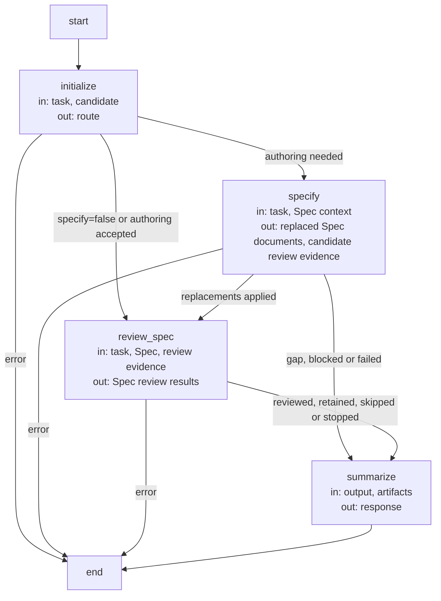

```concorde-document
{
  "id": "document.specify-loop.specify-loop",
  "owner": "module.specify-loop",
  "main_visible": true
}
```

# Specification Flow

## Usage & Contract

The [common invocation envelope](../development/interfaces.md#capability-execution-boundary),
[typed handoffs](../development/interfaces.md#stage-handoffs) and
[gap rules](../development/review-and-gaps.md) apply. Artifact references are host-issued paths
and exact digests; a valid shape alone does not establish currentness or authority.
`concorde-specify-loop` routes one owning Module, authors or revises its owned Spec documents
and independently reviews its complete context and affected consumers. It returns the common
stage response with `completed` after successful Spec stages, preserving artifacts, explicit
review skips and blockers. It never plans, writes code, runs code checks, requires code review,
marks ready or delivers. Repeated invocations retain accepted authoring for the same intent and
reuse only current review evidence. Necessary gaps and blocking reviews stop for Spec repair
with fresh context; there is no automatic Spec-repair edge. `specify=false` selects review of the
existing Spec, and `run_reviews=false` records only a Spec review skip where no requirement exists.


### Composition, state and recovery

The public request requires task and admits optional target/focus hints, constraints, change_id,
specify and run_reviews. Both booleans default true. New tasks use Query and Routing to select one
owner; a trusted bound caller preserves that owner. Mutating primary requests first use the common
host's isolated committed-base handoff. The recorded task, owner, focus and constraints bind resume;
incompatible intent or worktree identity is rejected before a worker starts.

Spec Authoring produces owned replacements; Review produces independent current coverage for the
complete contract and affected consumers. No author transcript or artifacts become reviewer input.
The affected-consumer compatibility reviews that admit a candidate before it is applied are
recorded under the consumer's review intent; because the applied bytes equal the reviewed bytes,
the review stage rechecks and reuses that evidence instead of reviewing the same consumer context
twice, and reviews only the owner and any consumer whose evidence is missing or stale.
An already accepted authoring result is reused only for the same intent; unrelated standalone
review never stands for authoring. Changed relevant inputs invalidate review. Spec review requirements
are sticky: run_reviews=false records skipped only when no requirement already exists. Skipped,
failed, incomplete and successful evidence remain distinct. The flow returns completed with the
common response and ArtifactRefs; it never requires code review, runs implementation checks or marks
ready. Dev-loop may consume that completed result without repeating accepted current Spec work.

## Architecture & Realization

### Specification Flow (`specify_flow`)

State: `output` (the last stage's typed response data), `artifacts` (every stage's artifact
references under a merge reducer), `result`. The candidate record carries the accepted authoring
(task, focus, constraints, Spec digest), the review requirements and intents, the owner's and
each consumer's review evidence and the gap history.

| Node | Executes | in | out |
| --- | --- | --- | --- |
| `initialize` | Deterministic: authoring is needed unless `specify=false` or the same intent was already accepted without an open gap. | task, candidate | route |
| `specify` | Spec Authoring: one spec-author invocation; the owner's and every affected consumer's candidate reviews admit the replacements before they are applied and are recorded for reuse. | task, Spec context | replaced Spec documents, candidate review evidence |
| `review_spec` | Independent Spec review of the owner and every consumer whose evidence is missing or stale; an explicit skip or fully current evidence is recorded instead. | task, Spec, review evidence | Spec review results |
| `summarize` | Deterministic: the capability response with every artifact reference. | output, artifacts | response |



There is no automatic Spec-repair edge. A necessary gap waits for explicit repair and fresh inputs;
blocking reviews, invalid output, failed execution, cancellation and limits preserve inspectable
progress with their distinct outcomes. Repeated unchanged blockers cannot imply completion.
The flow composes only the declared specify and review adapters. Its routing is the common
router service, not an additional callable query capability.
