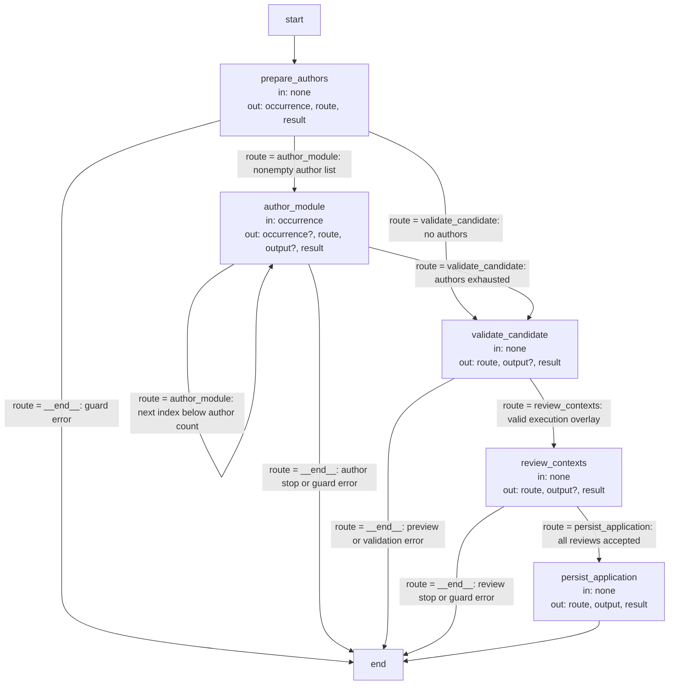
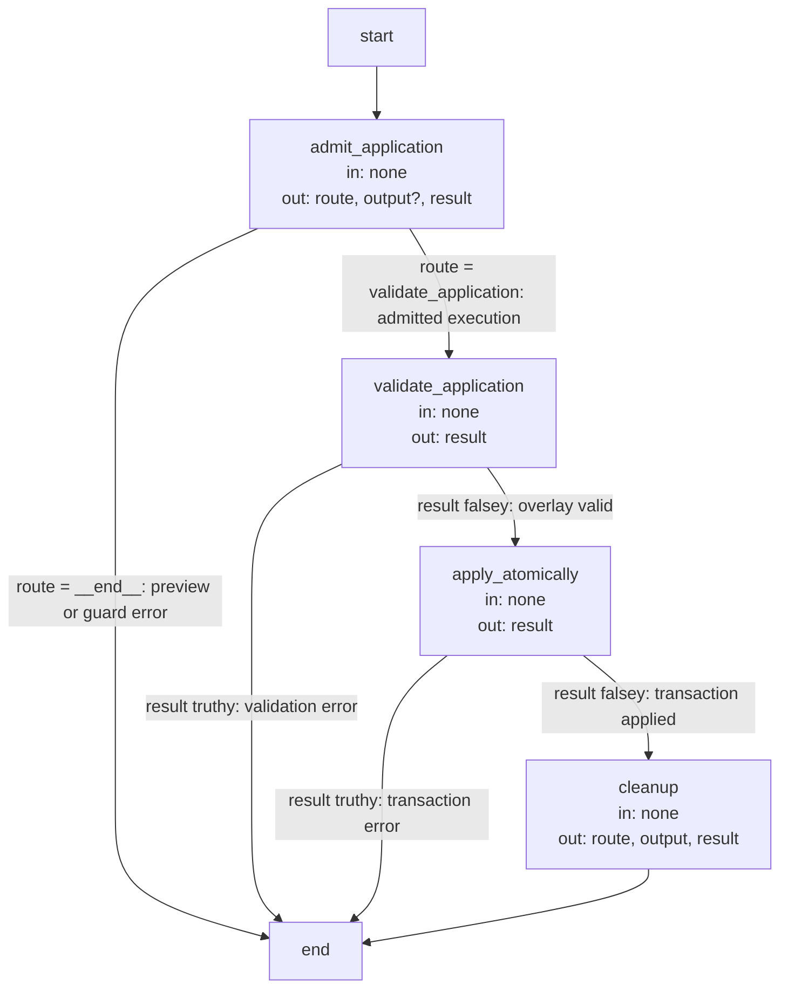

# Topology execution and record contracts

These are the precise implementation agreements and executable Graph specifications owned by the
[Topology Module](module.md). Explanatory topics introduce their purposes; exact identities, limits
and transitions are retained here as the single detailed contract.

## Terminology

| Term | Meaning / definition |
| --- | --- |
| [Module](../module.md#terminology) | Defined in Concorde Framework. |
| [Registry](../module.md#terminology) | Defined in Concorde Framework. |
| [Spec](../module.md#terminology) | Defined in Concorde Framework. |
| [Ownership](../spec/registry.md#terminology) | Defined in Registry. |
| [Reference](../spec/registry.md#terminology) | Defined in Registry. |
| [Graph](../module.md#terminology) | Defined in Concorde Framework. |
| [Operation](../module.md#terminology) | Defined in Concorde Framework. |
| [Harness](../module.md#terminology) | Defined in Concorde Framework. |
| [Host](../module.md#terminology) | Defined in Concorde Framework. |
| [Grant](../module.md#terminology) | Defined in Concorde Framework. |
| [Evidence](../module.md#terminology) | Defined in Concorde Framework. |
| [Protocol binding](../spec/values.md#terminology) | Defined in Identities and versions. |
| [Skill](../module.md#terminology) | Defined in Concorde Framework. |

## Topology evolution Graphs {#topology-topology-evolution-graphs}

Use these Graphs when registered targets, document ownership and references, shared truth or routing structure
must change together. The developer supplies intended behavior and constraints. Main designs a
candidate registry; fresh target-local authors supply the affected Specs after design acceptance.
A second acceptance binds the exact prepared transaction before application.

Human acceptance is a Graph control input tied to the exact design or prepared application. A
rejection may select another design or authoring loop, but cannot authorize the rejected effects.
The loop waits for a required decision and re-admits revised intent and current source identity.
Topology-designer and topology-author are separate model Operations with independent State contracts and Harness bindings.

### Design {#topology-design}

#### Topology preparation Graph (`topology_graph`) {#topology-topology-preparation-graph-topology-graph}

**State.** `occurrence` (the author being run), `route`, `output` (the main response), `result`.
All channels use replacement updates. `occurrence` is the integer index into the ordered authors.
The accepted design supplies the candidate registry and one Spec task per new or changed Module;
these, the ordered author list, collected replacements and validated overlay are Host/closure-held,
not State channels. `none` below means no Graph-channel read; `?` denotes a conditional update.
Admitted guards write `result=None` on success or a failure envelope and `route=__end__` on error.
A blocked author/review instead writes a business response to `output`, with `route=__end__`.

**Nodes.**

| Node | Executes | in | out |
| --- | --- | --- | --- |
| `prepare_authors` | Validates the Host-bound design/registry, holds ordered authors outside State and initializes occurrence to zero. | none | occurrence, route, result |
| `author_module` | Runs ordered_authors[occurrence] with its own candidate context; accumulates replacements outside State; increments occurrence only on success. | occurrence | occurrence?, route, output?, result |
| `validate_candidate` | Validates the complete closure-held overlay; describe-policy writes a preview response and stops without persistence. | none | route, output?, result |
| `review_contexts` | Calls sequential independent reviews for affected old/candidate contexts; retains evidence outside State or returns a blocking response. | none | route, output?, result |
| `persist_application` | Rechecks the proposal and stores exact registry/document bytes with before-digests for the second acceptance; returns its artifact reference. | none | route, output, result |

**Edges.** Every node except `persist_application` writes `route`, and a conditional edge follows
it. `prepare_authors` and `author_module` route to `author_module` while authors remain, which
makes authoring a loop of one author per pass, and to `validate_candidate` once every author has
completed. `validate_candidate` and `review_contexts` advance only on success. Any gap, failure,
invalid candidate or blocked review ends the Graph before an application is persisted. The author
loop uses `occurrence < len(ordered_authors)` after incrementing the index. Validation in
`describe-policy` also ends with `output.outcome=described`, rather than entering review.
All conditional edges read `state["route"]`; persistence writes `route=__end__` but its outgoing
edge is unconditional. Human acceptance is supplied by a subsequent Operation request, not a
hidden LangGraph interrupt or an edge from preparation into application.

#### Topology application Graph (`topology_apply_graph`) {#topology-topology-application-graph-topology-apply-graph}

**State.** `route`, `output` (the main response), `result` (guard failure or None), using
replacement updates. The shared TopologyState schema also admits `occurrence`, unused by this
Graph. The application reference, admitted transaction, registry, before-digests and changed-file
list are Host/closure-held inputs/effects. `validate_application` and `apply_atomically` return an
empty normal update: validation and file writes are not State channels; their guard still writes
`result`. `?` marks a preview-only response update.

**Nodes.**

| Node | Executes | in | out |
| --- | --- | --- | --- |
| `admit_application` | Validates the Host-bound reference, proposal area, design, base registry and Protocol; holds the transaction outside State or returns a preview. | none | route, output?, result |
| `validate_application` | Validates the closure-held complete overlay. | none | result |
| `apply_atomically` | Applies the closure-held transaction with before-digests and final validation, bound to the worktree's owning task; retains changed paths outside State. | none | result |
| `cleanup` | Removes consumed proposal artifacts and returns the applied-topology response with changed paths. | none | route, output, result |

**Edges.** `admit_application` writes `route`: an admitted application continues, while a policy
preview, a rejected or a stale application ends the Graph. After `validate_application` and after
`apply_atomically`, a conditional edge reads `result`, so a validation failure or a failed
transaction ends the Graph and success continues. `cleanup` always ends the Graph.

No target author writes project files. A gap or unresolved consumer compatibility leaves the
pre-design project unchanged. Prepared
artifacts contain full proposed bytes, but only their path/digest enters the topology designer's cognition.
Application is one host transaction with current before-digests and final repository validation.

Every new Concorde Module includes a local `module.md` with an inline Mermaid entity diagram
whose `accTitle` and `accDescr` describe it for readers who cannot see it. Its author returns the
complete registered Markdown replacements, including diagram fences. The host checks all proposed
files as one overlay before exposing the prepared application. Diagram content cannot widen Spec
membership or agent permissions. Only the sole owner proposes shared source bytes; all affected consumers receive separate compatibility checks.

## Realization and reuse limits

This Module and its consumers are siblings under Concorde Framework. Its behavior is realized in
its own package `src/concorde/topology/`, bound by its adapter entity together with its `operations/` declaration; this Spec boundary
creates no public Skill, Agent grant or configurable arbitrary graph. Host admission, phase
artifacts and permissions remain mandatory. A new graph requires declared composition and an
implementation of its sequencing, artifact admission, recovery and completion policies before it
can execute. [Harness admission](../harness/admission.md) realizes the common entry and invocation
host, and [Operations](../operations/execution-reference.md#graphs-dispatch-graphs) the dispatch
that reaches this provider.
