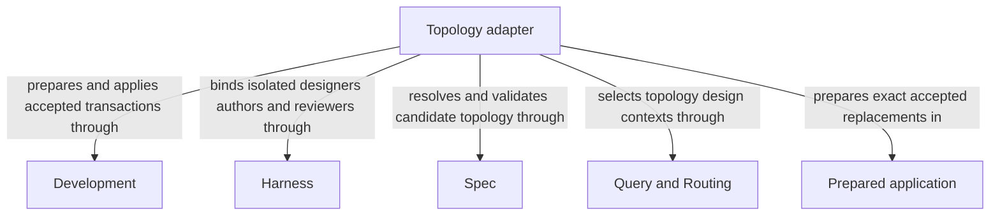

# Topology

## Purpose

Topology designs, prepares and atomically applies changes to registered Module structure and owned definitions. It serves developers evolving ownership, references, dependencies and file bindings through the existing accepted design and application boundaries.

## Usage

Use the topology actions of `concorde-main` when Module ownership, references, composition,
dependencies or file bindings must change together. Supply intended behavior and constraints to
design-topology. Review the proposed registry before accept-topology prepares owned Specs and
compatibility evidence; review that exact prepared application before apply-topology changes files.
The two acceptances concern different artifacts and neither can be inferred from elapsed time.

Authors receive their own candidate contexts and may replace only candidate-owned documents.
A shared definition is authored once; affected consumers are reviewed independently. Rejected,
stale or conflicting input leaves the pre-application project unchanged rather than partially
changing ownership. New Modules need usable external contracts and internal designs, not merely
new directories. The existing main adapter supplies these actions without adding a new callable
flow entry. See [topology](topology.md) for preparation, application and recovery.

## Design

Preparation orders candidate authors so providers precede consumers, validates the complete
overlay and obtains independent affected-context reviews before persisting an exact application.
Application then rechecks the accepted artifact, registry/Protocol identity and every before-digest
before one transaction. [Topology Flows](topology.md#design) expose those distinct
boundaries and stop conditions.

Each candidate definition has one author/owner. Comparing old and candidate contexts captures
consumers affected by reference or ownership changes even when the path set is unchanged. Keeping
prepared bytes separate from accepted effects supports the external two-acceptance and no-partial-
application promises; it does not add arbitrary flow configuration or provider write grants.

## Relationships

This diagram separates preparing a topology change from applying the Prepared application. Query
and Routing supplies explicit discovery, Spec resolves old and candidate ownership and references,
and Harness isolates designers, owner-local authors and independent reviewers. Development retains
the exact proposal and applies only the accepted transaction. These provider collaborations do not
transfer document ownership to Topology or turn a designer's proposed paths into write authority.

### Development

Admit topology actions and exact acceptance artifacts, store before-digest-bound applications and apply accepted replacements atomically.

This collaboration applies when design-topology, accept-topology or apply-topology crosses its existing host boundary.

- [Host admission](../development/interfaces.md#capability-execution-boundary); Recheck admitted intent and returned identities before accepting host state; a rejected result cannot advance the dependent step.

### Harness

Run an isolated topology designer and separate candidate-local Spec authors and compatibility reviewers under their own contexts.

During design and accepted preparation, before each fresh topology designer, author or consumer-review invocation.

- [Explicit complete-context discovery](../harness/contracts.md#context-global-spec-context-assembly); Supply only mode-admitted inputs and require a matching completion; unavailable enforcement stops execution without a wider grant.

### Spec

Resolve registry ownership and old/candidate contexts and validate the combined registry and document overlay.

This collaboration applies when forming a candidate topology, finding affected consumers or validating the exact prepared application.

- [Owner and context resolution](../spec/contracts.md#registry-stable-id-spec-context-queries); Reconstruct current resolutions after input changes; unresolved ownership, missing required definitions or stale revisions block dependent use.
- [Structural validation](../spec/scenarios.md#scenario.spec.validate-success); require consistent registered state without claiming semantic completeness.

### Query and Routing

Supply explicit complete-context discovery for topology design without reading implementation to infer missing contracts.

This collaboration applies when design-topology selects or expands the complete Module contexts needed to propose a registry.

- [Explicit discovery and routing](../query-routing/query-and-routing.md); Preserve submitted task and constraints; accept only admitted selections and stop on gaps, ambiguity or discovery limits.

## Realization and reuse limits

This Module and its consumers are siblings under Concorde Framework. Declared files explicitly
share the existing adapter realization with Development; no new runtime package, public Skill,
Agent grant or configurable arbitrary flow is created by this Spec boundary. Host admission,
phase artifacts and permissions remain mandatory. A new flow requires declared composition and
an implementation of its sequencing, artifact admission, recovery and completion policies before
it can execute. The existing host package still realizes common dispatch and provider internals.

## Precise specifications

The Topology Module owns the exact obligations and interface details in [requirements](requirements.md), [scenarios](scenarios.md).
These companions are part of the same complete Module specification, not separate topic owners.
