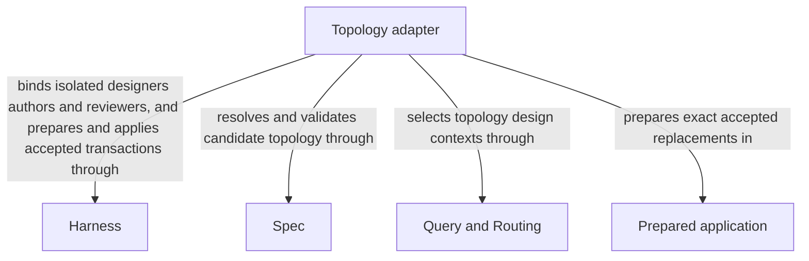

# Topology

## Purpose

Topology changes the declared responsibility structure of a project: Module ownership, composition, references and file bindings. It prepares consistent changes for review before applying them together. Developers use it when boundaries must change, not just when editing the behavior of one existing Module.

## Terminology

| Term | Meaning / definition |
| --- | --- |
| [Module](../module.md#terminology) | Defined in Concorde Framework. |
| [Registry](../module.md#terminology) | Defined in Concorde Framework. |
| [Spec](../module.md#terminology) | Defined in Concorde Framework. |
| [Ownership](../spec/registry.md#terminology) | Defined in Registry. |
| [Composition](../spec/registry.md#terminology) | Defined in Registry. |
| [Reference](../spec/registry.md#terminology) | Defined in Registry. |
| [Implementation binding](../spec/registry.md#terminology) | Defined in Registry. |
| [Protocol binding](../spec/values.md#terminology) | Defined in Identities and versions. |
| [Evidence](../module.md#terminology) | Defined in Concorde Framework. |
| [Graph](../module.md#terminology) | Defined in Concorde Framework. |
| [Grant](../module.md#terminology) | Defined in Concorde Framework. |

## Usage

Use the topology actions of `concorde-main` when Module ownership, references, composition,
dependencies or file bindings must change together. Supply intended behavior and constraints to
design-topology. Review the proposed registry before accept-topology prepares owned Specs and
compatibility evidence; review that exact prepared application before apply-topology changes files.
The two acceptances concern different artifacts and neither can be inferred from elapsed time.

Authors receive their own candidate contexts and may replace only candidate-owned documents;
they cannot read implementation to fill missing meaning. A shared definition is authored once;
affected consumers are reviewed independently. Rejected,
stale or conflicting input leaves the pre-application project unchanged rather than partially
changing ownership. New Modules need usable external contracts and internal designs, not merely
new directories. The existing main adapter supplies these actions without adding a new callable
graph entry.

For example, moving a shared interface from one owner to another requires more than moving a file.
Its stable identity must remain unique, its consumers must include the new canonical unit, and their
local obligations must still make sense. Consumers do not copy it into competing contracts.

### Two decisions

This conceptual view explains the two human decisions, not the runtime's exact nodes or error edges.
The [executable Graph](execution-reference.md#topology-topology-preparation-graph-topology-graph)
is defined once in Implementation Specs.

```mermaid
flowchart LR
    accTitle: Two acceptances for a topology change
    accDescr: Agree on the responsibility design, prepare and review the affected specifications, then approve and apply the exact edits.
    design["Propose responsibilities"]
    agree["Accept the design"]
    prepare["Prepare and review Specs"]
    approve["Accept exact edits"]
    apply["Apply together"]
    design -->|developer decides| agree
    agree -->|authors and reviewers work| prepare
    prepare -->|developer inspects| approve
    approve -->|host verifies and writes| apply
```

## Design

Preparation orders candidate authors so providers precede consumers, validates the complete
overlay and obtains independent affected-context reviews before persisting an exact application.
Application then rechecks the accepted artifact, registry/Protocol identity and every before-digest
before one transaction. [Topology Graphs](execution-reference.md#topology-design) expose those distinct
boundaries and stop conditions.

Each `concorde-main` topology action runs its own Graph. `design-topology` runs the
[query Graph](../query-routing/execution-reference.md#query-and-routing-query-graph-query-graph),
whose `decide` node is the topology-designer worker. `accept-topology` runs the
[topology preparation Graph](execution-reference.md#topology-topology-preparation-graph-topology-graph),
whose `author_module` node runs one topology-author worker per new or changed Module, each as an
[Operation node](../harness/execution-reference.md#host-operation-node-operation-node).
`apply-topology` runs the
[topology application Graph](execution-reference.md#topology-topology-application-graph-topology-apply-graph),
whose nodes are all deterministic.

Each candidate definition has one author/owner. Comparing old and candidate contexts captures
consumers affected by reference or ownership changes even when the path set is unchanged. Keeping
prepared bytes separate from accepted effects lets validation and review find conflicts without
exposing a half-updated registry. Rechecking inputs prevents an old proposal from overwriting a
later edit. These boundaries support the two-acceptance and no-partial-application promises; they
do not add arbitrary graph configuration or provider write grants.

## Relationships

This diagram separates preparing a topology change from applying the Prepared application. [Query and Routing](../query-routing/module.md) supplies explicit discovery, [Spec Module](../spec/module.md) resolves old and candidate ownership and references,
and [Harness Module](../harness/module.md) isolates designers, owner-local authors and independent reviewers. [Harness admission](../harness/admission.md) retains
the exact proposal and applies only the accepted transaction. These provider collaborations do not
transfer document ownership to Topology or turn a designer's proposed paths into write authority.

### Harness

Run an isolated topology designer and separate candidate-local Spec authors and compatibility reviewers under their own contexts.

During design and accepted preparation, before each fresh topology designer, author or consumer-review invocation.

Admit topology actions and exact acceptance artifacts, store before-digest-bound applications and apply accepted replacements atomically.

This collaboration applies when design-topology, accept-topology or apply-topology crosses its existing host boundary.

- [Explicit complete-context discovery](../harness/contracts.md#context-global-spec-context-assembly); Supply only mode-admitted inputs and require a matching completion; unavailable enforcement stops execution without a wider grant.
- [Host admission](../harness/admission.md#operation-execution-boundary); Recheck admitted intent and returned identities before accepting host state; a rejected result cannot advance the dependent step.

### Spec

Resolve registry ownership and old/candidate contexts and validate the combined registry and document overlay.

This collaboration applies when forming a candidate topology, finding affected consumers or validating the exact prepared application.

- [Owner and context resolution](../spec/contracts.md#registry-stable-id-spec-context-queries); Reconstruct current resolutions after input changes; unresolved ownership, missing required definitions or stale revisions block dependent use.
- [Structural validation](../spec/scenarios.md#scenario.spec.validate-success); require consistent registered state without claiming semantic completeness.

### Query and Routing

Supply explicit complete-context discovery for topology design without reading implementation to infer missing contracts.

This collaboration applies when design-topology selects or expands the complete Module contexts needed to propose a registry.

- [Explicit discovery and routing](../query-routing/module.md#usage); Preserve submitted task and constraints; accept only admitted selections and stop on gaps, ambiguity or discovery limits.

## Precise specifications

The Topology Module owns the exact obligations and interface details in [requirements](requirements.md), [scenarios](scenarios.md) and the
[execution and record contracts](execution-reference.md#topology-topology-evolution-graphs).
These companions are part of the same complete Module specification, not separate topic owners.
