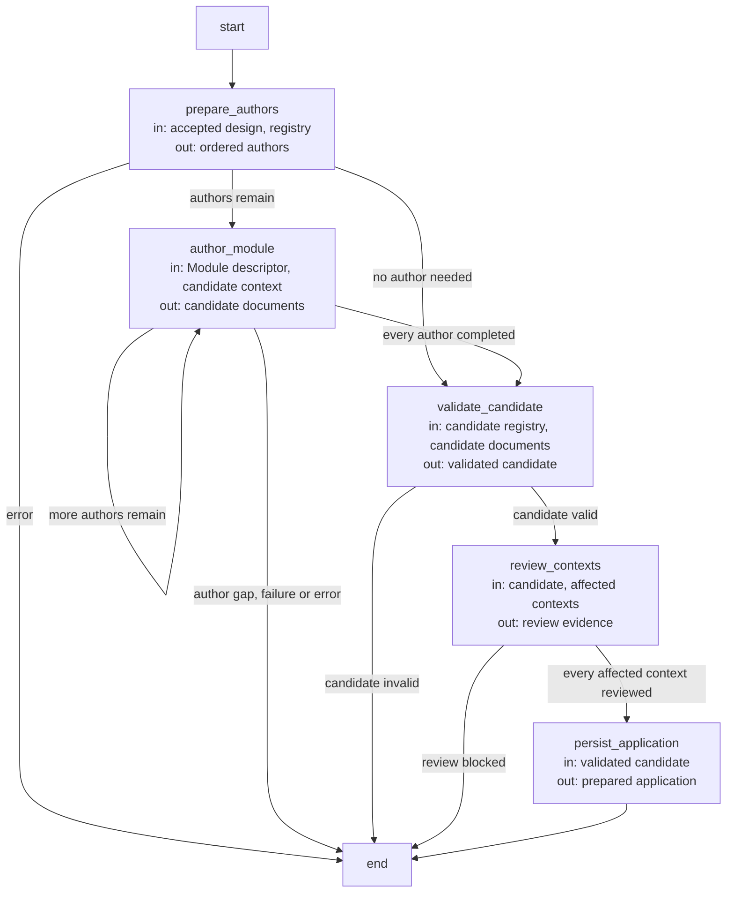
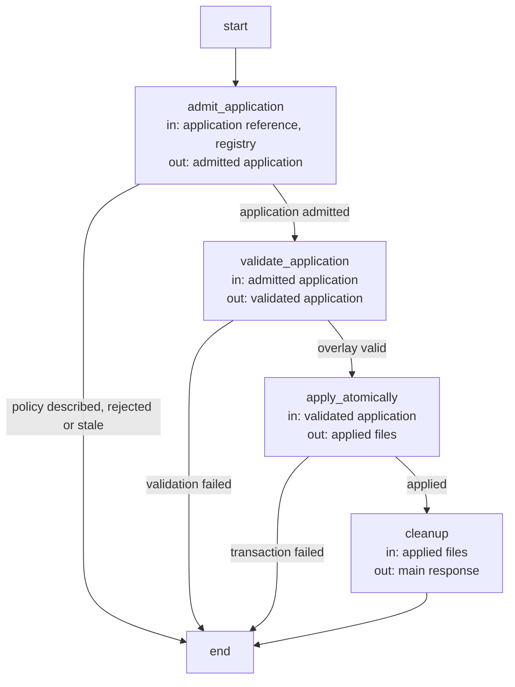

# Topology evolution Agent Flow

Use this Flow when registered targets, document ownership and references, shared truth or routing structure
must change together. The developer supplies intended behavior and constraints. Main designs a
candidate registry; fresh target-local authors supply the affected Specs after design acceptance.
A second acceptance binds the exact prepared transaction before application.

Human acceptance is a Flow control input tied to the exact design or prepared application. A
rejection may select another design or authoring loop, but cannot authorize the rejected effects.
The loop waits for a required decision and re-admits revised intent and current source identity.
Topology-designer and target-author invocations retain separate Agent definitions and Harness bindings.

## Design

### Topology preparation Flow (`topology_flow`)

State: `occurrence` (the author being run), `route`, `output` (the main response), `result`.
The accepted design supplies the candidate registry and one Spec task per new or changed Module.

| Node | Executes | in | out |
| --- | --- | --- | --- |
| `prepare_authors` | Deterministic: validates the accepted design against the current registry and orders the target-local authors so providers precede consumers. | accepted design, registry | ordered authors |
| `author_module` | One topology-author invocation for the current author; its replacements join the candidate overlay. | Module descriptor, candidate context | candidate documents |
| `validate_candidate` | Deterministic repository validation of the complete candidate overlay. | candidate registry, candidate documents | validated candidate |
| `review_contexts` | Sequential work items: every affected old or candidate context receives an independent Spec compatibility review. | candidate, affected contexts | review evidence |
| `persist_application` | Deterministic: the exact prepared application (registry and document bytes with before-digests) is written for the second acceptance. | validated candidate | prepared application |

### Topology application Flow (`topology_apply_flow`)

State: `route`, `output`, `result`.

| Node | Executes | in | out |
| --- | --- | --- | --- |
| `admit_application` | Deterministic: the referenced application is inside the proposal area, matches the accepted design, base registry and Protocol binding; describe-policy stops here. | application reference, registry | admitted application |
| `validate_application` | Deterministic validation of the application's complete overlay. | admitted application | validated application |
| `apply_atomically` | Deterministic: one file transaction with before-digests and final repository validation, bound to this worktree's owning task. | validated application | applied files |
| `cleanup` | Deterministic: removes the consumed proposal artifacts and records the applied topology. | applied files | main response |

No target author writes project files. A gap or unresolved consumer compatibility leaves the
pre-design project unchanged. Prepared
artifacts contain full proposed bytes, but only their path/digest enters the topology designer's cognition.
Application is one host transaction with current before-digests and final repository validation.

Every new Concorde Module includes a local `module.md` with an inline Mermaid entity diagram
whose `accTitle` and `accDescr` describe it for readers who cannot see it. Its author returns the
complete registered Markdown replacements, including diagram fences. The host checks all proposed
files as one overlay before exposing the prepared application. Diagram content cannot widen Spec
membership or agent permissions. Only the sole owner proposes shared source bytes; all affected consumers receive separate compatibility checks.
