# Changing responsibility boundaries

Use Topology when Module ownership, references, dependencies or implementation bindings must change
together. It separates agreeing on the design from approving the exact project edits.

## Terminology

| Term | Meaning / definition |
| --- | --- |
| [Module](../concepts.md#terminology) | Defined in Concepts for reading Concorde. |
| [Registry](../concepts.md#terminology) | Defined in Concepts for reading Concorde. |
| [Ownership](../spec/registry.md#terminology) | Defined in Registry. |
| [Reference](../spec/registry.md#terminology) | Defined in Registry. |
| [Implementation binding](../spec/registry.md#terminology) | Defined in Registry. |
| [Host](../concepts.md#terminology) | Defined in Concepts for reading Concorde. |
| [Flow](../concepts.md#terminology) | Defined in Concepts for reading Concorde. |

## Two decisions

First, the developer reviews a proposed arrangement of responsibilities. After that design is
accepted, separate authors update their own Module Specs and the host checks the combined candidate.
Affected consumers receive independent compatibility review. A second acceptance approves the exact
prepared file changes, which the host then applies together.

For example, moving a shared interface from one owner to another requires more than moving a file.
Its stable identity must remain unique, its consumers must include the new canonical unit, and their
local obligations must still make sense. One owner authors the shared definition; consumers do not
each copy it into a competing contract.

## Conceptual decision path

This view explains the two human decisions, not the runtime's exact nodes or error edges. The
[executable Flow](execution-reference.md#topology-topology-preparation-flow-topology-flow) is defined once in Implementation Specs.

```mermaid
flowchart LR
    accTitle: Two acceptances for a topology change
    accDescr: Agree on the responsibility design, prepare and review the affected specifications, then approve and apply the exact edits.
    design["Propose responsibilities"]
    agree["Accept the design"]
    prepare["Prepare and review Specs"]
    approve["Accept exact edits"]
    apply["Apply together"]
    design -->|developer decides| agree
    agree -->|authors and reviewers work| prepare
    prepare -->|developer inspects| approve
    approve -->|host verifies and writes| apply
```

## Why preparation does not immediately apply

A valid-looking diagram does not prove that all documents agree. Preparing complete changes before
application lets validation and review find conflicts without exposing a half-updated registry.
Rechecking the accepted inputs before the atomic write prevents a later edit from being overwritten
by an old proposal. A rejection preserves the pre-application project.

Authors cannot write another owner's documents or read its implementation to fill missing meaning.
The exact preparation/application Flows and before-state records are in Implementation Specs. The
conceptual sequence here explains the two acceptances, not another executable topology.

## Precise specifications

See the Module-owned [execution and record contracts](execution-reference.md#topology-topology-evolution-agent-flow).
The exact obligations remain in Implementation Specs; this topic explains their purpose and use.
