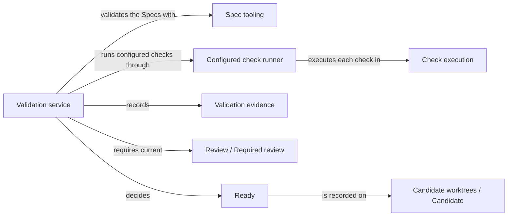

# Validation

## Purpose

Validation decides whether a candidate change is ready to be delivered. It checks the Specs'
structure, runs the project's configured checks against the candidate's current files, and then
confirms that the change's own gates hold: accepted tasks are complete, required reviews are current
and no task blocker is open. The user session calls it after implementing or editing a change;
Delivery calls its completion check again before publishing. Validation runs no model, repairs
nothing and delivers nothing. A ready candidate has passed deterministic gates for its exact bytes;
that is not proof that its Specs or code are semantically complete.

## Terminology

| Term | Definition |
| --- | --- |
| Ready | The state of a candidate whose current Spec validation, configured checks, accepted tasks, required reviews and task blockers all satisfy its gates for its exact current files. |
| Validation evidence | The recorded Spec validation and configured check results of a candidate, each bound to digests of the inputs it examined. |
| Affected Module | A Module whose realizations bind a file that the validated Module also binds, so its checks run too. |
| Direct candidate | A candidate whose change records no planned Module work, typically because the user session edited it directly. |
| [Module](../vocabulary.md#concept.concorde.module) | |
| [Spec](../vocabulary.md#concept.concorde.spec) | |
| [Capability](../vocabulary.md#concept.concorde.capability) | |
| [Host](../vocabulary.md#concept.concorde.host) | |
| [Evidence](../vocabulary.md#concept.concorde.evidence) | |
| [Candidate](../harness/worktrees/module.md#concept.worktrees.candidate) | |
| [Task](../planning/module.md#concept.planning.task) | |
| [Blocker](../issues/module.md#concept.issues.blocker) | |
| [Required review](../review/module.md#concept.review.required-review) | |

## Usage

The user session calls `concorde-validate` in the candidate's worktree with `target_id` (the Module
the change is about), `task`, and optionally `focus_id`, `constraints`, `change_id` and `run_checks`
(default `true`). Validation is a Host service: it starts no worker and selects no model context.

For example, after `concorde-implement` finished the accepted tasks of `module.transfer`, the user
session calls `concorde-validate` with the same task. Validation checks the Specs, finds that
`module.transfer` shares a file with `module.ledger`, runs the configured checks of both Modules,
verifies that the tasks are complete and the required reviews are current, and answers with outcome
`ready` and the check results. The candidate's status record now says it is ready and remembers the
exact file tree that was validated. Delivery can take it from there.

Before it checks anything, validation in a candidate confirms pending realization entries. A Spec
may declare a file as `pending` while it does not exist yet; once the file exists, the Protocol
requires the marker to go. So when the worktree has a change status record, the Host removes from
every realization's `pending` list each entry whose file or directory now exists, keeping the entry
itself bound. Only the metadata members of the affected documents change; reading prose is never
touched, and entries whose files are still missing stay pending. The confirmation becomes part of
the validated tree. In a directory without a change status record, pending entries are left alone
and an existing pending file is reported by structural validation.

The checks run are those of every affected Module, including the validated Module itself, because a
change to a shared file can break any Module that binds it. Each check result states the check,
its Module, `passed`, `failed` or `timeout`, the exit code, and digests of the check's inputs and its
log. The logs themselves stay in the Host's run records. The checks run in a sandbox that lets them
read the project but not write anything in it, so temporary files, caches and reports must go to the
scratch directories the sandbox provides.

Validation answers with one of these outcomes:

- `failed` when the Specs are structurally invalid or a check did not pass. The candidate is marked
  blocked and stays as it is for inspection.
- `ready` when every gate holds. The candidate's status becomes `ready` and its validated tree is
  recorded.
- `completed` with "semantic completeness is not proven" when the checks passed but the change
  still has unfinished accepted tasks, so it cannot be ready yet.

A gate that is not met stops the request with an error that names it, for example
`review_required` for a missing or stale required review, `spec_incomplete` for an open task
blocker, `incomplete_change` for unfinished tasks and `stale_evidence` when files changed while
validation ran.

A direct candidate needs no invented plan. When the user session edited Specs or code directly,
`concorde-validate` runs every configured check of the project, records the evidence against the
candidate's exact tree and marks it ready if every review the change has required is current. A
change with planned Module work cannot use this path to skip its unfinished tasks.

`run_checks: false` skips running the checks but never fakes them: a gate that needs check results
still fails when they are missing or stale. Repeating validation always recomputes against current
bytes; an earlier pass is not permanent. If the check sandbox cannot be set up, validation stops
with `check_sandbox_unavailable` and never runs the checks with fewer restrictions. The sandbox
currently needs Linux with a system bubblewrap and working namespace support.

## Design

The validation service separates collecting evidence from deciding readiness. Collecting evidence
checks Spec structure and runs checks; deciding readiness then reads that evidence together with
the change's task, review and blocker state. Keeping the two apart means a passing command can
never stand in for a missing review or an unfinished task, and the same completion check serves
both Validation and Delivery.

Every piece of evidence is bound to digests of what it examined. A check result is bound to the
check's command, its explicit input files, the implementation revision of its Module and the
sandbox policy. The recorded state also holds the Spec and implementation revisions of every
affected Module. Validation snapshots the candidate's file tree before and after running checks and
recomputes the affected revisions afterwards; a difference means someone changed the candidate
during validation, and the result is refused rather than recorded. Delivery later compares the
validated tree with the candidate's actual tree for the same reason.

Readiness is not transitive trust. When the change recorded component work, each component's own
completion is checked again with its own task, and a component whose Spec or implementation changed
since it completed stops readiness.

The configured check runner is the Host code that turns the project's check configuration into
sandboxed runs. It resolves each Module's checks, replaces a leading `{python}` with the Host's
interpreter, runs the command through Check execution, saves stdout and stderr as a private log,
and records the result. It also serves the same checks to implementation and code review workers
on request. This file is shared with Check execution, which owns the sandbox itself.

The validation tests cover check execution, gates and readiness on fixture projects, including
real sandboxed check runs.

Open questions. The Host's `defer_ready` switch, which stops a validation before marking the
candidate ready, is never set by any current caller.

## Relationships

The picture shows one validation request. Admission, task state and blockers are explained below.

**Spec tooling** loads the registry and checks structural conformance. Validation runs its structural
validation first and reports any error as outcome `failed`; it also asks Spec tooling which Modules bind
the validated Module's files. A structurally invalid project never reaches the checks.

**Check execution** runs one command with read-only access to the project, external scratch space
and a bounded process lifetime, and reports its output, exit code and timeout. Validation supplies
the command, the timeout and an environment whose `PYTHONPATH` points at the Concorde package, and
keeps the raw output private. When Check execution cannot provide its sandbox, Validation saves the
diagnostic log and stops with `check_sandbox_unavailable`.

**Candidate worktrees** keeps the status record of the [candidate](../harness/worktrees/module.md#concept.worktrees.candidate)
change and computes its file tree snapshot. Validation reads the recorded tasks, components,
blockers and earlier evidence from it and writes the new evidence, the phase and the `ready` status.
Validation of a direct candidate stores its evidence in the change's `validation` record.

**Request admission** receives the `concorde-validate` request, binds it to the candidate worktree
and wraps the answer. Validation relies on it to have selected the Module and the worktree before it
starts.

**Review** answers whether every [required review](../review/module.md#concept.review.required-review)
of the change is current, following [its currentness rule](../review/requirements.md#req.review.required-current).
Validation asks this first when deciding readiness and stops with `review_required` when the answer
is no. It never chooses new review requirements itself.

**Planning** writes the accepted [tasks](../planning/module.md#concept.planning.task) of a change.
Validation only reads whether every accepted task of the validated Module is marked complete and
stops with `incomplete_change` otherwise.

**Issues** records [blockers](../issues/module.md#concept.issues.blocker) against a task. An open
blocker for the validated Module's current task stops readiness with `spec_incomplete`; Validation
never closes a blocker because files changed.
