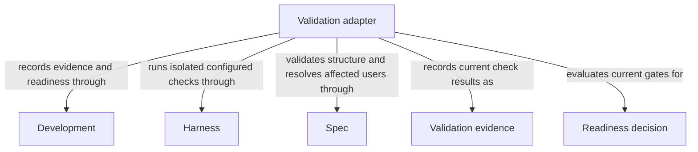

```concorde-document
{
  "id": "document.validation.module",
  "owner": "module.validation",
  "main_visible": true
}
```

# Validation

## Usage & Contract

### Purpose

Validation collects deterministic structural and configured implementation-check evidence for the current candidate and evaluates the applicable readiness gates. It serves explicit validation requests and composing flows; neither a development plan nor dev-loop invocation is universally required.

### Usage

Run `concorde-validate` for the current admitted candidate with target_id and task; optionally
choose whether to run configured checks. This deterministic capability launches no Agent. It
returns structural and configured-check evidence tied to current bytes and evaluates existing
readiness requirements. A directly authored candidate needs no invented plan or attempt; existing
authored tasks and required reviews still apply.

Omitting checks does not satisfy a gate whose evidence is missing or stale. Failed checks,
incomplete tasks or required reviews block ready while preserving the candidate. Repeating
validation evaluates current inputs; prior passing results are not permanent. Checks can read
project files but must write temporary output only to issued external scratch. Unsupported check
isolation fails closed with private diagnostics, not a less restricted fallback. Validation
neither repairs defects nor delivers a change, and structural success or scenario coverage does
not prove semantics. See [validation](validation.md) for results and operational prerequisites.

### Requirements


The consumer guarantees are stated by the scenarios below and their detailed contract.
### Scenarios

#### scenario.development.validate-ready — Deterministic checks record readiness

- GIVEN the current candidate
- WHEN `concorde-validate` runs
- THEN the host runs deterministic Spec validation and every configured implementation check of every affected Module, and records readiness evidence bound to the exact candidate bytes
- AND validation never claims semantic completeness

#### scenario.development.validate-blocked — A failed or stale check blocks readiness

- GIVEN a configured implementation check fails, is missing, or its previously recorded evidence no longer matches the current candidate bytes
- WHEN readiness is evaluated
- THEN the candidate is not recorded ready and the failing or stale check is reported

## Architecture & Realization

### Design

Validation resolves affected Spec consumers and changed-file users before collecting evidence.
The host admits configured commands and delegates execution to Harness's OS-enforced read-only
executor; only the outside host persists logs and digest-bound results. [Check execution](validation.md#configured-check-execution)
describes scratch, private diagnostics and concurrent-change rechecks.

Readiness combines current structural/check evidence with existing task completion and required
reviews, without inventing a plan for a manual candidate. Unavailable isolation fails closed.
This separation keeps a command's success from granting writes, proving semantics or bypassing a
previously required review.

### Entities

```concorde-entities
[
  {
    "id": "entity.validation.adapter",
    "title": "Validation adapter",
    "kind": "shared program",
    "responsibility": "Validation collects deterministic structural and configured implementation-check evidence for the current candidate and evaluates the applicable readiness gates. It serves explicit validation requests and composing flows; neither a development plan nor dev-loop invocation is universally required.",
    "files": [
      "capabilities/validate.py",
      "tests/concorde/development/test_check_execution.py",
      "tests/concorde/development/test_review.py",
      "tests/concorde/harness/test_scoped_protocol.py",
      "tests/concorde/harness/test_worktree_lifecycle.py"
    ]
  },
  {
    "id": "entity.validation.development",
    "title": "Development",
    "kind": "used module",
    "target_id": "module.development",
    "responsibility": "Admit deterministic validation requests, retain private check logs and store current candidate evidence and readiness decisions."
  },
  {
    "id": "entity.validation.harness",
    "title": "Harness",
    "kind": "used module",
    "target_id": "module.harness",
    "responsibility": "Execute configured checks with OS-enforced read-only project access, external scratch and bounded process-tree lifetime."
  },
  {
    "id": "entity.validation.spec",
    "title": "Spec",
    "kind": "used module",
    "target_id": "module.spec",
    "responsibility": "Validate Spec structure and resolve every affected contract consumer and implementation-file user for candidate checks."
  },
  {
    "id": "entity.validation.evidence",
    "title": "Validation evidence",
    "kind": "record",
    "responsibility": "Current Spec and configured-check evidence for each affected Module."
  },
  {
    "id": "entity.validation.readiness",
    "title": "Readiness decision",
    "kind": "record",
    "responsibility": "A host decision requiring task completion and all current required evidence."
  }
]
```

### Relationships

The diagram separates Validation evidence from the Readiness decision that consumes it. Spec
identifies affected consumers and checks structure, Harness executes admitted commands without
project writes, and Development records results and evaluates existing gates. A passing command
is evidence for its checked inputs, not permission to skip required reviews or a proof of semantic
completeness. These collaborations are capability dependencies; Validation does not own its providers.




### Internal constraints

#### req.development.check-isolation — Configured checks use enforced read-only execution

Validation SHALL execute configured checks through Harness's OS-enforced project-read-only executor.


### Internal verification scenarios

#### scenario.development.validate-check-isolation — Checks cannot write their inputs or host logs

- GIVEN a configured implementation check and the current candidate
- WHEN validation runs the check
- THEN project writes, including writes to lifecycle records and logs, are denied by Harness
- AND the outside host saves private stdout/stderr and records passed, failed or timeout evidence with exit and digest identities
- AND unavailable enforcement blocks readiness with check_sandbox_unavailable while raw diagnostics stay in the host log
- AND check input, candidate tree and affected Module freshness checks still reject external changes


The detailed contract is [Current deterministic evidence](validation.md).


### Dependencies and composition

```concorde-dependencies
[
  {
    "target_id": "module.development",
    "responsibility": "Admit deterministic validation requests, retain private check logs and store current candidate evidence and readiness decisions.",
    "selection_condition": "When validation is requested, check results are recorded or existing task and review gates are evaluated.",
    "relied_upon_promises": [
      "[Host admission](../development/interfaces.md#capability-execution-boundary); Recheck admitted intent and returned identities before accepting host state; a rejected result cannot advance the dependent step."
    ]
  },
  {
    "target_id": "module.harness",
    "responsibility": "Execute configured checks with OS-enforced read-only project access, external scratch and bounded process-tree lifetime.",
    "selection_condition": "When run_checks admits a configured command whose result is needed for candidate evidence.",
    "relied_upon_promises": [
      "[Isolated configured-check execution](../harness/execution.md#configured-deterministic-checks); Supply the registered command and timeout; keep raw diagnostics in host records and refuse checks when isolation is unavailable."
    ]
  },
  {
    "target_id": "module.spec",
    "responsibility": "Validate Spec structure and resolve every affected contract consumer and implementation-file user for candidate checks.",
    "selection_condition": "When computing structural evidence and the affected Module set for current validation.",
    "relied_upon_promises": [
      "[Owner and context resolution](../spec/registry.md#stable-id-spec-context-queries); Reconstruct current resolutions after input changes; unresolved ownership, missing required definitions or stale revisions block dependent use.",
      "[Structural validation](../spec/structure.md#scenario.spec.validate-success); require consistent registered state without claiming semantic completeness."
    ]
  }
]
```


### Realization and reuse limits

This Module and its consumers are siblings under Concorde Framework. Declared files explicitly
share the existing adapter realization with Development; no new runtime package, public Skill,
Agent grant or configurable arbitrary flow is created by this Spec boundary. Host admission,
phase artifacts and permissions remain mandatory. A new flow requires declared composition and
an implementation of its sequencing, artifact admission, recovery and completion policies before
it can execute. The existing host package still realizes common dispatch and provider internals.
