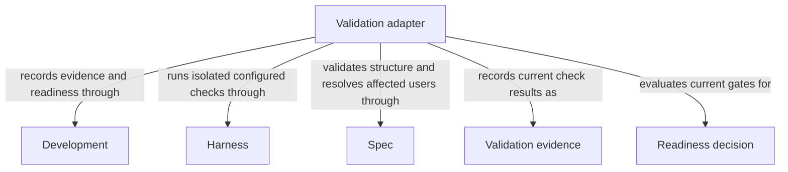

# Validation

## Purpose

Validation checks specification structure and runs configured verification commands against the current candidate. It uses those results and existing completion requirements to assess readiness. It does not repair failures or deliver the change.

## Terminology

| Term | Meaning / definition |
| --- | --- |
| [Candidate](../module.md#terminology) | Defined in Concorde Framework. |
| [Evidence](../module.md#terminology) | Defined in Concorde Framework. |
| [Ready](../module.md#terminology) | Defined in Concorde Framework. |
| [Spec](../module.md#terminology) | Defined in Concorde Framework. |
| [Host](../module.md#terminology) | Defined in Concorde Framework. |
| [Structural validation](../spec/structure.md#terminology) | Defined in What structural validation tells you. |
| [Semantic completeness](../spec/structure.md#terminology) | Defined in What structural validation tells you. |
| [Scenario](../module.md#terminology) | Defined in Concorde Framework. |
| [Operation](../module.md#terminology) | Defined in Concorde Framework. |

## Usage

Run `concorde-validate` for the current admitted candidate with target_id and task; optionally
choose whether to run configured checks. This deterministic operation launches no Agent. It
returns structural and configured-check evidence tied to current bytes and evaluates existing
readiness requirements. A directly authored candidate needs no invented plan or attempt; existing
authored tasks and required reviews still apply.

Omitting checks does not satisfy a gate whose evidence is missing or stale. Failed checks,
incomplete tasks or required reviews block ready while preserving the candidate. Repeating
validation evaluates current inputs; prior passing results are not permanent. Checks can read
project files but must write temporary output only to issued external scratch. Unsupported check
isolation fails closed with private diagnostics, not a less restricted fallback. Validation
neither repairs defects nor delivers a change, and structural success or scenario coverage does
not prove semantics.

For example, if code changes after a passing check, the old result is no longer evidence for those
new bytes. Validation recomputes or rechecks the relevant evidence before reporting readiness.

## Design

Validation resolves affected Spec consumers and changed-file users before collecting evidence.
The host admits configured commands and delegates execution to [Harness Module](../harness/module.md)'s OS-enforced read-only
executor; only the outside host persists logs and digest-bound results. [Check execution](execution-reference.md#validation-configured-check-execution)
describes scratch, private diagnostics and concurrent-change rechecks. Child processes share the
read-only boundary; caches and reports go to issued storage. Formatting source is an implementation
action, not something a check may silently do while claiming to verify the original bytes.

Currently the isolated runner requires Linux, system bubblewrap and working namespace/pidfd support.
If that boundary is unavailable, validation stops instead of running unrestricted commands.

Readiness combines current structural/check evidence with existing task completion and required
reviews, without inventing a plan for a manual candidate. Unavailable isolation fails closed.
This separation keeps a command's success from granting writes, proving semantics or bypassing a
previously required review.

## Relationships

The diagram separates Validation evidence from the Readiness decision that consumes it. The [Spec Module](../spec/module.md)
identifies affected consumers and checks structure, Harness executes admitted commands without
project writes, and [Development Module](../development/module.md) records results and evaluates existing gates. A passing command
is evidence for its checked inputs, not permission to skip required reviews or a proof of semantic
completeness. These collaborations are operation dependencies; Validation does not own its providers.

## Provider collaboration

Validation relies on these providers while retaining responsibility for its own readiness decision.

### Development

Admit deterministic validation requests, retain private check logs and store current candidate evidence and readiness decisions.

This collaboration applies when validation is requested, check results are recorded or existing task and review gates are evaluated.

- [Host admission](../development/interfaces.md#operation-execution-boundary); Recheck admitted intent and returned identities before accepting host state; a rejected result cannot advance the dependent step.

### Harness

Execute configured checks with OS-enforced read-only project access, external scratch and bounded process-tree lifetime.

This collaboration applies when run_checks admits a configured command whose result is needed for candidate evidence.

- [Isolated configured-check execution](../harness/execution-reference.md#execution-configured-deterministic-checks); Supply the registered command and timeout; keep raw diagnostics in host records and refuse checks when isolation is unavailable.

### Spec

The Spec Module validates Spec structure and resolves every affected contract consumer and implementation-file user for candidate checks.

This collaboration applies when computing structural evidence and the affected Module set for current validation.

- [Owner and context resolution](../spec/contracts.md#registry-stable-id-spec-context-queries); Reconstruct current resolutions after input changes; unresolved ownership, missing required definitions or stale revisions block dependent use.
- [Structural validation](../spec/scenarios.md#scenario.spec.validate-success); require consistent registered state without claiming semantic completeness.

## Precise specifications

The Validation Module owns the exact obligations and interface details in [requirements](requirements.md), [scenarios](scenarios.md) and the
[execution and record contracts](execution-reference.md#validation-validation-operation).
These companions are part of the same complete Module specification, not separate topic owners.
