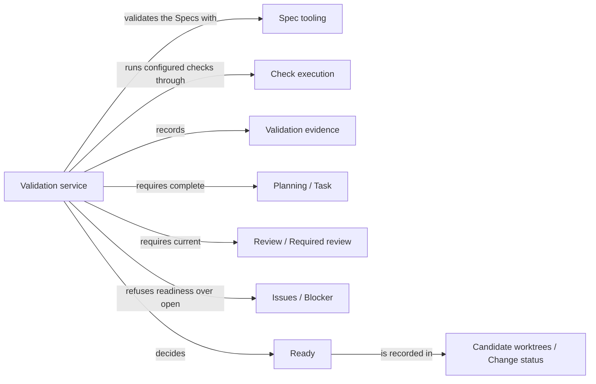

# Validation

## Purpose

Validation decides whether an existing change is ready to be delivered. For the change's candidate
it checks the Specs' structure, has Check execution run the configured checks of every affected
Module against the candidate's current files, and then runs the completion check: accepted tasks
are complete, required reviews are current and no Blocker is open. The user session calls it after
implementing or editing a change, and Delivery reruns the completion check before it publishes
anything. Validation runs no model, repairs nothing, delivers nothing and never creates a change or
a candidate. It does not own the check runner or the check result record; those belong to Check
execution. A ready candidate has passed deterministic gates for its exact bytes, which is not proof
that its Specs or code are semantically complete.

## Terminology

| Term | Definition |
| --- | --- |
| Ready | The state of a change whose Spec validation, configured checks, accepted tasks, required reviews and Blockers all satisfy its gates for the candidate's exact current files. |
| Validation evidence | The recorded Spec validation result, check results and Module revisions of one validation, each bound to digests of the inputs it examined. |
| Affected Module | A Module whose configured checks and revisions a validation covers: the validated Module, the edited Modules when the validated Module is the one the change is about, and every Module binding a file one of those binds. |
| Edited Module | A Module that owns a Spec document member, or binds a file, that differs between the change's base commit and the candidate's deliverable tree. |
| Direct candidate | A change that records no planned Module work, typically because the user session edited Specs or code directly. |
| Completion check | The deterministic gate, shared with Delivery, that decides from recorded evidence and current bytes whether one Module's part of a change is complete. |
| [Module](../vocabulary.md#concept.concorde.module) | |
| [Spec](../vocabulary.md#concept.concorde.spec) | |
| [Capability](../vocabulary.md#concept.concorde.capability) | |
| [Host](../vocabulary.md#concept.concorde.host) | |
| [Evidence](../vocabulary.md#concept.concorde.evidence) | |
| [Candidate](../harness/worktrees/module.md#concept.worktrees.candidate) | |
| [Change status](../harness/worktrees/module.md#concept.worktrees.change-status) | |
| [Configured check](../harness/checks/module.md#concept.checks.configured-check) | |
| [Check result](../harness/checks/module.md#concept.checks.check-result) | |
| [Task](../planning/module.md#concept.planning.task) | |
| [Component work](../implementation/module.md#concept.implementation.component-work) | |
| [Blocker](../issues/module.md#concept.issues.blocker) | |
| [Required review](../review/module.md#concept.review.required-review) | |

## Usage

The user session calls `concorde-validate` with `target_id` (the Module the change is about, or the
Module whose component work is being validated), `task`, and optionally `focus_id`, `constraints`,
`change_id` and `run_checks` (default `true`). In a candidate worktree it validates that worktree's
change; from the primary worktree `change_id` is required and Request admission relays the request
into that change's candidate. A request without an existing change is refused with
`missing_change` and nothing is created.

For example, after `concorde-implement` finished the accepted tasks of `module.transfer`, the user
session calls `concorde-validate` in the candidate with the same task. Validation first confirms
pending realization entries whose files now exist, checks the Specs, finds that `module.transfer`
shares a file with `module.ledger`, has Check execution run the configured checks of both Modules,
runs the completion check and answers `ready` with the check results. The change status now records
the change as ready with the exact validated tree, and Delivery can take it from there.

**Which checks run.** The checks of every affected Module run, because a change to a shared file can
break any Module that binds it. When the validated Module is the one the change is about, the edited
Modules are included too, so a change that must edit several Modules together, such as a contract's
provider and its participants, is validated and later delivered as one candidate. A direct candidate
runs every configured check of the project.

**Outcomes.** `ready` when the completion check passes; `completed`, with the note that semantic
completeness is not proven, when every check passed but accepted tasks are unfinished; `failed` when
the Specs are structurally invalid or a check did not pass. A `failed` answer marks the change
`blocked` with outcome `invalid_spec` or `failed_checks`, and for a planned change also the
validated Module's progress entry; a direct candidate has no such entry, so only the change is
marked. A gate of the completion check that is not met stops the request with an error naming it,
such as `review_required`, `spec_incomplete`, `incomplete_change` or `stale_evidence`, without
marking the change blocked.

**Direct candidates.** When the user session edited Specs or code directly, the change records no
planned work. Validation runs every configured check of the project, records the evidence against
the exact tree and marks the change ready if every required review is current and no Blocker is
open. A change with planned work cannot use this path to skip unfinished tasks.

Every request first withdraws an earlier ready state and recomputes against current bytes.
`run_checks: false` skips the checks but never fakes them, so such a request answers at most
`completed`. Without Check execution's boundary validation stops with `check_sandbox_unavailable`.
The exact request, flow, completion contract and gate table are in
[Validation interface](records.md); the reasons behind them are in [Validation design](design.md).

## Design

The validation service keeps collecting evidence separate from deciding readiness: it validates
the Specs and has the checks run, and the completion check then reads that evidence with the
change's tasks, reviews and Blockers. A passing command therefore never stands in for a missing
review, and Delivery can rerun the same decision as the
[completion contract](records.md#contract.validation.completion).

Validation evidence binds every result to digests of what it examined: the check results' measured
inputs, the validated Spec sources and the Spec and implementation revisions of every affected
Module. A candidate that changed while validation ran is refused rather than recorded, and the
completion check refuses evidence that no longer matches the current bytes. Validation computes the
edited Modules itself, from the paths that differ since the change's base commit, because that is a
question about one change and not about the Spec model. A failed check marks the change, an unmet
gate does not, and Validation never creates a candidate, because readiness is a property of work.
What is not enforced: Validation trusts Check execution's boundary, which restricts writes only.

The validation tests drive the capability on disposable Git repositories with fixture Specs and
real sandboxed check runs.

## Relationships

**Delivery** is the consumer of the [completion contract](records.md#contract.validation.completion).
Validation promises that the check is deterministic, writes nothing and decides only from recorded
evidence and the candidate's current bytes, so Delivery can run it in the candidate immediately
before building the integration.

**Spec tooling** loads the [registry](../spec/module.md#concept.spec.registry) and runs the
[structural checks](../spec/module.md#concept.spec.structural-check), which Validation runs first;
any error answers `failed` before a check runs. Its [impact indexes](../spec/module.md#concept.spec.impact-index)
say which Modules own a document or bind a file, and its [boundary sets](../spec/module.md#concept.spec.boundary-set)
give Module revisions. Pending entries are confirmed through a
[file transaction](../spec/module.md#concept.spec.file-transaction); a stale one stops with `stale_proposal`.

**Check execution** runs each [configured check](../harness/checks/module.md#concept.checks.configured-check)
in its [read-only check boundary](../harness/checks/module.md#concept.checks.read-only-boundary) and
returns a [check result](../harness/checks/module.md#concept.checks.check-result) with the digest of
what it measured. Validation chooses which checks run and records the results; without the boundary
it stops with `check_sandbox_unavailable`.

**Candidate worktrees** keeps the [change status](../harness/worktrees/module.md#concept.worktrees.change-status)
of the [candidate](../harness/worktrees/module.md#concept.worktrees.candidate) and computes its
deliverable tree. Validation reads tasks, components, Blockers and earlier evidence from it and
writes evidence, status and the validated tree; a concurrent status change stops the request.

**Request admission** receives `concorde-validate` requests and wraps the answer in the
[result envelope](../harness/admission/module.md#concept.admission.result-envelope). Validation's
[capability declaration](../harness/admission/module.md#concept.admission.capability-declaration)
says it needs an existing change, so admission refuses a primary-worktree request without
`change_id` and otherwise [relays](../harness/admission/module.md#concept.admission.relay) it into
the change's candidate.

**Review** decides whether every [required review](../review/module.md#concept.review.required-review)
of the change is current. The completion check asks this first and stops with `review_required`
when the answer is no. Validation never chooses review requirements itself.

**Planning** records the accepted [tasks](../planning/module.md#concept.planning.task) of a planned
change and the Spec revision its [plan](../planning/module.md#concept.planning.plan) was written for.
The completion check only reads them and stops with `incomplete_change` or `stale_context`.

**Implementation** records the [completion](../implementation/module.md#concept.implementation.completion)
of a Module's tasks and the [component work](../implementation/module.md#concept.implementation.component-work)
done for other Modules in the candidate. The completion check refuses readiness when either changed
since it completed.

**Issues** defines the [Blocker](../issues/module.md#concept.issues.blocker). An open Blocker for
the validated Module's current task stops readiness with `spec_incomplete`; Validation never
releases a Blocker because files changed.
