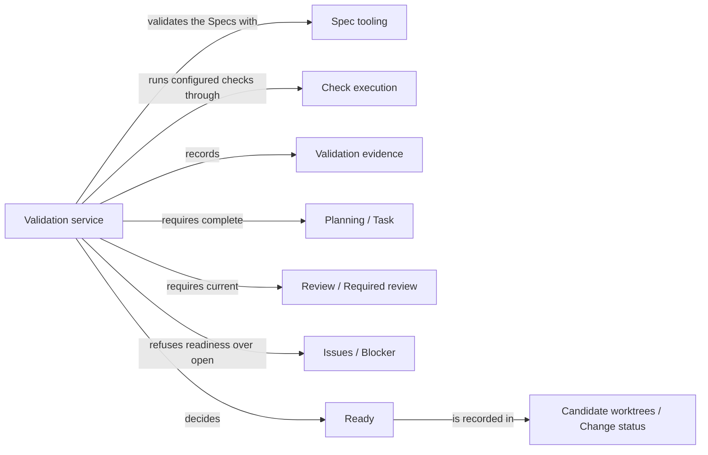

# Validation

## Purpose

Validation decides whether an existing change is ready to be delivered. For the change's candidate
it checks the Specs' structure, has Check execution run the configured checks of every affected
Module against the candidate's current files, and then runs the completion check: accepted tasks
are complete, required reviews are current and no Blocker is open. The user session calls it after
implementing or editing a change, and Delivery reruns the completion check before it publishes
anything. Validation runs no model, repairs nothing, delivers nothing and never creates a change or
a candidate. It does not own the check runner or the check result record; those belong to Check
execution. A ready candidate has passed deterministic gates for its exact bytes, which is not proof
that its Specs or code are semantically complete.

## Terminology

| Term | Definition |
| --- | --- |
| Ready | The state of a change whose Spec validation, configured checks, accepted tasks, required reviews and Blockers all satisfy its gates for the candidate's exact current files. |
| Validation evidence | The recorded Spec validation result, check results and Module revisions of one validation, each bound to digests of the inputs it examined. |
| Affected Module | A Module whose configured checks and revisions a validation covers: the validated Module, the edited Modules when the validated Module is the one the change is about, and every Module binding a file one of those binds. |
| Edited Module | A Module that owns a Spec document member, or binds a file, that differs between the change's base commit and the candidate's deliverable tree. |
| Direct candidate | A change that records no planned Module work, typically because the user session edited Specs or code directly. |
| Completion check | The deterministic gate, shared with Delivery, that decides from recorded evidence and current bytes whether one Module's part of a change is complete. |
| [Module](../vocabulary.md#concept.concorde.module) | |
| [Spec](../vocabulary.md#concept.concorde.spec) | |
| [Capability](../vocabulary.md#concept.concorde.capability) | |
| [Host](../vocabulary.md#concept.concorde.host) | |
| [Evidence](../vocabulary.md#concept.concorde.evidence) | |
| [Candidate](../harness/worktrees/module.md#concept.worktrees.candidate) | |
| [Change status](../harness/worktrees/module.md#concept.worktrees.change-status) | |
| [Configured check](../harness/checks/module.md#concept.checks.configured-check) | |
| [Check result](../harness/checks/module.md#concept.checks.check-result) | |
| [Task](../planning/module.md#concept.planning.task) | |
| [Component work](../implementation/module.md#concept.implementation.component-work) | |
| [Blocker](../issues/module.md#concept.issues.blocker) | |
| [Required review](../review/module.md#concept.review.required-review) | |

Validation evidence is what one run records; Ready is the decision drawn from it by the completion
check. Affected and edited Modules decide which checks and revisions that evidence must cover.

## Usage

The user session calls the `concorde-validate` capability with `target_id` (the Module the change is
about, or the Module whose component work is being validated), `task`, and optionally `focus_id`,
`constraints`, `change_id` and `run_checks` (default `true`).

**Validation needs an existing change.** Run in a candidate worktree, it validates the change bound
to that worktree; a supplied `change_id` must name it. Run in the primary worktree, `change_id` is
required: Request admission relays the request into the recorded candidate of that change and
returns the candidate's answer. A request from the primary worktree without `change_id`, or one
that names no recorded change, is refused with `missing_change` and nothing is created. A fresh,
empty candidate would contain nothing but its base commit, so readiness would say nothing about any
work; Validation therefore never asks for one.

For example, after `concorde-implement` finished the accepted tasks of `module.transfer`, the user
session calls `concorde-validate` in the candidate with the same task. Validation checks the Specs,
finds that `module.transfer` shares a file with `module.ledger`, has Check execution run the
configured checks of both Modules, runs the completion check and answers with outcome `ready` and
the check results. The change status now says the change is ready and records the exact file tree
that was validated. Delivery can take it from there.

**Pending entries are confirmed first.** A Spec may declare a file as `pending` while it does not
exist yet; once the file exists, the Protocol requires the marker to go. Before it validates, the
Host removes from every realization's `pending` list each entry whose file or directory now exists,
keeping the entry itself bound. Only the metadata members of the affected documents change, and
the confirmation becomes part of the validated tree.

**Which checks run.** The checks of every affected Module run, the validated Module's own included,
because a change to a shared file can break any Module that binds it. When the validated Module is
the one the change is about, the affected Modules also include every edited Module: one change may
have to edit several Modules together, for example a contract's provider and every participant
when the contract's version rises, and validating it from its own Module checks all of them at
once, so delivering the one candidate is the atomic step. Local control records and the Host's own
worktree guidance are not part of the deliverable tree and so edit no Module. A direct candidate
runs every configured check of the project. Check execution runs each check in its read-only check
boundary and returns one [check result](../harness/checks/module.md#concept.checks.check-result)
per check; Validation records those results and never runs a check any other way.

**Outcomes.** Validation answers with one of three outcomes:

- `failed` when the Specs are structurally invalid or a check did not pass. The change is marked
  `blocked`, with outcome `invalid_spec` or `failed_checks`; for a planned change the validated
  Module's progress entry is marked `blocked` too, while a direct candidate, which has no such
  entry, only has its change marked. The candidate's files stay as they are for inspection.
- `ready` when the completion check passes. The change becomes `ready` and its validated tree is
  recorded.
- `completed`, with the note that semantic completeness is not proven, when every check passed but
  the change still has unfinished accepted tasks.

A gate of the completion check that is not met stops the request with an error naming it, for
example `review_required` for a missing or stale required review, `spec_incomplete` for an open
Blocker, `incomplete_change` for unfinished tasks, and `stale_evidence` when evidence no longer
matches the current bytes or the candidate changed while validation ran. Such an error leaves the
change in phase `validate` with any earlier ready state withdrawn; it does not mark the change
blocked, because nothing failed that the next edit could not fix.

**Direct candidates.** When the user session edited Specs or code directly, the change records no
planned Module work. Validation then runs every configured check of the project, records the
evidence against the candidate's exact tree and marks the change ready if every review the change
has required is current and no Blocker is open. A change with planned Module work cannot use this
path to skip its unfinished tasks.

**Repeating and skipping.** Every validation request first withdraws an earlier ready state and
recomputes everything against current bytes; an earlier pass is never permanent.
`run_checks: false` skips running the checks but never fakes them: the completion check still
requires a current passing result for every required check, so such a request can answer at most
`completed`. If Check execution cannot set up its boundary, validation stops with
`check_sandbox_unavailable` and records no result.

The exact request, flow, completion check and gate table are in
[Validation interface](records.md).

## Design

**Collecting evidence is separate from deciding readiness.** One part of the validation service
validates the Specs and has the checks run; the completion check then reads that evidence together
with the change's tasks, reviews and Blockers. Keeping them apart means a passing command can never
stand in for a missing review or an unfinished task, and it lets Delivery rerun exactly the same
decision, as the [completion contract](records.md#contract.validation.completion), without running
any check of the candidate a second time.

**Evidence is bound to bytes.** A check result carries the digest of what the check measured,
computed by Check execution. Validation adds the digest of the validated Spec sources and the Spec
and implementation revisions of every affected Module: a Module's Spec revision is the identity of
its resolved Spec context, and its implementation revision is a digest of its realization entries
and the bytes of every file they bind. Validation snapshots the candidate's deliverable tree before
the checks and compares it, and the affected revisions, afterwards; a difference means someone
changed the candidate during validation, and the result is refused rather than recorded. Delivery
later compares the validated tree with the candidate's actual tree for the same reason.

**The edited-Modules policy belongs here.** Which Modules a change edits is a question about one
change's candidate, not about the Spec model, so Validation computes it itself: from the paths that
differ between the change's base commit and the candidate's deliverable tree, it takes the owner of
every changed Spec document member and every Module that binds a changed file. Spec tooling supplies
only the model's indexes, which Module owns a document and which Modules bind a file. Scoping the
widening to the Module the change is about keeps the validation of one component's work to that
component's own affected Modules.

**Readiness is not transitive trust.** When the change recorded component work, the completion
check runs again for each component with its own task, and a component whose Spec or implementation
changed since it completed stops readiness. The Module the change is about also records the
revisions of every edited Module, so an edit to any of them after validation makes the evidence
stale.

**A failure marks the change, an unmet gate does not.** A failed check or invalid Spec is a fact
about the candidate's current bytes, recorded as `blocked` so that the user session and Delivery see
it. A missing review or an unfinished task is a gate still to be met, so it only stops the request.

**Validation requires an existing change** because readiness is a property of work. Creating a
candidate to validate would record readiness of an unchanged base commit and leave an orphan
worktree; refusing is the honest answer.

What is not enforced: Validation trusts Check execution's boundary, which restricts writes only and
shares the host's network and environment. The service's own code under `src/concorde/validation/`
holds the flow, the completion check and the edited-Modules computation.

The validation tests drive the capability on disposable Git repositories with fixture Specs and
real sandboxed check runs: readiness of planned and direct candidates, each gate that stops it, and
multi-Module changes.

## Relationships

The picture shows one validation request. Admission and component work are explained below.

**Delivery** is the consumer of the [completion contract](records.md#contract.validation.completion).
Validation promises that the check is deterministic, writes nothing and decides only from recorded
evidence and the candidate's current bytes, so Delivery can run it in the candidate immediately
before building the integration.

**Spec tooling** loads the [registry](../spec/module.md#concept.spec.registry) and runs the
[structural checks](../spec/module.md#concept.spec.structural-check). Validation runs structural
validation first and answers `failed` on any error, so a structurally invalid project never reaches
the checks. It uses the [impact indexes](../spec/module.md#concept.spec.impact-index) to learn which
Modules bind a file and which Module owns a document, and the resolved
[boundary sets](../spec/module.md#concept.spec.boundary-set) to compute Module revisions. It
confirms pending entries through a [file transaction](../spec/module.md#concept.spec.file-transaction)
bound to the metadata members it replaces; a transaction refused as stale stops validation with
`stale_proposal`.

**Check execution** runs each [configured check](../harness/checks/module.md#concept.checks.configured-check)
inside its [read-only check boundary](../harness/checks/module.md#concept.checks.read-only-boundary)
and returns a [check result](../harness/checks/module.md#concept.checks.check-result) with the
digest of what it measured; it refuses a result whose measured input changed during the run.
Validation chooses which Modules' checks run, records the results and keeps nothing else of the
output. When Check execution cannot provide its boundary, Validation stops with
`check_sandbox_unavailable`.

**Candidate worktrees** keeps the [change status](../harness/worktrees/module.md#concept.worktrees.change-status)
of the [candidate](../harness/worktrees/module.md#concept.worktrees.candidate) and computes its
deliverable tree. Validation reads the recorded tasks, components, Blockers, base commit and earlier
evidence from it and writes the new evidence, the phase, the `blocked` or `ready` status and the
validated tree, each as a revision-checked write; a concurrent status change stops the request.

**Request admission** receives `concorde-validate` requests and wraps the answer in the common
[result envelope](../harness/admission/module.md#concept.admission.result-envelope). Validation's
[capability declaration](../harness/admission/module.md#concept.admission.capability-declaration)
states that it needs an existing change and must not be given a new candidate, so admission refuses
a primary-worktree request without `change_id` and otherwise [relays](../harness/admission/module.md#concept.admission.relay)
it into the change's candidate. Validation relies on admission to have bound the Module and the
worktree before it starts.

**Review** decides whether every [required review](../review/module.md#concept.review.required-review)
of the change is current. The completion check asks this first and stops with `review_required`
when the answer is no. Validation never chooses review requirements itself.

**Planning** records the accepted [tasks](../planning/module.md#concept.planning.task) of a planned
change and the Spec revision its [plan](../planning/module.md#concept.planning.plan) was written for.
The completion check only reads whether every accepted task of the validated Module is complete and
whether the Module's Spec is still the planned one; it stops with `incomplete_change` or
`stale_context` otherwise.

**Implementation** records the [completion](../implementation/module.md#concept.implementation.completion)
of a Module's tasks with the implementation revision it completed on, and the
[component work](../implementation/module.md#concept.implementation.component-work) done for other
Modules in the same candidate. The completion check refuses readiness when the implementation or a
completed component changed since then.

**Issues** defines the [Blocker](../issues/module.md#concept.issues.blocker). An open Blocker for
the validated Module's current task stops readiness with `spec_incomplete`; Validation never
releases a Blocker because files changed.
