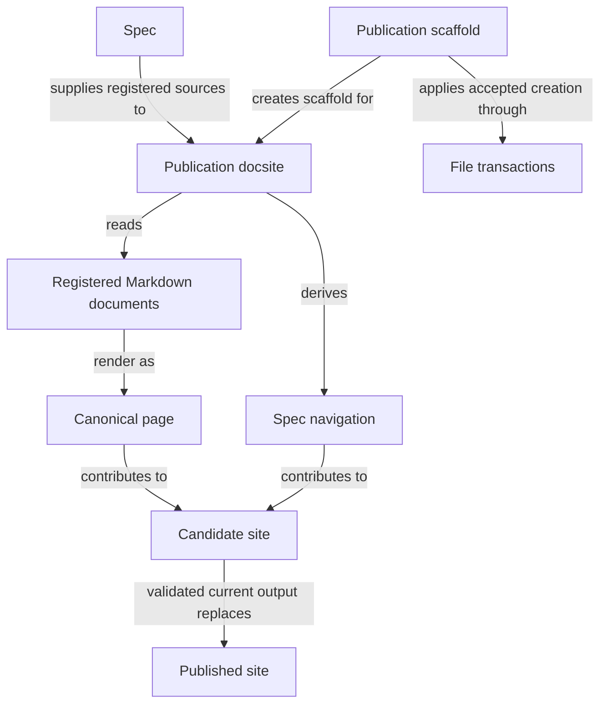
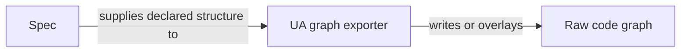
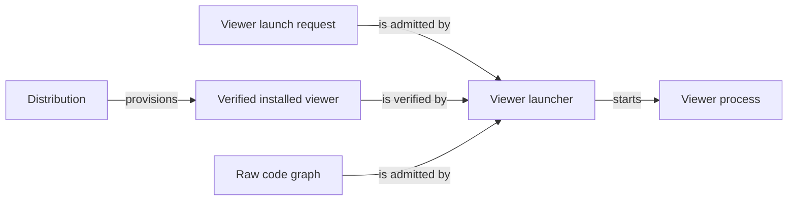

# Views

## Purpose

Views turns the project's explicit Spec registry into a documentation site that developers and
reviewers read, deterministically projects that same registry into a skeleton Understand Anything
knowledge graph, and separately lets a developer open an already-produced code-structure graph in
the official Understand Anything viewer. Its publishing promises stop at rendering registered
Markdown faithfully: it derives Module Spec pages and navigation only from the registry, and it never infers a
Module's completeness or correctness from a diagram, a route or a rendered page. Its graph-export
promises stop at deriving Module, document and bound-file structure from the registry; it never
scans the filesystem for undeclared content, and repeated export replaces only elements in its
declared ownership scope. Its viewer promises stop at admission and launch: the launcher does not generate
the graph it opens, does not judge whether that graph still agrees with the code, and does not grant
an agent any access beyond its own host-bound Spec context.

## Usage

Choose among three independent uses: publish registered Specs as a docsite, export or overlay a
registry-derived UA graph, or open an existing graph in the installed viewer. For a new site, propose
a scaffold, inspect it and apply the exact proposal; existing site files are not overwritten.
With site dependencies prepared, build and validate the candidate before publication. A broken
link, invalid document or stale input prevents promotion and preserves the previous published site.
[Publication](publication.md) explains scaffolding, custom documentation and reading behavior;
[pipeline](pipeline.md) defines the build API and records.

The Spec reader presents Usage before Design, so using a Module
does not require first reading its entity/file inventory. Both explanations remain canonical reading content.
Custom docs are separate human documentation and grant no Spec context. For graphs, use
[UA export](ua-graph.md) to derive or overlay declared structure and `--check` for drift without
writes. Use the [viewer launcher](viewer.md) only with an existing valid graph and verified runtime.
The launcher neither generates a graph nor verifies agreement with code; no rendered view proves
semantic completeness or authorizes a change.

## Design

Publication docsite reads Registered Markdown documents and their paired metadata as one source
model, but produces one Canonical page per reading document. Spec navigation follows registered
Module parentage rather than directory structure. The Docsite build interface separates admission,
materialization, candidate build, source/link validation and promotion. Only a current validated
Candidate site replaces the Published site; a failure preserves the last successful build.
Metadata participates in source identity and auxiliary provenance, not an appended file inventory.
The [pipeline design](pipeline.md#design) defines these identities and promotion mechanics.

Docsite scaffold command uses Publication scaffold and File transactions to create only the exact
accepted site files. Scaffolding does not rewrite project Specs or overwrite existing consumer
files. Provider definitions stay at their canonical pages: ordinary links never transclude a
second copy of a shared contract.

UA graph export command uses UA graph exporter to derive or overlay declared structure without
judging implementation conformance. A Raw code graph can also be an observation produced elsewhere.
Viewer launch command passes a Viewer launch request to Viewer launcher, which admits the existing
graph and the Verified installed viewer supplied by Distribution before starting the Viewer process.
Launch neither regenerates the graph nor checks its freshness against source. Export and launch are
independent of reading publication and grant no additional agent context.

## Relationships

Publication scaffold and Publication docsite touch disjoint files and never edit each other's
output: the scaffold's own exact-file transaction creates or updates project structure, and
rendering project Specs never authorizes editing them. A candidate is promoted only when complete
and current; any invalid link, diagram or stale source during generation leaves the published site
exactly as it was. Registry composition still supplies navigation, and dependency and interface
agreements still undergo validation; none creates a standalone docsite graph projection.

The UA graph exporter derives and writes a skeleton from the registry without judging agreement
with code. The viewer launcher independently admits an existing graph and verified runtime and
launches a process; it neither generates nor verifies the freshness of that graph.

### Publication and scaffolding

This view covers reading publication and its creation-only scaffold, not graph generation or viewer
processes. Concorde-only Flow inspection additionally uses Harness under the local agreement below.

### Independent graph export

Export derives or overlays the registry's declared structure; it is not a source-code analysis or a
replacement for a Module's authored relationship view.

### Existing-graph viewing

Launch selects an already-existing graph and a verified viewer. It neither generates that graph
nor verifies its agreement with current implementation.

## Requirements

### req.views.registry-derived-pages — Pages and navigation derive from the registry

Publication SHALL derive Module Spec pages and their navigation only from the explicit registry.

Every published Module Spec is traceable to a registered entry. The optional project introduction
and project-owned custom docs are presentation surfaces outside that membership.
The Module Specs sidebar follows registry parentage alone; custom docs use independent tabs. See
[req.views.no-directory-scanning](#req.views.no-directory-scanning).

### req.views.custom-docs — Separate project documentation

Publication SHALL support project-owned custom docs through independent tabs outside Module Spec registration and agent Spec context.

The generic template defaults to Module Specs alone and publishes no unregistered Projections
section. See [custom docs](publication.md#scenario.views.custom-docs) for configuration and migration.

### req.views.no-directory-scanning — No directory scanning or link-based discovery

Publication SHALL NOT discover Spec documents by scanning directories or following links.

### req.views.one-page-per-document — One canonical page per registered document

A physical Spec document SHALL publish at exactly one canonical page regardless of how many Modules reference it.

### req.views.current-internal-links — Published internal links resolve

Publication SHALL promote only a candidate in which every internal navigation link retained in its published documents resolves to an available destination and, when specified, an existing anchor.

The guarantee covers the site's own published pages, including enabled reading collections.
Cross-Module references are valid navigation and do not establish document ownership and references or expand
Spec context. External destinations retain their existing handling; publication does not promise
the continued availability of another website. Current-owner legacy aliases and failure
behavior are defined in [publication](publication.md#scenario.views.publish-legacy-redirect)
and [pipeline](pipeline.md#scenario.views.validate-candidate-mismatch).

### req.views.no-agent-context-grant — No extra agent context from a rendered view

A rendered page or generated view SHALL NOT itself grant an agent invocation additional Spec context beyond its own host-bound target snapshot.

### req.views.diagram-source-identity — Mermaid fence is the sole diagram source

An inline Mermaid fence in a Module's Relationships subsection SHALL be its sole authored diagram source.

### req.views.no-external-diagram-record — No external diagram record or output

Publication SHALL create no external diagram record or `generated/diagrams` output.

The authored fence is the sole source; publication produces no external record derived from it.

### req.views.no-docsite-graph-view — No docsite graph view

Publication SHALL NOT expose the former Module, Scenario or entity-relationship graph view.

This removes the docsite graph page and route, Graph navigation entry, graph-specific UI,
architecture-graph projection and artifact, and resources or dependencies used exclusively for that
feature. It also applies to the publishing template supplied to consumer projects. Dependencies
and resources still needed for ordinary reading, navigation or inline Mermaid rendering remain.
The UA exporter and official viewer remain separate non-docsite facilities.

Concorde's own source-checkout site has an independent Agent Flows page describing actual runtime
execution. It is excluded from the consumer template and does not derive a graph from the Spec
registry. See [Agent execution publication](pipeline.md#scenario.views.agent-flows).

### req.views.agent-flows — Concorde-only execution diagrams

Concorde's own docsite SHALL publish an Agent Flows tab whose LangGraph nodes and edges come from
the current executable factories and whose explanations distinguish execution, wrappers and
unimplemented design.

### req.views.production-preview-isolation — Production builds preserve preview output

A production build SHALL NOT clear or overwrite the development preview's generated directory.

### req.views.hash-format — Digests use the sha256 hex format

Every content or source digest SHALL be `sha256:` followed by 64 lowercase hexadecimal digits.

### req.views.safe-relative-paths — Member paths are safe relative POSIX paths

Every member path SHALL use POSIX separators without absolute paths, backslashes, empty, dot or traversal components, or symlinks.

### req.views.promote-atomic — Promotion restores the prior destination on failure

`promoteCandidate` SHALL attempt to restore the prior destination on a failed move or removal.

### req.views.promote-requires-checked-candidate — Promotion runs only on checked candidates

`promoteCandidate` SHALL NOT be called on unchecked or stale output.

### req.views.no-contract-context-expansion — Contract edges do not expand loaded context

The registry loader SHALL NOT follow a `concorde-contract` edge to import additional Module context.

### req.views.no-graph-generation — Launcher leaves graph contents unchanged

The viewer launcher SHALL NOT modify graph contents, including generating or rewriting the graph it opens.

### req.views.no-graph-freshness-verification — Launcher never verifies graph freshness

The viewer launcher SHALL NOT verify the freshness of the graph it opens against source.

### req.views.no-dependency-install — Launcher resolves no dependencies or network access

The viewer launcher SHALL NOT resolve dependencies or perform network acquisition.

### req.views.cli-syntax-errors — Argument errors exit separately from launch failures

Invalid launch syntax or a port outside 0-65535 SHALL exit through argument parsing with code 2, distinct from a failed launch's exit code 3.

### req.views.ua-graph-registry-only — Exported skeleton derives only from the registry

The UA graph exporter SHALL limit derivation inputs to the explicit registry, registered documents, declared implementation listings and an admitted existing graph.

The existing graph supplies foreign-node reuse and the unlisted-file layer under the local overlay
rules; it does not authorize discovery of additional project files or Spec membership. Fresh
skeletons derive their structure solely from registered inputs, with initial project metadata as
defined in the local serialized graph contract.

### req.views.ua-graph-idempotent — Re-export replaces only Concorde-owned elements

A repeated export SHALL replace only the nodes, edges and layers in the ownership scope defined by scenario.views.ua-graph-overlay, leaving every other element of an existing graph unchanged.

## Scenarios

Scaffold and top-level publication scenarios are defined in [publication](publication.md).
Registry loading, materialization and build/promotion scenarios are defined in
[pipeline](pipeline.md). Viewer launch scenarios are defined in [viewer](viewer.md), and UA graph
export scenarios in [ua-graph](ua-graph.md).

## Dependencies and composition

### Spec

Supplies the explicit registry, document ownership and references, relationships and file bindings used by publication and UA export, without recursive filename discovery.

Supply the explicit registry, document ownership and references, relationships and entity file bindings consumed by publication and UA export.

This collaboration applies when loading publication inputs, materializing pages or navigation, or exporting the UA graph skeleton.

- [Derive pages and graph structure from explicit unique ownership, references and entity listings](../spec/structure.md#registry-shape)
- [Resolve inclusion provenance without recursive reads](../spec/registry.md#stable-id-spec-context-queries)

### Distribution

Provisions and verifies the official viewer package inside the managed runtime that the viewer launcher checks before starting a launch.

Provision and verify the official viewer package inside the managed runtime.

This collaboration applies when launching the viewer.

- [Launch only the exact verified viewer entrypoint and stop on an absent receipt](../distribution/runtime.md)

### Harness

Supply inspectable executable Flows without invoking nodes.

This collaboration applies when compiling Agent execution views without running nodes.

- [Harness contract](../harness/graphs-and-loops.md); preserve its admission conditions, retain distinct blockers and do not infer wider authority from composition.

## Unresolved information

Publication accepts Profile 14 projects only. `requireScoped` refuses any other `profile_version`
with an explicit error, and no compatibility rendering path exists for an older profile: migrating
such a project is a separate, explicit topology change that this Module does not perform.

## Ownership, context and implementation status

The loaders and exporters implement publication schema 20, unique owners, reference provenance, canonical contract anchors and UA reference edges. Reference inclusion creates no transclusion, implementation grant or new page authority.
