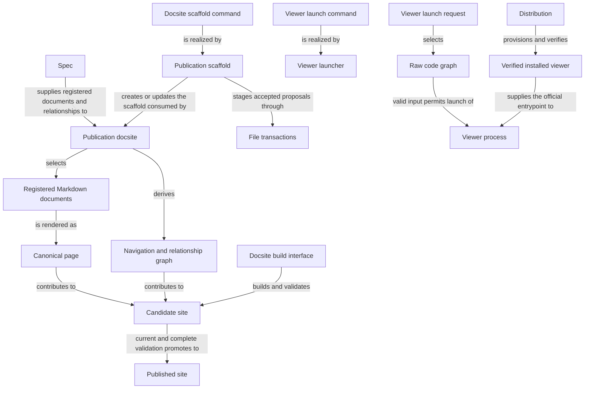

```concorde-document
{
  "id": "document.views.module",
  "targets": [
    "module.views"
  ],
  "main_visible": true
}
```

# Views

Publish registered Module Specs as a navigable documentation site, and open an existing Understand Anything code graph with the verified installed viewer.

## Purpose

Views turns the project's explicit Spec registry into a documentation site that developers and
reviewers read, and separately lets a developer open an already-produced code-structure graph in
the official Understand Anything viewer. Its publishing promises stop at rendering registered
Markdown faithfully: it derives pages, navigation and relationship edges only from the registry,
and it never infers a Module's completeness or correctness from a diagram, a route or a rendered
page. Its viewer promises stop at admission and launch: it does not generate the graph it opens,
does not judge whether that graph still agrees with the code, and does not grant an agent any
access beyond its own host-bound Spec context.

## Requirements

### req.views.registry-derived-pages — Pages and navigation derive from the registry

Publication SHALL derive Module Spec pages and their navigation only from the explicit registry.

This is the positive half of the registry-only promise: every published Module Spec is
traceable to a registered entry. The optional project introduction and independent Protocol
collection are presentation surfaces outside that membership. The companion prohibition on directory scanning is
[req.views.no-directory-scanning](#req.views.no-directory-scanning).

### req.views.no-directory-scanning — No directory scanning or link-based discovery

Publication SHALL NOT discover Spec documents by scanning directories or following links.

### req.views.one-page-per-document — One canonical page per registered document

A physical Spec document SHALL publish at exactly one canonical page regardless of how many Modules
register it.

### req.views.no-agent-context-grant — No extra agent context from a rendered view

A rendered page or generated view SHALL NOT itself grant an agent invocation additional Spec context
beyond its own host-bound target snapshot.

### req.views.diagram-source-identity — Mermaid fence is the sole diagram source

An inline Mermaid fence in a Module's Relationships subsection SHALL be its sole authored diagram
source.

### req.views.no-external-diagram-record — No external diagram record or output

Publication SHALL create no external diagram record or `generated/diagrams` output.

This is the companion prohibition to
[req.views.diagram-source-identity](#req.views.diagram-source-identity): the authored fence is not
just the sole source, publication also produces no external record derived from it.

### req.views.production-preview-isolation — Production builds preserve preview output

A production build SHALL NOT clear or overwrite the development preview's generated directory.

### req.views.hash-format — Digests use the sha256 hex format

Every content or source digest SHALL be `sha256:` followed by 64 lowercase hexadecimal digits.

### req.views.safe-relative-paths — Member paths are safe relative POSIX paths

Every member path SHALL use POSIX separators without absolute paths, backslashes, empty, dot or
traversal components, or symlinks.

### req.views.promote-atomic — Promotion restores the prior destination on failure

`promoteCandidate` SHALL attempt to restore the prior destination on a failed move or removal.

### req.views.promote-requires-checked-candidate — Promotion runs only on checked candidates

`promoteCandidate` SHALL NOT be called on unchecked or stale output.

### req.views.no-contract-context-expansion — Contract edges do not expand loaded context

The registry loader SHALL NOT follow a `concorde-contract` edge to import additional Module context.

### req.views.no-graph-generation — Launcher never generates or verifies graph freshness

The viewer launcher SHALL NOT generate, rewrite or verify the freshness of the graph it opens
against source.

### req.views.no-dependency-install — Launcher resolves no dependencies or network access

The viewer launcher SHALL NOT resolve dependencies or perform network acquisition.

### req.views.cli-syntax-errors — Argument errors exit separately from launch failures

Invalid launch syntax or a port outside 0-65535 SHALL exit through argument parsing with code 2,
distinct from a failed launch's exit code 3.

## Scenarios

Scenario definitions for the docsite scaffold and top-level publish behavior are registered in
[publication](publication.md). Scenario definitions for the registry-loading, materialization and
build/promotion pipeline are registered in [pipeline](pipeline.md). Scenario definitions for the
viewer launch command are registered in [viewer](viewer.md).

## Ontology

The Ontology names what Views consists of and touches at its boundary — its publication and
viewer programs, the interfaces that reach them, and the publication and viewer data they exchange
— and the labeled relationships that connect those things.

### Entities

The three programs below realize scaffolding, publication and viewer launch; the interface
entities are their means of use; the remaining entities name the publication and viewer data the
scenarios exchange. The docsite entity lists the whole `docsite/` directory and the scaffold entity
its `src/concorde/views/` and `tests/concorde/views/` packages; the viewer launcher keeps its two
exact entries, one of them inside a listed test package.

```concorde-entities
[
  {
    "id": "entity.views.publication-docsite",
    "title": "Publication docsite",
    "kind": "program",
    "responsibility": "Realizes registry-driven Markdown publication: materializes one canonical page and inline Mermaid rendering per physical document, derives navigation and the relationship graph, binds a candidate to exact source digests and route coverage, and promotes only a complete current candidate while preserving the previous successful build on failure.",
    "files": [
      "docsite/"
    ]
  },
  {
    "id": "entity.views.publication-scaffold",
    "title": "Publication scaffold",
    "kind": "program",
    "responsibility": "Realizes exact docsite scaffold proposals and deploys the current publishing template for a registered project, without reading code to infer architecture.",
    "files": [
      "src/concorde/views/",
      "tests/concorde/views/"
    ]
  },
  {
    "id": "entity.views.viewer-launcher",
    "title": "Viewer launcher",
    "kind": "program",
    "responsibility": "Realizes the deterministic admission and process-launch boundary that selects the first existing raw graph, verifies the installed runtime and launches the official viewer without generating the graph or installing dependencies.",
    "files": [
      "scripts/run-viewer.py",
      "tests/concorde/views/test_viewer_launcher.py"
    ]
  },
  {
    "id": "entity.views.file-transactions",
    "title": "File transactions",
    "kind": "shared program",
    "responsibility": "Realizes exact replacement proposals as staged filesystem operations with before-digest checks and original-byte recovery, for every Module that applies an accepted proposal.",
    "files": [
      "src/concorde/spec/changes.py"
    ]
  },
  {
    "id": "entity.views.spec",
    "title": "Spec",
    "kind": "used module",
    "target_id": "module.spec",
    "responsibility": "Supplies the explicit registry, document memberships and relationships that publication renders, without recursive filename discovery."
  },
  {
    "id": "entity.views.distribution",
    "title": "Distribution",
    "kind": "used module",
    "target_id": "module.distribution",
    "responsibility": "Provisions and verifies the official viewer package inside the managed runtime that the viewer launcher checks before starting a launch."
  },
  {
    "id": "entity.views.docsite-scaffold-command",
    "title": "Docsite scaffold command",
    "kind": "interface",
    "responsibility": "The deterministic `concorde docsite --propose`/`--apply` command that creates and applies an accepted project-relative scaffold proposal under the host's worktree policy, checking before-digests and owning only scaffold files."
  },
  {
    "id": "entity.views.docsite-build-interface",
    "title": "Docsite build interface",
    "kind": "interface",
    "responsibility": "The TypeScript requireScoped/loadScopedRegistry/materializeScoped/buildSite/promoteCandidate functions and Docusaurus plugin hooks, plus the project-local npm run validate/npm run build commands, that admit only a Profile 11 project, load the registry, stage Markdown and navigation, build and validate a candidate and promote only a checked result."
  },
  {
    "id": "entity.views.viewer-launch-command",
    "title": "Viewer launch command",
    "kind": "interface",
    "responsibility": "The `python3 .../scripts/run-viewer.py --project-root PATH [--port N] [--no-open]` command that admits an existing raw graph and a verified runtime and launches the official viewer, returning its process exit code."
  },
  {
    "id": "entity.views.markdown-documents",
    "title": "Registered Markdown documents",
    "kind": "concept",
    "responsibility": "Every physical Spec document explicitly registered in the project's Spec registry, including documents shared by several Modules, which publication renders without directory scanning."
  },
  {
    "id": "entity.views.canonical-page",
    "title": "Canonical page",
    "kind": "record",
    "responsibility": "The one rendered page a registered physical document publishes at its readable derived route, carrying its membership, aliases and content digest even when the document is shared by several Modules."
  },
  {
    "id": "entity.views.navigation",
    "title": "Navigation and relationship graph",
    "kind": "concept",
    "responsibility": "The primary directory-mirroring sidebar, the secondary Module-composition view and the composes/uses/required-interface edges, all derived from the registry rather than from links or directory scanning."
  },
  {
    "id": "entity.views.candidate-site",
    "title": "Candidate site",
    "kind": "record",
    "responsibility": "The staged build whose exact source digest, route inventory and diagram rendering are validated against the current registry before promotion is considered."
  },
  {
    "id": "entity.views.published-site",
    "title": "Published site",
    "kind": "concept",
    "responsibility": "The previously promoted build that a validation failure or a source change during generation leaves untouched, so only a complete current candidate ever replaces it."
  },
  {
    "id": "entity.views.viewer-request",
    "title": "Viewer launch request",
    "kind": "concept",
    "responsibility": "One invocation of the viewer launch command with its project root and optional port/no-open flags."
  },
  {
    "id": "entity.views.code-graph",
    "title": "Raw code graph",
    "kind": "external observation",
    "responsibility": "The first existing knowledge-graph JSON file in the manifest's ordered graph_paths, an observation produced by another tool that the launcher admits by shape but does not generate, rewrite or check for freshness against source."
  },
  {
    "id": "entity.views.verified-viewer-runtime",
    "title": "Verified installed viewer",
    "kind": "concept",
    "responsibility": "The runtime marker and viewer package identity that Distribution's managed runtime provisions and that the launcher checks before starting the official viewer."
  },
  {
    "id": "entity.views.viewer-process",
    "title": "Viewer process",
    "kind": "concept",
    "responsibility": "The launched official-viewer child process, run from the project directory with the requested flags, whose exit code (or 130 on interruption) the launcher returns."
  }
]
```

### Relationships

Publication scaffold and Publication docsite touch disjoint files and never edit each other's
output: the scaffold's own exact-file transaction creates or updates project structure, and
rendering project Specs never authorizes editing them. A candidate is promoted only when it is both
complete and current; any invalid link, diagram or stale source during generation leaves the
published site exactly as it was. The viewer side is independent of publication: it admits an
existing graph and a verified runtime and launches a process, and it proves nothing about whether
that graph still agrees with the Specs this same Module publishes.



## Dependencies and composition

```concorde-dependencies
[
  {
    "target_id": "module.spec",
    "responsibility": "Supply the explicit registry, document memberships and relationships that publication renders.",
    "selection_condition": "When materializing pages, navigation or the relationship graph.",
    "relied_upon_promises": [
      "Every registered document has exactly one identity and an explicit membership list, and relationships are declared rather than inferred, so a page and its edges can be derived without reading source code."
    ]
  },
  {
    "target_id": "module.distribution",
    "responsibility": "Provision and verify the official viewer package inside the managed runtime.",
    "selection_condition": "When launching the viewer.",
    "relied_upon_promises": [
      "A verified runtime receipt identifies the exact viewer entrypoint, and a missing or unverified runtime is reported rather than substituted."
    ]
  }
]
```

## Unresolved information

Publication accepts Profile 11 projects only. `requireScoped` refuses any other `profile_version`
with an explicit error, and no compatibility rendering path exists for an older profile: migrating
such a project is a separate, explicit topology change that this Module does not perform.
