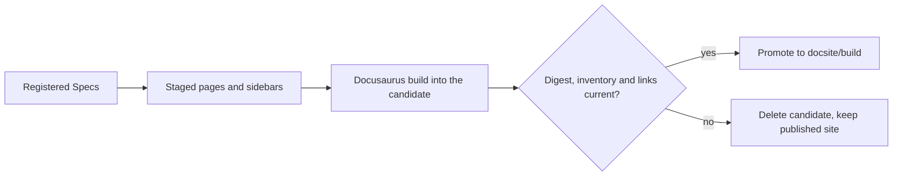
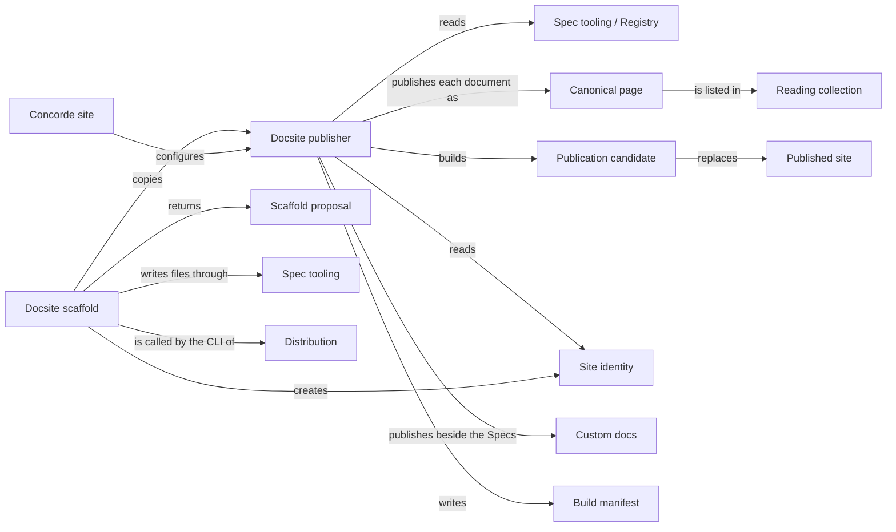

# Views

## Purpose

Views publishes a project's Specs as a documentation website, so that a developer can read the
Modules, follow how they fit together and look up their precise promises in a browser. It has two
parts. The publisher is a Docusaurus site under `docsite/` that turns the registered Spec documents
into pages, checks the result and only then replaces the previous site. The scaffold command copies
that same publisher into another Concorde project. Concorde publishes its own Specs with it. A
published page is only a view of the Specs: it grants no agent any context, never changes a Spec,
and proves nothing about whether the code keeps the promises it shows. Views does not define the
Spec format, which belongs to the Spec Module, does not install Node dependencies, and deploys
nothing unless a project opts into the GitHub Pages workflow the scaffold can add.

## Terminology

| Term | Definition |
| --- | --- |
| Published site | The last docsite build that passed every check, kept in `docsite/build/`. |
| Publication candidate | A complete new build, generated apart from the published site, that must pass every check before it may replace it. |
| Promotion | The directory swap that makes a checked publication candidate the new published site. |
| Canonical page | The single page at which one registered Spec document is published. |
| Reading collection | One of the two Spec tabs of the site, Module Specs or Implementation Specs, chosen for each document by its declared role. |
| Custom docs | Project-owned documentation that the site publishes in its own tab, beside the Specs and outside them. |
| Site identity | The project-owned file `docsite/site.json` that names the site and configures its optional homepage and custom docs. |
| Scaffold proposal | The exact list of files, with their digests, that the scaffold command would create in a project. |
| Build manifest | The record a build writes beside its pages, listing every published document with its route and source digests. |
| [Developer](../vocabulary.md#concept.concorde.developer) | |
| [Module](../vocabulary.md#concept.concorde.module) | |
| [Spec](../vocabulary.md#concept.concorde.spec) | |
| [Context](../vocabulary.md#concept.concorde.context) | |
| [Registry](../spec/module.md#concept.spec.registry) | |

A reader of the site meets canonical pages and reading collections. Someone who builds the site
meets the candidate, promotion and the build manifest. Someone who adds a site to a project meets
the scaffold proposal and the site identity.

## Usage

### Reading the site

<a id="concept.views.canonical-page"></a><a id="concept.views.reading-collection"></a>

The navigation bar has a **Module Specs** tab and, when any document has the role
`implementation`, an **Implementation Specs** tab. Both show the same tree of Modules, built from
the `contains` relations: the root Module at the top, and under each Module its child Modules. In
Module Specs, clicking a Module's name opens its entry `module.md`; its explanatory topics and child
Modules are listed beneath it. Implementation Specs shows only the precise documents
(requirements, scenarios, contracts) under the same tree. The role declared in each document's
metadata decides the tab. Moving a document from one role to the other moves it between tabs and
changes nothing else: its route, owner and the Modules that read it stay the same.

Every registered document has exactly one canonical page, under the Module that owns it. Its route
comes from its source path: `specs/concorde/views/scenarios.md` is published at
`/specs/concorde/views/scenarios`. When another Module reads the document through `uses` or
`includes`, the site does not copy it; links from that Module lead to the same page. So a shared
contract always has one page and one owner.

Each page starts with a short provenance bar: whether it is a Module Spec or an Implementation
Spec, its source path, links between the entry and the Module's implementation documents, and a
"Spec metadata" disclosure with the document identity, its owner, the Modules whose context selects
it and why, and the digests of its reading and metadata files.

Every stable identity is an anchor on its page: the Module on its entry, the document, and every
concept, realization, requirement, scenario and contract the document defines. A link written in a Spec as
`scenarios.md#scenario.views.build-site` arrives at
`/specs/concorde/views/scenarios#scenario.views.build-site`. Requirement and scenario headings
display only their title; the identity stays in the page as the heading's anchor. A Terminology
import row, which in the source holds only a link, is shown with the imported definition next to
the link, read from the defining document when the site is built and marked "Imported from" the
owning Module. Mermaid diagrams appear exactly
where the document places them, and a diagram marked `illustrative` carries a visible label saying
it is not normative.

<a id="concept.views.custom-docs"></a>

Custom docs appear in their own tabs. Concorde, for example, publishes the Spec Protocol chapters at
`/protocol` as a custom docs collection. Custom docs are ordinary documentation: they belong to no
Module and are never part of any agent's context.

### Building and previewing

<a id="concept.views.publication-candidate"></a><a id="concept.views.promotion"></a><a id="concept.views.published-site"></a><a id="concept.views.build-manifest"></a>

Run the commands from `docsite/` after installing its dependencies with `npm ci` (Node.js 20 or
newer). `npm run start` stages the current Specs and starts a local preview. `npm run validate`
loads and checks the registered sources without building. `npm run build` stages the Specs, builds
a publication candidate in `docsite/.generated/candidate`, checks it against the current sources
and, only if every check passes, promotes it to `docsite/build/`, the published site. `npm test`
runs the publisher's tests, and `npm run check` runs type checks, tests, validation and a build.

A successful build leaves a build manifest, `build-manifest.json`, at the root of the published
site. It lists every published document with its route, owner, reading collection and the digests
of its two source files, together with one digest over all inputs. It tells you exactly which
sources a site was built from; it says nothing about whether the code satisfies them.

If anything fails, the candidate is deleted and the published site stays exactly as it was. For
example, if a scenario moves to another document and a link still points to the old
`requirements.md#scenario...` location, the build stops with an error naming the referring page and
the missing destination. Fix the link and build again.

### Adding a site to a project

<a id="concept.views.scaffold-proposal"></a><a id="concept.views.site-identity"></a>

In an initialized Concorde project, ask for a scaffold proposal, read it, and then apply exactly
that proposal:

```bash
python3 .concorde/framework/scripts/concorde.py docsite --propose > proposal.json
python3 .concorde/framework/scripts/concorde.py docsite --apply --proposal proposal.json
```

The proposal lists every file of the publisher template, a new `docsite/site.json` and, with
`--github-pages`, a deployment workflow at `.github/workflows/deploy-docsite.yml`. `--title`,
`--repository`, `--url` and `--base-url` override the defaults, which come from the root Module's
title and the Git `origin` remote. The proposal also reports whether Node.js and npm are present;
it never installs them. The command runs in an isolated worktree and refuses the primary worktree
unless `--allow-primary-worktree` is given.

Applying creates only files that do not exist yet. If every file already has the proposed bytes,
the result is `unchanged`. If any destination exists with other content, the result is `conflict`
and nothing is written. A proposal made from different package bytes is rejected; propose again.
The scaffold never updates or deletes an existing site: bringing an existing site up to a newer
template is a manual, reviewed change.

After applying, edit `docsite/site.json` if needed. It holds the title, address and base URL, an
optional repository link, an optional homepage and optional custom docs collections. Without a
homepage, the site root redirects to the root Module's entry page. The exact fields are in
[the site identity rules](contracts.md#site-identity).

## Design

<a id="realization.views.publisher"></a>

**The registry is the only source.** The Docsite publisher reads the project configuration, the
registry and the documents the registry lists, and nothing else. It never scans directories for
Markdown or follows links to find documents. A nearby file that looks like a Spec therefore never
becomes a page, and nothing is published that no Module owns. The navigation tree follows
`contains` because composition is the Protocol's top-down reading path; directory layout plays no
part.

**One page per document, one route per path.** A document is published once, at a route derived
from its source path, so its address does not depend on which Modules read it. Consumers link to
the owner's page instead of receiving a copy, which prevents copies from drifting apart. There are
no alias or redirect routes: moving a document changes its route, and the build refuses any link
that still points to the old one.

**Rendered views are never written back.** Hiding identities in headings, adding anchors, filling
in imported definitions and labelling illustrative diagrams all happen on a staged copy under
`docsite/.generated/`. The Spec files stay byte-for-byte unchanged, so a published enrichment can
never become a second, unreviewed definition.

**A candidate protects the published site.** Rendering can fail halfway and sources can change
while a build runs. The publisher therefore builds into a separate directory and checks it before
promotion. It computes one source digest over the configuration, the registry and both files of
every document, and compares it at staging, after the Docusaurus build and in the final
validation. The build manifest records that digest and the page inventory, and the final check
also follows every internal link and anchor in the built HTML. Promotion is a rename of whole
directories with rollback, so a failure leaves the old site in place, and pages that a new build
no longer produces disappear with the old directory.



**The publisher checks what it depends on, not everything.** It refuses inputs it cannot publish
correctly, such as a document without a valid role, a requirement in a `module`-role document, an
unmarked Mermaid block that is not a flowchart or an unresolved link; the
[pipeline](pipeline.md#loading-and-admission) lists them all. It is not the Protocol validator:
the registry mirror, checked flowcharts, realization bindings and contract examples are checked by
the Spec Module's `concorde validate`, and a site that builds proves nothing more.

**Preview and production do not disturb each other.** The preview keeps Docusaurus's generated
files in `docsite/.docusaurus`, a production build in `docsite/.generated/docusaurus-production`,
so building the site does not break a running preview.

<a id="realization.views.scaffold"></a>

**The scaffold only creates.** The Docsite scaffold computes the template inventory with the same
rule the installer uses to ship `docsite/`, so a project receives exactly the adapter Concorde runs
itself. The proposal binds that inventory by digest. Applying it goes through the Spec Module's file
transactions: every destination must be absent before staging and again before each write, and a
concurrent change rolls back the files already written. Because the scaffold can neither replace
nor delete, accepting a proposal can never damage an existing site or a project Spec.

<a id="realization.views.concorde-site"></a>

**Concorde's own site is project-owned.** The Concorde site consists of the files that configure
Concorde's publication rather than the template: `docsite/site.json` with Concorde's homepage, the
Protocol collection under `docsite/custom-docs/`, the repository-specific tests in
`docsite/tests/repository/` and the GitHub Pages workflow. The template inventory excludes them, so
a scaffolded project never receives Concorde's homepage or Protocol chapters.

## Relationships



The publisher and the scaffold never edit each other's output: the scaffold creates files once,
and publication only reads Specs and writes derived output under `docsite/`. Neither changes a
registered Spec document.

<a id="uses-spec"></a>

**Spec.** The Spec Module defines the Protocol formats and owns the project [Registry](../spec/module.md#concept.spec.registry),
the Python loading of Specs and the [file transactions](../spec/module.md#concept.spec.file-transaction).
The publisher relies on the registry records to know which Modules and documents exist, which
Module contains which, and which Modules select a document. It parses the registry and metadata
itself in TypeScript and refuses any input it cannot publish, which fails the build and keeps the
published site; it leaves full structural conformance to the Spec validator. The scaffold relies
on the Spec Module to find the root Module's title for the default site title, to report findings
in the common result shape, and to apply its files through a transaction that
[writes everything or nothing](../spec/requirements.md#req.spec.transaction-all-or-nothing) and
[stops on stale input](../spec/requirements.md#req.spec.transaction-digest-bound), a null digest
meaning the file must still be absent. When the project has no readable Spec configuration, the
scaffold returns `invalid` and asks for project initialization first.

<a id="uses-distribution"></a>

**Distribution.** Distribution builds and installs the Concorde
[package](../distribution/module.md#concept.distribution.package) and provides its command line.
The scaffold is reached as `concorde.py docsite`, which Distribution's CLI dispatches after
enforcing the isolated worktree, and it reads the templates from the installed package, whose
manifest `concorde.json` must list `docsite` as a package root. In the other direction,
Distribution's installer ships `docsite/` using the inventory rule that Views defines, so the two
cannot disagree about the template. When the package root is missing or unsafe, the scaffold
returns `invalid` and asks for a reinstall. Distribution's own build manifest records Concorde's
generated build outputs and is unrelated to the docsite's build manifest.
