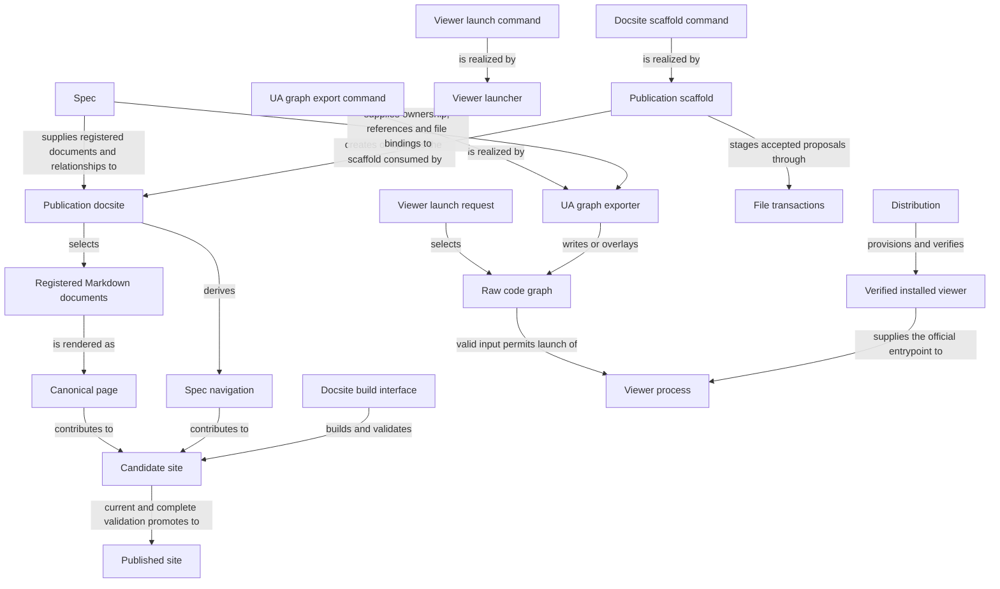

```concorde-document
{
  "id": "document.views.module",
  "owner": "module.views",
  "main_visible": true
}
```

# Views

Publish registered Module Specs as a navigable documentation site, deterministically export or
overlay a skeleton Understand Anything code graph from that same registry, and open an existing
Understand Anything code graph with the verified installed viewer.

## Purpose

Views turns the project's explicit Spec registry into a documentation site that developers and
reviewers read, deterministically projects that same registry into a skeleton Understand Anything
knowledge graph, and separately lets a developer open an already-produced code-structure graph in
the official Understand Anything viewer. Its publishing promises stop at rendering registered
Markdown faithfully: it derives pages and navigation only from the registry, and it never infers a
Module's completeness or correctness from a diagram, a route or a rendered page. Its graph-export
promises stop at deriving Module, document and bound-file structure from the registry; it never
scans the filesystem for undeclared content, and repeated export replaces only elements in its
declared ownership scope. Its viewer promises stop at admission and launch: the launcher does not generate
the graph it opens, does not judge whether that graph still agrees with the code, and does not grant
an agent any access beyond its own host-bound Spec context.

## Requirements

### req.views.registry-derived-pages — Pages and navigation derive from the registry

Publication SHALL derive Module Spec pages and their navigation only from the explicit registry.

Every published Module Spec is traceable to a registered entry. The optional project introduction
and independent Protocol collection are presentation surfaces outside that membership. See
[req.views.no-directory-scanning](#req.views.no-directory-scanning).

### req.views.no-directory-scanning — No directory scanning or link-based discovery

Publication SHALL NOT discover Spec documents by scanning directories or following links.

### req.views.one-page-per-document — One canonical page per registered document

A physical Spec document SHALL publish at exactly one canonical page regardless of how many Modules register it.

### req.views.current-internal-links — Published internal links resolve

Publication SHALL promote only a candidate in which every internal navigation link retained in its published documents resolves to an available destination and, when specified, an existing anchor.

The guarantee covers the site's own published pages, including enabled reading collections.
Cross-Module references are valid navigation and do not establish document ownership and references or expand
Spec context. External destinations retain their existing handling; publication does not promise
the continued availability of another website. Current-owner legacy aliases and failure
behavior are defined in [publication](publication.md#scenario.views.publish-legacy-redirect)
and [pipeline](pipeline.md#scenario.views.validate-candidate-mismatch).

### req.views.no-agent-context-grant — No extra agent context from a rendered view

A rendered page or generated view SHALL NOT itself grant an agent invocation additional Spec context beyond its own host-bound target snapshot.

### req.views.diagram-source-identity — Mermaid fence is the sole diagram source

An inline Mermaid fence in a Module's Relationships subsection SHALL be its sole authored diagram source.

### req.views.no-external-diagram-record — No external diagram record or output

Publication SHALL create no external diagram record or `generated/diagrams` output.

The authored fence is the sole source; publication produces no external record derived from it.

### req.views.no-docsite-graph-view — No docsite graph view

Publication SHALL NOT expose the former Module, Scenario or entity-relationship graph view.

This removes the docsite graph page and route, Graph navigation entry, graph-specific UI,
architecture-graph projection and artifact, and resources or dependencies used exclusively for that
feature. It also applies to the publishing template supplied to consumer projects. Dependencies
and resources still needed for ordinary reading, navigation or inline Mermaid rendering remain.
The UA exporter and official viewer remain separate non-docsite facilities.

Concorde's own source-checkout site has an independent Agent Flows page describing actual runtime
execution. It is excluded from the consumer template and does not derive a graph from the Spec
registry. See [Agent execution publication](pipeline.md#scenario.views.agent-flows).

### req.views.agent-flows — Concorde-only execution diagrams

Concorde's own docsite SHALL publish an Agent Flows tab whose LangGraph nodes and edges come from
the current executable factories and whose explanations distinguish execution, wrappers and
unimplemented design.

### req.views.production-preview-isolation — Production builds preserve preview output

A production build SHALL NOT clear or overwrite the development preview's generated directory.

### req.views.hash-format — Digests use the sha256 hex format

Every content or source digest SHALL be `sha256:` followed by 64 lowercase hexadecimal digits.

### req.views.safe-relative-paths — Member paths are safe relative POSIX paths

Every member path SHALL use POSIX separators without absolute paths, backslashes, empty, dot or traversal components, or symlinks.

### req.views.promote-atomic — Promotion restores the prior destination on failure

`promoteCandidate` SHALL attempt to restore the prior destination on a failed move or removal.

### req.views.promote-requires-checked-candidate — Promotion runs only on checked candidates

`promoteCandidate` SHALL NOT be called on unchecked or stale output.

### req.views.no-contract-context-expansion — Contract edges do not expand loaded context

The registry loader SHALL NOT follow a `concorde-contract` edge to import additional Module context.

### req.views.no-graph-generation — Launcher leaves graph contents unchanged

The viewer launcher SHALL NOT modify graph contents, including generating or rewriting the graph it opens.

### req.views.no-graph-freshness-verification — Launcher never verifies graph freshness

The viewer launcher SHALL NOT verify the freshness of the graph it opens against source.

### req.views.no-dependency-install — Launcher resolves no dependencies or network access

The viewer launcher SHALL NOT resolve dependencies or perform network acquisition.

### req.views.cli-syntax-errors — Argument errors exit separately from launch failures

Invalid launch syntax or a port outside 0-65535 SHALL exit through argument parsing with code 2, distinct from a failed launch's exit code 3.

### req.views.ua-graph-registry-only — Exported skeleton derives only from the registry

The UA graph exporter SHALL limit derivation inputs to the explicit registry, registered documents, declared implementation listings and an admitted existing graph.

The existing graph supplies foreign-node reuse and the unlisted-file layer under the local overlay
rules; it does not authorize discovery of additional project files or Spec membership. Fresh
skeletons derive their structure solely from registered inputs, with initial project metadata as
defined in the local serialized graph contract.

### req.views.ua-graph-idempotent — Re-export replaces only Concorde-owned elements

A repeated export SHALL replace only the nodes, edges and layers in the ownership scope defined by scenario.views.ua-graph-overlay, leaving every other element of an existing graph unchanged.

## Scenarios

Scaffold and top-level publication scenarios are defined in [publication](publication.md).
Registry loading, materialization and build/promotion scenarios are defined in
[pipeline](pipeline.md). Viewer launch scenarios are defined in [viewer](viewer.md), and UA graph
export scenarios in [ua-graph](ua-graph.md).

## Ontology

The Ontology names the publication, viewer and UA export programs, their interfaces and the data
they exchange. Removing the docsite graph view does not remove authored relationship diagrams,
registry relationships or the independent UA facilities.

### Entities

Entity file declarations retain their exact registered entries. A more specific entry takes
precedence over a containing directory entry.

```concorde-entities
[
  {
    "id": "entity.views.publication-docsite",
    "title": "Publication docsite",
    "kind": "program",
    "responsibility": "Realizes registry-driven Markdown publication: materializes one canonical page and inline Mermaid rendering per physical document, derives navigation, binds a candidate to exact source digests and route coverage, and promotes only a complete current candidate while preserving the previous successful build on failure.",
    "files": ["docsite/"]
  },
  {
    "id": "entity.views.publication-scaffold",
    "title": "Publication scaffold",
    "kind": "program",
    "responsibility": "Realizes exact docsite scaffold proposals and deploys the current publishing template without a standalone graph view for a registered project, without reading code to infer architecture.",
    "files": ["src/concorde/views/", "tests/concorde/views/"]
  },
  {
    "id": "entity.views.viewer-launcher",
    "title": "Viewer launcher",
    "kind": "program",
    "responsibility": "Realizes the deterministic admission and process-launch boundary that selects the first existing raw graph, verifies the installed runtime and launches the official viewer without generating the graph or installing dependencies.",
    "files": ["scripts/run-ua-graph-viewer.py", "tests/concorde/views/test_viewer_launcher.py"]
  },
  {
    "id": "entity.views.ua-graph-exporter",
    "title": "UA graph exporter",
    "kind": "program",
    "responsibility": "Realizes the deterministic export or overlay of a skeleton Understand Anything graph from the registry's Module identities, relationships, documents and entity file listings, replacing on re-export only the nodes, edges and layers in its declared ownership scope.",
    "files": ["src/concorde/views/ua_graph.py", "tests/concorde/views/test_ua_graph.py"]
  },
  {
    "id": "entity.views.file-transactions",
    "title": "File transactions",
    "kind": "shared program",
    "responsibility": "Realizes exact replacement proposals as staged filesystem operations with before-digest checks and original-byte recovery, for every Module that applies an accepted proposal.",
    "files": ["src/concorde/spec/changes.py"]
  },
  {
    "id": "entity.views.spec",
    "title": "Spec",
    "kind": "used module",
    "target_id": "module.spec",
    "responsibility": "Supplies the explicit registry, document ownership and references, relationships and file bindings used by publication and UA export, without recursive filename discovery."
  },
  {
    "id": "entity.views.distribution",
    "title": "Distribution",
    "kind": "used module",
    "target_id": "module.distribution",
    "responsibility": "Provisions and verifies the official viewer package inside the managed runtime that the viewer launcher checks before starting a launch."
  },
  {
    "id": "entity.views.docsite-scaffold-command",
    "title": "Docsite scaffold command",
    "kind": "interface",
    "responsibility": "The deterministic `concorde docsite --propose`/`--apply` command that creates and applies an accepted project-relative scaffold proposal under the host's worktree policy, checking before-digests and owning only scaffold files."
  },
  {
    "id": "entity.views.docsite-build-interface",
    "title": "Docsite build interface",
    "kind": "interface",
    "responsibility": "The TypeScript requireScoped/loadScopedRegistry/materializeScoped/buildSite/promoteCandidate functions and Docusaurus plugin hooks, plus the project-local npm run validate/npm run build commands, that admit only a Profile 12 project, load the registry, stage Markdown and navigation, build and validate a candidate and promote only a checked result."
  },
  {
    "id": "entity.views.viewer-launch-command",
    "title": "Viewer launch command",
    "kind": "interface",
    "responsibility": "The `python3 .../scripts/run-ua-graph-viewer.py --project-root PATH [--port N] [--no-open]` command that admits an existing raw graph and a verified runtime and launches the official viewer, returning its process exit code."
  },
  {
    "id": "entity.views.ua-graph-command",
    "title": "UA graph export command",
    "kind": "interface",
    "responsibility": "The `python -m concorde ua-graph [--check]` command that derives a skeleton Understand Anything graph from the registry, overlays it onto an existing raw graph when one is present, and reports drift without writing under `--check`."
  },
  {
    "id": "entity.views.markdown-documents",
    "title": "Registered Markdown documents",
    "kind": "concept",
    "responsibility": "Every physical Spec document explicitly registered in the project's Spec registry, including solely owned documents referenced by several Modules, which publication renders without directory scanning."
  },
  {
    "id": "entity.views.canonical-page",
    "title": "Canonical page",
    "kind": "record",
    "responsibility": "The one rendered page a registered physical document publishes at its readable derived route, carrying its sole owner, inclusion provenance, aliases and content digest even when several Modules reference it."
  },
  {
    "id": "entity.views.navigation",
    "title": "Spec navigation",
    "kind": "concept",
    "responsibility": "The primary directory-mirroring sidebar and secondary Module-composition view, derived from registered paths and parent relationships without directory scanning or a standalone graph view."
  },
  {
    "id": "entity.views.candidate-site",
    "title": "Candidate site",
    "kind": "record",
    "responsibility": "The staged build whose exact source digest, route inventory and diagram rendering are validated against the current registry before promotion is considered."
  },
  {
    "id": "entity.views.published-site",
    "title": "Published site",
    "kind": "concept",
    "responsibility": "The previously promoted build that a validation failure or a source change during generation leaves untouched, so only a complete current candidate ever replaces it."
  },
  {
    "id": "entity.views.viewer-request",
    "title": "Viewer launch request",
    "kind": "concept",
    "responsibility": "One invocation of the viewer launch command with its project root and optional port/no-open flags."
  },
  {
    "id": "entity.views.code-graph",
    "title": "Raw code graph",
    "kind": "external observation",
    "responsibility": "The first existing knowledge-graph JSON file in the manifest's ordered graph_paths, an observation produced by another tool that the launcher admits by shape but does not generate, rewrite or check for freshness against source."
  },
  {
    "id": "entity.views.verified-viewer-runtime",
    "title": "Verified installed viewer",
    "kind": "concept",
    "responsibility": "The runtime marker and viewer package identity that Distribution's managed runtime provisions and that the launcher checks before starting the official viewer."
  },
  {
    "id": "entity.views.viewer-process",
    "title": "Viewer process",
    "kind": "concept",
    "responsibility": "The launched official-viewer child process, run from the project directory with the requested flags, whose exit code (or 130 on interruption) the launcher returns."
  }
]
```

### Relationships

Publication scaffold and Publication docsite touch disjoint files and never edit each other's
output: the scaffold's own exact-file transaction creates or updates project structure, and
rendering project Specs never authorizes editing them. A candidate is promoted only when complete
and current; any invalid link, diagram or stale source during generation leaves the published site
exactly as it was. Registry composition still supplies navigation, and dependency and interface
agreements still undergo validation; none creates a standalone docsite graph projection.

The UA graph exporter derives and writes a skeleton from the registry without judging agreement
with code. The viewer launcher independently admits an existing graph and verified runtime and
launches a process; it neither generates nor verifies the freshness of that graph.



## Dependencies and composition

```concorde-dependencies
[
  {
    "target_id": "module.spec",
    "responsibility": "Supply the explicit registry, document ownership and references, relationships and entity file bindings consumed by publication and UA export.",
    "selection_condition": "When loading publication inputs, materializing pages or navigation, or exporting the UA graph skeleton.",
    "relied_upon_promises": [
      "[Derive pages and graph structure from explicit unique ownership, references and entity listings](../spec/structure.md#registry-shape)",
      "[Resolve inclusion provenance without recursive reads](../spec/registry.md#stable-id-spec-context-queries)"
    ]
  },
  {
    "target_id": "module.distribution",
    "responsibility": "Provision and verify the official viewer package inside the managed runtime.",
    "selection_condition": "When launching the viewer.",
    "relied_upon_promises": [
      "[Launch only the exact verified viewer entrypoint and stop on an absent receipt](../distribution/runtime.md)"
    ]
  }
]
```

## Unresolved information

Publication accepts Profile 12 projects only. `requireScoped` refuses any other `profile_version`
with an explicit error, and no compatibility rendering path exists for an older profile: migrating
such a project is a separate, explicit topology change that this Module does not perform.

## Ownership, context and implementation status

The loaders and exporters implement publication schema 19, unique owners, reference provenance, canonical contract anchors and UA reference edges. Reference inclusion creates no transclusion, implementation grant or new page authority.
