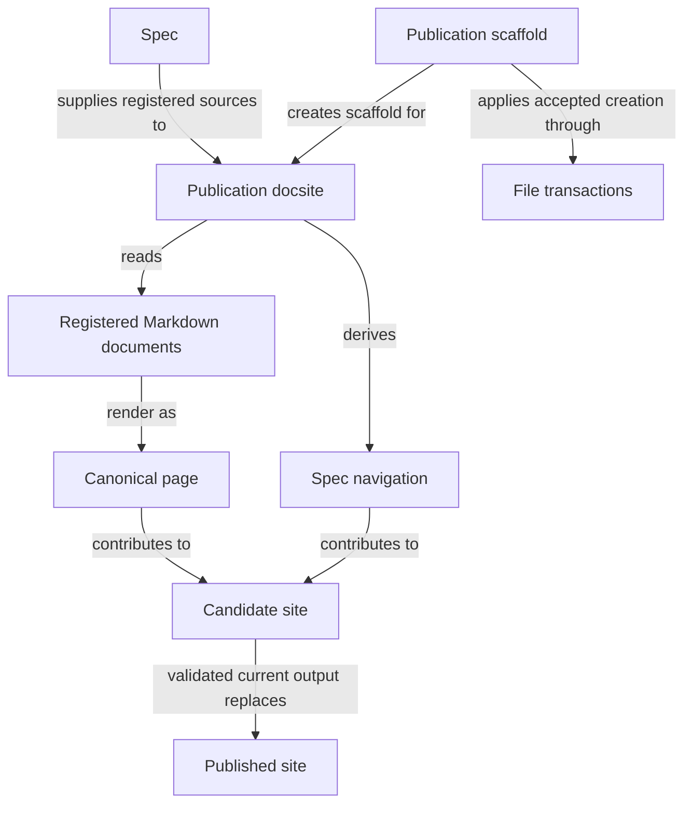

# Views

## Purpose

Views publishes registered specifications as a readable website. Developers use it to understand a project and inspect its declared relationships. A published page does not by itself prove that the code satisfies the specification.

## Terminology

| Term | Meaning / definition |
| --- | --- |
| [Module Specs](../module.md#terminology) | Defined in Concorde Framework. |
| [Implementation Specs](../module.md#terminology) | Defined in Concorde Framework. |
| [Registry](../module.md#terminology) | Defined in Concorde Framework. |
| [Publication candidate](pipeline.md#terminology) | Defined in From source documents to a published site. |
| [Promotion](pipeline.md#terminology) | Defined in From source documents to a published site. |
| [Document role](../spec/values.md#terminology) | Defined in Identities and versions. |
| [Document unit](../spec/values.md#terminology) | Defined in Identities and versions. |
| [Spec context](../harness/context.md#terminology) | Defined in What information a worker receives. |
| [Reference](../spec/registry.md#terminology) | Defined in Registry. |
| [Entity](../module.md#terminology) | Defined in Concorde Framework. |
| [Graph](../module.md#terminology) | Defined in Concorde Framework. |
| [Semantic completeness](../spec/structure.md#terminology) | Defined in What structural validation tells you. |

## Usage

Use Views to publish registered Specs as a docsite. For a new site, propose a scaffold, inspect it
and apply the exact proposal; existing site files are not overwritten.
With site dependencies prepared, build and validate the publication candidate before publication. A broken
link, invalid document or stale input prevents promotion and preserves the previous published site.
[Publication](publication.md) explains scaffolding, custom documentation and reading behavior;
[pipeline](pipeline.md) defines the build API and records.

For reading, start with **Module Specs** to understand a Module's purpose, correct use and design.
When its author explicitly classifies detailed companions, **Implementation Specs** provides a
parallel tab for precise obligations and interfaces, with links back to the owning Module.
Both tabs read from the same registry: references never duplicate a document, and changing its tab
neither changes its canonical route nor removes it from complete agent Spec context.
Classification is explicit, never inferred from a filename or the presence of SHALL statements.
The [publication contract](scenarios.md#scenario.views.reading-collections) specifies the details.

The Spec reader presents Usage before Design, so using a Module
does not require first reading its entity/file inventory. Both explanations remain canonical reading content.
Custom docs are separate human documentation and grant no Spec context. No rendered view proves
semantic completeness or authorizes a change.

## Design

Publication docsite reads Registered Markdown documents and their paired metadata as one source
model, but produces one Canonical page per reading document. Spec navigation follows registered
Module parentage rather than directory structure. The Docsite build interface separates admission,
materialization, candidate build, source/link validation and promotion. Only a current validated
Candidate site replaces the Published site; a failure preserves the last successful build.
Metadata participates in source identity and auxiliary provenance, not an appended file inventory.
The Protocol's explicit document role assigns each source to a reading collection; the publisher
validates that formal definitions occur only in Implementation Specs. Role-based navigation retains
one complete Module specification: both sidebars derive from the same Module parentage, each document appears once, and
shared provider definitions stay at their owner's canonical page. Main entries retain an explanatory
reading path; exact requirements and scenarios can be authored once in owned companions rather
than repeated or extracted into a second generated specification.
The [pipeline design](execution-reference.md#pipeline-design) defines these identities and promotion mechanics.

Docsite scaffold command uses Publication scaffold and File transactions to create only the exact
accepted site files. Scaffolding does not rewrite project Specs or overwrite existing consumer
files. Provider definitions stay at their canonical pages: ordinary links never transclude a
second copy of a shared contract.

## Relationships

Publication scaffold and Publication docsite touch disjoint files and never edit each other's
output: the scaffold's own exact-file transaction creates or updates project structure, and
rendering project Specs never authorizes editing them. A publication candidate is promoted only when complete
and current; any invalid link, diagram or stale source during generation leaves the published site
exactly as it was. Registry composition still supplies navigation, and dependency and interface
agreements still undergo validation; none creates a standalone docsite graph projection.

### Publication and scaffolding

This view covers reading publication and its creation-only scaffold. Concorde-only Graph inspection
additionally uses [Harness Module](../harness/module.md) under the local agreement below.

## Precise specifications

The explanation above is the entry to the Views specification. Its
[Module-wide requirements](requirements.md), [scenarios](scenarios.md) and
[interface contracts](contracts.md) provide the precise obligations used for implementation and
verification under **Implementation Specs**. Publication and pipeline pages remain explanatory
topics under **Module Specs**.
They remain normative parts of this same Module, not code documentation or a separate context.

## Dependencies and composition

### Spec

The [Spec Module](../spec/module.md) supplies the explicit registry, document ownership and references, relationships and file bindings used by publication, without recursive filename discovery.

Supply the explicit registry, document ownership and references, relationships and entity file bindings consumed by publication.

This collaboration applies when loading publication inputs or materializing pages or navigation.

- [Derive pages and navigation from explicit unique ownership, references and entity listings](../spec/structure.md#registry-shape)
- [Resolve inclusion provenance without recursive reads](../spec/contracts.md#registry-stable-id-spec-context-queries)

### Harness

Supply inspectable executable Graphs without invoking nodes.

This collaboration applies when compiling Agent execution views without running nodes.

- [Harness contract](../harness/graphs-and-loops.md); preserve its admission conditions, retain distinct blockers and do not infer wider authority from composition.

## Unresolved information

Publication accepts Profile 15 projects only. `requireScoped` refuses any other `profile_version`
with an explicit error, and no compatibility rendering path exists for an older profile: migrating
such a project is a separate, explicit topology change that this Module does not perform.

## Ownership, context and implementation status

The loaders and exporters implement publication schema 21, unique owners, reference provenance, and canonical contract anchors. Reference inclusion creates no transclusion, implementation grant or new page authority.
