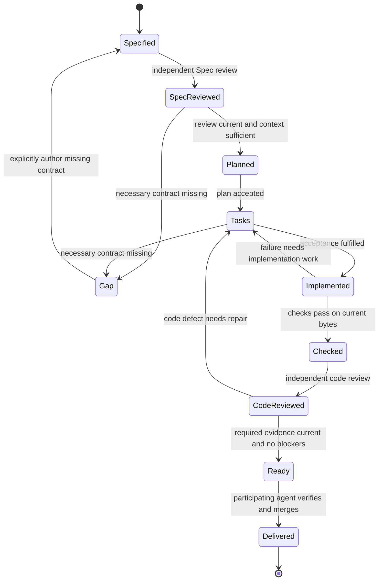

```concorde-document
{
  "id": "document.workflow.development",
  "targets": [
    "domain.workflow"
  ],
  "main_visible": true
}
```

# Development Agent Graph and revision loops

A developer supplies intended behavior and constraints for one top-level candidate change.
`concorde-dev-loop` coordinates Spec authoring, review, context assessment, planning, tasks,
implementation and checks. `specify=false` skips authoring; `run_reviews=false` records review
skips where no earlier requirement exists. These are configurations of one development lifecycle.
Its successful output is a ready candidate, not an automatic merge.

## Stages and outcomes


The standard loop follows these transitions; fast-loop skips remain explicit review records.




## AI and human feedback

Author, assessor, planner, task author, implementation and reviewer invocations MUST resolve their
own Agent definitions and effective Harnesses. Shared Graph state contains admitted outputs and
feedback, not their private transcripts. Review findings identify the input revision and the
required repair. A code defect selects an implementation repair and another review; a necessary
Spec gap selects a clarification or authorized Spec-authoring path before implementation resumes.

The Graph MUST record which AI finding or human decision selected a transition. Repeated unchanged
blocking feedback waits for new information or stops at the declared limit. Human changes to intent
create a revised task and invalidate dependent plans and evidence. Human acceptance required for
another transition remains explicit; a reviewer cannot grant it. `ready` ends this Graph, while
user-authorized delivery remains a separate capability.

## Failure and recovery

A known prohibition is unsupported, a contradiction is conflicting, a missing runtime value is
invalid input, and tool failure is failed. None automatically means Spec incomplete. A gap names
the unresolved question, blocked step and needed contract; target and snapshot identity accompany it.
Context solving diagnoses from the exact existing collection and never expands permissions.

A Domain task may coordinate multiple components participating in that scope or its nested scopes.
The Domain planner sees only the Domain collection and derives exact component IDs from its local
`concorde-participants` declarations. Before planning, deterministic context solving rejects any
missing direct registry relationship as a Domain-owned Spec gap and reports inconsistent entries as
conflicting. Each component
receives its own explicit task, local authoring invocation and fast loop. All affected
consumer/provider contract views must agree before any component implementation begins. Component
ancestry and scope membership never grant extra reads. Successful component revisions are checked
again before Domain delivery.

Checks are trusted deterministic argv declared by project configuration, not commands invented by
an agent. Raw logs stay out of later Spec-only sessions. A stale Spec, changed task intent, modified
code, failed check or missing completion blocks delivery and preserves the candidate worktree. Resuming a
change reuses its target records and typed artifacts but starts a fresh agent session. The host does not copy unrelated
conversation or free-form predecessor output into context.
