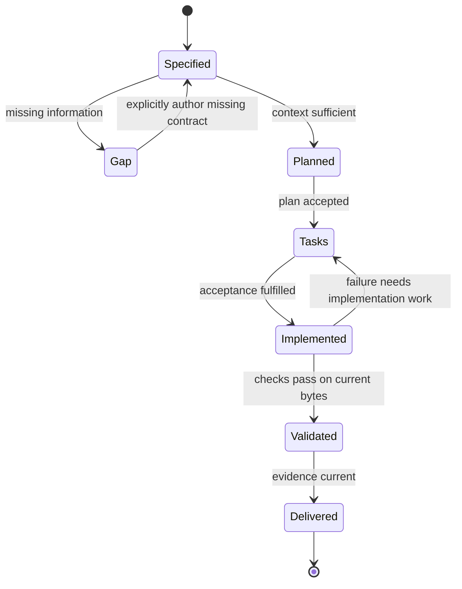
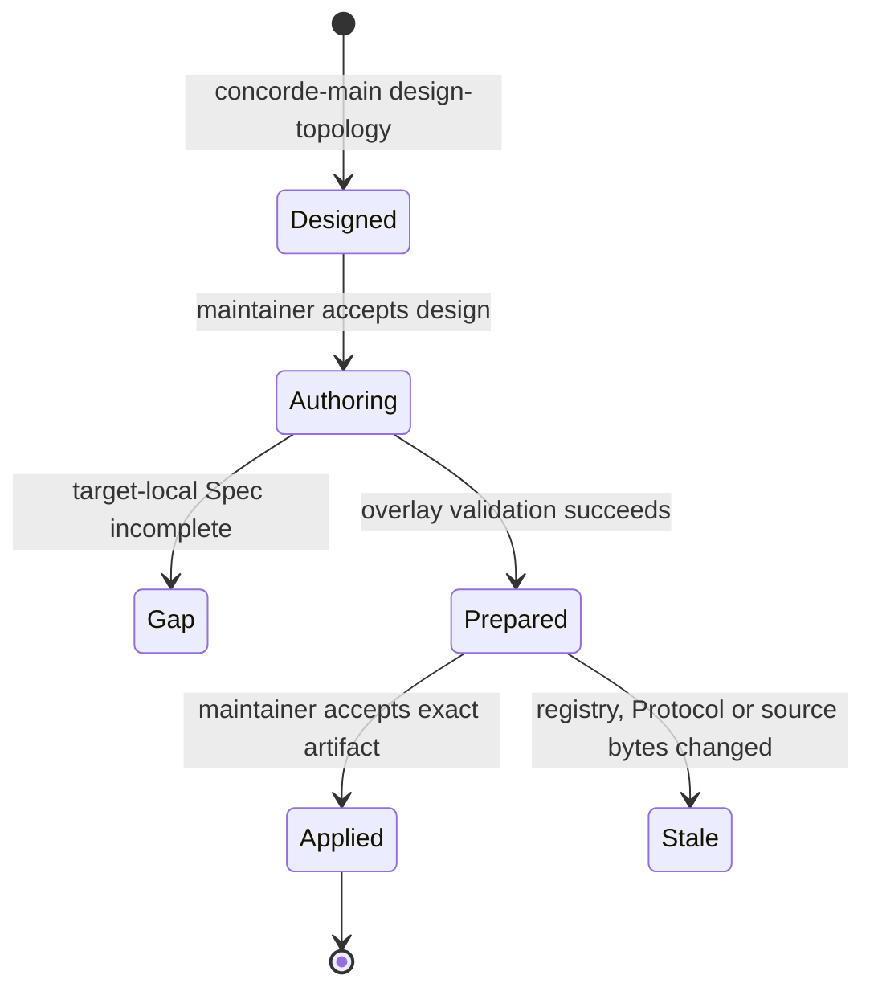

# How a specified change progresses

This Domain concerns turning intended behavior into a completed, evidenced change. It includes
Spec contexts, the Operation host, agent execution, permissions, reflection triage and file transactions.
The Operation inventory in this collection is the complete public command vocabulary.

## Business entities and responsibility

A Task is user intent for exactly one target, optionally focused on a local Feature or API. Its
constraints travel unchanged through the change attempt. A Configuration selects a supported agent
integration and enforcement mode; it is project setup, not per-stage agent authority. A Spec snapshot
freezes the selected collection plus global principles and the target kind definition. A Stage is
one fresh cognition session with a declared role. A Change attempt binds its plan and tasks to the
intent and Spec revision. A Check measures implementation and returns status plus byte identities.
A Gap is a concrete missing obligation or fact required by a stage. A Reflection is a reported
problem that may require investigation and, separately, human approval of a proposed resolution.
A Topology design is a coordinator-authored candidate registry plus target-local Spec tasks. A
Topology application is the host-private exact registry/document byte set produced only after that
design is accepted.

The context Service selects only registered local documents. The host gives that snapshot to the
agent execution Module under a permission policy compiled for the stage. Authoring returns proposed
replacement documents; the host applies only members of the selected collection. Planning first
assesses whether the task is answerable. An insufficient context stops before an attempt is created.
Tasks turn the accepted plan into explicit acceptance conditions. The implementation worker receives
that plan/tasks TypedValue plus explicitly owned code. It cannot edit Specs, registry or other code.

## Main routing view

The main coordinator may expand this Domain after `domain.concorde` identifies a workflow task. It
selects `service.spec-context` for target registration, Protocol binding, context resolution and
Spec structural validation; `service.workflow-host` for public Operation admission, routing,
agent-stage execution and lifecycle state; and `service.reflections` for Reflection selection,
investigation or disposition. It selects `module.registry` for the in-process registry API,
`module.wire-contracts` for TypedValue/schema validation, `module.file-transactions` for atomic file
replacement, `module.agent-execution` for native model-process execution,
`module.permissions` for policy compilation, `module.package-assets` for capability projection, and
`module.spec-publication` for workflow-facing publication integration. Module IDs are selectable
from this routing view but their Specs remain unavailable to the main coordinator.

## Conditions, states and recovery

Topology evolution follows a separate two-gate sequence:

No target author writes project files. A gap leaves the pre-design project unchanged. Prepared
artifacts contain full proposed bytes, but only their path/digest enters coordinator cognition.
Application is one host transaction with current before-digests and final repository validation.

A known prohibition is unsupported, a contradiction is conflicting, a missing runtime value is
invalid input, and tool failure is failed. None automatically means Spec incomplete. A gap names
the unresolved question, blocked step and needed contract; target and snapshot identity accompany it.
Context solving diagnoses from the exact existing collection and never expands permissions.

A Domain task may coordinate multiple components participating in that scope or its nested scopes.
The Domain planner sees only the Domain collection. Each component receives its own explicit task,
local authoring invocation and fast loop. All affected consumer/provider contract views must agree
before any component implementation begins. Component ancestry and scope membership never grant
extra reads. Successful component revisions are checked again before Domain delivery.

Checks are trusted deterministic argv declared by project configuration, not commands invented by
an agent. Raw logs stay out of later Spec-only sessions. A stale Spec, changed task intent, modified
code, failed check or missing completion blocks delivery and preserves the attempt. Resuming a
change reuses its typed artifacts but starts a fresh agent session. The host does not copy unrelated
conversation or free-form predecessor output into context.

Reflection status is metadata-only. Investigation runs as read-only implementation with selected
record bytes and HEAD. The host preserves the original report and human comments, writes findings
and an evidence-bound plan, and enforces configured approval. Implementation gets a newly authored
behavior task through a standard loop. Human disposition remains required before closing a report;
merely observing that a problem no longer reproduces does not dismiss it.
