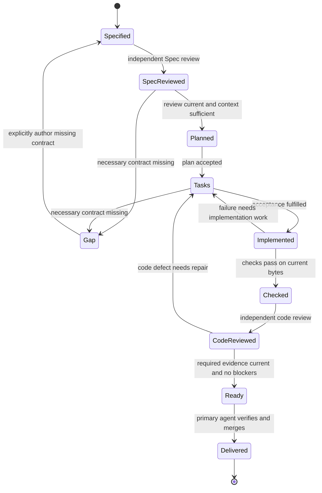
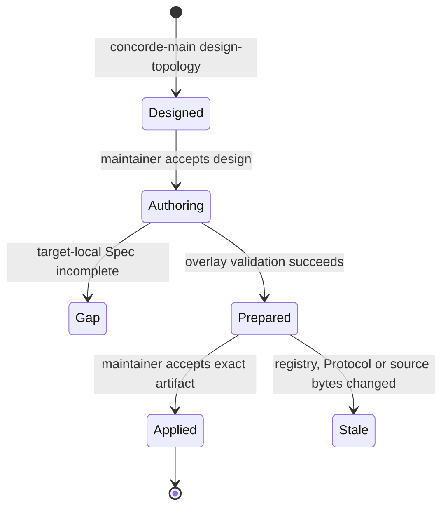

```concorde-document
{
  "id": "document.workflow.lifecycle",
  "targets": ["domain.workflow"],
  "main_visible": true
}
```

# How a specified change progresses

This Domain concerns turning intended behavior into a completed, evidenced change. It includes
Spec contexts, the Operation host, agent execution, permissions, reflection triage and file transactions.
The Operation inventory in this collection is the complete public command vocabulary.

## Business entities and responsibility

A Task is user intent for exactly one target, optionally focused on a local Feature or API. Its
constraints travel unchanged through the change attempt. A Configuration selects a supported agent
integration and enforcement mode; it is project setup, not per-stage agent authority. A Spec snapshot
freezes the selected target's Target Spec plus one-hop Shared Specs, global principles and kind definition. A Stage is
one fresh cognition session with a declared role. A candidate worktree owns one change and binds its plan, target tasks and progress to
the intent and Spec revision. A Check measures implementation and returns status plus byte identities.
An independent Review examines representative tasks against a complete Spec, or compares registered
implementation with its contracts, in a separate read-only session. A Gap is a concrete missing
obligation or fact required by a stage. A Reflection is a reported
problem that may require investigation and, separately, human approval of a proposed resolution.
A Topology design is a coordinator-authored candidate registry plus target-local Spec tasks. A
Topology application is the host-private exact registry/document byte set produced only after that
design is accepted.

The context Service selects only registered target-local and shared documents, never the remaining
collections of co-referencing entities. The host gives that snapshot to the
agent execution Module under a permission policy compiled for the stage. Authoring returns proposed
replacement documents. A normal target author may change only documents referenced by that target
alone; collective shared truth requires the accepted multi-author topology path. Planning first
assesses whether the task is answerable. An insufficient context stops before a target plan is created and leaves a recorded worktree gap.
Tasks turn the accepted plan into explicit acceptance conditions. The implementation worker receives
that plan/tasks TypedValue plus explicitly owned code. It cannot edit Specs, registry or other code.

## Main routing view

The main coordinator may expand this Domain after `domain.concorde` identifies a workflow task. It
selects `service.spec-context` for target registration, Protocol binding, context resolution and
Spec structural validation; `service.workflow-host` for public Operation admission, routing,
agent-stage execution and lifecycle state; and `service.reflections` for Reflection selection,
investigation or disposition. It selects `module.registry` for the in-process registry API,
`module.wire-contracts` for TypedValue/schema validation, `module.file-transactions` for atomic file
replacement, `module.agent-execution` for native model-process execution,
`module.permissions` for policy compilation, `module.package-assets` for capability projection, and
`module.spec-publication` for workflow-facing publication integration. Module IDs are selectable
from this routing view but their Specs remain unavailable to the main coordinator.

## Participating components

```concorde-participants
[
  {
    "target_id": "service.spec-context",
    "kind": "service",
    "responsibility": "Resolve registered target context and validate Spec structure for workflow stages.",
    "selection_condition": "Select when a workflow needs target selection, context resolution, Protocol binding, or Spec validation.",
    "relied_upon_promises": [
      "Each non-implementation worker receives exactly one complete registered target collection plus its pinned global rules."
    ]
  },
  {
    "target_id": "service.workflow-host",
    "kind": "service",
    "responsibility": "Admit public Operations and coordinate their bounded lifecycle transitions.",
    "selection_condition": "Select for Operation routing, agent-stage orchestration, worktree changes, checks, or delivery behavior.",
    "relied_upon_promises": [
      "Every agent stage is a fresh invocation bound to typed input, context identity, policy, and completion evidence."
    ]
  },
  {
    "target_id": "service.reflections",
    "kind": "service",
    "responsibility": "Retain, investigate, implement, and dispose project Reflections under explicit ownership and approval.",
    "selection_condition": "Select when work concerns Reflection status, evidence, investigation, implementation, or disposition.",
    "relied_upon_promises": [
      "Reflection investigation is read-only implementation cognition and human disposition remains independent."
    ]
  },
  {
    "target_id": "module.registry",
    "kind": "module",
    "responsibility": "Admit registry metadata and select targets, focuses, documents, contracts, and implementation ownership.",
    "selection_condition": "Select for in-process registry parsing, identity lookup, membership, or ownership validation.",
    "relied_upon_promises": [
      "Registry lookup never adds ancestor, peer, participant, or implementation bodies to a target context."
    ]
  },
  {
    "target_id": "module.wire-contracts",
    "kind": "module",
    "responsibility": "Validate versioned TypedValues and JSON boundary schemas.",
    "selection_condition": "Select when an Operation or internal handoff needs deterministic data admission.",
    "relied_upon_promises": [
      "Unknown fields, incompatible type identities, unsupported versions, and unsafe project paths are rejected."
    ]
  },
  {
    "target_id": "module.file-transactions",
    "kind": "module",
    "responsibility": "Apply exact authorized file replacements with current before-digests and rollback.",
    "selection_condition": "Select when a workflow stage persists documents, worktree state, proposals, or other approved files.",
    "relied_upon_promises": [
      "A stale or invalid multi-file change leaves or restores the complete pre-change state."
    ]
  },
  {
    "target_id": "module.agent-execution",
    "kind": "module",
    "responsibility": "Launch native model processes and attest their completion envelopes.",
    "selection_condition": "Select when a bounded workflow stage requires model cognition.",
    "relied_upon_promises": [
      "Launch, policy, workspace, invocation, and context identities are checked before domain output is admitted."
    ]
  },
  {
    "target_id": "module.permissions",
    "kind": "module",
    "responsibility": "Compile stage effects into native or outer sandbox grants.",
    "selection_condition": "Select when an agent launch needs exact read, write, network, or credential authority.",
    "relied_upon_promises": [
      "Runtime configuration cannot widen the host-issued semantic role paths."
    ]
  },
  {
    "target_id": "module.package-assets",
    "kind": "module",
    "responsibility": "Render and validate canonical public Operation surfaces used by the workflow.",
    "selection_condition": "Select for capability inventory, dependencies, projected wrappers, or exported schemas.",
    "relied_upon_promises": [
      "Projected public surfaces preserve the canonical executable and typed Operation boundary."
    ]
  },
  {
    "target_id": "module.spec-publication",
    "kind": "module",
    "responsibility": "Provide workflow-facing publication of registered Specs and declared diagrams.",
    "selection_condition": "Select when workflow behavior invokes or validates the documentation projection.",
    "relied_upon_promises": [
      "Published views are derived from explicit registry membership and never become agent context authority."
    ]
  }
]
```

## Conditions, states and recovery

The standard loop follows these transitions; fast-loop skips remain explicit review records.



Topology evolution follows a separate two-gate sequence:



No target author writes project files. A gap or disagreement over exact shared bytes leaves the
pre-design project unchanged. Prepared
artifacts contain full proposed bytes, but only their path/digest enters coordinator cognition.
Application is one host transaction with current before-digests and final repository validation.

A known prohibition is unsupported, a contradiction is conflicting, a missing runtime value is
invalid input, and tool failure is failed. None automatically means Spec incomplete. A gap names
the unresolved question, blocked step and needed contract; target and snapshot identity accompany it.
Context solving diagnoses from the exact existing collection and never expands permissions.

A Domain task may coordinate multiple components participating in that scope or its nested scopes.
The Domain planner sees only the Domain collection and derives exact component IDs from its local
`concorde-participants` declarations. Before planning, deterministic context solving rejects any
missing direct registry relationship as a Domain-owned Spec gap and reports inconsistent entries as
conflicting. Each component
receives its own explicit task, local authoring invocation and fast loop. All affected
consumer/provider contract views must agree before any component implementation begins. Component
ancestry and scope membership never grant extra reads. Successful component revisions are checked
again before Domain delivery.

Checks are trusted deterministic argv declared by project configuration, not commands invented by
an agent. Raw logs stay out of later Spec-only sessions. A stale Spec, changed task intent, modified
code, failed check or missing completion blocks delivery and preserves the candidate worktree. Resuming a
change reuses its target records and typed artifacts but starts a fresh agent session. The host does not copy unrelated
conversation or free-form predecessor output into context.

Reflection status is metadata-only. Investigation runs as read-only implementation with selected
record bytes and HEAD. The host preserves the original report and human comments, writes findings
and an evidence-bound plan, and enforces configured approval. Implementation gets a newly authored
behavior task through a standard loop. Human disposition remains required before closing a report;
merely observing that a problem no longer reproduces does not dismiss it.


## Candidate worktrees and primary delivery

One linked worktree contains the entire in-progress revision for one top-level change. Its
`.concorde/worktree.json` records ownership, phase/status, target plans and task progress, per-component
Spec reconciliation and implementation outcomes, gaps and the exact validated tree. Already authored
component Specs may remain as draft bytes if another component blocks. Recovery resumes this explicit
state, and global consumer/provider agreement is checked only after the affected authors finish.

The primary worktree retains `.concorde/worktrees.json` with basic information about all live linked
worktrees. Primary main cognition sees that inventory; secondary main cognition also sees its own
candidate identity and status. These are declared lifecycle inputs, not hidden reads of another
worktree's Specs or code. Secondary AGENTS.md/CLAUDE.md blocks remind newly opened agents of this scope.

Standard and fast loops end at ready. The user must open an agent in the primary worktree and request
concorde-deliver with the selected change_id there. A secondary session cannot switch directories,
redirect or forward delivery. Only the primary host merges the verified candidate into the branch
currently checked out in the primary worktree, whose name need not be main. It verifies the actual
integration result and then removes the secondary worktree and its local state. Local prompt injection
and control files never enter the merged tree. A primary delivery receipt distinguishes an accepted
merge from pending cleanup, allowing cleanup to resume without another merge.

## Independent review and task gaps

`concorde-review` uses separate fresh Spec and code reviewers. Spec review sees the complete Target
Spec and Shared Specs, task and scoped Spec patches; code review additionally sees only the owning
target's registered implementation files and scoped code patches. Neither has project write authority.
The host records input versions, coverage, concrete findings, gaps and completion. No-findings,
findings, incomplete, not-run and skipped are distinct, and all conclusions remain task-specific.

Standard development requires Spec review after authoring and before planning, and code review after
implementation/checks and before ready. Fast-loop `run_reviews` defaults to false and records each
skip. Once required, a review cannot be disabled by a resumed fast loop. Blocking contract gaps or
behavior findings stop dependent steps; advisory findings remain available through result artifacts.
Domain changes review their own Spec before planning, then each affected component's full Spec and
code in that component's own session. Host aggregation carries only their typed results.

Any necessary missing/ambiguous contract encountered during explanation, planning, task authoring or
implementation uses the same gap fields. Queries report gaps; development records and deduplicates
them by target/task/phase/question/blocked step/needed contract in the existing change state, with
Spec revision and observed contexts. Unrelated work cannot erase unresolved gaps. Retrying an unchanged
blocked step waits for its contract repair. After a Spec change, a fresh successful assessment resolves
that step's old gaps and retains history. Spec authoring can itself supply the repair. A durable gap
can be discovered through reflections-triage `status` gap_records and explicitly captured by
`record-gaps` using those returned IDs; capture does not resolve the gap,
change its owner, approve a fix or start implementation.

Review results are invalidated by changed relevant Spec, registered code, task/focus/constraints,
configuration, role instructions or host review runtime, candidate HEAD/base/change identity, or
scoped patches. Required evidence is rechecked at readiness/delivery, using the same worktree
lifecycle. A failed process or incomplete review never becomes an empty successful review.
