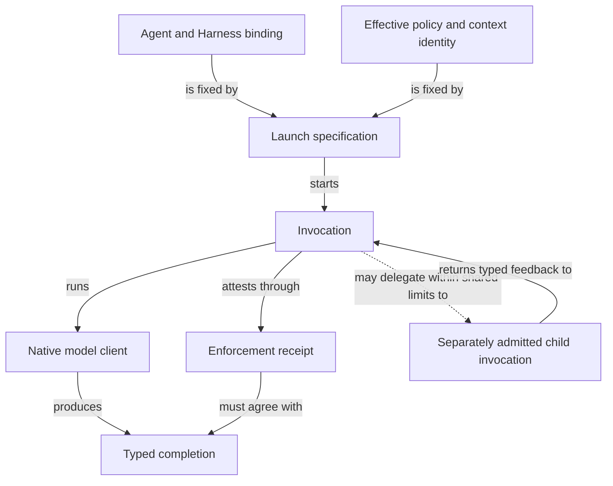

```concorde-document
{
  "id": "document.specs.modules.concorde.agent-execution.module",
  "targets": [
    "module.agent-execution"
  ],
  "main_visible": true
}
```

# Agent execution

Execute separately bound Agent invocations through their Harness and admit typed results.

## Contract identity and context

`module.agent-execution` follows Spec Protocol 2.0.0. Its sole structural parent is `module.concorde`. The complete contract is the Markdown collection explicitly registered in `.concorde/specs.json`; links and realization references do not expand it. This reading entry introduces the collection.

The registered companion documents explain [interfaces](interfaces.md), [runtime-values](runtime-values.md), [agents-and-harnesses](agents-and-harnesses.md). Their content remains authoritative regardless of navigation visibility.

## Architecture

Authored source: `specs/modules/concorde/agent-execution/module.md` (the Mermaid fence in this section). Kind: `mermaid`. Title: **Agent execution entities and relationships**. The source is included through this document’s explicit membership; it is not a separate external diagram record.



An Agent binding identifies responsibilities, Harness, accepted values and limits. A launch binds that definition to one context, effective policy, workspace and invocation. The executor verifies those identities before running the selected native client and admits completion only when both the domain value and enforcement receipt match.

The recursive runtime adds an explicitly bound invocation tree. A child receives a fresh context and inherited restrictions; direct child results become ordered typed feedback. Shared call, depth, decision and deadline limits cannot be renewed by descendants. Failures never retry with broader permissions. Candidate edits made by an authorized writer before execution failure may remain; this service does not roll back those edits.

## Features

### feature.agent-execution.provide

For an admitted Agent binding and launch, execute its Harness under the effective permissions and accept only a matching typed completion with enforcement evidence. For a host-assembled recursive graph, give each child its own context and identity while retaining shared limits and typed feedback. Process exit alone is insufficient; cancellation, exhaustion, rejection and execution failure remain distinct.

## Interfaces

### api.execution.execute

`api.execution.execute` accepts a host-built LaunchSpecification and returns a validated completion and enforcement receipt or CapabilityExecutionError. `api.execution.invoke-agent` accepts an admitted graph, typed input and explicit grant and returns AgentRun with a typed outcome and host events. Preconditions, records, effects, failure classifications and retry limits are defined in [interfaces.md](interfaces.md) and the local runtime-value document. Each call starts a new execution; no interface promises rollback of authorized code edits.

### api.execution.invoke-agent

The recursive invocation interface and its exact graph, input, grant, feedback, cancellation and completion contracts are defined in [interfaces.md](interfaces.md#apiexecutioninvoke-agent). Construction creates no authority; every invocation rechecks the current binding.

## Local collaboration agreements

These entries describe the exact direct providers and children registered for this Module. They state relied-upon behavior without importing another Module’s documents.

```concorde-dependencies
[
  {
    "target_id": "module.permissions",
    "responsibility": "Compile declared effects and host authority into reproducible execution permissions.",
    "selection_condition": "When compiling or verifying the effective permissions of a host-bound launch.",
    "relied_upon_promises": [
      "compile_policy intersects role paths and caller authority. Native renderers establish the resulting read, write, command and network boundaries or reject unsupported enforcement. Only a code-writing invocation may write its bound implementation files and admitted Implementation Spec documents; Module contracts remain immutable in that phase."
    ]
  },
  {
    "target_id": "module.wire-contracts",
    "responsibility": "Admit versioned structured values, offline schemas and safe project paths.",
    "selection_condition": "When admitting typed values, offline schemas, digests or safe paths.",
    "relied_upon_promises": [
      "TypedValue envelopes identify a type, version and data. Unknown fields, unsupported identities and malformed values fail admission. File-path helpers reject traversal and aliases. Schema validation is deterministic and offline; a validation error never grants a different context or fallback authority."
    ]
  },
  {
    "target_id": "module.package-assets",
    "responsibility": "Build deterministic Agent, Skill, Protocol, schema and documentation assets from authored sources.",
    "selection_condition": "When loading current generated instructions and their source-bound Agent definitions.",
    "relied_upon_promises": [
      "build renders assets; write_build writes owned projections; check_build compares without changing the worktree. verify_fresh detects changed authoring sources. Module and Implementation kind definitions are distributed together. Generated assets are derived outputs and are never independent authoring sources."
    ]
  }
]
```

## Realizations

The registered realizations are `implementation.agent-execution`. They describe exact file ownership and internal implementation choices separately. Module/Feature/Interface selection includes this full contract collection and does not load those Implementation Specs. Code writing and dedicated code review use their separately declared Framework authority.
