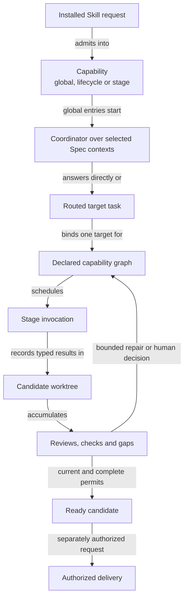

```concorde-document
{
  "id": "document.development.module",
  "targets": [
    "module.development"
  ],
  "main_visible": true
}
```

# Development

Provide the installed Skill boundary and the workflows that answer questions, develop one change to a ready candidate, evolve topology, record candidate evidence and deliver an authorized change.

## Contract identity and context

`module.development` follows Spec Protocol 2.1.0. Its sole structural parent is `module.concorde`. The complete contract is the Markdown collection explicitly registered in `.concorde/specs.json`; links and realization references do not expand it. This reading entry introduces the collection.

The registered companion documents explain [interfaces](interfaces.md), [capabilities](capabilities.md), [query-and-routing](query-and-routing.md), [development](development.md), [topology](topology.md), [review-and-gaps](review-and-gaps.md) and [delivery](delivery.md). Their content remains authoritative regardless of navigation visibility.

## Architecture

Authored source: `specs/modules/concorde/development/module.md` (the Mermaid fence in this section). Kind: `mermaid`. Title: **Development entities and relationships**. The source is included through this document’s explicit membership; it is not a separate external diagram record.



A capability is global, lifecycle or stage. Global capabilities discover complete Module contexts through the coordinator and may span several targets and stages; lifecycle capabilities are deterministic host behavior; stage capabilities receive an already bound target and one frozen context. Every capability's control flow is a LangGraph graph composed of deterministic steps and Agent invocations that this Module obtains from the Harness.

A candidate owns component progress, gaps and evidence. Reviews refer to the exact candidate inputs they assessed. A code defect can select the bounded task/implementation repair edge; a necessary contract gap waits for a contract revision. Finalization includes every affected user of shared implementation. Readiness, authorized delivery and cleanup are separate completion states.

## Features

### feature.development.execute

For an installed global or lifecycle Skill, admit its versioned request, select its declared execution graph and obtain each Agent invocation, bound to current instructions, context and authority, from the Harness. Return a typed capability result with distinct admission, domain and execution outcomes. Unregistered stages cannot be called as public Skills; stale inputs or unenforceable permissions prevent launch.

### feature.development.query

For a question and optional routing hints, deterministically resolve explicitly selected complete Module Spec contexts and inject deduplicated original document and diagram bodies into the coordinator. The coordinator reasons across those contexts and returns an answer with attributed gaps or limitations without authoring project files. A routing hint cannot grant context, and discovery stops at its declared limits.

### feature.development.develop

For one intended change, coordinate Spec authoring when enabled, configured reviews, sufficiency assessment, plan, tasks, implementation and checks. A successful result is a ready candidate with current evidence for all affected implementation users. Preserve drafts on failure; code-review repairs are bounded, and unchanged blocking feedback cannot loop indefinitely.

### feature.development.topology

For a change to identities, composition, dependencies, membership or realization bindings, prepare a registry design and separately authored local contracts. Bind developer acceptance first to the design and then to the complete application artifact. Conflicting shared bytes or stale preconditions reject application; successful application updates the accepted structure and sources together.

### feature.development.validate

For the current candidate, run deterministic Spec validation and every configured implementation check of every affected Module, and record readiness evidence bound to the exact candidate bytes. A failed, missing or stale check cannot establish readiness, and validation never claims semantic completeness.

### feature.development.deliver

For an authorized ready change selected by change_id, verify participation, candidate evidence and actual integration, publish an independent `concorde/delivered/<change_id>` branch and remove the source unless explicitly retained. Default delivery preserves the primary branch, index and project files. Only a separate explicitly user-authorized `merge_primary:true` request from the primary owning session may merge into its checked-out branch after current integration checks. One agent owns primary writes; repository locking serializes shared lifecycle writes and final merges. Branch delivery, cleanup and primary merging are recorded separately for safe retries.

## Interfaces

### interface.development.use

The public boundary is a versioned TypedValue invocation of an installed `concorde-*` Skill. Global calls select the owning Module; lifecycle calls perform declared deterministic actions. A planner determines tasks from the selected Module Spec alone. Code writers additionally receive the Module's implementation context. Each stage reports its own completion and gaps; a completed component does not independently deliver the enclosing change.

The [local interface contract](interfaces.md) defines accepted inputs, outputs, effects, errors and compatibility. A successful shape check alone does not establish successful execution or a complete business contract.

## Local collaboration agreements

These entries describe the exact direct providers registered for this Module. They state relied-upon behavior from this Module's perspective without importing another Module's documents.

```concorde-dependencies
[
  {
    "target_id": "module.harness",
    "responsibility": "Freeze context kinds, bind Agents, compile permissions and execute invocations under LangGraph control flow.",
    "selection_condition": "When a capability graph reaches an Agent invocation or needs a policy preview.",
    "relied_upon_promises": [
      "A stage receives exactly its frozen context kinds and compiled authority, and only a matching typed completion with enforcement evidence is returned; nothing retries with wider permissions.",
      "A recursive delegation tree shares finite budgets and cancellation and returns only typed results."
    ]
  },
  {
    "target_id": "module.spec",
    "responsibility": "Select Module descriptors, documents and implementation bindings, and validate Spec structure.",
    "selection_condition": "When routing, binding a target, deriving affected implementation users or recording validation evidence.",
    "relied_upon_promises": [
      "Selection and the reverse index identify every affected Module deterministically, and structural validation reports invalid state with a source digest without proving semantics."
    ]
  },
  {
    "target_id": "module.reflections",
    "responsibility": "Retain explicitly captured development gaps and reports.",
    "selection_condition": "When a developer explicitly records gaps from a change's history.",
    "relied_upon_promises": [
      "Recording a gap creates or reuses a durable link without resolving the gap or starting work."
    ]
  },
  {
    "target_id": "module.distribution",
    "responsibility": "Render the projections of a Concorde package checkout and report build freshness.",
    "selection_condition": "When delivery verifies the integration of a checkout that contains concorde.json.",
    "relied_upon_promises": [
      "Rendering a merged checkout's own sources before validation is deterministic and a build failure prevents the primary update."
    ]
  }
]
```

## Realizations

The registered realizations are `implementation.development-host`, `implementation.development-capabilities`, `implementation.worktree-lifecycle` and `implementation.file-transactions`. They describe exact file ownership and internal implementation choices separately. Module/Feature/Interface selection includes this full contract collection and does not load those Implementation Specs. Code writing and dedicated code review use their separately declared Framework authority.
