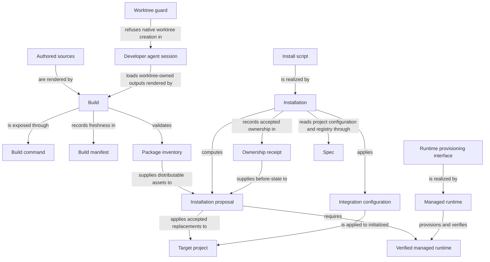

```concorde-document
{
  "id": "document.distribution.module",
  "targets": [
    "module.distribution"
  ],
  "main_visible": true
}
```

# Distribution

Build authored projections, install and configure owned integrations, provision the managed runtime and keep a source checkout's own projections bound to the worktree that built them.

## Purpose

Distribution turns authored Framework sources into the deterministic outputs a project actually
runs: rendered Agent instructions and Skills, an installed and configured integration, and a
verified managed Python and viewer runtime. Its users are developers installing or updating
Concorde into a consumer project, developers maintaining this source checkout, and every other
Framework capability that depends on fresh generated projections before it executes. Its promises
stop at owned, receipt-tracked output: it never edits project-owned Specs or configuration, and it
never decides what those Specs should say.

## Scenarios

Scenario definitions for installing, configuring and guarding this source checkout's own worktrees
are registered in [installation](installation.md). Scenario definitions for rendering and
freshness-checking projections are registered in [build](build.md). Scenario definitions for
provisioning the managed Python and viewer runtime are registered in [runtime](runtime.md).

## Requirements

- req.distribution.no-silent-protocol-rewrite: Install or update SHALL NOT silently rewrite a consumer's Protocol binding; a package with changed Protocol assets SHALL require the consumer's explicit binding decision before execution.
- req.distribution.build-idempotent: `build` and `build --check` SHALL be idempotent and byte-identical across repeated runs and SHALL perform no network or process I/O.
- req.distribution.one-worktree-build: Every build invocation SHALL operate only on the worktree containing its named sources and SHALL NOT point one worktree's build at another worktree's outputs.

## Entities

The three programs below realize build, installation and runtime provisioning; the interface
entities are their means of use, and the remaining entities name the data and actors those
interfaces exchange.

```concorde-entities
[
  {
    "id": "entity.distribution.build",
    "title": "Build",
    "kind": "program",
    "responsibility": "Renders every Agent, Skill, rule, schema, documentation and Studio-graph output deterministically from authored sources, records their exact source/output digests in the build manifest, verifies freshness before ordinary capability execution, and runs package validation.",
    "files": [
      "agents/__init__.py",
      "capabilities/__init__.py",
      "concorde.json",
      "pyproject.toml",
      "src/concorde/distribution/build.py",
      "src/concorde/distribution/package_validation.py",
      "src/concorde/distribution/prompt_resolver.py",
      "tests/concorde/distribution/test_build.py",
      "tests/concorde/distribution/test_package_validation.py",
      "tests/concorde/distribution/test_prompt_resolver.py",
      "tests/concorde/fixtures/build/golden/claude/concorde-configure/SKILL.md",
      "tests/concorde/fixtures/build/golden/claude/concorde-deliver/SKILL.md",
      "tests/concorde/fixtures/build/golden/claude/concorde-dev-loop/SKILL.md",
      "tests/concorde/fixtures/build/golden/claude/concorde-init/SKILL.md",
      "tests/concorde/fixtures/build/golden/claude/concorde-main/SKILL.md",
      "tests/concorde/fixtures/build/golden/claude/concorde-reflections-triage/SKILL.md",
      "tests/concorde/fixtures/build/golden/claude/concorde-validate/SKILL.md",
      "tests/concorde/fixtures/build/golden/codex/concorde-configure/SKILL.md",
      "tests/concorde/fixtures/build/golden/codex/concorde-deliver/SKILL.md",
      "tests/concorde/fixtures/build/golden/codex/concorde-dev-loop/SKILL.md",
      "tests/concorde/fixtures/build/golden/codex/concorde-init/SKILL.md",
      "tests/concorde/fixtures/build/golden/codex/concorde-main/SKILL.md",
      "tests/concorde/fixtures/build/golden/codex/concorde-reflections-triage/SKILL.md",
      "tests/concorde/fixtures/build/golden/codex/concorde-validate/SKILL.md",
      "tests/concorde/support/build_fixture.py",
      "uv.lock"
    ]
  },
  {
    "id": "entity.distribution.installation",
    "title": "Installation",
    "kind": "program",
    "responsibility": "Plans and applies receipt-owned Framework, Skill and bounded root-guidance changes for a target project without replacing project-owned Specs or configuration, and hosts the source checkout's own deterministic maintenance CLI and worktree guard.",
    "files": [
      "capabilities/configure.py",
      "scripts/concorde.ps1",
      "scripts/concorde.py",
      "scripts/concorde.sh",
      "scripts/development/check-docsite-types.py",
      "scripts/install-concorde.py",
      "scripts/requirements.lock",
      "scripts/run-capability.py",
      "scripts/worktree-guard.py",
      "skills/concorde-configure/SKILL.md",
      "src/concorde/distribution/__init__.py",
      "src/concorde/distribution/cli.py",
      "src/concorde/distribution/protocol_guidance.py",
      "templates/module-template.md",
      "templates/plan-template.md",
      "templates/reflections-template.md",
      "templates/scenario-template.md",
      "templates/tasks-template.md",
      "tests/concorde/distribution/__init__.py",
      "tests/concorde/distribution/test_consumer_install_end_to_end.py",
      "tests/concorde/distribution/test_fresh_clone_bootstrap.py",
      "tests/concorde/distribution/test_install_concorde.py",
      "tests/concorde/distribution/test_manifests.py",
      "tests/concorde/distribution/test_protocol_guidance.py",
      "tests/concorde/distribution/test_worktree_guard.py"
    ]
  },
  {
    "id": "entity.distribution.managed-runtime",
    "title": "Managed runtime",
    "kind": "program",
    "responsibility": "Plans, stages and verifies the locked Python interpreter and the official viewer package as versioned, hash-bound artifacts, recording a recoverable identity receipt.",
    "files": [
      "src/concorde/distribution/managed_runtime.py",
      "tests/concorde/support/managed_runtime.py",
      "viewer/README.md",
      "viewer/package-lock.json",
      "viewer/package.json"
    ]
  },
  {
    "id": "entity.distribution.spec",
    "title": "Spec",
    "kind": "used module",
    "target_id": "module.spec",
    "responsibility": "Defines the project configuration and registry that installation, configuration and initialization read or write, with exactly one pinned Protocol binding."
  },
  {
    "id": "entity.distribution.install-script",
    "title": "Install script",
    "kind": "interface",
    "responsibility": "The `python3 scripts/concorde.py` and `scripts/install-concorde.py` command surface that previews owned changes by default and applies them only with `--apply`, and the `concorde-configure` capability that changes a supported integration or enforcement setting on an initialized project."
  },
  {
    "id": "entity.distribution.build-command",
    "title": "Build command",
    "kind": "interface",
    "responsibility": "The `build`/`write_build`/`check_build`/`verify_fresh`/`load_agent` Python functions and the `python3 scripts/concorde.py build` CLI entry that render, write, compare and freshness-check the projections, and load one Agent's current rendered binding."
  },
  {
    "id": "entity.distribution.runtime-provisioning",
    "title": "Runtime provisioning interface",
    "kind": "interface",
    "responsibility": "The `load_runtime_spec`/`plan_runtime`/`provision_runtime` functions that describe local provisioning state and stage the reviewed action for the locked Python runtime and the official viewer."
  },
  {
    "id": "entity.distribution.worktree-guard",
    "title": "Worktree guard",
    "kind": "interface",
    "responsibility": "The `scripts/worktree-guard.py` Claude Code and Codex hook command that decides one hook payload and refuses native worktree creation in a developer session of this source checkout."
  },
  {
    "id": "entity.distribution.authored-sources",
    "title": "Authored sources",
    "kind": "concept",
    "responsibility": "The root `concorde.json`, canonical `prompts/`, `skills/`, `capabilities/`, Protocol chapters and the contract modules under `src/concorde/spec` that the build resolves through `@include` graphs into deterministic outputs."
  },
  {
    "id": "entity.distribution.build-manifest",
    "title": "Build manifest",
    "kind": "record",
    "responsibility": "The recorded source-to-output digest identity at `generated/build-manifest.json` that establishes freshness and that the host checks before every top-level capability invocation except a lifecycle capability."
  },
  {
    "id": "entity.distribution.package-inventory",
    "title": "Package inventory",
    "kind": "record",
    "responsibility": "The distributable `concorde.json` manifest naming the package version, accepted Protocol binding, workspace protocol, roles, capabilities, Skills and templates that installation selects assets from."
  },
  {
    "id": "entity.distribution.installation-proposal",
    "title": "Installation proposal",
    "kind": "record",
    "responsibility": "The preview of receipt-owned Framework, Skill and root-guidance replacements, computed from the package inventory and the target's current ownership receipt, that installation applies only once accepted and still current."
  },
  {
    "id": "entity.distribution.ownership-receipt",
    "title": "Ownership receipt",
    "kind": "record",
    "responsibility": "The hashed record of owned installed bytes, required runtime identity and root-guidance block boundaries that installation checks before accepting a change and restores from on failure."
  },
  {
    "id": "entity.distribution.target-project",
    "title": "Target project",
    "kind": "concept",
    "responsibility": "The initialized or uninitialized project directory that an installation, configuration or build proposal is applied to, whose project-owned Specs, configuration and unrelated files are always preserved."
  },
  {
    "id": "entity.distribution.verified-runtime",
    "title": "Verified managed runtime",
    "kind": "concept",
    "responsibility": "The staged, hash-verified Python interpreter and official viewer package that installation provisions and that runtime and viewer consumers read through the recorded receipt."
  },
  {
    "id": "entity.distribution.integration-configuration",
    "title": "Integration configuration",
    "kind": "concept",
    "responsibility": "The typed, supported integration and enforcement setting that `concorde-configure` applies atomically to an initialized project, leaving the previous configuration in place on any failure."
  },
  {
    "id": "entity.distribution.developer-session",
    "title": "Developer agent session",
    "kind": "external actor",
    "responsibility": "The Claude Code or Codex agent session in this source checkout whose native worktree creation the worktree guard refuses, so its loaded worktree-owned Skills never outlive the worktree that built them."
  }
]
```

## Architecture

Build, Installation and Managed runtime are independent programs that only meet at explicit
records: Build never writes into a target project, Installation never renders Framework assets
itself, and Managed runtime never chooses which files Installation replaces. Ownership receipt and
Build manifest play matching but distinct roles — one binds installed bytes in a target project,
the other binds authored sources to rendered outputs in this checkout or a build client — and
neither substitutes for the other. In this source checkout specifically, the worktree guard and the
developer session it constrains are the only entities with no counterpart in an installed consumer
project, because the guard is checkout policy and ships to no one else.



## Dependencies and composition

```concorde-dependencies
[
  {
    "target_id": "module.spec",
    "responsibility": "Define the project configuration and registry that installation, configuration and initialization read or write.",
    "selection_condition": "When installing into or configuring an initialized project, or when a Protocol binding must be checked.",
    "relied_upon_promises": [
      "An initialized project has exactly one configuration with a pinned Protocol binding, and an incompatible binding is reported as a mismatch rather than reinterpreted."
    ]
  }
]
```

## Unresolved information

Managed runtime's replacement design intends to preserve the previous valid runtime until a rebuild
is verified and to restore it after a failed rebuild, but the current provisioning implementation
still removes an owned environment before rebuilding; this preservation promise is not yet fulfilled
by code, and callers must not infer recovery from the absence of success metadata.

Project initialization and Protocol-binding decisions belong to `module.spec`'s `concorde-init`
capability, not to this Module; installation never creates the registry or a Module stub itself.
