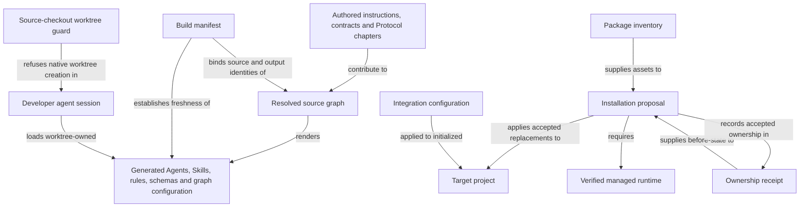

```concorde-document
{
  "id": "document.distribution.module",
  "targets": [
    "module.distribution"
  ],
  "main_visible": true
}
```

# Distribution

Build authored projections, install and configure owned integrations, provision the managed runtime and keep a source checkout's own projections bound to the worktree that built them.

## Contract identity and context

`module.distribution` follows Spec Protocol 2.1.0. Its sole structural parent is `module.concorde`. The complete contract is the Markdown collection explicitly registered in `.concorde/specs.json`; links and realization references do not expand it. This reading entry introduces the collection.

The registered companion documents explain [installation](installation.md), [build](build.md) and [runtime](runtime.md). Their content remains authoritative regardless of navigation visibility.

## Architecture

Authored source: `specs/modules/concorde/distribution/module.md` (the Mermaid fence in this section). Kind: `mermaid`. Title: **Distribution entities and relationships**. The source is included through this document’s explicit membership; it is not a separate external diagram record.



The build resolves `@include` graphs from authored Agent responsibilities, Skill instructions, rule adapters and capability contracts and renders deterministic outputs whose freshness the manifest binds; generated assets are derived views, never authoring sources. Installation proposes owned replacements, applies an accepted current proposal, verifies runtime and assets and records ownership; failure restores previously valid owned state. The managed runtime provisions the locked Python environment and viewer package from hash-bound inputs. A source checkout distributes itself by building its own projections, and its checked-in agent configuration refuses native worktree creation in developer sessions so those projections stay bound to the worktree that built them.

## Features

### feature.distribution.install

For a supported integration and target directory, preview receipt-owned Framework, Skill and root-guidance changes, then apply the accepted current proposal. Preserve user content and project-owned Specs and configuration. Conflicting ownership, modified owned blocks, stale previews or runtime failure prevent acceptance and restore replaced owned state.

### feature.distribution.build

For authored Framework assets and an integration selection, render deterministic Agent, Skill, rule, schema, documentation and Studio graph outputs; write them only to owned projection locations or compare them without writes. Source digests bind runtime freshness. In the source checkout, the worktree guard registered in the checked-in Claude Code and Codex configuration refuses a developer session's native worktree creation, so loaded Skills never outlive the worktree that built them; the guard is not installed into consumer projects. Invalid includes, bindings or package contracts produce findings or a build error and cannot authorize stale execution.

### feature.distribution.runtime

For locked Python and viewer requirements and an accepted provisioning action, compare installed state, stage required artifacts, verify their identity and record the resulting owned runtime receipt. An unchanged verified runtime may be reused. Failed acquisition or verification must not replace a previously valid runtime or mark partial state usable.

### feature.distribution.configure

For an initialized project, apply an explicit supported integration and enforcement configuration atomically. Unsupported values, an uninitialized project or a failed write leave the previous configuration in place.

## Interfaces

### interface.distribution.install

The installer proposes owned file changes and applies accepted current proposals; `python3 scripts/concorde.py` exposes build, validate, docsite and protocol-manifest maintenance commands, `scripts/worktree-guard.py` is the source checkout's hook command, and `concorde-configure` applies integration settings. Missing business facts remain explicit. Failed application or provisioning restores previously valid owned state. The [installation](installation.md) document defines the commands, proposals, receipts and errors.

### interface.distribution.build

`build` renders assets; `write_build` writes owned projections; `check_build` compares without changing the worktree; `verify_fresh` detects changed authoring sources; `load_agent` returns one Agent's rendered body with its binding. Module and Implementation kind definitions are distributed together. The [build](build.md) document defines inputs, outputs, the manifest and errors.

### interface.distribution.runtime

`load_runtime_spec` reads locked requirements, `plan_runtime` describes provisioning state and `provision_runtime` stages versioned, hash-bound inputs and records verified receipts. A failed acquisition does not replace a previously valid runtime or accept a partial installation. The [runtime](runtime.md) document defines the records, actions and errors.

## Local collaboration agreements

These entries describe the exact direct providers registered for this Module. They state relied-upon behavior from this Module's perspective without importing another Module's documents.

```concorde-dependencies
[
  {
    "target_id": "module.spec",
    "responsibility": "Define the project configuration and registry that installation, configuration and initialization read or write.",
    "selection_condition": "When installing into or configuring an initialized project, or when a Protocol binding must be checked.",
    "relied_upon_promises": [
      "An initialized project has exactly one configuration with a pinned Protocol binding, and an incompatible binding is reported as a mismatch rather than reinterpreted."
    ]
  }
]
```

## Realizations

The registered realizations are `implementation.build`, `implementation.installation`, `implementation.managed-runtime` and `implementation.legacy-understanding`. They describe exact file ownership and internal implementation choices separately; the legacy realization is a pending removal that the maintenance CLI's `validate` command still imports. Module/Feature/Interface selection includes this full contract collection and does not load those Implementation Specs.
