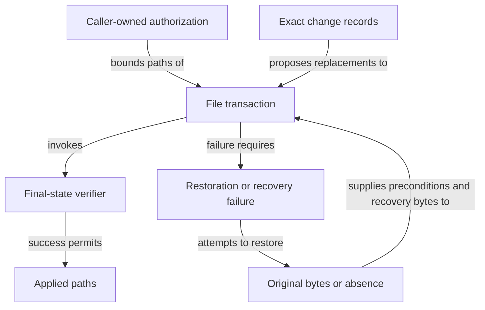

```concorde-document
{
  "id": "document.specs.modules.concorde.file-transactions.module",
  "targets": [
    "module.file-transactions"
  ],
  "main_visible": true
}
```

# File transactions

Apply exact multi-file changes with before-digest checks and rollback.

## Contract identity and context

`module.file-transactions` follows Spec Protocol 2.0.0. Its sole structural parent is `module.concorde`. The complete contract is the Markdown collection explicitly registered in `.concorde/specs.json`; links and realization references do not expand it. This reading entry introduces the collection.

The registered companion documents explain [interfaces](interfaces.md). Their content remains authoritative regardless of navigation visibility.

## Architecture

Authored source: `specs/modules/concorde/file-transactions/module.md` (the Mermaid fence in this section). Kind: `mermaid`. Title: **File transactions entities and relationships**. The source is included through this document’s explicit membership; it is not a separate external diagram record.



A change record contains an exact path, expected original digest (or absence) and replacement content. The caller supplies a separate allowed-path set and optional final-state verifier. The transaction stores original bytes, stages replacements and rechecks preconditions immediately before each replacement.

Success means all replacements and the verifier completed. Admission failure has no replacement effects; later failure triggers restoration of replaced bytes and removal of newly created files. This is a recoverable file transaction, not a promise of crash durability or isolation from arbitrary concurrent writers. Recovery I/O failure must surface and never be labeled applied.

## Features

### feature.file-transactions.provide

For caller-authorized exact file replacements, capture original digests, stage bytes, recheck preconditions and verify the resulting state. Return applied paths only after all replacements and verification succeed. Rejection or application failure restores prior bytes and removes transaction-created files when recovery I/O succeeds; recovery failure remains an explicit failed transaction.

## Interfaces

### api.files.apply

file_change captures a current before-digest. apply_files accepts exact allowed paths, stages changes, rechecks originals and invokes verification. Invalid or stale preflight causes no replacement. A later failure restores changed original bytes and removes transaction-created files when recovery I/O succeeds; recovery failure remains explicit. Proposed content cannot expand the allowed set.

The [local interface contract](interfaces.md) defines accepted inputs, outputs, effects, errors and compatibility. A successful shape check alone does not establish successful execution or a complete business contract.

## Local collaboration agreements

The transaction consumes these exact byte/path helper capabilities. Both providers remain sibling Modules; it has no structural children.

```concorde-dependencies
[
  {
    "target_id": "module.registry",
    "responsibility": "Read exact regular-file bytes and compute canonical source digests.",
    "selection_condition": "When capturing, rechecking or restoring the original state of a proposed file replacement.",
    "relied_upon_promises": [
      "read_file(root, relative) reads only the exact safe regular file and rejects missing, unsafe or aliased input. digest(bytes) returns sha256 identity of those exact bytes; neither operation writes project files."
    ]
  },
  {
    "target_id": "module.wire-contracts",
    "responsibility": "Admit safe project-relative paths within the caller-owned root.",
    "selection_condition": "Before reading, staging, replacing or restoring each proposed destination.",
    "relied_upon_promises": [
      "checked_path(root, relative) rejects absolute paths, traversal, aliases and symlink components with TypedDataError rather than selecting a different destination. Path admission never widens the caller\u2019s allowed set."
    ]
  }
]
```

## Realizations

The registered realizations are `implementation.file-transactions`. They describe exact file ownership and internal implementation choices separately. Module/Feature/Interface selection includes this full contract collection and does not load those Implementation Specs. Code writing and dedicated code review use their separately declared Framework authority.
