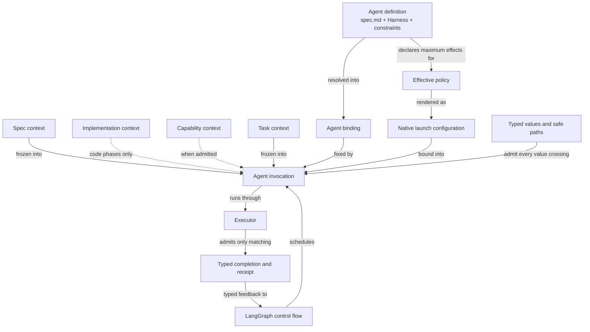

```concorde-document
{
  "id": "document.harness.module",
  "targets": [
    "module.harness"
  ],
  "main_visible": true
}
```

# Harness

Configure and run every Agent invocation: freeze its context kinds, bind its Agent and Harness definition, compile its effective permissions, execute it natively and coordinate it through LangGraph control flow.

## Contract identity and context

`module.harness` follows Spec Protocol 2.1.0. Its sole structural parent is `module.concorde`. The complete contract is the Markdown collection explicitly registered in `.concorde/specs.json`; links and realization references do not expand it. This reading entry introduces the collection.

The registered companion documents explain [Agents and Harnesses](agents-and-harnesses.md), [Agent Graphs and Loops](graphs-and-loops.md), [context](context.md), [permissions](permissions.md), [execution](execution.md), [host](host.md), [runtime values](runtime-values.md) and [typed values](typed-values.md). Their content remains authoritative regardless of navigation visibility.

## Architecture

Authored source: `specs/modules/concorde/harness/module.md` (the Mermaid fence in this section). Kind: `mermaid`. Title: **Harness entities and relationships**. The source is included through this document’s explicit membership; it is not a separate external diagram record.



An invocation is the unit of work. Its Spec context is the selected Module's complete collection; its implementation context is the Protocol-defined union of referenced Implementation Specs and bound files, supplied to code phases only; its capability context is the admitted Capability and Tool contracts; its task context is the task, constraints, stage artifacts and lifecycle metadata. The frozen closure is never empty and its identity covers every admitted byte.

An Agent definition binds an authored `spec.md`, one of three registered Harnesses and narrowing constraints. Resolution against the current build yields an `AgentBinding` that every structured launch carries and the executor reverifies. Permissions are compiled purely from declared effects and host authority and rendered into native enforcement or refused. Every control flow is a LangGraph graph whose nodes are deterministic steps or Agent invocations; a leaf may be either. Recursive delegation runs inside the same graphs under shared budgets, depth limits and cancellation. Failures never retry with broader permissions, and process exit alone never establishes completion.

## Features

### feature.harness.context

For one Module, phase, task and optional local focus, freeze the Spec context, the phase-appropriate subset of implementation context, the admitted capability context and the task context into an immutable identified snapshot. Global assembly supports several explicit Module selections for the coordinator. Focus changes the question, not membership. Invalid input or a stale binding yields no reusable partial snapshot.

### feature.harness.agents

For every named Agent, bind its authored `spec.md`, registered Harness and constraints into a reproducible binding verified against the current build. Unknown Harnesses, widened effects, unexported context or result types and stale builds prevent any launch. The registered inventory and Harness catalog are stated in the Agents and Harnesses document.

### feature.harness.permissions

For declared Agent effects, explicit role paths and a narrowing host binding, produce a reproducible effective policy and native launch configuration. Grants cannot exceed either the declaration or caller authority. Unknown roles, unsafe paths, widened authority or unsupported enforcement reject compilation or rendering before task execution.

### feature.harness.execute

For an admitted Agent binding and launch, execute its Harness under the effective permissions in a fresh process and accept only a matching typed completion with enforcement evidence. For a host-assembled recursive graph, give each child its own context and identity while retaining shared limits and typed feedback. Cancellation, limit exhaustion, rejection and execution failure remain distinct outcomes.

### feature.harness.typed-values

For a named registered wire type, structured contract schema or project path, validate the declared version, shape and contextual path rules and return a validated value or precise failure. Canonical serialization and artifact digests provide reproducible byte identities. Unknown types, duplicate JSON keys, unsupported schemas and unsafe paths fail without network resolution or fallback authority.

## Interfaces

### interface.harness.context

`resolve_context` selects one Module and freezes its context kinds; `resolve_discovery_context` freezes several explicitly selected complete Module contexts for the coordinator; the recheck functions reject reuse after any admitted input changed. Non-code phases receive no implementation context. The [context](context.md) document defines inputs, records, phases and errors.

### interface.harness.bind

`agent_definition` looks up a named Agent and `resolve_agent` returns its verified `AgentBinding`; both refuse unknown Agents, stale builds and inconsistent definitions. The [runtime values](runtime-values.md) document defines the records and the [Agents and Harnesses](agents-and-harnesses.md) document defines the model.

### interface.harness.compile

`compile_policy` intersects declared effects, role paths and caller authority into a digest-bound policy; the native renderers establish the resulting read, write, command and network boundaries or reject unsupported enforcement; `build_launch_specification` binds policy, context identity and Agent binding into a launch. Only a code-writing invocation may write its bound implementation files and admitted Implementation Spec documents. The [permissions](permissions.md) document defines the signatures and errors.

### interface.harness.execute

`AgentProcessExecutor` accepts a host-built `LaunchSpecification`, verifies the binding and effective policy, starts the selected native integration and validates completion evidence. Exit code alone does not establish completion. The [execution](execution.md) document defines preconditions, outcomes and effects.

### interface.harness.invoke-agent

`AgentRuntime` and `CapabilityHost.invoke_agent` run an explicitly assembled recursive graph with typed inputs, an explicit grant, shared limits and typed child feedback. Construction creates no authority; every invocation rechecks the current binding. The [host](host.md) and [execution](execution.md) documents define the records and outcomes.

### interface.harness.validate

`typed`, `validate_typed`, `json_schema`, `decode`, `canonical`, the artifact helpers and `checked_path` admit typed envelopes, schemas, digests and safe project paths deterministically and offline. A validation error never grants a different context or fallback authority. The [typed values](typed-values.md) document defines the complete boundary.

## Local collaboration agreements

These entries describe the exact direct providers registered for this Module. They state relied-upon behavior from this Module's perspective without importing another Module's documents.

```concorde-dependencies
[
  {
    "target_id": "module.spec",
    "responsibility": "Admit the registry and resolve identities, document collections, implementation references and file ownership.",
    "selection_condition": "When freezing any context kind or checking a target, focus or binding.",
    "relied_upon_promises": [
      "Selection returns the complete registered collection and exact file bindings of one identity without following relationships, and a changed source is visible as a changed digest."
    ]
  },
  {
    "target_id": "module.distribution",
    "responsibility": "Render Agent instructions and Protocol assets from authored sources and attest their freshness.",
    "selection_condition": "When resolving an Agent binding or admitting the Protocol rule bundle for a launch.",
    "relied_upon_promises": [
      "A rendered instruction or rule asset is traceable to its authored source through the build manifest, and a stale build is reported rather than served."
    ]
  }
]
```

## Realizations

The registered realizations are `implementation.context`, `implementation.agent-model`, `implementation.agent-definitions`, `implementation.permissions`, `implementation.agent-execution`, `implementation.typed-values`, `implementation.studio` and `implementation.worktree-lifecycle`. They describe exact file ownership and internal implementation choices separately. The control-flow substrate and the split between binding mechanics and business graphs are implementation constraints recorded there. Module/Feature/Interface selection includes this full contract collection and does not load those Implementation Specs.
