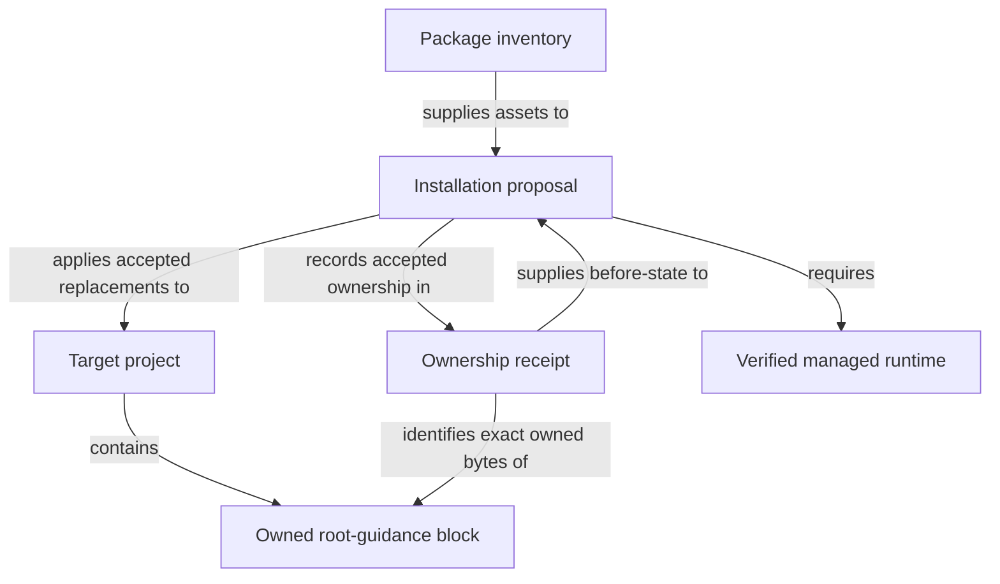

```concorde-document
{
  "id": "document.specs.modules.concorde.installation.module",
  "targets": [
    "module.installation"
  ],
  "main_visible": true
}
```

# Installation

Install, initialize, configure and upgrade Concorde while preserving user-owned content.

## Contract identity and context

`module.installation` follows Spec Protocol 2.0.0. Its sole structural parent is `module.concorde`. The complete contract is the Markdown collection explicitly registered in `.concorde/specs.json`; links and realization references do not expand it. This reading entry introduces the collection.

The registered companion documents explain [interfaces](interfaces.md). Their content remains authoritative regardless of navigation visibility.

## Architecture

Authored source: `specs/modules/concorde/installation/module.md` (the Mermaid fence in this section). Kind: `mermaid`. Title: **Installation entities and relationships**. The source is included through this document’s explicit membership; it is not a separate external diagram record.



A package inventory identifies distributable assets. An installation proposal selects owned replacements and records their current preconditions. A receipt records exact installed ownership, including bounded root-guidance blocks; bytes outside those blocks remain user-owned. Managed runtime provisioning is a prerequisite to accepting the installed state.

Preview observes without writing. Apply checks the reviewed state, stages assets and runtime, verifies them and then records acceptance. Failure restores replaced owned state. Project initialization is a separately requested Spec Context capability and cannot be inferred from copying Framework files. Source-checkout distribution builds projections in their owning worktree instead of installing a nested Framework.

## Features

### feature.installation.install

For a supported integration and target directory, preview receipt-owned Framework, Skill and root-guidance changes, then apply the accepted current proposal. Preserve user content and project-owned Specs/configuration. Conflicting ownership, modified owned blocks, stale previews or runtime failure prevent acceptance and restore replaced owned state.

### feature.installation.self-distribute

For the current source checkout, build the canonical Agent, Skill and rule projections into that same worktree and report whether the outputs and Protocol manifest are current. Repeated builds of unchanged inputs are byte-identical. verify-worktree rejects mismatched instruction ownership even when bytes match; a new worktree requires its own built assets and fresh session.

## Interfaces

### interface.installation.use

The installer proposes owned file changes and applies accepted current proposals. Initialization creates a Module stub, an explicit registry and a pinned Protocol binding. Build produces assets; installation places and verifies them. Missing business facts remain explicit. Failed application or provisioning restores previously valid owned state.

The [local interface contract](interfaces.md) defines accepted inputs, outputs, effects, errors and compatibility. A successful shape check alone does not establish successful execution or a complete business contract.

## Local collaboration agreements

These entries describe the exact direct providers and children registered for this Module. They state relied-upon behavior without importing another Module’s documents.

```concorde-dependencies
[
  {
    "target_id": "module.spec-context",
    "responsibility": "Resolve complete Module contracts, bind code-writing implementation context and validate explicit Spec structure.",
    "selection_condition": "When resolving a complete Module context or preparing initial project Spec state.",
    "relied_upon_promises": [
      "resolve_context selects one Module and its complete registered documents. Feature focus never trims the collection. Non-code phases do not receive Implementation Specs or source. The implementation phase adds only the referenced Implementation Specs and exact bound files. Membership, bytes, rules and admitted stage inputs determine context identity."
    ]
  },
  {
    "target_id": "module.package-assets",
    "responsibility": "Build deterministic Agent, Skill, Protocol, schema and documentation assets from authored sources.",
    "selection_condition": "When loading current generated instructions and their source-bound Agent definitions.",
    "relied_upon_promises": [
      "build renders assets; write_build writes owned projections; check_build compares without changing the worktree. verify_fresh detects changed authoring sources. Module and Implementation kind definitions are distributed together. Generated assets are derived outputs and are never independent authoring sources."
    ]
  },
  {
    "target_id": "module.managed-runtime",
    "responsibility": "Provision and verify the pinned Python and viewer runtime used by installed integrations.",
    "selection_condition": "When obtaining verified installed Python or viewer resources.",
    "relied_upon_promises": [
      "load_runtime_spec reads locked requirements. plan_runtime describes provisioning state. provision_runtime stages versioned, hash-bound inputs and records verified receipts. A failed acquisition does not replace a previously valid runtime or accept a partial installation."
    ]
  },
  {
    "target_id": "module.file-transactions",
    "responsibility": "Apply exact multi-file changes with before-digest checks and rollback.",
    "selection_condition": "When applying exact proposed file replacements with current preconditions.",
    "relied_upon_promises": [
      "file_change captures a current before-digest. apply_files accepts exact allowed paths, stages changes, rechecks originals and invokes verification. Invalid or stale preflight causes no replacement. A later failure restores changed original bytes and removes transaction-created files when recovery I/O succeeds; recovery failure remains explicit. Proposed content cannot expand the allowed set."
    ]
  },
  {
    "target_id": "module.wire-contracts",
    "responsibility": "Admit versioned structured values, offline schemas and safe project paths.",
    "selection_condition": "When admitting typed values, offline schemas, digests or safe paths.",
    "relied_upon_promises": [
      "TypedValue envelopes identify a type, version and data. Unknown fields, unsupported identities and malformed values fail admission. File-path helpers reject traversal and aliases. Schema validation is deterministic and offline; a validation error never grants a different context or fallback authority."
    ]
  }
]
```

## Realizations

The registered realizations are `implementation.installation`, `implementation.spec-engine`, `implementation.package-build`, `implementation.worktree-lifecycle`. They describe exact file ownership and internal implementation choices separately. Module/Feature/Interface selection includes this full contract collection and does not load those Implementation Specs. Code writing and dedicated code review use their separately declared Framework authority.
